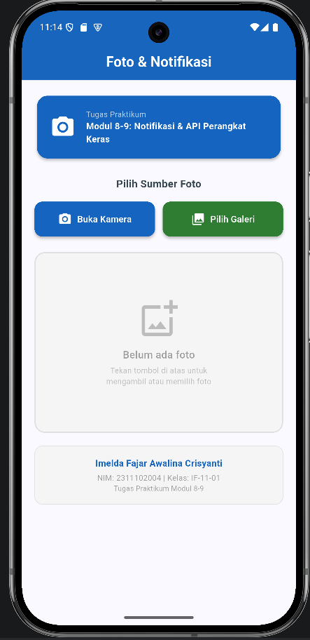
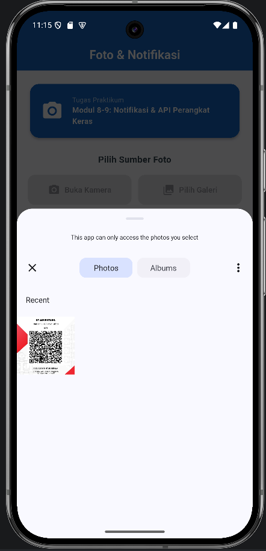
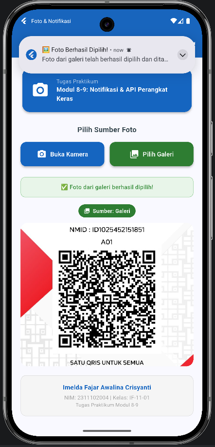

<div align="center">
    <br />
    <h1>LAPORAN PRAKTIKUM <br> APLIKASI BERBASIS PLATFORM</h1>
    <br />
    <h3>MODUL 8-9 <br> Notifikasi & API Perangkat Keras</h3>
    <br />
    
    <br />
    <br />
    <h3>Disusun Oleh :</h3>
    <p>
        <strong>Imelda Fajar Awalina Crisyanti</strong><br>
        <strong>2311102004</strong><br>
        <strong>S1 IF-11-REG 01</strong>
    </p>
    <br />
    <h3>Dosen Pengampu :</h3>
    <p><strong>Dimas Fanny Hebrasianto Permadi S.ST., M.Kom</strong></p>
    <br />
    <h4>Asisten Praktikum :</h4>
    <p>
        <strong>Apri Pandu Wicaksono</strong><br>
        <strong>Rangga Pradarrel Fathi</strong>
    </p>
    <br />
    <h3>
        LABORATORIUM HIGH PERFORMANCE<br>
        FAKULTAS INFORMATIKA<br>
        UNIVERSITAS TELKOM PURWOKERTO<br>
        2026
    </h3>
</div>

---

## 📚 Dasar Teori

Pengembangan aplikasi seluler modern sering kali membutuhkan integrasi mendalam dengan perangkat keras fisik *smartphone* untuk memberikan fitur yang fungsional. Pada *framework* Flutter, akses terhadap perangkat keras seperti **Kamera** dan **Galeri Penyimpanan** tidak bisa dilakukan secara langsung melalui kode Dart standar, melainkan memerlukan *Application Programming Interface* (API) yang menjembatani komunikasi antara aplikasi dengan sistem operasi *native* (Android atau iOS).

Hal ini diimplementasikan menggunakan paket eksternal [`image_picker`](https://pub.dev/packages/image_picker) yang memungkinkan aplikasi meminta hak akses (izin) dan mengambil gambar secara asinkron (menggunakan `Future`).

Selain antarmuka perangkat keras, sistem komunikasi dengan pengguna juga krusial. **Notifikasi Lokal (*Local Notifications*)** adalah fitur yang memungkinkan aplikasi memunculkan pesan peringatan di *status bar* perangkat **tanpa memerlukan koneksi internet** atau server *push notification* (seperti Firebase). Dengan menggunakan paket [`flutter_local_notifications`](https://pub.dev/packages/flutter_local_notifications), pengembang dapat mengonfigurasi *Channel ID*, tingkat prioritas pesan (seperti *heads-up notification*), dan ikon secara spesifik untuk masing-masing platform.

> ⚠️ Penggunaan fitur-fitur ini wajib didaftarkan terlebih dahulu pada file konfigurasi platform (misalnya `AndroidManifest.xml` pada Android) agar sistem operasi tidak memblokir akses atas dasar keamanan privasi pengguna.

---

## 🛠️ Tugas Modul 8-9 — Notifikasi & API Perangkat Keras

### Struktur Project

```
lib/
├── main.dart                  # Gerbang utama & inisialisasi notifikasi
├── home_page.dart             # UI, tombol kamera/galeri, dan penampil foto
└── notification_service.dart  # Logika pemanggilan notifikasi sistem

android/app/src/main/
└── AndroidManifest.xml        # Konfigurasi perizinan platform
```

---

### 📄 Source Code

#### 1. `lib/main.dart` — Gerbang Utama & Inisialisasi Notifikasi

```dart
import 'package:flutter/material.dart';
import 'package:flutter_local_notifications/flutter_local_notifications.dart';
import 'home_page.dart';

final FlutterLocalNotificationsPlugin flutterLocalNotificationsPlugin =
    FlutterLocalNotificationsPlugin();

void main() async {
  WidgetsFlutterBinding.ensureInitialized();

  const AndroidInitializationSettings initializationSettingsAndroid =
      AndroidInitializationSettings('@mipmap/ic_launcher');

  const InitializationSettings initializationSettings =
      InitializationSettings(android: initializationSettingsAndroid);

  await flutterLocalNotificationsPlugin.initialize(initializationSettings);
  runApp(const MyApp());
}

class MyApp extends StatelessWidget {
  const MyApp({super.key});

  @override
  Widget build(BuildContext context) {
    return MaterialApp(
      title: 'Foto & Notifikasi',
      theme: ThemeData(
        colorScheme: ColorScheme.fromSeed(seedColor: const Color(0xFF1565C0)),
      ),
      home: const HomePage(),
      debugShowCheckedModeBanner: false,
    );
  }
}
```

---

#### 2. `lib/home_page.dart` — UI, Tombol Kamera/Galeri, dan Penampil Foto

```dart
import 'dart:io';
import 'package:flutter/material.dart';
import 'package:image_picker/image_picker.dart';
import 'notification_service.dart';

class HomePage extends StatefulWidget {
  const HomePage({super.key});

  @override
  State<HomePage> createState() => _HomePageState();
}

class _HomePageState extends State<HomePage> {
  File? _fotoTerpilih;
  final ImagePicker _imagePicker = ImagePicker();

  Future<void> _ambilFotoDariKamera() async {
    final XFile? foto =
        await _imagePicker.pickImage(source: ImageSource.camera);
    if (foto != null) {
      setState(() => _fotoTerpilih = File(foto.path));
      await NotificationService.tampilkanNotifikasi(source: 'kamera');
    }
  }

  Future<void> _pilihFotoDariGaleri() async {
    final XFile? foto =
        await _imagePicker.pickImage(source: ImageSource.gallery);
    if (foto != null) {
      setState(() => _fotoTerpilih = File(foto.path));
      await NotificationService.tampilkanNotifikasi(source: 'galeri');
    }
  }

  @override
  Widget build(BuildContext context) {
    return Scaffold(
      appBar: AppBar(
        title: const Text('Foto & Notifikasi'),
        backgroundColor: const Color(0xFF1565C0),
        foregroundColor: Colors.white,
      ),
      body: Center(
        child: Column(
          mainAxisAlignment: MainAxisAlignment.center,
          children: [
            _fotoTerpilih != null
                ? Image.file(_fotoTerpilih!, height: 300)
                : const Text('Belum ada foto yang dipilih.'),
            const SizedBox(height: 20),
            ElevatedButton.icon(
              onPressed: _ambilFotoDariKamera,
              icon: const Icon(Icons.camera_alt),
              label: const Text('Buka Kamera'),
            ),
            const SizedBox(height: 10),
            ElevatedButton.icon(
              onPressed: _pilihFotoDariGaleri,
              icon: const Icon(Icons.photo_library),
              label: const Text('Pilih dari Galeri'),
            ),
          ],
        ),
      ),
    );
  }
}
```

---

#### 3. `lib/notification_service.dart` — Logika Notifikasi Sistem

```dart
import 'package:flutter_local_notifications/flutter_local_notifications.dart';
import 'main.dart';

class NotificationService {
  static Future<void> tampilkanNotifikasi({required String source}) async {
    const AndroidNotificationDetails androidDetails =
        AndroidNotificationDetails(
      'foto_channel',
      'Notifikasi Foto',
      importance: Importance.high,
      priority: Priority.high,
      ticker: 'Foto berhasil!',
      icon: '@mipmap/ic_launcher',
    );

    const NotificationDetails notificationDetails =
        NotificationDetails(android: androidDetails);

    final String judul = source == 'kamera'
        ? '📸 Foto Berhasil Diambil!'
        : '🖼️ Foto Berhasil Dipilih!';

    final String pesan =
        'Foto dari $source telah berhasil diproses ke layar.';

    await flutterLocalNotificationsPlugin.show(
        1001, judul, pesan, notificationDetails);
  }
}
```

---

#### 4. `android/app/src/main/AndroidManifest.xml` — Konfigurasi Perizinan

```xml
<!-- Izin akses kamera -->
<uses-permission android:name="android.permission.CAMERA"/>

<!-- Izin baca penyimpanan (Android 9 ke bawah) -->
<uses-permission
    android:name="android.permission.READ_EXTERNAL_STORAGE"
    android:maxSdkVersion="32"/>

<!-- Izin baca media gambar (Android 13+) -->
<uses-permission android:name="android.permission.READ_MEDIA_IMAGES"/>

<!-- Izin tampilkan notifikasi (Android 13+) -->
<uses-permission android:name="android.permission.POST_NOTIFICATIONS"/>
```

---

### 📸 Hasil Output (Screenshots)

Berikut adalah bukti dokumentasi saat project dijalankan di dalam emulator Android:

#### 1. Tampilan Awal Aplikasi (Data Foto Kosong)

<p align="center">
  
</p>

#### 2. Tampilan Kamera / Galeri Terbuka

<p align="center">
  
</p>

#### 3. Foto Tampil dan Notifikasi Lokal Muncul

<p align="center">
  
</p>

---

### 💡 Penjelasan Fungsionalitas

Aplikasi ini dibangun menggunakan SDK Flutter dan berhasil memanfaatkan hardware perangkat secara langsung. Berikut alur kerja utamanya:

| Aksi Pengguna | Proses | Output |
|---|---|---|
| Tekan **"Buka Kamera"** | `image_picker` meminta izin & membuka kamera native | Foto diambil, dirender, notifikasi muncul |
| Tekan **"Pilih dari Galeri"** | `image_picker` membuka penjelajah file sistem | Foto dipilih, dirender, notifikasi muncul |
| Foto berhasil dipilih | `setState()` memperbarui `_fotoTerpilih` | `Image.file()` merender foto di layar |
| Rendering selesai | `NotificationService.tampilkanNotifikasi()` dipanggil | Notifikasi *heads-up* Android muncul dengan prioritas tinggi |

Setelah gambar dipilih, *file path* dikembalikan ke Flutter untuk dirender menggunakan widget `Image.file()`. Tepat setelah gambar berhasil dirender, fungsi asinkron dari `flutter_local_notifications` dieksekusi untuk memicu notifikasi lokal Android dengan **prioritas tinggi (Heads-up)** yang menginformasikan bahwa proses pengambilan gambar telah berhasil.

---