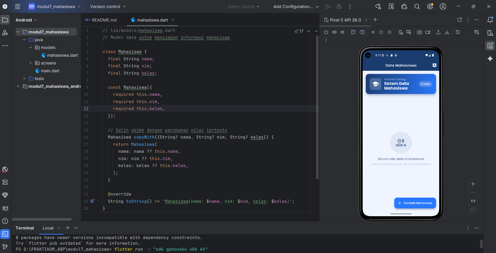
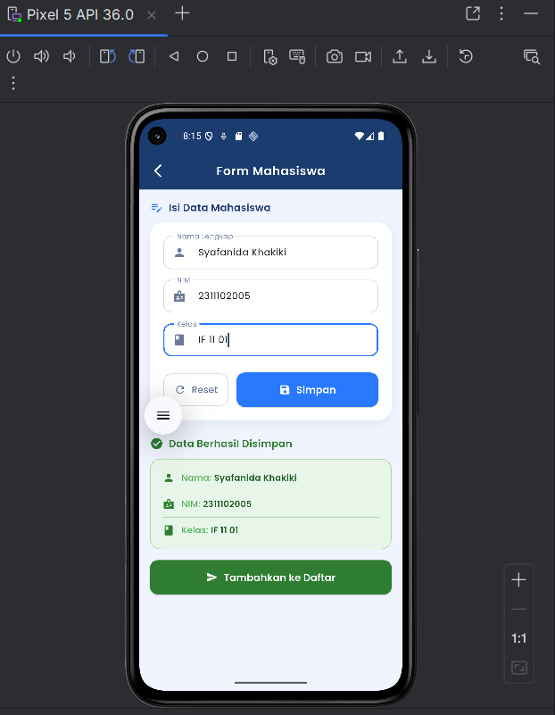
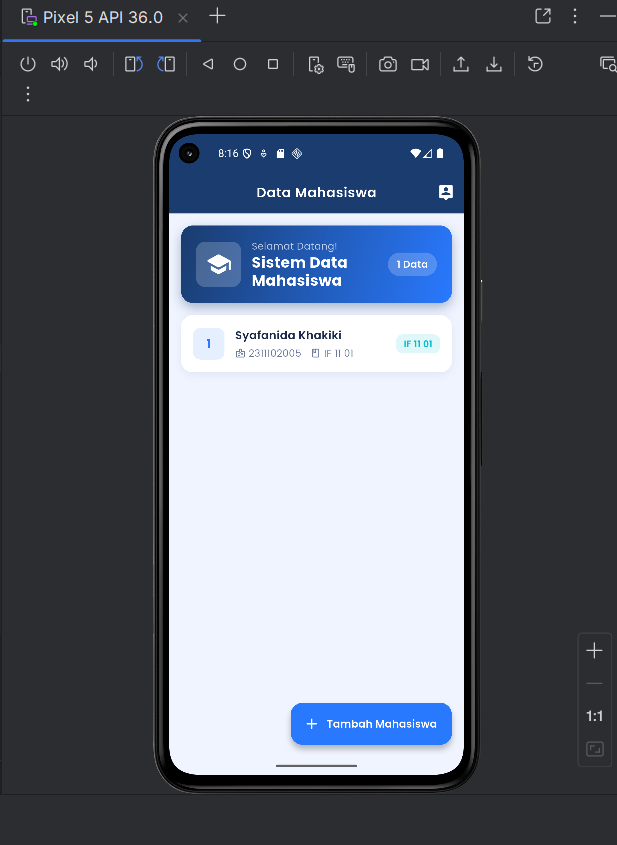

## LAPORAN PRAKTIKUM
## APLIKASI BERBASIS PLATFORM

### MODUL 7
### MOBILE

  

  

**Disusun oleh:**
**Syafanida Khakiki**
**2311102005**

 

**KELAS PS1IF-11-REG01**
**Dosen: Dimas Fanny Hebrasianto Permadi, S.ST., M.Kom**

  

## PROGRAM STUDI S1 TEKNIK INFORMATIKA   FAKULTAS INFORMATIKA   UNIVERSITAS TELKOM PURWOKERTO   2026   

---

---

# 1. Dasar Teori

Flutter adalah framework UI open-source dari Google yang memungkinkan pengembangan aplikasi mobile, web, dan desktop dari satu codebase menggunakan bahasa **Dart**. Pada modul ini, fokus pembelajaran adalah **navigasi antar halaman**, **manajemen state menggunakan StatefulWidget**, serta **pengelolaan data dinamis menggunakan List**.

## Navigasi di Flutter

Flutter menggunakan konsep **Navigator** berbasis stack untuk berpindah antar halaman (route).

| Method | Deskripsi |
|----------|----------|
| `Navigator.push()` | Membuka halaman baru dan menambahkannya ke stack navigasi |
| `Navigator.pop()` | Menutup halaman saat ini dan kembali ke halaman sebelumnya |
| `Navigator.pop(result)` | Menutup halaman dan mengembalikan data ke halaman pemanggil |
| `MaterialPageRoute` | Route bawaan Flutter dengan transisi Material Design |

## StatefulWidget vs StatelessWidget

| Widget | Deskripsi |
|----------|----------|
| **StatelessWidget** | Widget statis tanpa state internal yang berubah |
| **StatefulWidget** | Widget dengan state internal yang dapat berubah menggunakan `setState()` |

## Widget dan Konsep Utama

| Konsep | Deskripsi |
|----------|----------|
| **Model Class** | Class Dart untuk merepresentasikan struktur data mahasiswa |
| **List<T>** | Struktur data untuk menyimpan kumpulan objek secara dinamis |
| **TextEditingController** | Mengontrol dan membaca nilai dari TextField |
| **TextField** | Input field untuk menerima teks dari pengguna |
| **ElevatedButton** | Tombol Material Design dengan tampilan solid |
| **SnackBar** | Notifikasi sementara yang muncul di bagian bawah layar |
| **ListView.builder** | Menampilkan daftar data secara efisien |
| **AppBar** | Bar navigasi pada bagian atas aplikasi |
| **Google Fonts** | Package untuk menggunakan font Google Fonts secara langsung |

---

# 2. Hasil Praktikum

## Deskripsi Aplikasi

Aplikasi yang dibuat adalah **Sistem Data Mahasiswa**, yaitu aplikasi sederhana untuk mengelola data mahasiswa. Pengguna dapat menambahkan data mahasiswa berupa Nama, NIM, dan Kelas melalui form input, kemudian data akan ditampilkan pada halaman utama secara dinamis.

**Fitur utama:**

- Halaman Home dengan daftar mahasiswa dinamis
- Badge jumlah data mahasiswa
- Empty state saat belum ada data
- Form input mahasiswa
- Validasi data sebelum disimpan
- Preview data sebelum ditambahkan ke daftar
- Navigasi antar halaman menggunakan Navigator
- Pengiriman data menggunakan `Navigator.pop()`

**Hasil:**

