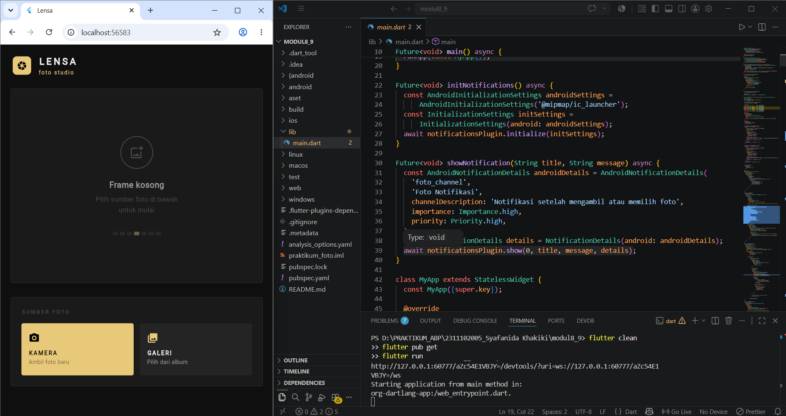
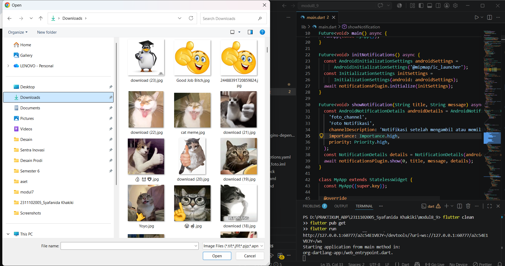

<div align="center">

## LAPORAN PRAKTIKUM
## APLIKASI BERBASIS PLATFORM

### MODUL 8 & 9
### MOBILE

<br><br>


<br><br>

**Disusun oleh:**
**Syafanida Khakiki**
**2311102005**

<br>

**KELAS PS1IF-11-REG01**
**Dosen: Dimas Fanny Hebrasianto Permadi, S.ST., M.Kom**

<br><br>

## PROGRAM STUDI S1 TEKNIK INFORMATIKA <br> FAKULTAS INFORMATIKA <br> UNIVERSITAS TELKOM PURWOKERTO <br> 2026 <br><br>

</div>

---

## 1. Dasar Teori

Flutter adalah framework UI open-source dari Google yang memungkinkan pengembangan aplikasi mobile, web, dan desktop dari satu codebase menggunakan bahasa **Dart**. Pada modul ini, fokus pembelajaran adalah **pengambilan gambar menggunakan kamera dan galeri** dengan package `image_picker`, serta **notifikasi lokal** menggunakan package `flutter_local_notifications`.

### Image Picker

Package `image_picker` memungkinkan aplikasi Flutter mengambil gambar dari kamera perangkat maupun galeri foto.

| Method | Deskripsi |
|--------|-----------|
| `ImagePicker()` | Inisialisasi instance image picker. |
| `pickImage(source: ImageSource.camera)` | Mengambil foto langsung dari kamera. |
| `pickImage(source: ImageSource.gallery)` | Memilih foto dari galeri perangkat. |
| `imageQuality` | Parameter opsional untuk mengatur kualitas kompresi gambar (0–100). |
| `XFile` | Objek yang dikembalikan berisi path file gambar yang dipilih. |

### Flutter Local Notifications

Package `flutter_local_notifications` digunakan untuk menampilkan notifikasi lokal pada perangkat tanpa memerlukan koneksi internet atau server.

| Komponen | Deskripsi |
|----------|-----------|
| `FlutterLocalNotificationsPlugin` | Instance utama untuk mengelola notifikasi. |
| `AndroidInitializationSettings` | Konfigurasi inisialisasi untuk platform Android, termasuk ikon notifikasi. |
| `InitializationSettings` | Menggabungkan konfigurasi dari berbagai platform (Android, iOS). |
| `AndroidNotificationDetails` | Detail notifikasi khusus Android: channel ID, nama, importance, dan priority. |
| `NotificationDetails` | Wrapper yang menggabungkan detail notifikasi lintas platform. |
| `notificationsPlugin.show()` | Menampilkan notifikasi dengan ID, judul, dan pesan yang ditentukan. |
| `Importance.high` | Tingkat kepentingan notifikasi sehingga muncul sebagai heads-up notification. |

### Widget dan Konsep Utama

| Konsep | Deskripsi |
|--------|-----------|
| **StatefulWidget** | Widget dengan state internal yang dapat berubah via `setState()`. Digunakan untuk menampilkan foto yang berubah secara dinamis. |
| **TickerProviderStateMixin** | Mixin yang memungkinkan widget memiliki `AnimationController` untuk animasi. |
| **AnimationController** | Mengontrol animasi, termasuk durasi dan arah pemutaran. |
| **FadeTransition** | Widget bawaan Flutter untuk animasi fade-in/fade-out. |
| **CustomPainter** | Kelas abstrak untuk menggambar elemen kustom menggunakan `Canvas`, digunakan untuk membuat corner bracket. |
| **File** | Kelas dari `dart:io` untuk merepresentasikan file di sistem operasi, digunakan untuk memuat gambar dari path lokal. |
| **Image.file()** | Menampilkan gambar dari file lokal di perangkat. |
| **GestureDetector** | Mendeteksi gestur pengguna seperti tap untuk tombol kustom. |
| **ScaleTransition** | Animasi perubahan skala (scale) untuk efek press pada tombol. |
| **WidgetsFlutterBinding.ensureInitialized()** | Memastikan binding Flutter sudah siap sebelum menjalankan kode async di `main()`. |
| **SystemChrome** | Mengatur tampilan sistem UI seperti status bar. |

---

## 2. Hasil Praktikum

### Deskripsi Aplikasi

Aplikasi yang dibuat adalah **LENSA — Foto Studio** — sebuah aplikasi galeri foto minimalis bertema gelap (dark theme). Pengguna dapat mengambil foto langsung dari kamera atau memilih foto dari galeri perangkat. Setelah foto berhasil dimuat, aplikasi akan menampilkan notifikasi lokal sebagai konfirmasi, disertai animasi fade-in pada gambar dan overlay corner bracket bergaya kamera sebagai elemen desain khas.

**Fitur utama:**
- Halaman utama dengan frame foto berukuran besar bergaya photo studio
- Empty state informatif saat belum ada foto dimuat, lengkap dengan dekorasi film strip
- Tombol KAMERA (gold/kuning) untuk mengambil foto baru dari kamera perangkat
- Tombol GALERI (dark) untuk memilih foto dari album/galeri
- Animasi fade-in saat foto baru berhasil dimuat
- Overlay corner bracket berwarna gold pada foto menggunakan `CustomPainter`
- Badge sumber foto (Kamera / Galeri) di sudut kiri bawah frame
- Notifikasi lokal yang muncul setelah foto berhasil diambil atau dipilih
- Tombol Hapus untuk menghapus foto dari tampilan
- Status konfirmasi foto dimuat di panel kontrol

---

### Langkah-Langkah Pembuatan

**1.** Buka **Visual Studio Code**, pastikan extension **Flutter** dan **Dart** sudah terpasang, lalu verifikasi instalasi dengan:

```bash
flutter doctor
```

**2.** Buat project Flutter baru melalui **View → Command Palette → Flutter: New Project → Application**, beri nama project `praktikum_foto`, lalu tekan Enter dan tunggu proses selesai.

**3.** Tambahkan package yang diperlukan pada `pubspec.yaml`:

```yaml
dependencies:
  flutter:
    sdk: flutter
  cupertino_icons: ^1.0.8
  image_picker: ^1.1.2
  flutter_local_notifications: ^17.2.2
```

Lalu jalankan:

```bash
flutter pub get
```

**4.** Untuk platform Android, tambahkan permission kamera pada `android/app/src/main/AndroidManifest.xml`:

```xml
<uses-permission android:name="android.permission.CAMERA"/>
<uses-permission android:name="android.permission.READ_EXTERNAL_STORAGE"/>
```

**5.** Buat struktur file di dalam folder `lib/` sebagai berikut:

```
lib/
└── main.dart
```

**6.** Isi `lib/main.dart` dengan kode berikut:

**Inisialisasi dan Notifikasi**
```dart
import 'dart:io';
import 'package:flutter/material.dart';
import 'package:flutter/services.dart';
import 'package:image_picker/image_picker.dart';
import 'package:flutter_local_notifications/flutter_local_notifications.dart';

final FlutterLocalNotificationsPlugin notificationsPlugin =
    FlutterLocalNotificationsPlugin();

Future<void> main() async {
  WidgetsFlutterBinding.ensureInitialized();
  SystemChrome.setSystemUIOverlayStyle(
    const SystemUiOverlayStyle(
      statusBarColor: Colors.transparent,
      statusBarIconBrightness: Brightness.light,
    ),
  );
  await initNotifications();
  runApp(const MyApp());
}

Future<void> initNotifications() async {
  const AndroidInitializationSettings androidSettings =
      AndroidInitializationSettings('@mipmap/ic_launcher');
  const InitializationSettings initSettings =
      InitializationSettings(android: androidSettings);
  await notificationsPlugin.initialize(initSettings);
}

Future<void> showNotification(String title, String message) async {
  const AndroidNotificationDetails androidDetails = AndroidNotificationDetails(
    'foto_channel',
    'Foto Notifikasi',
    channelDescription: 'Notifikasi setelah mengambil atau memilih foto',
    importance: Importance.high,
    priority: Priority.high,
  );
  const NotificationDetails details = NotificationDetails(android: androidDetails);
  await notificationsPlugin.show(0, title, message, details);
}
```

**`MyApp` — Root Widget**
```dart
class MyApp extends StatelessWidget {
  const MyApp({super.key});

  @override
  Widget build(BuildContext context) {
    return MaterialApp(
      title: 'Lensa',
      debugShowCheckedModeBanner: false,
      theme: ThemeData(
        brightness: Brightness.dark,
        colorScheme: const ColorScheme.dark(
          primary: Color(0xFFE8C97A),
          surface: Color(0xFF141414),
        ),
        useMaterial3: true,
      ),
      home: const LensaPage(),
    );
  }
}
```

**`LensaPage` — Halaman Utama dengan State dan Animasi**
```dart
class LensaPage extends StatefulWidget {
  const LensaPage({super.key});

  @override
  State<LensaPage> createState() => _LensaPageState();
}

class _LensaPageState extends State<LensaPage> with TickerProviderStateMixin {
  File? _foto;
  String? _sumberFoto;
  final ImagePicker _picker = ImagePicker();
  bool _isLoading = false;

  late AnimationController _fadeController;
  late Animation<double> _fadeAnim;

  // Palette
  static const Color bg       = Color(0xFF0F0F0F);
  static const Color surface  = Color(0xFF1A1A1A);
  static const Color surface2 = Color(0xFF242424);
  static const Color gold     = Color(0xFFE8C97A);
  static const Color textHigh = Color(0xFFF0F0F0);
  static const Color textMid  = Color(0xFF9A9A9A);
  static const Color textLow  = Color(0xFF4A4A4A);

  @override
  void initState() {
    super.initState();
    _fadeController = AnimationController(
      vsync: this,
      duration: const Duration(milliseconds: 600),
    );
    _fadeAnim = CurvedAnimation(parent: _fadeController, curve: Curves.easeOut);
  }

  @override
  void dispose() {
    _fadeController.dispose();
    super.dispose();
  }
```

**Fungsi Pengambilan Gambar**
```dart
  Future<void> _ambilDariKamera() async {
    setState(() => _isLoading = true);
    try {
      final XFile? hasil = await _picker.pickImage(
        source: ImageSource.camera,
        imageQuality: 85,
      );
      if (hasil != null) {
        _fadeController.reset();
        setState(() {
          _foto = File(hasil.path);
          _sumberFoto = 'Kamera';
          _isLoading = false;
        });
        _fadeController.forward();
        await showNotification('Foto Tersimpan', 'Foto dari kamera berhasil diambil.');
      } else {
        setState(() => _isLoading = false);
      }
    } catch (_) {
      setState(() => _isLoading = false);
    }
  }

  Future<void> _pilihDariGaleri() async {
    setState(() => _isLoading = true);
    try {
      final XFile? hasil = await _picker.pickImage(
        source: ImageSource.gallery,
        imageQuality: 85,
      );
      if (hasil != null) {
        _fadeController.reset();
        setState(() {
          _foto = File(hasil.path);
          _sumberFoto = 'Galeri';
          _isLoading = false;
        });
        _fadeController.forward();
        await showNotification('Foto Tersimpan', 'Foto dari galeri berhasil dipilih.');
      } else {
        setState(() => _isLoading = false);
      }
    } catch (_) {
      setState(() => _isLoading = false);
    }
  }

  void _hapusFoto() {
    setState(() {
      _foto = null;
      _sumberFoto = null;
    });
  }
```

**Widget Frame Foto dengan Overlay Corner Bracket**
```dart
  Widget _buildPhotoFrame() {
    return Container(
      width: double.infinity,
      height: 380,
      decoration: BoxDecoration(
        color: surface,
        borderRadius: BorderRadius.circular(4),
        border: Border.all(color: const Color(0xFF2A2A2A), width: 1),
      ),
      child: _isLoading
          ? const Center(child: CircularProgressIndicator(color: gold, strokeWidth: 2))
          : _foto != null
              ? Stack(
                  fit: StackFit.expand,
                  children: [
                    FadeTransition(
                      opacity: _fadeAnim,
                      child: ClipRRect(
                        borderRadius: BorderRadius.circular(3),
                        child: Image.file(_foto!, fit: BoxFit.cover),
                      ),
                    ),
                    // Source badge
                    Positioned(
                      bottom: 14, left: 14,
                      child: Container(
                        padding: const EdgeInsets.symmetric(horizontal: 10, vertical: 5),
                        decoration: BoxDecoration(
                          color: Colors.black.withOpacity(0.7),
                          borderRadius: BorderRadius.circular(4),
                        ),
                        child: Row(children: [
                          Icon(
                            _sumberFoto == 'Kamera'
                                ? Icons.camera_alt_rounded
                                : Icons.photo_library_rounded,
                            size: 12, color: gold,
                          ),
                          const SizedBox(width: 5),
                          Text(_sumberFoto ?? '',
                              style: const TextStyle(color: textHigh, fontSize: 11)),
                        ]),
                      ),
                    ),
                    _CornerBrackets(), // Corner bracket overlay
                  ],
                )
              : _buildEmptyState(),
    );
  }
```

**CustomPainter untuk Corner Bracket**
```dart
class _BracketPainter extends CustomPainter {
  final Color color;
  final double size;
  final double thickness;
  final double padding;

  _BracketPainter({
    required this.color, required this.size,
    required this.thickness, required this.padding,
  });

  @override
  void paint(Canvas canvas, Size s) {
    final p = Paint()
      ..color = color
      ..strokeWidth = thickness
      ..style = PaintingStyle.stroke
      ..strokeCap = StrokeCap.square;

    // Top-left
    canvas.drawLine(Offset(padding, padding + size), Offset(padding, padding), p);
    canvas.drawLine(Offset(padding, padding), Offset(padding + size, padding), p);
    // Top-right
    canvas.drawLine(
        Offset(s.width - padding - size, padding), Offset(s.width - padding, padding), p);
    canvas.drawLine(
        Offset(s.width - padding, padding), Offset(s.width - padding, padding + size), p);
    // Bottom-left
    canvas.drawLine(
        Offset(padding, s.height - padding - size), Offset(padding, s.height - padding), p);
    canvas.drawLine(
        Offset(padding, s.height - padding), Offset(padding + size, s.height - padding), p);
    // Bottom-right
    canvas.drawLine(
        Offset(s.width - padding - size, s.height - padding),
        Offset(s.width - padding, s.height - padding), p);
    canvas.drawLine(
        Offset(s.width - padding, s.height - padding - size),
        Offset(s.width - padding, s.height - padding), p);
  }

  @override
  bool shouldRepaint(_BracketPainter o) => false;
}
```

**7.** Jalankan aplikasi dengan perintah berikut:

```bash
flutter run
```

Atau untuk menjalankan di browser (web):

```bash
flutter run -d chrome
```

---

### Output

**Output 1 — Tampilan Awal Aplikasi (Frame Kosong)**

Tampilan awal aplikasi saat belum ada foto yang dimuat. Menampilkan header "LENSA foto studio" dengan logo kamera berwarna gold, frame foto kosong dengan ikon tambah foto dan dekorasi film strip, serta panel kontrol dengan dua tombol: KAMERA (gold) dan GALERI (dark).



---

**Output 2 — Dialog Pemilihan File dari Galeri**

Tampilan saat pengguna menekan tombol GALERI. Sistem membuka dialog file picker Windows/perangkat untuk memilih gambar dari direktori lokal. Terlihat folder Downloads dengan berbagai file gambar yang dapat dipilih.



---

## 3. Penjelasan Kode

### 3.1 Inisialisasi Notifikasi dan `WidgetsFlutterBinding`

Sebelum `runApp()` dipanggil, `WidgetsFlutterBinding.ensureInitialized()` wajib dipanggil terlebih dahulu karena `initNotifications()` bersifat async dan memerlukan binding Flutter yang sudah siap. Fungsi `initNotifications()` mengkonfigurasi `FlutterLocalNotificationsPlugin` dengan setting Android menggunakan ikon launcher aplikasi.

```dart
Future<void> main() async {
  WidgetsFlutterBinding.ensureInitialized();
  await initNotifications();
  runApp(const MyApp());
}

Future<void> initNotifications() async {
  const AndroidInitializationSettings androidSettings =
      AndroidInitializationSettings('@mipmap/ic_launcher');
  const InitializationSettings initSettings =
      InitializationSettings(android: androidSettings);
  await notificationsPlugin.initialize(initSettings);
}
```

---

### 3.2 Pengambilan Gambar dengan `image_picker`

Fungsi `_ambilDariKamera()` dan `_pilihDariGaleri()` menggunakan `ImagePicker.pickImage()` dengan parameter `source` yang berbeda. Setelah gambar berhasil diperoleh (`XFile? != null`), path file dikonversi menjadi objek `File` dari `dart:io` untuk ditampilkan dengan `Image.file()`. Kualitas gambar dibatasi 85% untuk efisiensi memori.

```dart
final XFile? hasil = await _picker.pickImage(
  source: ImageSource.camera, // atau ImageSource.gallery
  imageQuality: 85,
);
if (hasil != null) {
  setState(() {
    _foto = File(hasil.path);
    _sumberFoto = 'Kamera';
  });
  await showNotification('Foto Tersimpan', 'Foto dari kamera berhasil diambil.');
}
```

---

### 3.3 Animasi Fade-in dengan `AnimationController`

Aplikasi menggunakan `TickerProviderStateMixin` agar dapat membuat `AnimationController`. Setiap kali foto baru dimuat, controller di-reset lalu dijalankan kembali (`forward()`), menghasilkan efek fade-in pada `FadeTransition` yang membungkus `Image.file()`.

```dart
// initState
_fadeController = AnimationController(
  vsync: this,
  duration: const Duration(milliseconds: 600),
);
_fadeAnim = CurvedAnimation(parent: _fadeController, curve: Curves.easeOut);

// Saat foto baru dimuat
_fadeController.reset();
setState(() { _foto = File(hasil.path); });
_fadeController.forward();

// Di widget tree
FadeTransition(
  opacity: _fadeAnim,
  child: Image.file(_foto!, fit: BoxFit.cover),
)
```

---

### 3.4 Corner Bracket dengan `CustomPainter`

Elemen desain corner bracket berwarna gold digambar menggunakan `CustomPainter`. Kelas `_BracketPainter` meng-override method `paint()` untuk menggambar delapan garis pendek di keempat sudut frame foto menggunakan `canvas.drawLine()`. Widget `IgnorePointer` memastikan overlay ini tidak menghalangi interaksi pengguna dengan foto di bawahnya.

```dart
class _BracketPainter extends CustomPainter {
  @override
  void paint(Canvas canvas, Size s) {
    final p = Paint()
      ..color = color
      ..strokeWidth = thickness
      ..style = PaintingStyle.stroke;

    // Menggambar bracket di tiap sudut
    canvas.drawLine(Offset(padding, padding + size), Offset(padding, padding), p);
    canvas.drawLine(Offset(padding, padding), Offset(padding + size, padding), p);
    // ... (diulang untuk 3 sudut lainnya)
  }
}
```

---

### 3.5 Notifikasi Lokal setelah Aksi Foto

Fungsi `showNotification()` menampilkan notifikasi heads-up dengan channel ID `'foto_channel'` setiap kali pengguna berhasil mengambil atau memilih foto. `Importance.high` dan `Priority.high` memastikan notifikasi muncul di bagian atas layar bahkan saat aplikasi sedang aktif.

```dart
Future<void> showNotification(String title, String message) async {
  const AndroidNotificationDetails androidDetails = AndroidNotificationDetails(
    'foto_channel',
    'Foto Notifikasi',
    channelDescription: 'Notifikasi setelah mengambil atau memilih foto',
    importance: Importance.high,
    priority: Priority.high,
  );
  const NotificationDetails details = NotificationDetails(android: androidDetails);
  await notificationsPlugin.show(0, title, message, details);
}
```

---

### 3.6 Tombol Kustom dengan Animasi Scale (`_ShutterButton`)

Tombol KAMERA dan GALERI diimplementasikan sebagai widget `StatefulWidget` tersendiri (`_ShutterButton`) dengan animasi scale press menggunakan `GestureDetector` dan `ScaleTransition`. Saat tombol ditekan (`onTapDown`), skala mengecil ke 0.95; saat dilepas (`onTapUp`), kembali ke 1.0 — memberikan feedback visual yang responsif.

```dart
GestureDetector(
  onTapDown: (_) => _ctrl.forward(),   // scale ke 0.95
  onTapUp: (_) {
    _ctrl.reverse();                    // scale kembali 1.0
    widget.onTap();                     // panggil fungsi
  },
  onTapCancel: () => _ctrl.reverse(),
  child: ScaleTransition(
    scale: _scale, // Tween(begin: 1.0, end: 0.95)
    child: Container(...),
  ),
)
```

---

### 3.7 Dark Theme dan Palet Warna

Aplikasi menggunakan tema gelap (`Brightness.dark`) dengan palet warna yang didefinisikan sebagai konstanta statis untuk konsistensi di seluruh kode. Warna gold (`0xFFE8C97A`) menjadi aksen utama yang digunakan pada tombol primer, ikon, corner bracket, dan teks status.

```dart
// Palette konstanta
static const Color bg       = Color(0xFF0F0F0F); // Background utama
static const Color surface  = Color(0xFF1A1A1A); // Card/frame
static const Color surface2 = Color(0xFF242424); // Tombol sekunder
static const Color gold     = Color(0xFFE8C97A); // Aksen utama

// Tema global
ThemeData(
  brightness: Brightness.dark,
  colorScheme: const ColorScheme.dark(
    primary: Color(0xFFE8C97A),
    surface: Color(0xFF141414),
  ),
  useMaterial3: true,
)
```

---
