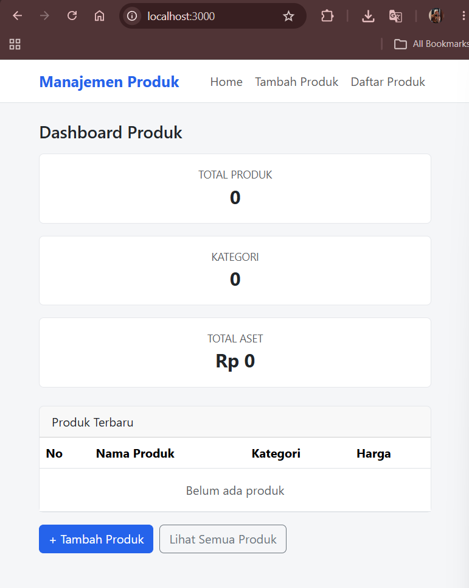
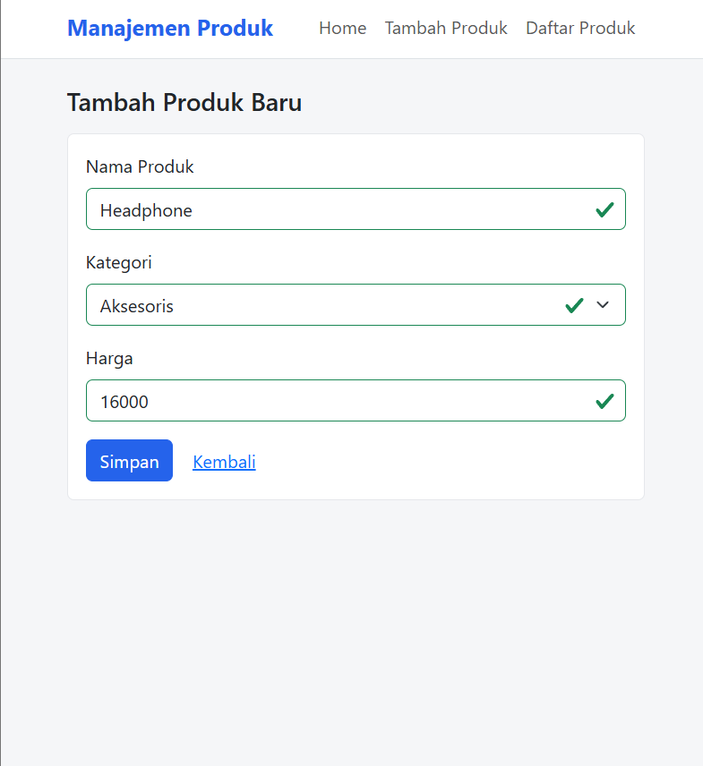
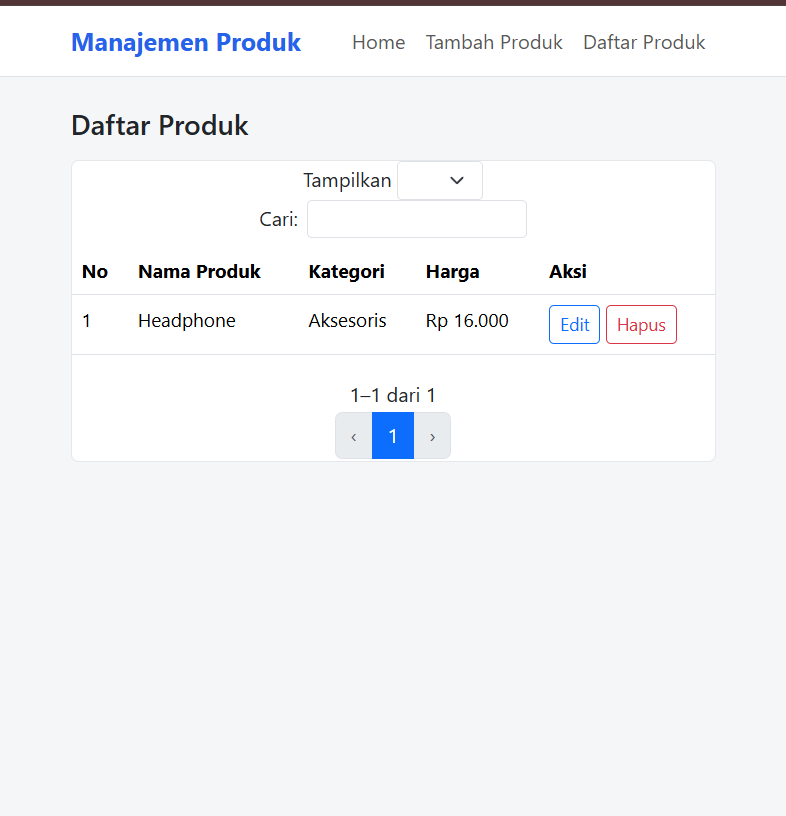

## LAPORAN PRAKTIKUM
## APLIKASI BERBASIS PLATFORM

### MODUL 6
### WEB

  

  

**Disusun oleh:**
**Syafanida Khakiki**
**2311102005**

 

**KELAS PS1IF-11-REG01**
**Dosen: Dimas Fanny Hebrasianto Permadi, S.ST., M.Kom**

  

## PROGRAM STUDI S1 TEKNIK INFORMATIKA   FAKULTAS INFORMATIKA   UNIVERSITAS TELKOM PURWOKERTO   2026   

---

# 1. Dasar Teori

Aplikasi web merupakan sistem yang berjalan melalui browser dengan memanfaatkan teknologi frontend dan backend. Pada praktikum ini digunakan Node.js sebagai runtime JavaScript untuk membangun aplikasi web sederhana dengan konsep routing dan tampilan dinamis.

:contentReference[oaicite:0]{index=0} adalah framework minimalis untuk Node.js yang digunakan untuk membangun aplikasi web dan API dengan cepat melalui sistem routing dan middleware.

:contentReference[oaicite:1]{index=1} adalah template engine yang memungkinkan HTML digabungkan dengan JavaScript untuk menghasilkan tampilan dinamis dari data server.

:contentReference[oaicite:2]{index=2} adalah framework CSS yang digunakan untuk membuat tampilan web yang responsif dan modern dengan komponen siap pakai.

---

# 2. Hasil Praktikum

Aplikasi yang dibuat adalah **Sistem Manajemen Produk Sederhana** yang memiliki tiga halaman utama yaitu Home, Tambah Produk, dan Daftar Produk. Aplikasi ini digunakan untuk mengelola data produk melalui antarmuka web.

## Output 1 — Halaman Home

Halaman Home merupakan halaman utama aplikasi yang menampilkan tampilan awal serta menu navigasi ke fitur lainnya.

## Output 2 — Halaman Tambah Produk

Halaman ini digunakan untuk menambahkan data produk baru melalui form input yang tersedia.

## Output 3 — Halaman Daftar Produk

Halaman ini menampilkan seluruh data produk yang sudah ditambahkan dalam bentuk tabel sederhana.

---

# 3. Penjelasan Sistem

Aplikasi ini memiliki konsep sederhana berbasis web dengan tiga halaman utama. Halaman Home digunakan sebagai landing page, halaman Tambah Produk digunakan untuk input data, dan halaman Daftar Produk digunakan untuk menampilkan seluruh data yang telah disimpan.

Alur sistem berjalan sebagai berikut: user membuka halaman Home, kemudian dapat menuju halaman Tambah Produk untuk memasukkan data, setelah itu data akan ditampilkan pada halaman Daftar Produk.

Struktur project terdiri dari folder views untuk halaman EJS, folder assets untuk menyimpan gambar output, serta file server.js sebagai backend utama yang mengatur routing aplikasi.

---

# 4. Kesimpulan

Aplikasi berhasil dibuat dengan konsep web sederhana menggunakan Node.js. Sistem ini mampu menampilkan tiga halaman utama yang saling terhubung serta memudahkan pengelolaan data produk secara sederhana melalui browser.
