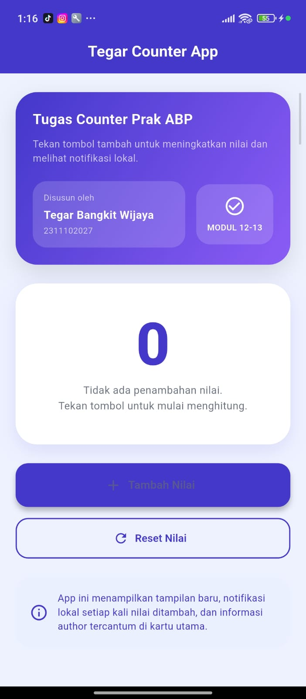
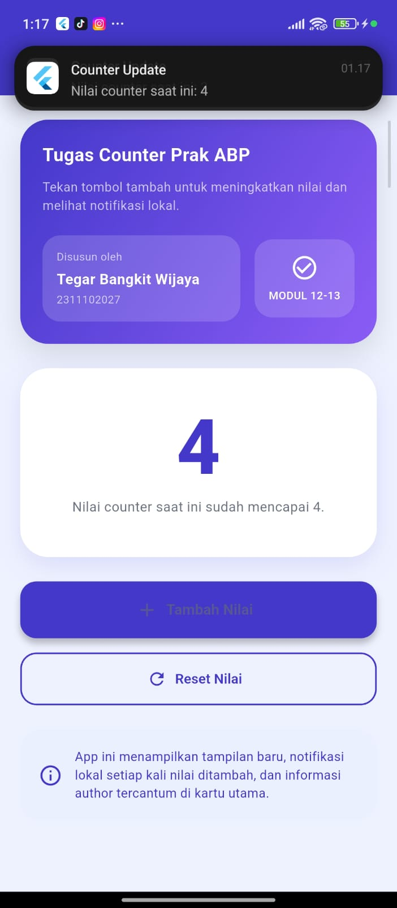

<div align="center">
  <br />
  <h1>LAPORAN PRAKTIKUM <br>APLIKASI BERBASIS PLATFORM</h1>
  <br />
  <h3>MODUL 12-13 - Mobile <br> 
  IMPLEMENTASI PROVIDER & NOTIFIKASI PADA FLUTTER</h3>
  <br />
  
  <br />
  <br />
  <br />
  <h3>Disusun Oleh :</h3>
  <p>
    <strong>Tegar Bangkit Wijaya</strong><br>
    <strong>2311102027</strong><br>
    <strong>IF-11-REG01</strong>
  </p>
  <br />
  <h3>Dosen Pengampu :</h3>
  <p>
    <strong>Dimas Fanny Hebrasianto Permadi, S.ST., M.Kom</strong>
  </p>
  <br />
  <br />
  <h4>Asisten Praktikum :</h4>
  <strong>Apri Pandu Wicaksono</strong> <br>
  <strong>Rangga Pradarrell Fathi</strong>
  <br />
  <h3>LABORATORIUM HIGH PERFORMANCE<br>FAKULTAS INFORMATIKA<br>UNIVERSITAS TELKOM PURWOKERTO<br>2026</h3>
</div>

---

## 1. Struktur Folder

```
lib/
├── main.dart                    → Entry point, inisialisasi Firebase, Provider, dan FCM
├── providers/
│   └── counter_provider.dart    → State management untuk counter
├── screens/
│   └── home_screen.dart         → Tampilan utama aplikasi
└── services/
    └── fcm_service.dart         → Inisialisasi Firebase Cloud Messaging dan notifikasi lokal
```

---

## 2. Code dan Penjelasan

### `lib/main.dart`

```dart
import 'package:flutter/material.dart';
import 'package:provider/provider.dart';
import 'package:firebase_core/firebase_core.dart';
import 'providers/counter_provider.dart';
import 'screens/home_screen.dart';
import 'services/fcm_service.dart';

void main() async {
  WidgetsFlutterBinding.ensureInitialized();

  bool firebaseReady = false;
  try {
    await Firebase.initializeApp();
    firebaseReady = true;
  } catch (e, stackTrace) {
    print('Firebase initialization failed: $e');
    print(stackTrace);
  }

  if (firebaseReady) {
    try {
      await FcmService().initialize();
    } catch (e, stackTrace) {
      print('FCM initialization failed: $e');
      print(stackTrace);
    }
  }

  runApp(
    ChangeNotifierProvider(
      create: (_) => CounterProvider(),
      child: const MyApp(),
    ),
  );
}

class MyApp extends StatelessWidget {
  const MyApp({super.key});

  @override
  Widget build(BuildContext context) {
    return MaterialApp(
      title: 'Tegar Counter App',
      debugShowCheckedModeBanner: false,
      theme: ThemeData(
        colorScheme: ColorScheme.fromSeed(seedColor: const Color(0xFF4338CA)),
        useMaterial3: true,
      ),
      home: const HomeScreen(),
    );
  }
}
```

`main.dart` menyiapkan Firebase dan FCM sebelum menjalankan aplikasi. Jika Firebase atau FCM gagal, aplikasi tetap berjalan sehingga tidak terjadi black screen.

### `lib/providers/counter_provider.dart`

```dart
import 'package:flutter/foundation.dart';

class CounterProvider extends ChangeNotifier {
  int _counter = 0;

  int get counter => _counter;

  void increment() {
    _counter++;
    notifyListeners();
  }

  void reset() {
    _counter = 0;
    notifyListeners();
  }
}
```

`CounterProvider` menyimpan nilai counter dan memberi tahu UI saat nilai berubah.

### `lib/screens/home_screen.dart`

```dart
import 'package:flutter/material.dart';
import 'package:provider/provider.dart';
import '../providers/counter_provider.dart';
import '../services/fcm_service.dart';

class HomeScreen extends StatelessWidget {
  const HomeScreen({super.key});

  @override
  Widget build(BuildContext context) {
    return Scaffold(
      backgroundColor: const Color(0xFFEEF2FF),
      appBar: AppBar(
        title: const Text('Tegar Counter App'),
        centerTitle: true,
        backgroundColor: const Color(0xFF4338CA),
      ),
      body: Consumer<CounterProvider>(
        builder: (context, counterProvider, child) {
          return Center(
            child: Column(
              mainAxisAlignment: MainAxisAlignment.center,
              children: [
                Text(
                  '${counterProvider.counter}',
                  style: const TextStyle(
                    fontSize: 84,
                    fontWeight: FontWeight.bold,
                    color: Color(0xFF4338CA),
                  ),
                ),
                const SizedBox(height: 16),
                ElevatedButton.icon(
                  onPressed: () async {
                    counterProvider.increment();
                    await FcmService().sendCounterNotification(counterProvider.counter);
                  },
                  icon: const Icon(Icons.add),
                  label: const Text('Tambah Nilai'),
                ),
                const SizedBox(height: 12),
                OutlinedButton.icon(
                  onPressed: counterProvider.reset,
                  icon: const Icon(Icons.refresh),
                  label: const Text('Reset Nilai'),
                ),
              ],
            ),
          );
        },
      ),
    );
  }
}
```

`HomeScreen` menampilkan nilai counter dan dua tombol untuk menambah atau mereset nilai. Saat tombol tambah ditekan, juga memanggil FCM service untuk menampilkan notifikasi lokal.

### `lib/services/fcm_service.dart`

```dart
import 'package:firebase_messaging/firebase_messaging.dart';
import 'package:flutter_local_notifications/flutter_local_notifications.dart';

@pragma('vm:entry-point')
Future<void> firebaseMessagingBackgroundHandler(RemoteMessage message) async {
  print('Background message: ${message.messageId}');
}

class FcmService {
  static final FcmService _instance = FcmService._internal();
  factory FcmService() => _instance;
  FcmService._internal();

  final FirebaseMessaging _fcm = FirebaseMessaging.instance;
  final FlutterLocalNotificationsPlugin _localNotif = FlutterLocalNotificationsPlugin();

  Future<void> initialize() async {
    try {
      await _fcm.requestPermission(alert: true, badge: true, sound: true);
      final token = await _fcm.getToken();
      print('FCM Token: $token');
      await _initLocalNotification();
      FirebaseMessaging.onMessage.listen(_handleForegroundMessage);
      FirebaseMessaging.onBackgroundMessage(firebaseMessagingBackgroundHandler);
    } catch (e, stackTrace) {
      print('FCM service initialization failed: $e');
      print(stackTrace);
    }
  }

  Future<void> _initLocalNotification() async {
    const AndroidInitializationSettings androidSettings = AndroidInitializationSettings('@mipmap/ic_launcher');
    await _localNotif.initialize(
      const InitializationSettings(android: androidSettings),
    );
  }

  void _handleForegroundMessage(RemoteMessage message) {
    final notification = message.notification;
    if (notification != null) {
      _localNotif.show(
        0,
        notification.title,
        notification.body,
        const NotificationDetails(
          android: AndroidNotificationDetails(
            'fcm_channel',
            'FCM Notifications',
            importance: Importance.high,
            priority: Priority.high,
          ),
        ),
      );
    }
  }

  Future<void> sendCounterNotification(int counterValue) async {
    try {
      await _localNotif.show(
        counterValue,
        'Counter Update',
        'Nilai counter saat ini: $counterValue',
        NotificationDetails(
          android: AndroidNotificationDetails(
            'fcm_channel',
            'FCM Notifications',
            channelDescription: 'Notifikasi dari Counter App',
            importance: Importance.high,
            priority: Priority.high,
            enableVibration: true,
            playSound: true,
          ),
        ),
      );
    } catch (e, stackTrace) {
      print('Failed to show local notification: $e');
      print(stackTrace);
    }
  }
}
```

`FcmService` bertanggung jawab atas inisialisasi FCM, pengaturan notifikasi lokal, dan penanganan pesan foreground/background.

---

## 3. Cara Kerja Aplikasi

- `main.dart` menginisialisasi Firebase saat startup dan kemudian memulai aplikasi.
- Aplikasi menggunakan `provider` untuk menyimpan nilai counter dalam `CounterProvider`.
- `HomeScreen` mendengarkan perubahan nilai counter menggunakan `Consumer<CounterProvider>`.
- Tombol `Tambah Nilai` menambah counter dan memicu notifikasi lokal.
- `FcmService` juga siap menerima pesan FCM dan menampilkan notifikasi ketika aplikasi sedang berjalan.

---

## 4. Catatan Penting

- Pastikan `android/app/google-services.json` sesuai dengan package name `com.example.counter_fcm_app`.
- Jika ingin agar FCM berfungsi sempurna, perangkat harus mengizinkan instalasi dari ADB dan permission notifikasi.

  ## 4. Hasil Tampilan

  

  
