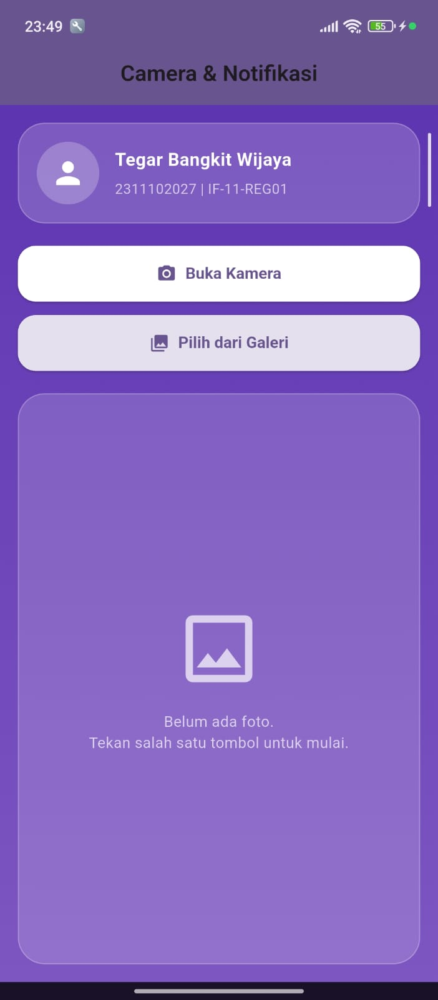
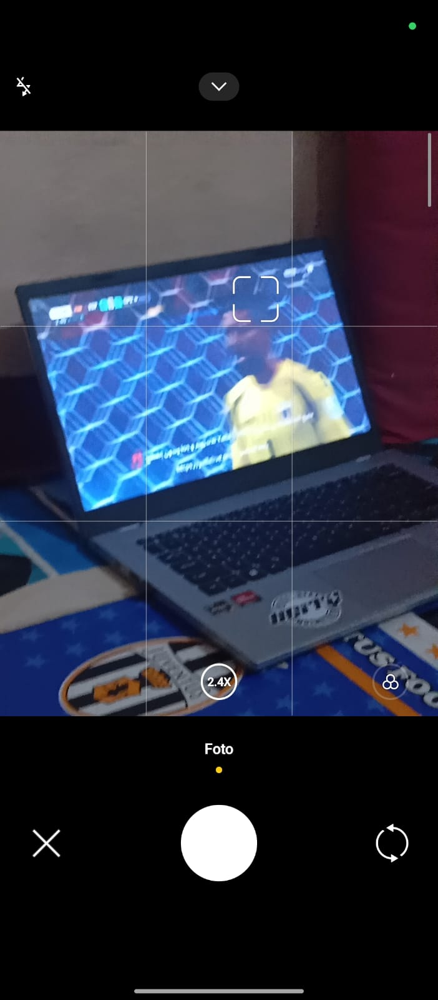
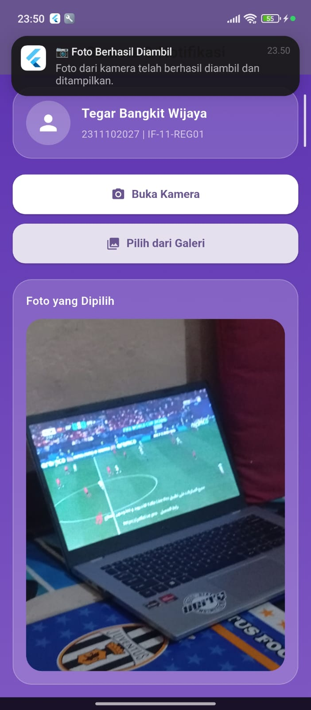
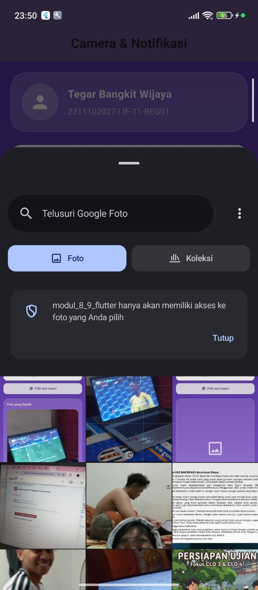
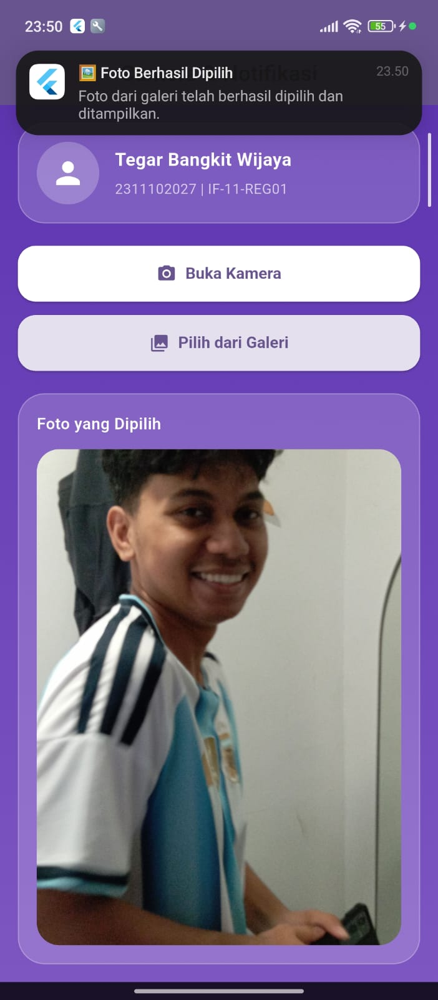

<div align="center">
  <br />
  <h1>LAPORAN PRAKTIKUM <br>APLIKASI BERBASIS PLATFORM</h1>
  <br />
  <h3>MODUL 08-09 - Mobile <br> CAMERA & NOTIFICATION APP  </h3>
  <br />
   
  <br />
  <br />
  <br />
  <h3>Disusun Oleh :</h3>
  <p>
    <strong>Tegar Bangkit Wijaya</strong><br>
    <strong>2311102027</strong><br>
    <strong>IF-11-REG01</strong>
  </p>
  <br />
  <h3>Dosen Pengampu :</h3>
  <p>
    <strong>Dimas Fanny Hebrasianto Permadi, S.ST., M.Kom</strong>
  </p>
  <br />
  <br />
    <h4>Asisten Praktikum :</h4>
    <strong> Apri Pandu Wicaksono </strong> <br>
    <strong>Rangga Pradarrell Fathi</strong>
  <br />
  <h3>LABORATORIUM HIGH PERFORMANCE
 <br>FAKULTAS INFORMATIKA <br>UNIVERSITAS TELKOM PURWOKERTO <br>2026</h3>
</div>

---

## Struktur Folder

```
2311102027_Tegar-Bangkit-Wijaya/
├── assets/                                 ← screenshot dan dokumentasi
├── modul_8_9_flutter/                      ← aplikasi Flutter
│   ├── android/                          
│   ├── ios/                              
│   ├── lib/                                ← kode aplikasi Dart
│   │   ├── main.dart                       ← entry point aplikasi
│   │   ├── screens/
│   │   │   └── home_screen.dart            ← halaman utama dengan camera & galeri
│   │   └── services/
│   │       └── notification_service.dart   ← setup dan trigger notifikasi lokal
│   ├── pubspec.yaml                       dependency
│   └── ...                                ← konfigurasi build dan platform
├── README.md                               ← dokumentasi utama project
```

## 1. Source Code dan Penjelasan

### 1.1 Code android/app/src/main/AndroidManifest.xml

```dart
<manifest xmlns:android="http://schemas.android.com/apk/res/android">

    <!-- Permission untuk camera, galeri/foto, dan notifikasi -->
    <uses-permission android:name="android.permission.CAMERA" />
    <uses-permission android:name="android.permission.READ_MEDIA_IMAGES" />
    <uses-permission android:name="android.permission.POST_NOTIFICATIONS" />

    <application
        android:label="modul_8_9_flutter"
        android:name="${applicationName}"
        android:icon="@mipmap/ic_launcher">

        <!-- FileProvider agar aplikasi bisa mengakses dan membagikan foto  -->
        <provider
            android:name="androidx.core.content.FileProvider"
            android:authorities="${applicationId}.fileprovider"
            android:exported="false"
            android:grantUriPermissions="true">
            <meta-data
                android:name="android.support.FILE_PROVIDER_PATHS"
                android:resource="@xml/file_paths" />
        </provider>

        <activity
            android:name=".MainActivity"
            android:exported="true"
            android:launchMode="singleTop"
            android:taskAffinity=""
            android:theme="@style/LaunchTheme"
            android:configChanges="orientation|keyboardHidden|keyboard|screenSize|smallestScreenSize|locale|layoutDirection|fontScale|screenLayout|density|uiMode"
            android:hardwareAccelerated="true"
            android:windowSoftInputMode="adjustResize">

            <meta-data
                android:name="io.flutter.embedding.android.NormalTheme"
                android:resource="@style/NormalTheme" />

            <intent-filter>
                <action android:name="android.intent.action.MAIN"/>
                <category android:name="android.intent.category.LAUNCHER"/>
            </intent-filter>

        </activity>

        <meta-data
            android:name="flutterEmbedding"
            android:value="2" />

    </application>

    <queries>
        <intent>
            <action android:name="android.intent.action.PROCESS_TEXT"/>
            <data android:mimeType="text/plain"/>
        </intent>
    </queries>

</manifest>
```

### Penjelasan :

**1. Permission Declarations:**

- `CAMERA` : Izin untuk mengakses kamera perangkat
- `READ_MEDIA_IMAGES` : Izin untuk membaca galeri/foto dari penyimpanan
- `POST_NOTIFICATIONS` : Izin untuk mengirim notifikasi lokal ke pengguna

**2. FileProvider Configuration:**

- Digunakan untuk berbagi file foto antar aplikasi dengan aman
- `android:authorities="${applicationId}.fileprovider"` : Mendefinisikan authority unik untuk aplikasi
- `android:grantUriPermissions="true"` : Memungkinkan pemberian URI permission
- Mengatur path untuk file yang akan dibagikan melalui resource `@xml/file_paths`

**3. Main Activity:**

- `MainActivity` adalah activity utama yang diluncurkan pertama kali
- `android:exported="true"` : Memungkinkan activity diakses dari aplikasi lain
- `android:launchMode="singleTop"` : Mencegah duplikasi activity di stack
- Intent filter menandai activity ini sebagai launcher utama aplikasi

**4. Flutter Embedding:**

- `flutterEmbedding` dengan value "2" menggunakan Flutter embedding versi 2 untuk kompatibilitas Android modern

**5. Queries:**

- Mendeklarasikan intent yang digunakan oleh aplikasi untuk proses teks

---

### 1.2 Code ios/Runner/Info.plist

```plist
<?xml version="1.0" encoding="UTF-8"?>
<!DOCTYPE plist PUBLIC "-//Apple//DTD PLIST 1.0//EN" "http://www.apple.com/DTDs/PropertyList-1.0.dtd">
<plist version="1.0">
<dict>
	<key>CADisableMinimumFrameDurationOnPhone</key>
	<true/>

	<key>CFBundleDevelopmentRegion</key>
	<string>$(DEVELOPMENT_LANGUAGE)</string>

	<key>CFBundleDisplayName</key>
	<string>Modul 8 9 Flutter</string>

	<key>CFBundleExecutable</key>
	<string>$(EXECUTABLE_NAME)</string>

	<!-- Izin Kamera -->
	<key>NSCameraUsageDescription</key>
	<string>Aplikasi membutuhkan akses kamera untuk mengambil foto.</string>

	<!-- Izin Galeri -->
	<key>NSPhotoLibraryUsageDescription</key>
	<string>Aplikasi membutuhkan akses galeri untuk memilih foto.</string>

</dict>
</plist>
```

### Penjelasan :

**1. Configurasi Bundle:**

- `CFBundleDisplayName` : Nama aplikasi yang ditampilkan di layar iPhone
- `CFBundleExecutable` dan `CFBundleIdentifier` : Identitas unik aplikasi
- `CFBundleVersion` dan `CFBundleSignature` : Versi dan signature aplikasi

**2. Privacy Permissions (Penting):**

- `NSCameraUsageDescription` : Pesan izin untuk mengakses kamera saat runtime
- `NSPhotoLibraryUsageDescription` : Pesan izin untuk mengakses galeri foto saat runtime
- Kedua permission ini WAJIB ada di iOS agar aplikasi bisa request izin ke user

**3. UI Settings:**

- `UIApplicationSupportsIndirectInputEvents` : Mendukung input tidak langsung (mouse, trackpad)
- `UILaunchStoryboardName` : File launch screen saat aplikasi dimulai
- `UISupportedInterfaceOrientations` : Orientasi layar yang didukung (portrait, landscape)

---

### 1.3 Code lib/main.dart

```dart
import 'package:flutter/material.dart';
import 'screens/home_screen.dart';
import 'services/notification_service.dart';

void main() async {
  WidgetsFlutterBinding.ensureInitialized();
  await NotificationService.init();
  runApp(const MyApp());
}

class MyApp extends StatelessWidget {
  const MyApp({super.key});

  @override
  Widget build(BuildContext context) {
    return MaterialApp(
      title: 'Kamera & Notifikasi - 2311102027',
      debugShowCheckedModeBanner: false,
      theme: ThemeData(
        colorScheme: ColorScheme.fromSeed(seedColor: Colors.deepPurple),
        useMaterial3: true,
        scaffoldBackgroundColor: const Color(0xFFF4F3FF),
        textTheme: ThemeData.light().textTheme.copyWith(
              headlineSmall: const TextStyle(fontWeight: FontWeight.bold),
              titleLarge: const TextStyle(fontWeight: FontWeight.w600),
            ),
      ),
      home: const HomeScreen(),
    );
  }
}
```

### Penjelasan :

- `WidgetsFlutterBinding.ensureInitialized()` memastikan Flutter binding siap sebelum operasi async.
- `await NotificationService.init()` menginisialisasi notifikasi lokal sebelum aplikasi dijalankan.
- `MaterialApp` menggunakan Material 3 dengan tema warna deep purple dan background custom.
- `HomeScreen` adalah halaman utama aplikasi.

---

### 1.4 Code lib/screens/home_screen.dart

```dart
import 'dart:io';
import 'package:flutter/material.dart';
import 'package:image_picker/image_picker.dart';
import '../services/notification_service.dart';

class HomeScreen extends StatefulWidget {
  const HomeScreen({super.key});

  @override
  State<HomeScreen> createState() => _HomeScreenState();
}

class _HomeScreenState extends State<HomeScreen> {
  File? _selectedImage;
  final ImagePicker _picker = ImagePicker();

  Future<void> _ambilFotoKamera() async {
    final XFile? photo =
        await _picker.pickImage(source: ImageSource.camera, imageQuality: 80);
    if (photo != null) {
      setState(() => _selectedImage = File(photo.path));
      await NotificationService.showNotification(
        title: '📷 Foto Berhasil Diambil',
        body: 'Foto dari kamera telah berhasil diambil dan ditampilkan.',
      );
    }
  }

  Future<void> _pilihDariGaleri() async {
    final XFile? image =
        await _picker.pickImage(source: ImageSource.gallery, imageQuality: 80);
    if (image != null) {
      setState(() => _selectedImage = File(image.path));
      await NotificationService.showNotification(
        title: '🖼️ Foto Berhasil Dipilih',
        body: 'Foto dari galeri telah berhasil dipilih dan ditampilkan.',
      );
    }
  }

  @override
  Widget build(BuildContext context) {
    final theme = Theme.of(context);

    return Scaffold(
      appBar: AppBar(
        title: const Text('Camera & Notifikasi'),
        centerTitle: true,
        elevation: 0,
        backgroundColor: theme.colorScheme.primary,
      ),
      body: Container(
        decoration: const BoxDecoration(
          gradient: LinearGradient(
            colors: [Color(0xFF5E35B1), Color(0xFF7E57C2)],
            begin: Alignment.topCenter,
            end: Alignment.bottomCenter,
          ),
        ),
        child: SafeArea(
          child: Padding(
            padding: const EdgeInsets.all(16),
            child: Column(
              crossAxisAlignment: CrossAxisAlignment.stretch,
              children: [
                Container(
                  padding: const EdgeInsets.all(16),
                  decoration: BoxDecoration(
                    color: Colors.white.withOpacity(0.18),
                    borderRadius: BorderRadius.circular(24),
                    border: Border.all(color: Colors.white24),
                  ),
                  child: Row(
                    children: [
                      CircleAvatar(
                        radius: 28,
                        backgroundColor: Colors.white24,
                        child: const Icon(Icons.person, size: 32, color: Colors.white),
                      ),
                      const SizedBox(width: 14),
                      Expanded(
                        child: Column(
                          crossAxisAlignment: CrossAxisAlignment.start,
                          children: const [
                            Text(
                              'Tegar Bangkit Wijaya',
                              style: TextStyle(
                                color: Colors.white,
                                fontSize: 18,
                                fontWeight: FontWeight.bold,
                              ),
                            ),
                            SizedBox(height: 6),
                            Text(
                              '2311102027 | IF-11-REG01',
                              style: TextStyle(
                                color: Colors.white70,
                                fontSize: 14,
                              ),
                            ),
                          ],
                        ),
                      )
                    ],
                  ),
                ),
                const SizedBox(height: 20),
                ElevatedButton.icon(
                  onPressed: _ambilFotoKamera,
                  icon: const Icon(Icons.camera_alt),
                  label: const Text('Buka Kamera'),
                  style: ElevatedButton.styleFrom(
                    padding: const EdgeInsets.symmetric(vertical: 16),
                    backgroundColor: Colors.white,
                    foregroundColor: theme.colorScheme.primary,
                    shape: RoundedRectangleBorder(
                      borderRadius: BorderRadius.circular(16),
                    ),
                    textStyle: const TextStyle(fontSize: 16, fontWeight: FontWeight.bold),
                  ),
                ),
                const SizedBox(height: 12),
                ElevatedButton.icon(
                  onPressed: _pilihDariGaleri,
                  icon: const Icon(Icons.photo_library),
                  label: const Text('Pilih dari Galeri'),
                  style: ElevatedButton.styleFrom(
                    padding: const EdgeInsets.symmetric(vertical: 16),
                    backgroundColor: Colors.white.withOpacity(0.85),
                    foregroundColor: theme.colorScheme.primary,
                    shape: RoundedRectangleBorder(
                      borderRadius: BorderRadius.circular(16),
                    ),
                    textStyle: const TextStyle(fontSize: 16, fontWeight: FontWeight.bold),
                  ),
                ),
                const SizedBox(height: 20),
                Expanded(
                  child: _selectedImage != null
                      ? Container(
                          padding: const EdgeInsets.all(16),
                          decoration: BoxDecoration(
                            color: Colors.white.withOpacity(0.18),
                            borderRadius: BorderRadius.circular(24),
                            border: Border.all(color: Colors.white24),
                          ),
                          child: Column(
                            crossAxisAlignment: CrossAxisAlignment.stretch,
                            children: [
                              const Text(
                                'Foto yang Dipilih',
                                style: TextStyle(
                                  color: Colors.white,
                                  fontSize: 16,
                                  fontWeight: FontWeight.w600,
                                ),
                              ),
                              const SizedBox(height: 12),
                              Expanded(
                                child: ClipRRect(
                                  borderRadius: BorderRadius.circular(20),
                                  child: Image.file(
                                    _selectedImage!,
                                    fit: BoxFit.cover,
                                    width: double.infinity,
                                  ),
                                ),
                              ),
                            ],
                          ),
                        )
                      : Container(
                          padding: const EdgeInsets.all(24),
                          decoration: BoxDecoration(
                            color: Colors.white.withOpacity(0.16),
                            borderRadius: BorderRadius.circular(24),
                            border: Border.all(color: Colors.white24),
                          ),
                          child: Column(
                            mainAxisAlignment: MainAxisAlignment.center,
                            children: const [
                              Icon(Icons.image_outlined,
                                  size: 80, color: Colors.white70),
                              SizedBox(height: 16),
                              Text(
                                'Belum ada foto.\nTekan salah satu tombol untuk mulai.',
                                textAlign: TextAlign.center,
                                style: TextStyle(
                                  color: Colors.white70,
                                  fontSize: 15,
                                ),
                              ),
                            ],
                          ),
                        ),
                ),
              ],
            ),
          ),
        ),
      ),
    );
  }
}
```

### Penjelasan :

**1. State Management:**

- `StatefulWidget` : Memungkinkan state berubah saat interaksi user
- `File? _selectedImage` : Menyimpan file foto yang dipilih, nullable (`?`)
- `ImagePicker _picker` : Instance untuk mengambil foto dari kamera atau galeri

**2. Fungsi \_ambilFotoKamera():**

- `ImageSource.camera` : Membuka aplikasi kamera
- `imageQuality: 80` : Mengatur kualitas foto 80% untuk menghemat storage
- `setState()` : Memperbarui UI setelah foto dipilih
- `NotificationService.showNotification()` : Menampilkan notifikasi lokal saat foto berhasil

**3. Fungsi \_pilihDariGaleri():**

- `ImageSource.gallery` : Membuka galeri untuk memilih foto
- Logika sama dengan kamera namun menampilkan pesan notifikasi berbeda

**4. UI Layout:**

- `Scaffold` : Struktur dasar halaman (AppBar + Body)
- Dua `ElevatedButton` : Tombol untuk kamera dan galeri dengan warna berbeda
- Kondisi `_selectedImage != null` : Menampilkan foto jika ada, atau placeholder jika tidak

---

### 1.5 Code lib/services/notification_service.dart

```dart
import 'dart:io';
import 'package:flutter_local_notifications/flutter_local_notifications.dart';
import 'package:permission_handler/permission_handler.dart';

class NotificationService {
  static final FlutterLocalNotificationsPlugin _plugin =
      FlutterLocalNotificationsPlugin();

  static Future<void> init() async {
    if (Platform.isAndroid) {
      final status = await Permission.notification.status;
      if (!status.isGranted) {
        await Permission.notification.request();
      }
    }

    const AndroidInitializationSettings androidSettings =
        AndroidInitializationSettings('@mipmap/ic_launcher');

    const DarwinInitializationSettings iosSettings =
        DarwinInitializationSettings(
          requestAlertPermission: true,
          requestBadgePermission: true,
          requestSoundPermission: true,
        );

    const InitializationSettings settings = InitializationSettings(
      android: androidSettings,
      iOS: iosSettings,
    );

    await _plugin.initialize(settings);

    if (Platform.isAndroid) {
      const AndroidNotificationChannel channel = AndroidNotificationChannel(
        'foto_channel',
        'Foto Notifikasi',
        description: 'Notifikasi setelah mengambil atau memilih foto',
        importance: Importance.high,
      );
      await _plugin
          .resolvePlatformSpecificImplementation<
            AndroidFlutterLocalNotificationsPlugin
          >()
          ?.createNotificationChannel(channel);
    }
  }

  static Future<void> showNotification({
    required String title,
    required String body,
  }) async {
    const AndroidNotificationDetails androidDetails =
        AndroidNotificationDetails(
          'foto_channel',
          'Foto Notifikasi',
          channelDescription: 'Notifikasi setelah mengambil atau memilih foto',
          importance: Importance.high,
          priority: Priority.high,
        );

    const NotificationDetails details = NotificationDetails(
      android: androidDetails,
      iOS: DarwinNotificationDetails(),
    );

    await _plugin.show(0, title, body, details);
  }
}
```

### Penjelasan :

- `NotificationService.init()` meminta izin notifikasi di Android 13+ dan membuat channel notifikasi.
- `showNotification()` menampilkan notifikasi lokal dengan judul dan pesan yang diberikan.

---

### 1.6 Code pubspec.yaml

```yaml
name: modul_8_9_flutter
description: "Modul 8-9 2311102027 Tegar Bangkit Wijaya."

publish_to: "none"
version: 1.0.0+1

environment:
  sdk: ^3.11.5

dependencies:
  flutter:
    sdk: flutter
  image_picker: ^1.0.7
  flutter_local_notifications: ^17.0.0
  permission_handler: ^11.3.0
  cupertino_icons: ^1.0.8

dev_dependencies:
  flutter_test:
    sdk: flutter
  flutter_lints: ^6.0.0

flutter:
  uses-material-design: true
```

### Penjelasan :

**1. Project Metadata:**

- `name: modul_8_9_flutter` : Nama package/project
- `description` : Deskripsi singkat aplikasi
- `version: 1.0.0+1` : Version code (1.0.0) dan build number (+1)
- `publish_to: 'none'` : Aplikasi tidak dipublikasikan ke pub.dev

**2. SDK Version:**

- `environment: sdk: ^3.11.5` : Memerlukan Flutter SDK versi 3.11.5 atau lebih tinggi

**3. Dependencies (Packages Utama):**

- `flutter: sdk: flutter` : Flutter framework utama
- `image_picker: ^1.0.7` : Package untuk mengambil foto dari kamera atau galeri
- `flutter_local_notifications: ^17.0.0` : Package untuk membuat dan menampilkan notifikasi lokal
- `permission_handler: ^11.3.0` : Package untuk mengelola permission runtime di Android dan iOS
- `cupertino_icons: ^1.0.8` : Icon library untuk iOS/Cupertino style

**4. Dev Dependencies:**

- `flutter_test: sdk: flutter` : Testing framework untuk Flutter
- `flutter_lints: ^6.0.0` : Linter untuk code quality dan style guidelines

**5. Flutter Config:**

- `uses-material-design: true` : Menggunakan Material Design icons dan style

---

## 2. Hasil Tampilan






