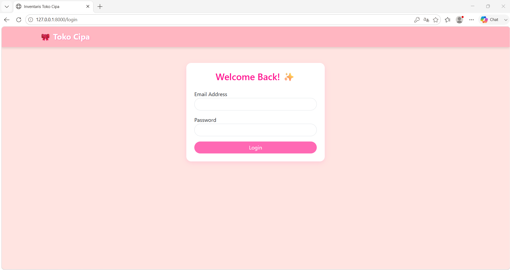
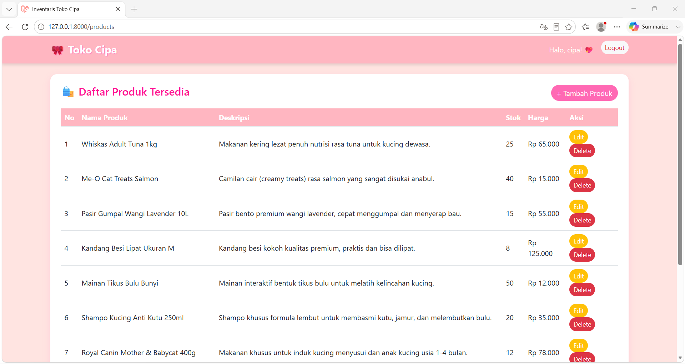
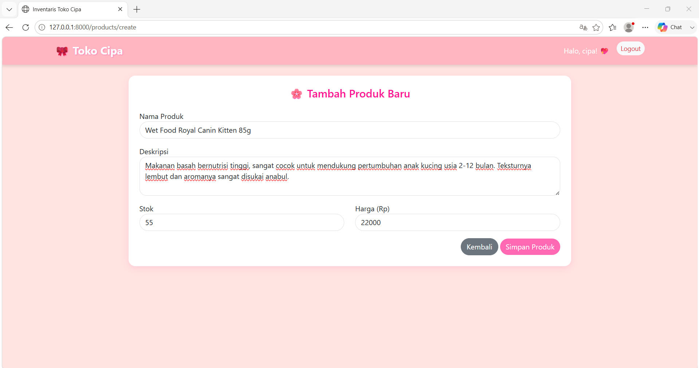
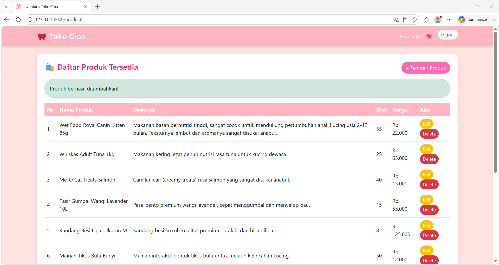
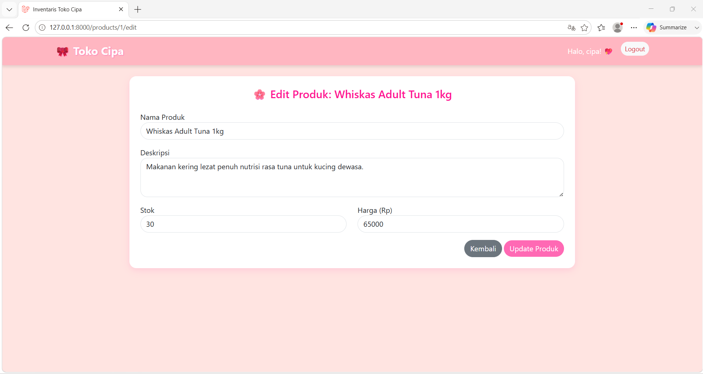
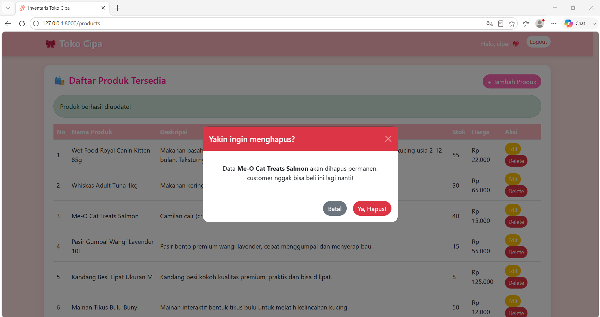
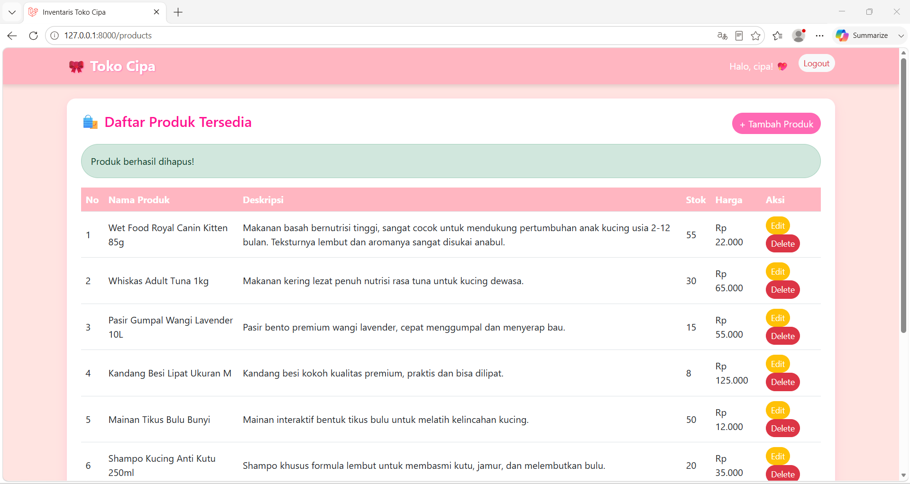

<div align="center">
  <br />
  <h1>LAPORAN PRAKTIKUM <br> APLIKASI BERBASIS PLATFORM</h1>
  <br />
  <h3>MODUL 11,12,13 <br> Laravel : CRUD Inventaris, Seeder, Factory, dan Authentication</h3>
  <br />
  
  <br />
  <br />
  <br />
  <h3>Disusun Oleh :</h3>
  <p>
    <strong>Shiva Indah Kurnia</strong><br>
    <strong>2311102035</strong><br>
    <strong>S1 IF-11-01</strong>
  </p>
  <br />
  <h3>Dosen Pengampu :</h3>
  <p>
    <strong>Dimas Fanny Hebrasianto Permadi, S.ST., M.Kom</strong>
  </p>
  <br />
  <br />
  <h4>Asisten Praktikum :</h4>
  <strong>Apri Pandu Wicaksono</strong> <br>
  <strong>Rangga Pradarrell Fathi</strong>
  <br />
  <br />
  <br />
  <br />
  <h3>LABORATORIUM HIGH PERFORMANCE <br> FAKULTAS INFORMATIKA <br> UNIVERSITAS TELKOM PURWOKERTO <br> 2026</h3>
</div>

---

## A. Dasar Teori

### 1. Laravel
Laravel adalah salah satu *framework* PHP yang digunakan untuk membangun aplikasi web secara terstruktur, efisien, dan mudah dikembangkan. Laravel employs the **MVC (Model-View-Controller)** architecture, which makes the application development process more efficient since program, tampilan, and data processing are done in accordance with its functions. In this practice, Laravel is used to create an inventory application with features like product data analysis, user authentication, and database integration.

### 2. Konsep MVC (*Model-View-Controller*)
MVC adalah pola perancangan aplikasi yang membagi sistem menjadi tiga bagian utama: "Model", yang mengelola data dan berhubungan dengan database, dan "View", yang menampilkan antarmuka pengguna.

Controller mengatur logika aplikasi dan berfungsi sebagai penghubung antara Model dan View.
Konsep MVC membuat pengembangan kode program untuk fitur baru lebih mudah dan lebih teratur.

### 3. CRUD (*Create, Read, Update, Delete*)
CRUD adalah empat operasi dasar dalam pengelolaan data pada aplikasi:
- **Create**, digunakan untuk menambahkan data baru.
- **Read**, digunakan untuk menampilkan atau membaca data.
- **Update**, digunakan untuk mengubah data yang sudah ada.
- **Delete**, digunakan untuk menghapus data.

Aplikasi inventaris toko menggunakan CRUD untuk mengelola data produk, yang memungkinkan pengguna menambah, melihat, mengubah, dan menghapus informasi barang.

### 4. Database dan MySQL
Database adalah kumpulan data yang disimpan secara sistematis sehingga mudah dikelola dan diakses. Database berfungsi sebagai tempat penyimpanan data penting dalam pengembangan aplikasi web, termasuk data pengguna, produk, kategori, stok, dan transaksi.  
Database yang digunakan dalam praktikum ini adalah MySQL, sistem manajemen basis data relasional yang umum digunakan bersama Laravel. MySQL mendukung penyimpanan data dalam bentuk tabel yang saling berelasi, yang membuatnya ideal untuk aplikasi inventaris.

### 5. Migration
Fitur migrasi Laravel adalah fitur yang memungkinkan pengembang untuk memastikan struktur database konsisten, terutama ketika proyek dikerjakan secara bertahap atau kolaboratif. Ini memungkinkan pembuatan, perubahan, dan penghapusan tabel secara terstruktur tanpa harus menulis perintah SQL secara manual.

### 6. Seeder dan Factory
Seder secara otomatis mengisi database dengan data awal atau data dummy, sedangkan pabrik menghasilkan banyak data tiruan dengan format yang telah ditentukan.  
Seder dan pabrik sangat membantu dalam aplikasi inventaris agar tabel tidak kosong saat aplikasi dimulai. Oleh karena itu, aplikasi dapat diuji langsung dengan data contoh tanpa harus memasukkan semua data secara manual.

### 7. Eloquent ORM
Eloquent ORM adalah fitur Laravel yang memungkinkan interaksi dengan database dengan menggunakan representasi objek atau model. Dengan Eloquent, pengembang tidak selalu perlu menulis query SQL secara langsung karena model PHP memungkinkan pengambilan, penyimpanan, pembaruan, dan penghapusan data. Pada praktikum ini, Eloquent dikelola data produk, kategori, dan pengguna pada aplikasi inventaris.

### 8. Authentication dan Session
Proses verifikasi identitas pengguna sebelum mereka dapat mengakses sistem dikenal sebagai autentikasi. Autentikasi dapat diterapkan dalam Laravel dengan menggunakan sistem login berbasis "session". Session adalah mekanisme yang menyimpan data pengguna sementara di sisi server setelah login berhasil. Hanya pengguna tertentu yang dapat mengakses halaman yang dilindungi, seperti halaman manajemen produk, setelah sesi diidentifikasi oleh sistem.

### 9. DataTables
Plugin berbasis JavaScript bernama DataTables digunakan untuk membuat tampilan tabel lebih interaktif. Pencarian, pengurutan kolom, pagination, dan pengaturan jumlah data yang ditampilkan adalah fitur yang tersedia.  
DataTables digunakan pada halaman daftar produk dalam aplikasi inventaris toko untuk membuat pencarian dan pengelolaan data barang lebih mudah.

### 10. Bootstrap
Bootstrap adalah framework CSS yang digunakan untuk mempercepat pembuatan tampilan web yang responsif dan rapi. Dengan bantuan Bootstrap, komponen antarmuka seperti tombol, form, tabel, alert, dan modal dapat dibuat dengan lebih mudah. Dalam kasus ini, Bootstrap digunakan untuk mendukung tampilan form tambah/edit produk, tabel data, serta modal konfirmasi hapus untuk membuat antarmuka aplikasi lebih menarik dan mudah digunakan.

### 11. Inventaris Barang
Data barang yang dimiliki oleh suatu toko atau organisasi dapat dicatat, dikelola, dan dipantau melalui sistem inventaris barang. Aplikasi inventaris berbasis web mencatat data seperti nama, kode, kategori, harga, stok, dan status barang. Pencatatan menggunakan aplikasi ini lebih cepat, lebih akurat, dan lebih mudah digunakan dibandingkan dengan pencatatan manual.

---

## B. Penjelasan Kode

### 1. Sourcecode routes/web.php
```php
<?php

use Illuminate\Support\Facades\Route;
use App\Http\Controllers\AuthController;
use App\Http\Controllers\ProductController;

Route::get('/', function () {
    return redirect()->route('login');
});

// Auth Routes (Session)
Route::get('/login', [AuthController::class, 'showLoginForm'])->name('login');
Route::post('/login', [AuthController::class, 'login']);
Route::post('/logout', [AuthController::class, 'logout'])->name('logout');

// CRUD Routes (Dilindungi oleh middleware Auth)
Route::middleware('auth')->group(function () {
    Route::resource('products', ProductController::class);
});
```

### Penjelasan

routes/web.php berfungsi sebagai pengatur lalu lintas atau pemetaan rute URL pada aplikasi web "Toko Cipa". Di dalam file ini, terdapat rute untuk menangani sistem autentikasi—seperti halaman login dan proses logout—serta rute khusus untuk manajemen produk yang diarahkan ke ProductController. Dengan memanfaatkan fungsi Route::resource, Laravel secara otomatis menyediakan seluruh jalur URL yang dibutuhkan untuk menjalankan operasi CRUD (Create, Read, Update, Delete) pada inventaris produk kucing. Selain itu, seluruh rute manajemen ini dilindungi oleh middleware auth untuk memastikan bahwa hanya admin yang sudah login yang memiliki hak akses untuk melihat, menambah, mengubah, maupun menghapus data di dalam sistem.

### 2. Sourcecode ProductController.php
```php
<?php

namespace App\Http\Controllers;

use App\Models\Product;
use Illuminate\Http\Request;

class ProductController extends Controller
{
    public function index() {
        $products = Product::latest()->get();
        return view('products.index', compact('products'));
    }

    public function create() {
        return view('products.create');
    }

    public function store(Request $request) {
        Product::create($request->validate([
            'nama_produk' => 'required',
            'deskripsi' => 'nullable',
            'stok' => 'required|numeric',
            'harga' => 'required|numeric',
        ]));
        return redirect()->route('products.index')->with('success', 'Produk berhasil ditambahkan!');
    }

    public function edit(Product $product) {
        return view('products.edit', compact('product'));
    }

    public function update(Request $request, Product $product) {
        $product->update($request->validate([
            'nama_produk' => 'required',
            'deskripsi' => 'nullable',
            'stok' => 'required|numeric',
            'harga' => 'required|numeric',
        ]));
        return redirect()->route('products.index')->with('success', 'Produk berhasil diupdate!');
    }

    public function destroy(Product $product) {
        $product->delete();
        return redirect()->route('products.index')->with('success', 'Produk berhasil dihapus!');
    }
}
```

### Penjelasan

ProductController.php bertindak sebagai pengendali logika utama yang mengatur segala alur data dan proses manipulasi inventaris pada "Toko Cipa". Controller ini menjembatani komunikasi antara Model Product (database SQLite) dengan halaman tampilan (views). Di dalamnya terdapat berbagai fungsi penting, seperti menampilkan daftar seluruh produk kucing, memproses pengisian form produk baru melalui validasi keamanan sebelum disimpan, menangani perubahan atau pembaruan (update) data barang, hingga menghapus (delete) produk dari sistem. Setelah setiap aksi berhasil dieksekusi, controller ini juga bertanggung jawab mengarahkan kembali admin ke halaman utama sembari mengirimkan notifikasi sukses.

### 3. Sourcecode Product.php
```php
<?php

namespace App\Models;

use Illuminate\Database\Eloquent\Factories\HasFactory;
use Illuminate\Database\Eloquent\Model;

class Product extends Model
{
    use HasFactory;

    // Menentukan kolom mana saja yang boleh diisi (Mass Assignment)
    protected $fillable = [
        'nama_produk',
        'deskripsi',
        'stok',
        'harga'
    ];
}
```

### Penjelasan

Product.php merupakan sebuah Eloquent Model yang berfungsi sebagai representasi digital dari tabel products di dalam database "Toko Cipa". Model ini bertanggung jawab penuh untuk menjembatani interaksi data produk kucing—seperti nama produk, deskripsi, stok, dan harga—agar dapat dimanipulasi dengan mudah menggunakan sintaks PHP tanpa perlu menulis kueri SQL manual. Di dalam file ini, terdapat konfigurasi keamanan krusial berupa properti $fillable (Mass Assignment Protection), yang mendefinisikan kolom mana saja yang diizinkan untuk menerima input data secara massal dari form. Pengaturan ini sangat penting untuk memastikan proses penambahan dan pembaruan data inventaris toko berjalan dengan aman, sekaligus melindungi database dari celah kerentanan manipulasi data ilegal dari luar.

### 4. Sourcecode Migration (0001_01_01_000000_create_users_table.php)
```php
<?php

use Illuminate\Database\Migrations\Migration;
use Illuminate\Database\Schema\Blueprint;
use Illuminate\Support\Facades\Schema;

return new class extends Migration
{
    /**
     * Run the migrations.
     */
    public function up(): void
    {
        Schema::create('users', function (Blueprint $table) {
            $table->id();
            $table->string('name');
            $table->string('email')->unique();
            $table->timestamp('email_verified_at')->nullable();
            $table->string('password');
            $table->rememberToken();
            $table->timestamps();
        });

        Schema::create('password_reset_tokens', function (Blueprint $table) {
            $table->string('email')->primary();
            $table->string('token');
            $table->timestamp('created_at')->nullable();
        });

        Schema::create('sessions', function (Blueprint $table) {
            $table->string('id')->primary();
            $table->foreignId('user_id')->nullable()->index();
            $table->string('ip_address', 45)->nullable();
            $table->text('user_agent')->nullable();
            $table->longText('payload');
            $table->integer('last_activity')->index();
        });
    }

    /**
     * Reverse the migrations.
     */
    public function down(): void
    {
        Schema::dropIfExists('users');
        Schema::dropIfExists('password_reset_tokens');
        Schema::dropIfExists('sessions');
    }
};

```
### Penjelasan

0001_01_01_000000_create_users_table.php merupakan berkas migrasi bawaan Laravel yang berfungsi sebagai cetak biru (blueprint) untuk merancang dan membangun struktur tabel users di dalam database "Toko Cipa". Melalui metode up(), file ini mendefinisikan kolom-kolom identitas penting yang dibutuhkan untuk sistem autentikasi, seperti name, email yang wajib bersifat unik agar tidak terjadi duplikasi data, serta password untuk menyimpan kata sandi pengguna secara aman. Berkas migrasi ini sangat krusial karena menjadi fondasi utama yang memastikan database SQLite siap mengenali dan memproses data login dari akun admin Cipa, sekaligus secara otomatis menyiapkan tabel pendukung lainnya untuk manajemen sesi login (sessions) dan mekanisme reset password.

### 5. Sourcecode DatabaseSeeder.php
```php
<?php

namespace Database\Seeders;

use Illuminate\Database\Seeder;
use App\Models\User;
use App\Models\Product;
use Illuminate\Support\Facades\Hash;

class DatabaseSeeder extends Seeder
{
    /**
     * Seed the application's database.
     */
    public function run(): void
    {
        // Akun Login Admin Cipa
        User::create([
            'name' => 'Cipa',
            'email' => 'shiva@gmail.com',
            'password' => Hash::make('12345678'),
        ]);

        // Daftar Produk Toko Kucing Lengkap & Jelas
        $produkKucing = [
            [
                'nama_produk' => 'Whiskas Adult Tuna 1kg',
                'deskripsi' => 'Makanan kering lezat penuh nutrisi rasa tuna untuk kucing dewasa.',
                'stok' => 25,
                'harga' => 65000,
            ],
            [
                'nama_produk' => 'Me-O Cat Treats Salmon',
                'deskripsi' => 'Camilan cair (creamy treats) rasa salmon yang sangat disukai anabul.',
                'stok' => 40,
                'harga' => 15000,
            ],
            [
                'nama_produk' => 'Pasir Gumpal Wangi Lavender 10L',
                'deskripsi' => 'Pasir bento premium wangi lavender, cepat menggumpal dan menyerap bau.',
                'stok' => 15,
                'harga' => 55000,
            ],
            [
                'nama_produk' => 'Kandang Besi Lipat Ukuran M',
                'deskripsi' => 'Kandang besi kokoh kualitas premium, praktis dan bisa dilipat.',
                'stok' => 8,
                'harga' => 125000,
            ],
            [
                'nama_produk' => 'Mainan Tikus Bulu Bunyi',
                'deskripsi' => 'Mainan interaktif bentuk tikus bulu untuk melatih kelincahan kucing.',
                'stok' => 50,
                'harga' => 12000,
            ],
            [
                'nama_produk' => 'Shampo Kucing Anti Kutu 250ml',
                'deskripsi' => 'Shampo khusus formula lembut untuk membasmi kutu, jamur, dan melembutkan bulu.',
                'stok' => 20,
                'harga' => 35000,
            ],
            [
                'nama_produk' => 'Royal Canin Mother & Babycat 400g',
                'deskripsi' => 'Makanan khusus untuk induk kucing menyusui dan anak kucing usia 1-4 bulan.',
                'stok' => 12,
                'harga' => 78000,
            ],
            [
                'nama_produk' => 'Kalung Kucing Lonceng Pita Pink',
                'deskripsi' => 'Kalung leher imut bermotif pita pink dengan lonceng nyaring, bikin anabul makin cantik.',
                'stok' => 30,
                'harga' => 8000,
            ],
            [
                'nama_produk' => 'Sisir Grooming Tombol Otomatis',
                'deskripsi' => 'Sisir bulu rontok dengan tombol otomatis di belakang untuk memudahkan pembersihan bulu.',
                'stok' => 18,
                'harga' => 28000,
            ],
            [
                'nama_produk' => 'Kasur Kucing Lembut Bentuk Kepala Kucing',
                'deskripsi' => 'Tempat tidur super empuk dan hangat, sangat nyaman untuk tempat tidur siang anabul.',
                'stok' => 5,
                'harga' => 95000,
            ]
        ];

        // Looping untuk memasukkan data ke database
        foreach ($produkKucing as $produk) {
            Product::create($produk);
        }
    }
}
```

### Penjelasan

DatabaseSeeder.php berfungsi sebagai pengisi data awal otomatis (seeding) ke dalam database aplikasi "Toko Kucing Cipa" agar sistem siap digunakan untuk pengujian tanpa harus menginput data satu per satu dari nol. Di dalam berkas ini, terdapat instruksi untuk membuat satu akun login admin utama atas nama 'Cipa' dengan kata sandi yang telah diamankan menggunakan Hash::make(). Selain itu, seeder ini memanfaatkan metode perulangan (looping) untuk menyuntikkan daftar sepuluh data produk kebutuhan kucing yang riil—seperti makanan, pasir gumpal, kandang, hingga aksesoris—langsung ke tabel produk, sehingga halaman utama aplikasi langsung menampilkan contoh data inventaris yang jelas, rapi, dan siap dipamerkan saat pengujian praktikum.
---

## C. Penjelasan Implementasi Sistem

Implementasi sistem "Toko Kucing Cipa" secara keseluruhan dibangun menggunakan framework Laravel dengan menerapkan arsitektur MVC (Model-View-Controller) dan memanfaatkan database SQLite sebagai media penyimpanan data yang ringan. Proses implementasi ini mengintegrasikan seluruh komponen yang telah dibuat, mulai dari perancangan struktur tabel melalui Migrations, penyuntikan data awal melalui Seeders, pengamanan hak akses menggunakan Middleware Auth, hingga pengelolaan logika bisnis CRUD (Create, Read, Update, Delete) di dalam Controller. Seluruh data tersebut kemudian disajikan secara dinamis kepada pengguna melalui antarmuka web yang responsif menggunakan Blade Views, sehingga menghasilkan satu kesatuan sistem inventaris toko yang aman, terstruktur, dan berjalan secara otomatis dari sisi backend hingga frontend.

---

## D. Hasil Tampilan 

### Halaman Login


Untuk mengakses dashboard dan fitur manajemen produk, pengguna harus memasukkan alamat email dan password mereka di halaman login sistem.

---

### Halaman Dashboard


Dashboard menampilkan daftar produk terbaru yang masuk ke dalam sistem. Ini juga menampilkan ringkasan data inventaris seperti total produk, total stok, tipe gitar, dan harga jual.

---

### Halaman Daftar Produk


Halaman daftar produk menampilkan tabel dengan semua data produk, termasuk nama, deskripsi, tipe, stok, harga, dan tombol untuk mengubah atau menghapus data.

---

### Halaman Tambah Produk


Untuk memasukkan data produk baru ke dalam database, pengguna harus mengisi tipe gitar, kode produk, nama, stok awal, harga dan deskripsi, pada halaman tambah produk sebelum data disimpan.

---

### Hasil Berhasil Menambah Produk


Setelah data disimpan dengan sukses, sistem memberikan notifikasi kepada pengguna bahwa produk telah ditambahkan. Data yang baru ditambahkan juga ditampilkan secara langsung pada daftar produk.

---

### Halaman Edit Produk


Untuk memperbarui data produk yang sudah ada, halaman edit produk digunakan. Form ini menampilkan data lama agar dapat diubah sesuai kebutuhan.

---

### Hasil Berhasil Update Produk


Setelah proses edit selesai, notifikasi diberikan oleh sistem bahwa data produk telah diperbarui dengan sukses.

---

### Modal Konfirmasi Hapus


Untuk mencegah penghapusan data secara tidak sengaja, sistem akan menampilkan modal konfirmasi sebelum data dihapus.

---

### Hasil Berhasil Hapus Produk


Setelah pengguna menekan tombol "hapus" pada modal konfirmasi, data akan dihapus dari database. Setelah selesai, sistem menampilkan notifikasi bahwa produk dihapus dengan sukses.

---

## E. Kesimpulan

Melalui pelaksanaan praktikum modul ini, implementasi aplikasi web inventaris toko gitar telah sukses diwujudkan dengan memanfaatkan keunggulan arsitektur modern framework Laravel. Pengembangan aplikasi ini berpusat pada optimalisasi logika bisnis di dalam ProductController untuk menangani siklus CRUD secara dinamis, yang diperkuat dengan proteksi keamanan Mass Assignment pada model data serta pembatasan hak akses halaman siber melalui mekanisme auth dan guest middleware.
---

## Referensi

[1] Modul Praktikum Aplikasi Berbasis Platform (ABP) Modul 11  
[2] Modul Praktikum Aplikasi Berbasis Platform (ABP) Modul 12  
[3] Modul Praktikum Aplikasi Berbasis Platform (ABP) Modul 13  
[4] W3Schools. https://www.w3schools.com  
