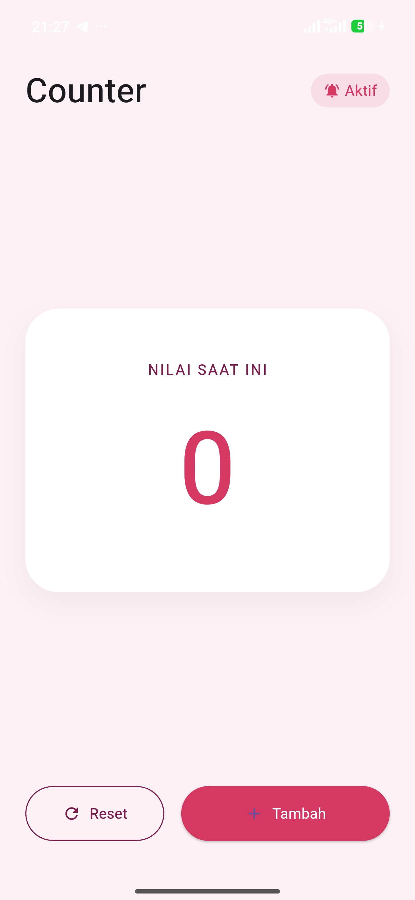
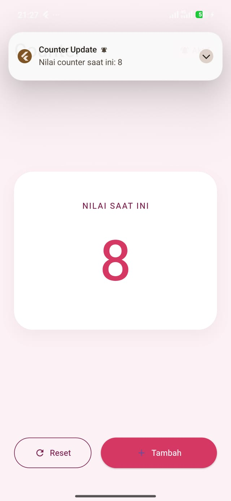
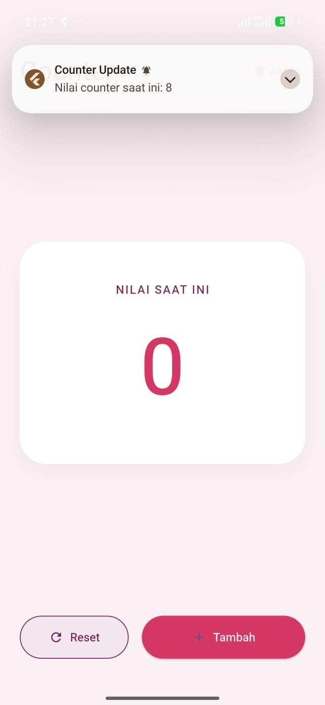

<div align="center">
  <br />
  <h1>LAPORAN PRAKTIKUM <br>APLIKASI BERBASIS PLATFORM</h1>
  <br />
  <h3>MODUL 12 & 13<br> IMPLEMENTASI PROVIDER & NOTIFIKASI <br>(Aplikasi Counter & State Management)</h3>
  <br />
   
  <br />
  <br />
  <br />
  <h3>Disusun Oleh :</h3>
  <p>
    <strong>Shiva Indah Kurnia</strong><br>
    <strong>2311102035</strong><br>
    <strong>S1 IF-11-REG01</strong>
  </p>
  <br />
  <br />
  <h3>Dosen Pengampu :</h3>
  <p>
    <strong>Dimas Fanny Hebrasianto Permadi, S.ST., M.Kom</strong>
  </p>
  <br />
  <br />
    <h4>Asisten Praktikum :</h4>
    <strong> Apri Pandu Wicaksono </strong> <br>
    <strong>Rangga Pradarrell Fathi</strong>
  <br />
  <h3>LABORATORIUM HIGH PERFORMANCE
 <br>FAKULTAS INFORMATIKA <br>UNIVERSITAS TELKOM PURWOKERTO <br>2026</h3>
</div>

---

## 1. Dasar Teori

### 1.1 Flutter
Flutter adalah framework antarmuka pengguna (UI) sumber terbuka dari Google yang digunakan untuk membangun aplikasi secara natively compiled untuk berbagai platform dari satu basis kode (codebase).

### 1.2 Provider (State Management)
`provider` adalah salah satu package manajemen state (state management) yang direkomendasikan secara resmi oleh tim Flutter. Provider berfungsi sebagai pembungkus (*wrapper*) di sekitar *InheritedWidget* untuk membuat penggunaan *InheritedWidget* menjadi lebih mudah dan terstruktur. Konsep utamanya adalah memisahkan antara *business logic* dan *UI*, sehingga saat terjadi perubahan state, hanya widget yang membutuhkan data tersebut yang akan di-rebuild.

### 1.3 Flutter Local Notifications
`flutter_local_notifications` adalah plugin untuk membuat dan menampilkan notifikasi pop-up secara lokal (offline) dari dalam aplikasi, tanpa melalui server atau internet (seperti Firebase Cloud Messaging). Notifikasi ini dikontrol secara langsung oleh sistem operasi ponsel.

### 1.4 ChangeNotifier & Consumer
Aplikasi ini memanfaatkan `ChangeNotifier`, yaitu sebuah kelas dasar bawaan Flutter yang menyediakan mekanisme pemberitahuan perubahan (*notifyListeners*). Di sisi UI, kita menggunakan widget `Consumer` yang berfungsi untuk "mendengarkan" perubahan dari provider dan membangun ulang (*rebuild*) dirinya secara otomatis setiap kali fungsi *notifyListeners()* dipanggil.

---

## 2. Implementasi Program

### 2.1 Deskripsi Aplikasi
Aplikasi bertema **"Implementasi Provider & Notifikasi"** ini dibuat untuk memahami cara mengelola perubahan state aplikasi skala menengah menggunakan pola desain manajemen state yang rapi. Fitur utama yang diimplementasikan:

1. **State Management Counter**: Menampilkan nilai angka counter yang state-nya dipertahankan secara terpusat.
2. **Penambahan Counter**: Terdapat tombol **"Tambah"** untuk menaikkan nilai counter dengan fungsi *increment*.
3. **Reset Counter**: Terdapat tombol **"Reset"** untuk mengembalikan angka menjadi 0.
4. **Notifikasi Sistem**:
   - Muncul notifikasi **"Counter Update"** ketika tombol tambah ditekan (menampilkan angka terakhir).
   - Muncul notifikasi **"Counter Direset"** ketika tombol reset ditekan.
5. **Modern Dark UI**: Tampilan visual mengusung gaya *dark navy* dengan elemen lingkaran bercahaya biru dan tombol bergaya modern.

---

## 3. Code & Penjelasan

### 3.1 `pubspec.yaml` — Menambahkan Dependensi

Dua library eksternal utama yang digunakan untuk menyelesaikan modul ini:

```yaml
dependencies:
  flutter:
    sdk: flutter

  provider: ^6.1.2
  flutter_local_notifications: ^17.2.3
```

**Penjelasan:**
Blok kode di dalam file pubspec.yaml tersebut berfungsi untuk mendaftarkan paket (library) pihak ketiga yang wajib diunduh agar aplikasi Flutter dapat berjalan. Deklarasi dependencies: bertindak sebagai instruksi utama bagi framework untuk mengintegrasikan seluruh pustaka di bawahnya ke dalam sistem aplikasi. Komponen pertama, yaitu flutter: dan sdk: flutter, merupakan dependensi inti untuk mengimpor seluruh widget dasar UI Flutter seperti tombol, teks, halaman, dan sistem tata letak standar.

Pustaka kedua, provider: ^6.1.2, digunakan untuk mengaktifkan manajemen status (state management) yang bertugas memisahkan logika data counter (backend) dari tampilan antarmuka (user interface), sehingga angka pada layar dapat diperbarui secara otomatis secara real-time. Terakhir, pustaka flutter_local_notifications: ^17.2.3 berfungsi memberikan akses ke sistem operasi perangkat keras HP agar aplikasi memiliki kemampuan untuk memunculkan pop-up banner notifikasi lokal di bagian atas layar setiap kali tombol penambah nilai counter ditekan.

---

### 3.2 Konfigurasi Izin Notifikasi — `AndroidManifest.xml`

Sejak Android 13 (API Level 33), sistem operasi memblokir notifikasi pop-up secara default kecuali izin eksplisit diminta dari pengguna.

```xml
<manifest xmlns:android="http://schemas.android.com/apk/res/android">
    <uses-permission android:name="android.permission.POST_NOTIFICATIONS"/>
    <application
        android:label="modul12_13"
        android:name="${applicationName}"
        android:icon="@mipmap/ic_launcher">
        <activity
            android:name=".MainActivity"
            android:exported="true"
            android:launchMode="singleTop"
            android:taskAffinity=""
            android:theme="@style/LaunchTheme"
            android:configChanges="orientation|keyboardHidden|keyboard|screenSize|smallestScreenSize|locale|layoutDirection|fontScale|screenLayout|density|uiMode"
            android:hardwareAccelerated="true"
            android:windowSoftInputMode="adjustResize">
            <!-- Specifies an Android theme to apply to this Activity as soon as
                 the Android process has started. This theme is visible to the user
                 while the Flutter UI initializes. After that, this theme continues
                 to determine the Window background behind the Flutter UI. -->
            <meta-data
              android:name="io.flutter.embedding.android.NormalTheme"
              android:resource="@style/NormalTheme"
              />
            <intent-filter>
                <action android:name="android.intent.action.MAIN"/>
                <category android:name="android.intent.category.LAUNCHER"/>
            </intent-filter>
        </activity>
        <!-- Don't delete the meta-data below.
             This is used by the Flutter tool to generate GeneratedPluginRegistrant.java -->
        <meta-data
            android:name="flutterEmbedding"
            android:value="2" />
    </application>
    <!-- Required to query activities that can process text, see:
         https://developer.android.com/training/package-visibility and
         https://developer.android.com/reference/android/content/Intent#ACTION_PROCESS_TEXT.

         In particular, this is used by the Flutter engine in io.flutter.plugin.text.ProcessTextPlugin. -->
    <queries>
        <intent>
            <action android:name="android.intent.action.PROCESS_TEXT"/>
            <data android:mimeType="text/plain"/>
        </intent>
    </queries>
</manifest>

```

**Penjelasan:**
Mulai dari Android 13 (API level 33) ke atas, sistem Android mewajibkan setiap aplikasi untuk meminta izin ini secara eksplisit agar memiliki hak legal dalam memunculkan spanduk ataupun pop-up notifikasi di layar HP pengguna. Tanpa adanya deklarasi baris izin ini di dalam manifes, sistem Android akan otomatis memblokir fungsi pengiriman notifikasi lokal yang dipicu oleh paket flutter_local_notifications pada aplikasi.

---

### 3.3 Membungkus Aplikasi dengan Provider — `main.dart`

```dart
import 'package:flutter/material.dart';
import 'package:provider/provider.dart';

import 'counter_provider.dart';
import 'notification_service.dart';

void main() async {
  WidgetsFlutterBinding.ensureInitialized();

  await NotificationService.init();

  runApp(
    ChangeNotifierProvider(
      create: (_) => CounterProvider(),
      child: const MyApp(),
    ),
  );
}

class MyApp extends StatelessWidget {
  const MyApp({super.key});

  @override
  Widget build(BuildContext context) {
    return MaterialApp(
      debugShowCheckedModeBanner: false,
      title: 'Provider Counter',
      home: const CounterPage(),
    );
  }
}

class CounterPage extends StatelessWidget {
  const CounterPage({super.key});

  @override
  Widget build(BuildContext context) {
    final counterProvider =
        Provider.of<CounterProvider>(context);

    return Scaffold(
      appBar: AppBar(
        title: const Text(
          'Provider & Notification',
        ),
      ),
      body: Center(
        child: Text(
          '${counterProvider.counter}',
          style: const TextStyle(
            fontSize: 50,
            fontWeight: FontWeight.bold,
          ),
        ),
      ),
      floatingActionButton:
          FloatingActionButton(
        onPressed: () {
          counterProvider.increment();
        },
        child: const Icon(Icons.add),
      ),
    );
  }
}
```

**Penjelasan:**
Proses membungkus aplikasi dengan Provider dilakukan di dalam fungsi utama main() pada file main.dart menggunakan widget ChangeNotifierProvider. Widget ini ditempatkan tepat di dalam fungsi runApp() untuk membungkus MyApp(), yang merupakan akar dari seluruh pohon widget (widget tree) aplikasi. Melalui properti create, kelas CounterProvider diinstansiasi secara terpusat sehingga status data (state) dan logika bisnis di dalamnya dapat dialirkan ke seluruh halaman di bawahnya. Penempatan Provider di posisi paling luar ini sangat krusial dalam arsitektur Flutter karena memastikan bahwa setiap komponen atau widget anak dapat mendengarkan perubahan data counter dan memicu fungsi notifikasi secara real-time tanpa perlu mengoper data secara manual melalui konstruktor kelas.

---
## 4. Hasil Tampilan (*Output*)

Berikut adalah tangkapan layar (*screenshot*) dari aplikasi yang menunjukkan fitur Provider dan Notifikasi Lokal telah berjalan dengan baik.

*(Ganti gambar ini dengan meletakkan hasil screenshot ke dalam folder `assets/` dengan nama yang sesuai)*

### 1. Halaman Utama


### 2. Menekan Tombol Tambah +1 dan notifikasi Pop-Up (counter bertambah)


### 3. Menekan riset dan notifikasi Pop-Up (riset ulang)

