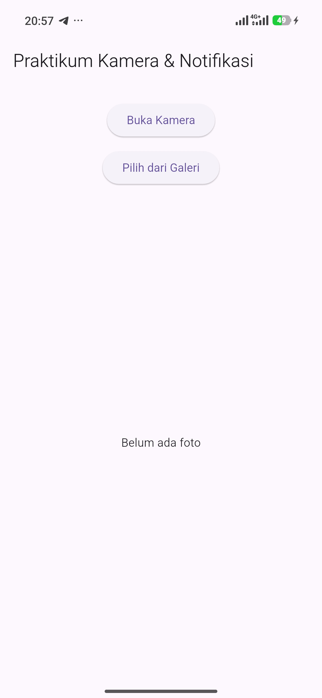
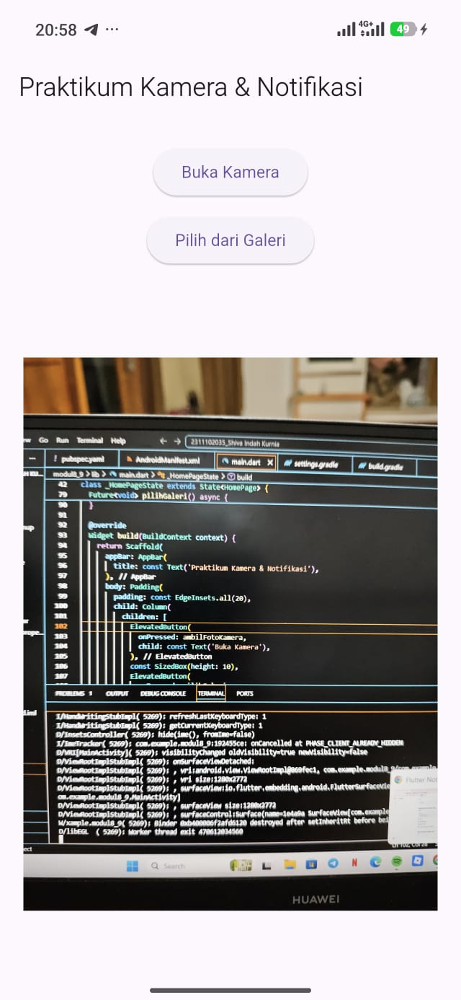
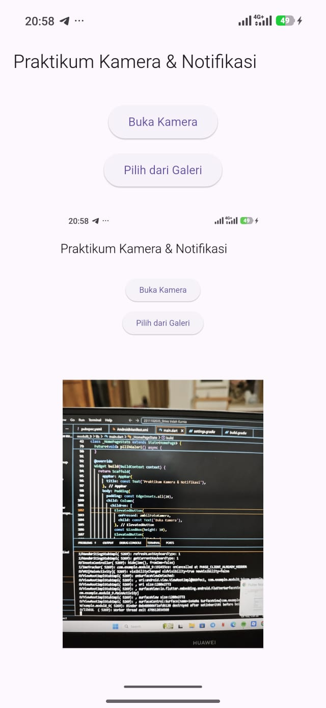

<div align="center">
  <br />
  <h1>LAPORAN PRAKTIKUM <br>APLIKASI BERBASIS PLATFORM</h1>
  <br />
  <h3>TUGAS MODUL 08 & 09 <br> NOTIFIKASI & API PERANGKAT KERAS <br>(Aplikasi Kamera & Notifikasi)</h3>
  <br />
  <br />
   
  <br />
  <br />
  <br />
  <br />
  <h3>Disusun Oleh :</h3>
  <p>
    <strong>Shiva Indah Kurnia</strong><br>
    <strong>2311102035</strong><br>
    <strong>S1 IF-11-01</strong>
  </p>
  <br />
  <br />
  <h3>Dosen Pengampu :</h3>
  <p>
    <strong>Dimas Fanny Hebrasianto Permadi, S.ST., M.Kom</strong>
  </p>
  <br />
  <br />
    <h4>Asisten Praktikum :</h4>
    <strong> Apri Pandu Wicaksono </strong> <br>
    <strong>Rangga Pradarrell Fathi</strong>
  <br />
  <h3>LABORATORIUM HIGH PERFORMANCE
 <br>FAKULTAS INFORMATIKA <br>UNIVERSITAS TELKOM PURWOKERTO <br>2026</h3>
</div>

---

## Dasar Teori

Flutter adalah framework multiplatform, pengembang dapat membuat aplikasi desktop, web, Android, dan iOS hanya dengan satu basis kode. Aplikasi "Camera & Notification App" dibuat dalam praktikum Modul 8-9 ini. Aplikasi ini memiliki dua fitur utama: mengambil foto menggunakan kamera atau galeri serta menampilkan notifikasi lokal setelah foto diambil dengan benar.

### Camera & Image Picker

Flutter tidak memiliki akses kamera secara bawaan, paket tambahan yang disebut "image_picker" diperlukan. Aplikasi dalam paket ini dapat mengambil foto langsung dari kamera perangkat dan memilih foto dari galeri. Dengan menggunakan metode "pickImage()", pengambilan foto dilakukan menggunakan "ImagePicker", yang menerima parameter "source". Nilai "ImageSource.camera" digunakan untuk membuka kamera, dan "ImageSource.gallery" digunakan untuk membuka galeri. Objekte "XFile?" yang dihasilkan oleh "pickImage()" kemudian diubah menjadi "File" dari paket "dart:io" sehingga dapat ditampilkan menggunakan widget "Image.file".

### Local Notification

Paket "flutter_local_notifications" digunakan untuk mengimplementasikan notifikasi lokal Flutter. Paket ini memungkinkan aplikasi untuk menampilkan notifikasi sistem di perangkat Android dan iOS tanpa memerlukan koneksi internet atau server. Sebelum notifikasi dapat digunakan, plugin harus diinisialisasi menggunakan "FlutterLocalNotificationsPlugin" dengan pengaturan "AndroidInitializationSettings". Ini dilakukan di dalam fungsi "main()" sebelum memanggil "runApp()" untuk memastikan plugin siap digunakan sebelum aplikasi berjalan. Metode "show()" digunakan untuk menampilkan notifikasi, yang menerima parameter ID notifikasi, judul, isi pesan, dan detail notifikasi dalam format "NotificationDetails."

### StatefulWidget dan setState

Tampilan aplikasi harus diperbarui ketika foto dipilih, menampilkan foto yang baru diambil, halaman utama menggunakan "StatefulWidget". Setiap kali foto dipilih, variabel "imageFile" diperbarui menggunakan "setState()", sehingga widget "Image.file" otomatis merender ulang tampilan dengan foto terbaru.

## Dependencies

```yaml
dependencies:
  flutter:
    sdk: flutter
  image_picker: ^1.0.7
  flutter_local_notifications: ^17.0.0
  permission_handler: ^11.3.0
```

---
## Source Code (`lib/main.dart`)

```dart
import 'dart:io';

import 'package:flutter/material.dart';
import 'package:image_picker/image_picker.dart';
import 'package:flutter_local_notifications/flutter_local_notifications.dart';

final FlutterLocalNotificationsPlugin notificationsPlugin =
    FlutterLocalNotificationsPlugin();

void main() async {
  WidgetsFlutterBinding.ensureInitialized();

  const AndroidInitializationSettings androidSettings =
      AndroidInitializationSettings('@mipmap/ic_launcher');

  const InitializationSettings initializationSettings =
      InitializationSettings(
    android: androidSettings,
  );

  await notificationsPlugin.initialize(initializationSettings);

  runApp(const MyApp());
}

class MyApp extends StatelessWidget {
  const MyApp({super.key});

  @override
  Widget build(BuildContext context) {
    return MaterialApp(
      debugShowCheckedModeBanner: false,
      title: 'Kamera dan Notifikasi',
      home: const HomePage(),
    );
  }
}

class HomePage extends StatefulWidget {
  const HomePage({super.key});

  @override
  State<HomePage> createState() => _HomePageState();
}

class _HomePageState extends State<HomePage> {
  File? imageFile;

  final ImagePicker picker = ImagePicker();

  Future<void> showNotification(String message) async {
    const AndroidNotificationDetails androidDetails =
        AndroidNotificationDetails(
      'foto_channel',
      'Foto Notification',
      importance: Importance.max,
      priority: Priority.high,
    );

    const NotificationDetails notificationDetails =
        NotificationDetails(android: androidDetails);

    await notificationsPlugin.show(
      0,
      'Berhasil',
      message,
      notificationDetails,
    );
  }

  Future<void> openCamera() async {
    final XFile? photo = await picker.pickImage(
      source: ImageSource.camera,
    );

    if (photo != null) {
      setState(() {
        imageFile = File(photo.path);
      });

      showNotification("Foto berhasil diambil dari kamera");
    }
  }

  Future<void> openGallery() async {
    final XFile? photo = await picker.pickImage(
      source: ImageSource.gallery,
    );

    if (photo != null) {
      setState(() {
        imageFile = File(photo.path);
      });

      showNotification("Foto berhasil dipilih dari galeri");
    }
  }

  @override
  Widget build(BuildContext context) {
    return Scaffold(
      appBar: AppBar(
        title: const Text("Tugas Kamera & Notifikasi"),
      ),
      body: Center(
        child: SingleChildScrollView(
          child: Column(
            mainAxisAlignment: MainAxisAlignment.center,
            children: [

              ElevatedButton(
                onPressed: openCamera,
                child: const Text("Buka Kamera"),
              ),

              const SizedBox(height: 10),

              ElevatedButton(
                onPressed: openGallery,
                child: const Text("Pilih dari Galeri"),
              ),

              const SizedBox(height: 20),

              imageFile != null
                  ? Image.file(
                      imageFile!,
                      height: 300,
                    )
                  : const Text("Belum ada foto"),
            ],
          ),
        ),
      ),
    );
  }
}
```

---

## Penjelasan Singkat Tiap Widget

**`MyApp` (StatelessWidget)** Widget ini merupakan akar (*root*) dari seluruh aplikasi yang berfungsi untuk mengatur konfigurasi global. Di dalam widget ini, `MaterialApp` digunakan untuk menentukan judul aplikasi, menyembunyikan *banner* debug, serta mengatur tema visual dasar aplikasi seperti warna primer biru dan mengaktifkan panduan desain Material 3. `MyApp` juga bertugas mengarahkan tampilan awal aplikasi langsung ke halaman `HomeScreen`.

**`HomeScreen` (StatefulWidget)** Widget ini mendefinisikan halaman utama aplikasi yang sifatnya dinamis atau dapat berubah statusnya (*stateful*). Karena aplikasi ini melibatkan interaksi langsung dengan perangkat keras—seperti menangkap file gambar baru dan memicu siklus inisialisasi sistem notifikasi saat aplikasi pertama kali dibuka—`HomeScreen` memisahkan strukturnya ke dalam kelas `_HomeScreenState` untuk mengelola perubahan data tersebut secara langsung di layar.

**`Scaffold` dan `AppBar**` `Scaffold` adalah widget struktur dasar yang menyediakan kerangka tata letak visual utama untuk halaman Android atau iOS. Di bagian atasnya terdapat widget `AppBar` yang berfungsi sebagai bilah menu atau *header* aplikasi, menampilkan judul teks "Praktikum Perangkat Keras" dengan latar belakang warna biru yang konsisten untuk mempertegas identitas visual halaman.

**`Padding` dan `Column**` Widget `Padding` membungkus seluruh konten utama di dalam halaman untuk memberikan jarak pembatas (*margin*) yang rapi di semua sisi sebesar 16 piksel. Di dalamnya, terdapat widget `Column` yang berfungsi untuk menyusun widget-widget anak secara vertikal dari atas ke bawah, sekaligus mengatur penyebaran kontennya agar meregang secara horizontal memenuhi lebar layar.

**`Expanded` dan `Center**` Widget `Expanded` digunakan di dalam `Column` untuk memaksa area tampilan gambar mengambil sisa ruang kosong yang tersedia secara maksimal di layar. Di dalam area luas tersebut, widget `Center` diletakkan untuk memastikan bahwa komponen visual berikutnya—baik berupa kotak penampung kosong maupun gambar asli yang berhasil dimuat—selalu berada tepat di tengah-tengah area porsi layar tersebut.

**Kondisional `ClipRRect` / `Container` (Tempat Gambar)** Bagian ini menggunakan logika kondisional untuk menampilkan komponen yang berbeda tergantung status file gambar. Jika gambar sudah dipilih, `ClipRRect` akan memotong ujung-ujung objek `Image.file` agar melengkung rapi; namun jika gambar masih kosong, aplikasi akan menampilkan widget `Container` abu-abu yang dihiasi dengan ikon galeri standar dan teks bertuliskan "Belum ada foto yang dipilih".

**`ElevatedButton.icon` (Tombol Kamera & Galeri)** Dua widget tombol timbul ini diletakkan di bagian bawah halaman untuk memicu aksi interaksi pengguna secara langsung. Tombol pertama dirancang khusus dengan latar biru solid dan ikon kamera untuk membuka fitur kamera bawaan perangkat keras, sedangkan tombol kedua menggunakan latar biru muda yang lebih lembut dengan ikon pustaka foto untuk membuka media galeri penyimpanan ponsel.

## Tampilan

### 1. Tampilan Awal (Belum Ada Foto)



### 2. Tampilan Setelah Foto Dengan Kamera



### 3. Notifikasi Setelah Foto Berhasil Dipilih


---
## Kesimpulan

Berdasarkan hasil pembuatan dan pengujian aplikasi "Praktikum Perangkat Keras" berbasis Flutter, dapat disimpulkan bahwa penggabungan fitur kamera dan galeri menggunakan package image_picker telah berjalan dengan sukses, sehingga pengguna dapat mengambil maupun memilih foto tanpa mengalami hambatan teknis. Di samping itu, fitur notifikasi lokal yang diimplementasikan melalui package flutter_local_notifications terbukti mampu memberikan respons secara langsung terhadap interaksi pengguna, yakni dengan menampilkan pemberitahuan segera setelah gambar berhasil dimuat ke dalam aplikasi. Keberhasilan tersebut turut ditunjang oleh penggunaan StatefulWidget yang memungkinkan tampilan antarmuka diperbarui secara otomatis dan real-time mengikuti perubahan data gambar, serta didukung oleh susunan tata letak yang terstruktur dan nyaman digunakan sesuai dengan panduan desain Material 3.
