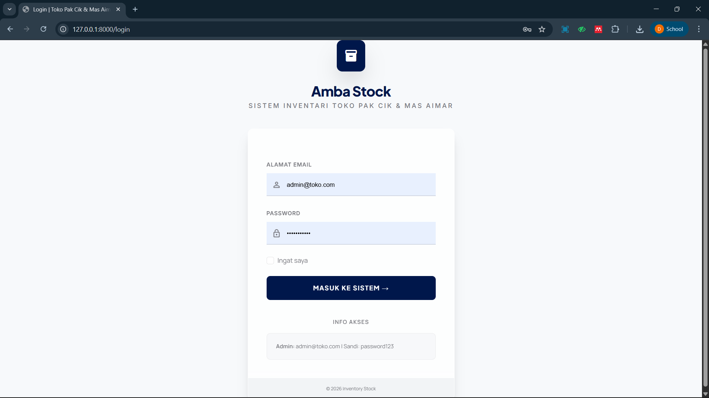
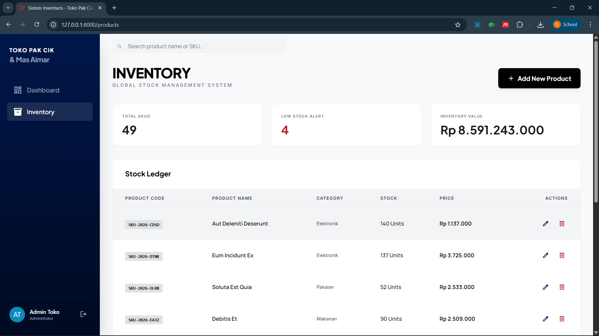
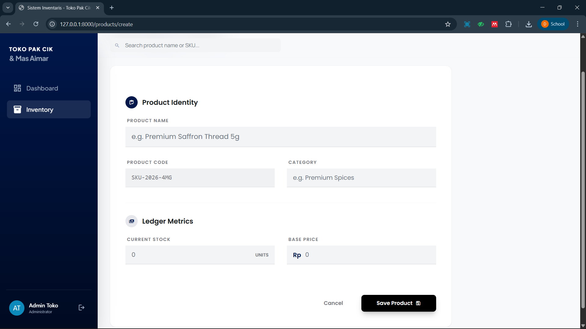
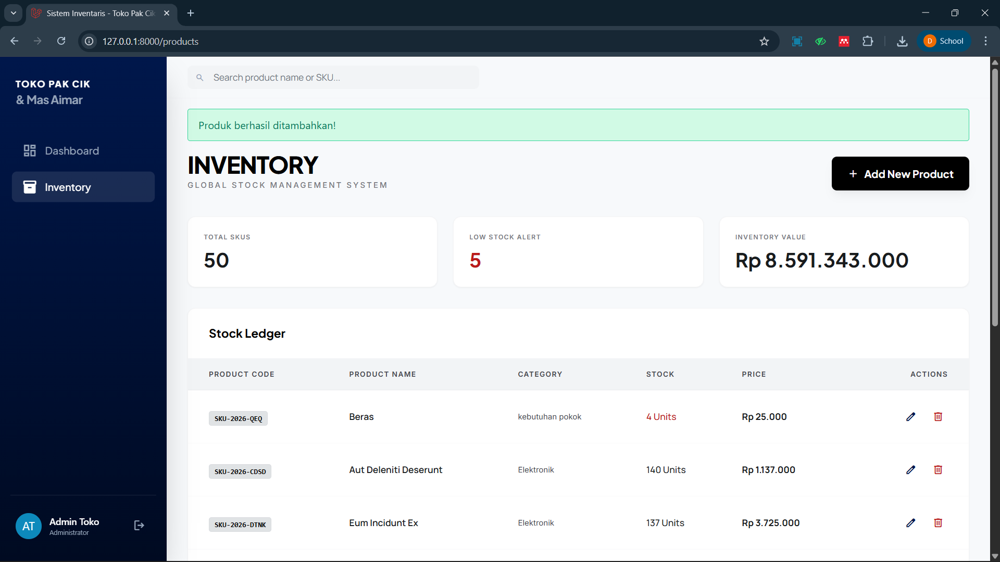
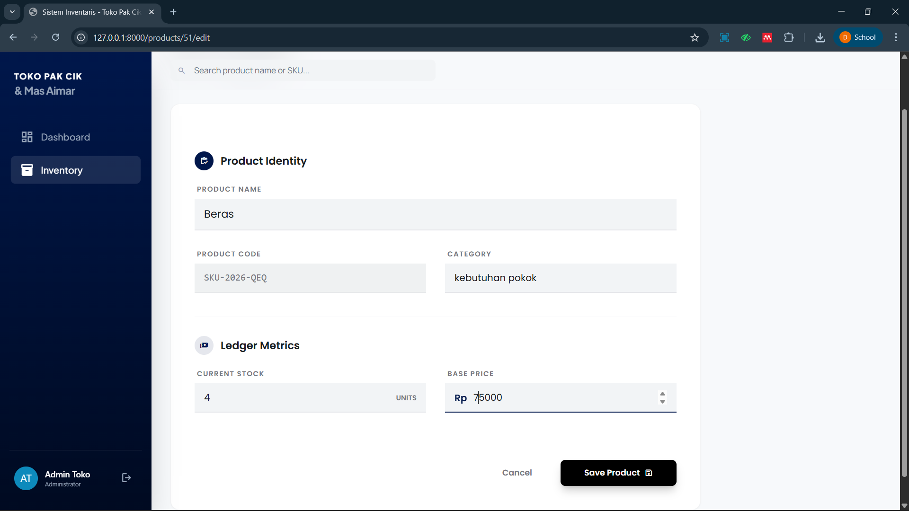
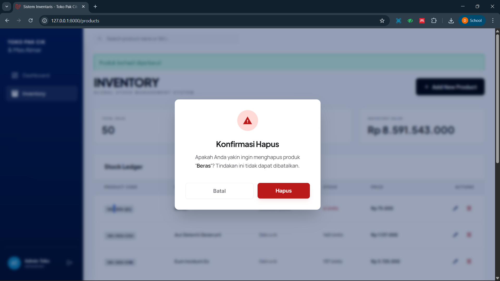
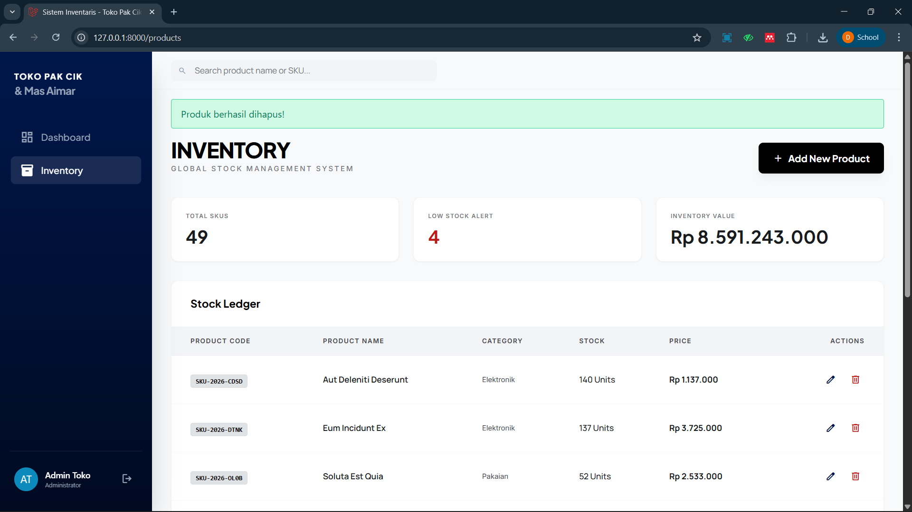

<div align="center">
  <br />
  <h1>LAPORAN PRAKTIKUM <br>APLIKASI BERBASIS PLATFORM</h1>
  <br />
  <h3>MODUL 11, 12 & 13 <br> Laravel: Migration, Seeder, CRUD & Authentication</h3>
  <br />
  <br />
  
  <br />
  <br />
  <br />
  <h3>Disusun Oleh :</h3>
  <p>
    <strong>Danendra Arden Shaduq</strong><br>
    <strong>2311102146</strong><br>
    <strong>S1 IF-11-REG01</strong><br>
  </p>
  <br />
  <h3>Dosen Pengampu :</h3>
  <p>
    <strong>Dimas Fanny Hebrasianto Permadi, S.ST., M.Kom</strong>
  </p>
  <br />
  <h3>Asisten Praktikum :</h3>
  <p>
    <strong>Apri Pandu Wicaksono</strong><br>
    <strong>Rangga Pradarrell Fathi</strong><br>
  </p>
  <br />
  <h3>LABORATORIUM HIGH PERFORMANCE<br>FAKULTAS INFORMATIKA <br>TELKOM UNIVERSITY PURWOKERTO <br>2026</h3>
</div>

---

# A. Soal

Buat *project* web menggunakan Laravel untuk membuat web inventari toko milik Pak Cik dan Mas Aimar. Spesifikasi tugas adalah sebagai berikut:
1. Terdapat fitur CRUD (Create, Read, Update, Delete) untuk mengelola produk.
2. Tampilan data produk harus menggunakan format *DataTable*.
3. Tersedia *form create* untuk menambah produk dan *form edit* untuk mengubah data produk.
4. Terdapat konfirmasi berupa *modal* ketika melakukan *delete* (hapus) produk.
5. Data harus disimpan ke dalam *database*.
6. Menggunakan *database factory* dan *seeder* agar tabel di dalam *database* tidak kosong secara *default*.
7. Menggunakan sistem otentikasi *login* berbasis sesi (*session*).

---

# B. Hasil dan Pembahasan Soal
Bagian ini akan merincikan bagaimana masing-masing spesifikasi sistem dari instruksi soal telah sukses diimplementasikan dalam struktur proyek situs inventari milik Pak Cik dan Mas Aimar.

### 1. Fitur CRUD Produk & Tampilan Form 

```php
// app/Http/Controllers/ProdukController.php
public function index()
    {
        $products = Product::latest()->paginate(10);
        $totalSkus = Product::count();
        $lowStock = Product::where('stok', '<', 10)->count();
        // Asumsi nilai total inventaris
        $inventoryValue = Product::sum(\DB::raw('stok * harga'));

        return view('products.index', compact('products', 'totalSkus', 'lowStock', 'inventoryValue'));
    }

    public function create()
    {
        $generatedSku = 'SKU-' . date('Y') . '-' . strtoupper(Str::random(3));
        return view('products.form', compact('generatedSku'));
    }

    public function store(Request $request)
    {
        $validatedData = $request->validate([
            'kode_barang' => 'required|unique:products',
            'nama_produk' => 'required|string|max:255',
            'kategori'    => 'required|string',
            'stok'        => 'required|integer|min:0',
            'harga'       => 'required|numeric|min:0',
        ]);

        Product::create($validatedData);
        return redirect()->route('products.index')->with('success', 'Produk berhasil ditambahkan!');
    }

    public function edit(Product $product)
    {
        return view('products.form', compact('product'));
    }

    public function update(Request $request, Product $product)
    {
        $validatedData = $request->validate([
            'nama_produk' => 'required|string|max:255',
            'kategori'    => 'required|string',
            'stok'        => 'required|integer|min:0',
            'harga'       => 'required|numeric|min:0',
        ]);

        $product->update($validatedData);
        return redirect()->route('products.index')->with('success', 'Produk berhasil diperbarui!');
    }

    public function destroy(Product $product)
    {
        $product->delete();
        return redirect()->route('products.index')->with('success', 'Produk berhasil dihapus!');
    }
```
Kode tersebut merupakan sebuah *controller* Laravel yang mengelola siklus hidup data produk melalui operasi CRUD (Create, Read, Update, Delete) serta menyediakan statistik inventaris yang informatif. Metode `index` bertugas menampilkan daftar produk beserta ringkasan operasional seperti total SKU, jumlah stok rendah, dan nilai total inventaris sementara metode `create` memfasilitasi pembuatan produk baru dengan otomatisasi kode SKU, yang kemudian divalidasi dan disimpan oleh metode `store`. Selain itu, kode ini mencakup fungsi `edit` dan `update` untuk menyunting data dengan validasi ketat agar tetap konsisten, serta fungsi `destroy` untuk menghapus data secara permanen, di mana seluruh proses tersebut dilengkapi dengan pesan konfirmasi otomatis untuk memberikan umpan balik kepada pengguna setelah setiap tindakan selesai dilakukan.

### 2. Implementasi Tampilan DataTables Produk

```javascript
// resources/views/products/index.blade.php
@extends('layouts.app')

@section('content')
<div class="flex flex-col md:flex-row md:items-end justify-between gap-4 mb-10">
    <div>
        <h2 class="font-headline font-extrabold text-4xl tracking-tight text-primary uppercase">Inventory</h2>
        <p class="font-label text-xs uppercase tracking-[0.2em] text-outline mt-1 font-medium">Global Stock Management System</p>
    </div>
    <a href="{{ route('products.create') }}" class="bg-primary text-on-primary font-headline font-bold px-6 py-3 rounded-lg flex items-center gap-2 transition-all hover:brightness-110 active:scale-95 shadow-lg shadow-black/5">
        <span class="material-symbols-outlined text-lg">add</span>
        <span>Add New Product</span>
    </a>
</div>

<div class="grid grid-cols-1 md:grid-cols-3 gap-6 mb-8">
    <div class="bg-white p-6 rounded-xl border border-outline-variant/20 shadow-sm">
        <p class="font-label text-[10px] uppercase tracking-widest text-outline font-bold mb-2">Total SKUs</p>
        <p class="font-headline font-bold text-3xl">{{ number_format($totalSkus) }}</p>
    </div>
    <div class="bg-white p-6 rounded-xl border border-outline-variant/20 shadow-sm">
        <p class="font-label text-[10px] uppercase tracking-widest text-outline font-bold mb-2">Low Stock Alert</p>
        <p class="font-headline font-bold text-3xl text-error">{{ $lowStock }}</p>
    </div>
    <div class="bg-white p-6 rounded-xl border border-outline-variant/20 shadow-sm">
        <p class="font-label text-[10px] uppercase tracking-widest text-outline font-bold mb-2">Inventory Value</p>
        <p class="font-headline font-bold text-3xl">Rp {{ number_format($inventoryValue, 0, ',', '.') }}</p>
    </div>
</div>

<div class="bg-white rounded-xl shadow-sm border border-outline-variant/20 overflow-hidden">
    <div class="px-8 py-6 flex items-center justify-between border-b border-outline-variant/10">
        <h3 class="font-headline font-bold text-lg text-primary">Stock Ledger</h3>
    </div>
    <div class="overflow-x-auto">
        <table class="w-full border-collapse">
            <thead>
                <tr class="bg-surface-container-low border-b border-outline-variant/20">
                    <th class="px-8 py-4 text-left font-label text-[11px] font-bold uppercase tracking-widest text-on-surface-variant">Product Code</th>
                    <th class="px-6 py-4 text-left font-label text-[11px] font-bold uppercase tracking-widest text-on-surface-variant">Product Name</th>
                    <th class="px-6 py-4 text-left font-label text-[11px] font-bold uppercase tracking-widest text-on-surface-variant">Category</th>
                    <th class="px-6 py-4 text-left font-label text-[11px] font-bold uppercase tracking-widest text-on-surface-variant">Stock</th>
                    <th class="px-6 py-4 text-left font-label text-[11px] font-bold uppercase tracking-widest text-on-surface-variant">Price</th>
                    <th class="px-8 py-4 text-right font-label text-[11px] font-bold uppercase tracking-widest text-on-surface-variant">Actions</th>
                </tr>
            </thead>
            <tbody class="divide-y divide-outline-variant/10">
                @forelse($products as $item)
                <tr class="group hover:bg-surface-container-low transition-colors">
                    <td class="px-8 py-5">
                        <span class="bg-surface-container-highest px-2 py-1 rounded text-[11px] font-mono font-bold text-primary border border-outline-variant/30">{{ $item->kode_barang }}</span>
                    </td>
                    <td class="px-6 py-5 font-body font-semibold text-sm text-on-surface">{{ $item->nama_produk }}</td>
                    <td class="px-6 py-5 font-label text-xs text-on-surface-variant">{{ $item->kategori }}</td>
                    <td class="px-6 py-5 font-body font-medium text-sm {{ $item->stok < 10 ? 'text-error font-bold' : '' }}">{{ $item->stok }} Units</td>
                    <td class="px-6 py-5 font-body font-bold text-sm">Rp {{ number_format($item->harga, 0, ',', '.') }}</td>
                    <td class="px-8 py-5 text-right">
                        <div class="flex items-center justify-end gap-3">
                            <a href="{{ route('products.edit', $item->id) }}" class="p-1.5 rounded-lg text-primary-container hover:bg-primary-container/10 transition-colors">
                                <span class="material-symbols-outlined text-lg">edit</span>
                            </a>
                            <button onclick="openDeleteModal('{{ $item->id }}', '{{ $item->nama_produk }}')" class="p-1.5 rounded-lg text-error hover:bg-error/10 transition-colors">
                                <span class="material-symbols-outlined text-lg">delete</span>
                            </button>
                        </div>
                    </td>
                </tr>
                @empty
                <tr>
                    <td colspan="6" class="px-8 py-10 text-center text-outline">Belum ada data produk.</td>
                </tr>
                @endforelse
            </tbody>
        </table>
    </div>
    <div class="px-8 py-4 border-t border-outline-variant/10">
        {{ $products->links() }}
    </div>
</div>

<div id="deleteModal" class="hidden fixed inset-0 z-[60] flex items-center justify-center p-4 bg-primary-container/40 backdrop-blur-sm">
    <div class="bg-white w-full max-w-md rounded-xl shadow-2xl overflow-hidden border border-outline-variant/20 relative">
        <div class="p-8">
            <div class="flex flex-col items-center text-center">
                <div class="w-16 h-16 bg-error-container rounded-full flex items-center justify-center mb-6">
                    <span class="material-symbols-outlined text-error text-3xl" style="font-variation-settings: 'FILL' 1;">warning</span>
                </div>
                <h3 class="font-headline text-2xl font-bold text-on-surface tracking-tight mb-3">Konfirmasi Hapus</h3>
                <p class="font-body text-on-surface-variant leading-relaxed">
                    Apakah Anda yakin ingin menghapus produk <span id="deleteProductName" class="font-semibold text-on-surface"></span>? Tindakan ini tidak dapat dibatalkan.
                </p>
            </div>
            <div class="flex flex-col sm:flex-row gap-3 mt-10">
                <button onclick="closeDeleteModal()" class="flex-1 order-2 sm:order-1 px-6 py-3 rounded-lg font-label font-semibold text-outline hover:bg-surface-container-low border border-outline-variant/30 transition-all">Batal</button>
                <form id="deleteForm" method="POST" class="flex-1 order-1 sm:order-2">
                    @csrf
                    @method('DELETE')
                    <button type="submit" class="w-full px-6 py-3 rounded-lg font-label font-semibold bg-error text-on-error hover:brightness-110 shadow-lg shadow-error/10 transition-all">Hapus</button>
                </form>
            </div>
        </div>
    </div>
</div>
@endsection

@push('scripts')
<script>
    function openDeleteModal(id, name) {
        document.getElementById('deleteModal').classList.remove('hidden');
        document.getElementById('deleteProductName').innerText = "'" + name + "'";
        document.getElementById('deleteForm').action = '/products/' + id;
    }
    function closeDeleteModal() {
        document.getElementById('deleteModal').classList.add('hidden');
    }
</script>
@endpush
```
Kode tersebut merupakan antarmuka *frontend* (Blade view) berbasis Tailwind CSS dalam Laravel yang berfungsi sebagai halaman utama manajemen inventaris, di mana sistem menampilkan ringkasan statistik real-time meliputi total SKU, jumlah stok rendah, dan nilai inventaris melalui tiga kartu informasi di bagian atas, diikuti oleh tabel data produk yang responsif dan dilengkapi dengan fitur paginasi untuk navigasi data. Halaman ini dirancang untuk memudahkan operasional pengguna dengan menyediakan tombol pintasan untuk menambah produk baru, serta menyertakan kolom aksi pada setiap baris tabel yang memungkinkan penyuntingan data atau penghapusan produk melalui *modal* konfirmasi interaktif yang dikendalikan oleh JavaScript, sehingga memastikan keamanan pengguna sebelum data dihapus secara permanen dari basis data.

### 3. Konfirmasi Hapus via Modal

```html
<button onclick="openDeleteModal('{{ $item->id }}', '{{ $item->nama_produk }}')" class="p-1.5 rounded-lg text-error hover:bg-error/10 transition-colors">
    <span class="material-symbols-outlined text-lg">delete</span>
</button>

<div id="deleteModal" class="hidden fixed inset-0 z-[60] flex items-center justify-center p-4 bg-primary-container/40 backdrop-blur-sm">
    <div class="bg-white w-full max-w-md rounded-xl shadow-2xl overflow-hidden border border-outline-variant/20 relative">
        <div class="p-8">
            <div class="flex flex-col items-center text-center">
                <div class="w-16 h-16 bg-error-container rounded-full flex items-center justify-center mb-6">
                    <span class="material-symbols-outlined text-error text-3xl" style="font-variation-settings: 'FILL' 1;">warning</span>
                </div>
                <h3 class="font-headline text-2xl font-bold text-on-surface tracking-tight mb-3">Konfirmasi Hapus</h3>
                <p class="font-body text-on-surface-variant leading-relaxed">
                    Apakah Anda yakin ingin menghapus produk <span id="deleteProductName" class="font-semibold text-on-surface"></span>? Tindakan ini tidak dapat dibatalkan.
                </p>
            </div>
            <div class="flex flex-col sm:flex-row gap-3 mt-10">
                <button onclick="closeDeleteModal()" class="flex-1 order-2 sm:order-1 px-6 py-3 rounded-lg font-label font-semibold text-outline hover:bg-surface-container-low border border-outline-variant/30 transition-all">Batal</button>
                <form id="deleteForm" method="POST" class="flex-1 order-1 sm:order-2">
                    @csrf
                    @method('DELETE')
                    <button type="submit" class="w-full px-6 py-3 rounded-lg font-label font-semibold bg-error text-on-error hover:brightness-110 shadow-lg shadow-error/10 transition-all">Hapus</button>
                </form>
            </div>
        </div>
    </div>
</div>
```
Bagian **Konfirmasi Hapus** tersebut terletak di **bagian paling akhir kode** (setelah elemen tabel), tepatnya di dalam `<div id="deleteModal" ...>`. Secara teknis, fitur ini bekerja melalui tiga komponen yang saling terintegrasi: pertama, **tombol hapus** pada setiap baris tabel yang memanggil fungsi `openDeleteModal` dengan mengirimkan data `id` dan `nama_produk`; kedua, **struktur elemen modal** itu sendiri yang secara *default* disembunyikan menggunakan kelas `hidden`; dan ketiga, **blok JavaScript** di bagian bawah (`@push('scripts')`) yang bertugas mengubah teks nama produk di dalam modal serta memperbarui atribut *action* pada formulir penghapusan (`deleteForm`) agar mengarah ke URL yang spesifik sesuai dengan ID produk yang dipilih sebelum modal tersebut ditampilkan ke layar.

### 4. Konfigurasi Arsitektur Database Melalui Seeder & Factory

```php
namespace Database\Seeders;

use Illuminate\Database\Seeder;
use App\Models\User;
use App\Models\Product; // Wajib dipanggil agar Laravel mengenali tabel Product

class DatabaseSeeder extends Seeder
{
    public function run(): void
    {
        // 1. Buat ulang akun Admin agar kita tetap bisa login
        User::create([
            'name' => 'Admin Toko',
            'email' => 'admin@toko.com',
            'password' => bcrypt('password123'),
        ]);

        // 2. Generate 50 data produk secara otomatis!
        Product::factory(50)->create();
    }
}
```
Kode tersebut adalah *Database Seeder* dalam Laravel yang dirancang untuk mengotomatisasi pengisian data awal ke dalam basis data aplikasi. Melalui metode `run`, kode ini pertama-tama membuat sebuah akun administrator dengan kredensial tetap—memastikan akses administratif tersedia segera setelah migrasi—dan kemudian menggunakan *Model Factory* untuk membangkitkan 50 data produk secara otomatis, yang sangat berguna untuk kebutuhan pengujian maupun simulasi tampilan data dalam jumlah besar tanpa perlu memasukkannya secara manual ke dalam sistem.

### 5. Sistem Kemanan Autentikasi Menggunakan Parameter ID Session

```php
<?php

namespace App\Http\Controllers;

use Illuminate\Http\Request;
use Illuminate\Support\Facades\Auth;

class AuthController extends Controller
{
    public function showLogin() {
        return view('auth.login');
    }

    public function login(Request $request) {
        $credentials = $request->validate([
            'email' => ['required', 'email'],
            'password' => ['required'],
        ]);

        if (Auth::attempt($credentials)) {
            $request->session()->regenerate();
            return redirect()->intended('/products');
        }

        return back()->withErrors(['email' => 'Email atau password salah.']);
    }

    public function logout(Request $request) {
        Auth::logout();
        $request->session()->invalidate();
        $request->session()->regenerateToken();
        return redirect('/login');
    }
}
```
Kode ini merupakan *controller* otentikasi dalam Laravel yang mengelola alur masuk dan keluar pengguna ke dalam sistem secara aman. Metode `showLogin` bertugas menampilkan antarmuka formulir masuk, sementara metode `login` memproses kredensial pengguna dengan memvalidasi input, melakukan pengecekan data menggunakan `Auth::attempt`, serta menjalankan regenerasi sesi untuk meningkatkan keamanan setelah autentikasi berhasil sebelum mengarahkan pengguna ke halaman utama. Selain itu, metode `logout` berperan menutup sesi pengguna yang sedang aktif dengan membatalkan sesi tersebut (`invalidate`), memperbarui token CSRF untuk mencegah celah keamanan, dan mengarahkan pengguna kembali ke halaman masuk, sehingga memastikan siklus pengelolaan sesi pengguna dalam aplikasi berjalan dengan terstruktur dan terlindungi.

---

# C. Kode

### 1. Alur (routes/web.php)

```php
<?php

use Illuminate\Support\Facades\Route;
use App\Http\Controllers\ProductController;
use App\Http\Controllers\LoginController;

Route::get('/', function () {
    return redirect()->route('products.index');
});

// routes/web.php

// Halaman login
Route::get('/login', [LoginController::class, 'showLogin'])->name('login');
Route::post('/login', [LoginController::class, 'login']);

// Grup route yang HANYA bisa diakses setelah login
Route::middleware('auth')->group(function () {
    Route::get('/', function () { return redirect()->route('products.index'); });
    Route::resource('products', ProductController::class);
});

// Route CRUD Product
Route::resource('products', ProductController::class);

// Untuk mempermudah testing sementara, kita pakai GET
Route::get('/logout', [App\Http\Controllers\LoginController::class, 'logout'])->name('logout');
```

### 2. Autentikasi (AuthController.php)

```php
<?php

namespace App\Http\Controllers;

use Illuminate\Http\Request;
use Illuminate\Support\Facades\Auth;

class AuthController extends Controller
{
    public function showLogin() {
        return view('auth.login');
    }

    public function login(Request $request) {
        $credentials = $request->validate([
            'email' => ['required', 'email'],
            'password' => ['required'],
        ]);

        if (Auth::attempt($credentials)) {
            $request->session()->regenerate();
            return redirect()->intended('/products');
        }

        return back()->withErrors(['email' => 'Email atau password salah.']);
    }

    public function logout(Request $request) {
        Auth::logout();
        $request->session()->invalidate();
        $request->session()->regenerateToken();
        return redirect('/login');
    }
}
```

### 3. Data CRUD (ProdukController.php)

```php
<?php

namespace App\Http\Controllers;

use App\Models\Product;
use Illuminate\Http\Request;
use Illuminate\Support\Str;

class ProductController extends Controller
{
    public function index()
    {
        $products = Product::latest()->paginate(10);
        $totalSkus = Product::count();
        $lowStock = Product::where('stok', '<', 10)->count();
        // Asumsi nilai total inventaris
        $inventoryValue = Product::sum(\DB::raw('stok * harga'));

        return view('products.index', compact('products', 'totalSkus', 'lowStock', 'inventoryValue'));
    }

    public function create()
    {
        $generatedSku = 'SKU-' . date('Y') . '-' . strtoupper(Str::random(3));
        return view('products.form', compact('generatedSku'));
    }

    public function store(Request $request)
    {
        $validatedData = $request->validate([
            'kode_barang' => 'required|unique:products',
            'nama_produk' => 'required|string|max:255',
            'kategori'    => 'required|string',
            'stok'        => 'required|integer|min:0',
            'harga'       => 'required|numeric|min:0',
        ]);

        Product::create($validatedData);
        return redirect()->route('products.index')->with('success', 'Produk berhasil ditambahkan!');
    }

    public function edit(Product $product)
    {
        return view('products.form', compact('product'));
    }

    public function update(Request $request, Product $product)
    {
        $validatedData = $request->validate([
            'nama_produk' => 'required|string|max:255',
            'kategori'    => 'required|string',
            'stok'        => 'required|integer|min:0',
            'harga'       => 'required|numeric|min:0',
        ]);

        $product->update($validatedData);
        return redirect()->route('products.index')->with('success', 'Produk berhasil diperbarui!');
    }

    public function destroy(Product $product)
    {
        $product->delete();
        return redirect()->route('products.index')->with('success', 'Produk berhasil dihapus!');
    }
}
```

### 4. Injeksi Basis Data secara Otomatis (DatabaseSeeder.php)

```php
<?php

namespace Database\Seeders;

use Illuminate\Database\Seeder;
use App\Models\User;
use App\Models\Product; // Wajib dipanggil agar Laravel mengenali tabel Product

class DatabaseSeeder extends Seeder
{
    public function run(): void
    {
        // 1. Buat ulang akun Admin agar kita tetap bisa login
        User::create([
            'name' => 'Admin Toko',
            'email' => 'admin@toko.com',
            'password' => bcrypt('password123'),
        ]);

        // 2. Generate 50 data produk secara otomatis!
        Product::factory(50)->create();
    }
}
```

### 5. Migration (2026_04_20_132420_create_products_table.php)

```php
<?php

use Illuminate\Database\Migrations\Migration;
use Illuminate\Database\Schema\Blueprint;
use Illuminate\Support\Facades\Schema;

return new class extends Migration
{
    public function up(): void
    {
        Schema::create('products', function (Blueprint $table) {
            $table->id();
            $table->string('kode_barang')->unique();
            $table->string('nama_produk');
            $table->string('kategori');
            $table->integer('stok');
            $table->decimal('harga', 15, 2);
            $table->timestamps();
        });
    }

    public function down(): void
    {
        Schema::dropIfExists('products');
    }
};
```

### 6. Model (Product.php)

```php
<?php

namespace App\Models;

use Illuminate\Database\Eloquent\Factories\HasFactory;
use Illuminate\Database\Eloquent\Model;

class Product extends Model
{
    use HasFactory;

    protected $guarded = ['id'];
}
```

### 7. View dan Antarmuka (index.blade.php)

```javascript
@extends('layouts.app')

@section('content')
<div class="flex flex-col md:flex-row md:items-end justify-between gap-4 mb-10">
    <div>
        <h2 class="font-headline font-extrabold text-4xl tracking-tight text-primary uppercase">Inventory</h2>
        <p class="font-label text-xs uppercase tracking-[0.2em] text-outline mt-1 font-medium">Global Stock Management System</p>
    </div>
    <a href="{{ route('products.create') }}" class="bg-primary text-on-primary font-headline font-bold px-6 py-3 rounded-lg flex items-center gap-2 transition-all hover:brightness-110 active:scale-95 shadow-lg shadow-black/5">
        <span class="material-symbols-outlined text-lg">add</span>
        <span>Add New Product</span>
    </a>
</div>

<div class="grid grid-cols-1 md:grid-cols-3 gap-6 mb-8">
    <div class="bg-white p-6 rounded-xl border border-outline-variant/20 shadow-sm">
        <p class="font-label text-[10px] uppercase tracking-widest text-outline font-bold mb-2">Total SKUs</p>
        <p class="font-headline font-bold text-3xl">{{ number_format($totalSkus) }}</p>
    </div>
    <div class="bg-white p-6 rounded-xl border border-outline-variant/20 shadow-sm">
        <p class="font-label text-[10px] uppercase tracking-widest text-outline font-bold mb-2">Low Stock Alert</p>
        <p class="font-headline font-bold text-3xl text-error">{{ $lowStock }}</p>
    </div>
    <div class="bg-white p-6 rounded-xl border border-outline-variant/20 shadow-sm">
        <p class="font-label text-[10px] uppercase tracking-widest text-outline font-bold mb-2">Inventory Value</p>
        <p class="font-headline font-bold text-3xl">Rp {{ number_format($inventoryValue, 0, ',', '.') }}</p>
    </div>
</div>

<div class="bg-white rounded-xl shadow-sm border border-outline-variant/20 overflow-hidden">
    <div class="px-8 py-6 flex items-center justify-between border-b border-outline-variant/10">
        <h3 class="font-headline font-bold text-lg text-primary">Stock Ledger</h3>
    </div>
    <div class="overflow-x-auto">
        <table class="w-full border-collapse">
            <thead>
                <tr class="bg-surface-container-low border-b border-outline-variant/20">
                    <th class="px-8 py-4 text-left font-label text-[11px] font-bold uppercase tracking-widest text-on-surface-variant">Product Code</th>
                    <th class="px-6 py-4 text-left font-label text-[11px] font-bold uppercase tracking-widest text-on-surface-variant">Product Name</th>
                    <th class="px-6 py-4 text-left font-label text-[11px] font-bold uppercase tracking-widest text-on-surface-variant">Category</th>
                    <th class="px-6 py-4 text-left font-label text-[11px] font-bold uppercase tracking-widest text-on-surface-variant">Stock</th>
                    <th class="px-6 py-4 text-left font-label text-[11px] font-bold uppercase tracking-widest text-on-surface-variant">Price</th>
                    <th class="px-8 py-4 text-right font-label text-[11px] font-bold uppercase tracking-widest text-on-surface-variant">Actions</th>
                </tr>
            </thead>
            <tbody class="divide-y divide-outline-variant/10">
                @forelse($products as $item)
                <tr class="group hover:bg-surface-container-low transition-colors">
                    <td class="px-8 py-5">
                        <span class="bg-surface-container-highest px-2 py-1 rounded text-[11px] font-mono font-bold text-primary border border-outline-variant/30">{{ $item->kode_barang }}</span>
                    </td>
                    <td class="px-6 py-5 font-body font-semibold text-sm text-on-surface">{{ $item->nama_produk }}</td>
                    <td class="px-6 py-5 font-label text-xs text-on-surface-variant">{{ $item->kategori }}</td>
                    <td class="px-6 py-5 font-body font-medium text-sm {{ $item->stok < 10 ? 'text-error font-bold' : '' }}">{{ $item->stok }} Units</td>
                    <td class="px-6 py-5 font-body font-bold text-sm">Rp {{ number_format($item->harga, 0, ',', '.') }}</td>
                    <td class="px-8 py-5 text-right">
                        <div class="flex items-center justify-end gap-3">
                            <a href="{{ route('products.edit', $item->id) }}" class="p-1.5 rounded-lg text-primary-container hover:bg-primary-container/10 transition-colors">
                                <span class="material-symbols-outlined text-lg">edit</span>
                            </a>
                            <button onclick="openDeleteModal('{{ $item->id }}', '{{ $item->nama_produk }}')" class="p-1.5 rounded-lg text-error hover:bg-error/10 transition-colors">
                                <span class="material-symbols-outlined text-lg">delete</span>
                            </button>
                        </div>
                    </td>
                </tr>
                @empty
                <tr>
                    <td colspan="6" class="px-8 py-10 text-center text-outline">Belum ada data produk.</td>
                </tr>
                @endforelse
            </tbody>
        </table>
    </div>
    <div class="px-8 py-4 border-t border-outline-variant/10">
        {{ $products->links() }}
    </div>
</div>

<div id="deleteModal" class="hidden fixed inset-0 z-[60] flex items-center justify-center p-4 bg-primary-container/40 backdrop-blur-sm">
    <div class="bg-white w-full max-w-md rounded-xl shadow-2xl overflow-hidden border border-outline-variant/20 relative">
        <div class="p-8">
            <div class="flex flex-col items-center text-center">
                <div class="w-16 h-16 bg-error-container rounded-full flex items-center justify-center mb-6">
                    <span class="material-symbols-outlined text-error text-3xl" style="font-variation-settings: 'FILL' 1;">warning</span>
                </div>
                <h3 class="font-headline text-2xl font-bold text-on-surface tracking-tight mb-3">Konfirmasi Hapus</h3>
                <p class="font-body text-on-surface-variant leading-relaxed">
                    Apakah Anda yakin ingin menghapus produk <span id="deleteProductName" class="font-semibold text-on-surface"></span>? Tindakan ini tidak dapat dibatalkan.
                </p>
            </div>
            <div class="flex flex-col sm:flex-row gap-3 mt-10">
                <button onclick="closeDeleteModal()" class="flex-1 order-2 sm:order-1 px-6 py-3 rounded-lg font-label font-semibold text-outline hover:bg-surface-container-low border border-outline-variant/30 transition-all">Batal</button>
                <form id="deleteForm" method="POST" class="flex-1 order-1 sm:order-2">
                    @csrf
                    @method('DELETE')
                    <button type="submit" class="w-full px-6 py-3 rounded-lg font-label font-semibold bg-error text-on-error hover:brightness-110 shadow-lg shadow-error/10 transition-all">Hapus</button>
                </form>
            </div>
        </div>
    </div>
</div>
@endsection

@push('scripts')
<script>
    function openDeleteModal(id, name) {
        document.getElementById('deleteModal').classList.remove('hidden');
        document.getElementById('deleteProductName').innerText = "'" + name + "'";
        document.getElementById('deleteForm').action = '/products/' + id;
    }
    function closeDeleteModal() {
        document.getElementById('deleteModal').classList.add('hidden');
    }
</script>
@endpush
```

---

# D. Hasil 

**1. Halaman Login**




---

**2. Halaman Produk**



---

**3. Halaman Form Tambah Produk**



---

**4. Halaman Read Produk**



---

**5. Halaman Form Edit Produk**




---

**6. Halaman Hapus**




---
