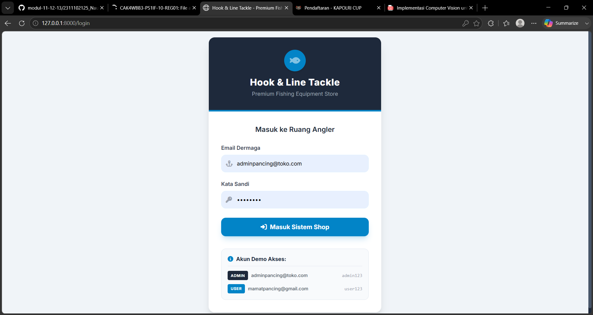
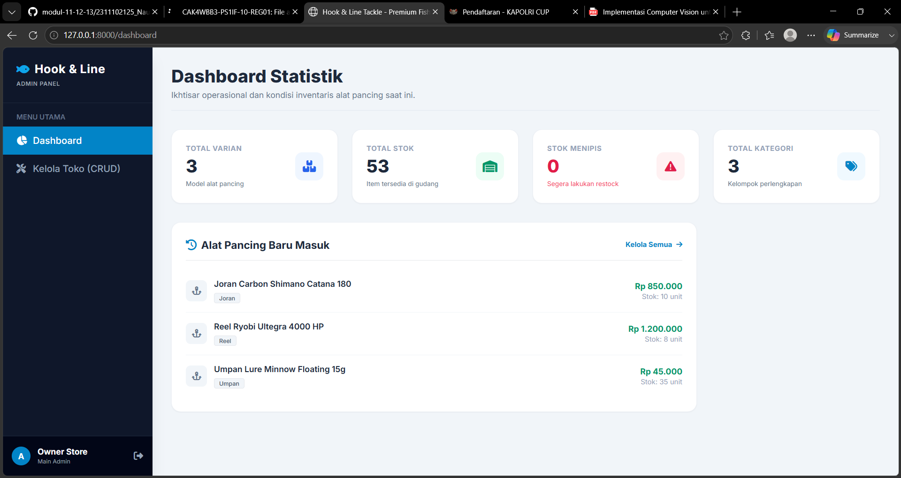
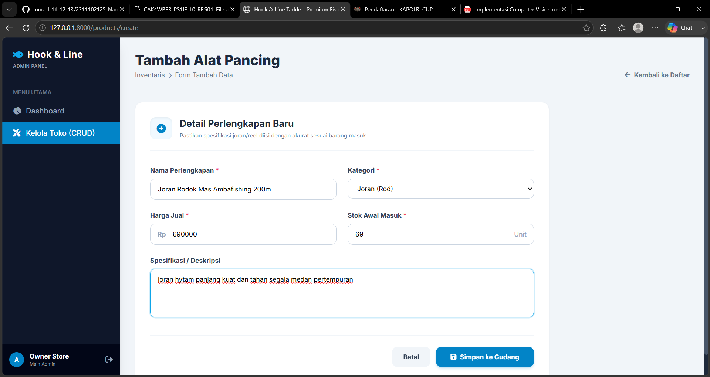
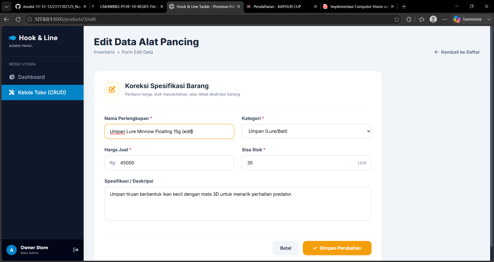
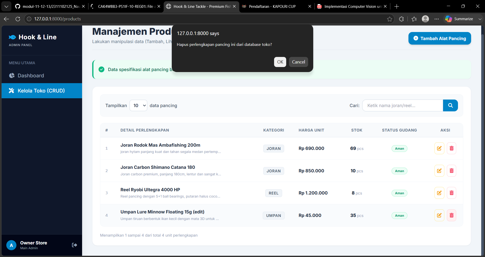
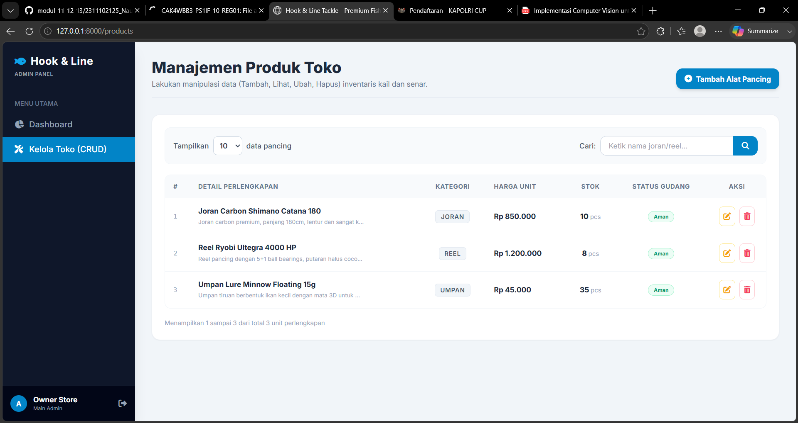

<div align="center">
  <br />
  <h1>LAPORAN PRAKTIKUM <br>APLIKASI BERBASIS PLATFORM</h1>
  <br />
  <h3>MODUL 11, 12 & 13 <br> Laravel Aplikasi Inventori Toko</h3>
  <br />
  <br />
   
  <br />
  <br />
  <br />
  <br />
  <h3>Disusun Oleh :</h3>
  <p>
    <strong>DHEVA DEWA SEPTIANTONI</strong><br>
    <strong>2311102324</strong><br>
    <strong>S1 IF-11-REG01</strong>
  </p>
  <br />
  <h3>Dosen Pengampu :</h3>
  <p>
    <strong>Dimas Fanny Hebrasianto Permadi, S.ST., M.Kom</strong>
  </p>
  <br />
  <br />
    <h4>Asisten Praktikum :</h4>
    <strong> Apri Pandu Wicaksono </strong> <br>
    <strong>Rangga Pradarrell Fathi</strong>
  <br />
  <h3>LABORATORIUM HIGH PERFORMANCE
 <br>FAKULTAS INFORMATIKA <br>UNIVERSITAS TELKOM PURWOKERTO <br>2026</h3>
</div>

---

## 1. Implementasi Sistem 

Pada praktikum ini dilakukan dengan membangun aplikasi web inventori toko berbasis Laravel yang terhubung dengan database MySQL untuk mengelola data produk secara terstruktur. Sistem diawali dengan pembuatan migration untuk mendefinisikan tabel products, kemudian dilanjutkan dengan model Product yang merepresentasikan data produk serta relasinya dengan User. Logika utama aplikasi diatur pada ProductController yang menangani proses CRUD, yaitu menampilkan, menambah, mengubah, dan menghapus data produk, disertai validasi input agar data yang disimpan tetap sesuai aturan. Pada sisi keamanan, sistem menerapkan autentikasi berbasis session sehingga hanya pengguna yang berhasil login yang dapat mengakses halaman inventori, serta pembatasan data berdasarkan `user_id` agar setiap pengguna hanya dapat mengelola produk miliknya sendiri. Antarmuka sistem dibangun menggunakan Blade template, Bootstrap, dan DataTables untuk menghasilkan tampilan modern, responsif, serta mendukung pencarian dan pengelolaan data yang lebih mudah. Selain itu, aplikasi juga dilengkapi seeder yang berisi data produk toko klontong agar database tidak kosong saat pertama kali dijalankan, sehingga sistem dapat langsung diuji dan digunakan.

---

## 2. Penjelasan Kode 

### 2.1 Migration Struktur Database

Migration ini mendefinisikan struktur tabel products pada database yang berisi kolom id, nama_produk, kategori, harga, stok, deskripsi, serta timestamps untuk menyimpan data produk. _File Referensi_: `database/migrations/2026_06_18_141456_create_products_table.php`

```php
<?php

use Illuminate\Database\Migrations\Migration;
use Illuminate\Database\Schema\Blueprint;
use Illuminate\Support\Facades\Schema;

return new class extends Migration
{
    /**
     * Run the migrations.
     */
    public function up(): void
    {
        Schema::create('products', function (Blueprint $table) {
            $table->id();
            $table->string('name');         // Nama alat pancing (misal: Joran Shimano Catana)
            $table->string('category');     // Kategori (Joran, Reel, Umpan, Aksesoris)
            $table->integer('price');       // Harga barang
            $table->integer('stock');       // Jumlah stok tersedia
            $table->text('description')->nullable(); // Spesifikasi/deskripsi produk
            $table->timestamps();
        });
    }

    /**
     * Reverse the migrations.
     */
    public function down(): void
    {
        Schema::dropIfExists('products');
    }
};
```

### 2.2 Model `Product.php`

Model Product mendefinisikan entitas produk yang dapat menyimpan data user_id, nama_produk, kategori, harga, stok, dan deskripsi, serta memiliki relasi belongsTo ke model User. _File Referensi_: `app/Models/Product.php`

```php
<?php

namespace App\Models;

use Illuminate\Database\Eloquent\Factories\HasFactory;
use Illuminate\Database\Eloquent\Model;

class Product extends Model
{
    use HasFactory;


    protected $fillable = [
        'name',
        'category',
        'price',
        'stock',
        'description'
    ];
}
```
---

### 2.3 Database Seeder

Seeder digunakan untuk membuat satu akun admin dan mengisi tabel products dengan data produk toko klontong secara otomatis agar database tidak kosong. _File Referensi_: `database/seeders/DatabaseSeeder.php`

```php
<?php

namespace Database\Seeders;

use App\Models\User;
use App\Models\Product;
use Illuminate\Database\Seeder;
use Illuminate\Support\Facades\Hash;

class DatabaseSeeder extends Seeder
{
    /**
     * Seed the application's database.
     */
    public function run(): void
    {
        // 1. Akun Admin (Pemilik Toko)
        User::create([
            'name' => 'Owner Toko Pancing',
            'email' => 'adminpancing@toko.com',
            'password' => Hash::make('admin123'),
            'role' => 'admin',
        ]);

        // 2. Akun User (Pembeli / Angler)
        User::create([
            'name' => 'Mamat Angler',
            'email' => 'mamatpancing@gmail.com',
            'password' => Hash::make('user123'),
            'role' => 'user',
        ]);

        // 3. Data Dummy Alat Pancing Awal
        Product::create([
            'name' => 'Joran Carbon Shimano Catana 180',
            'category' => 'Joran',
            'price' => 850000,
            'stock' => 12,
            'description' => 'Joran carbon premium, panjang 180cm, lentur dan sangat kuat untuk teknik casting.',
        ]);

        Product::create([
            'name' => 'Reel Ryobi Ultegra 4000 HP',
            'category' => 'Reel',
            'price' => 1200000,
            'stock' => 8,
            'description' => 'Reel pancing dengan 5+1 ball bearings, putaran halus cocok untuk target ikan besar.',
        ]);

        Product::create([
            'name' => 'Umpan Lure Minnow Floating 15g',
            'category' => 'Umpan',
            'price' => 45000,
            'stock' => 35,
            'description' => 'Umpan tiruan berbentuk ikan kecil dengan mata 3D untuk menarik perhatian predator.',
        ]);

        Product::create([
            'name' => 'Senar Pancing PE Sougayilang 100m',
            'category' => 'Senar',
            'price' => 95000,
            'stock' => 3, // Menguji status 'Kritis/Menipis' (< 5)
            'description' => 'Senar jalinan (braided) ekstra kuat dengan diameter tipis namun daya tahan gesek tinggi.',
        ]);
    }
}
```

### 2.4 Routes web.php

Routes mendefinisikan alur akses aplikasi dengan mengarahkan halaman utama dan /home ke halaman produk serta mengatur resource route products yang hanya bisa diakses oleh user yang sudah login. _File Referensi_: `routes/web.php`

```php
<?php

use Illuminate\Support\Facades\Route;
use App\Http\Controllers\AuthController;
use App\Http\Controllers\DashboardController;
use App\Http\Controllers\ProductController;
use App\Http\Controllers\ShopController;

// Halaman awal otomatis diarahkan ke Login
Route::get('/', function () {
    return redirect()->route('login');
});

// Rute Autentikasi (Hanya untuk tamu / belum login)
Route::middleware(['guest'])->group(function () {
    Route::get('/login', [AuthController::class, 'showLogin'])->name('login');
    Route::post('/login', [AuthController::class, 'authenticate'])->name('login.post');
});

// Rute Logout
Route::post('/logout', [AuthController::class, 'logout'])->name('logout');

// Rute Terproteksi (Wajib Login)
Route::middleware(['auth'])->group(function () {

    // KELOMPOK RUTE ADMIN (Pemilik Toko Alat Pancing)
    Route::middleware(['role:admin'])->group(function () {
        // Rute Dashboard Utama Admin (Statistik & Grafik Ringkas)
        Route::get('/dashboard', [DashboardController::class, 'index'])->name('dashboard');
        
        // Rute CRUD Otomatis untuk Inventaris Alat Pancing
        Route::resource('products', ProductController::class);
    });

    // KELOMPOK RUTE USER (Pembeli / Angler)
    Route::middleware(['role:user'])->group(function () {
        Route::get('/shop', [ShopController::class, 'index'])->name('shop.index');
        Route::post('/shop/buy/{product}', [ShopController::class, 'buy'])->name('shop.buy');
    });
});
```

### 2.5 Controller `ProductController.php`

Controller mendefinisikan logika CRUD produk yang hanya dapat diakses oleh user yang sudah login, termasuk menampilkan, menambah, mengubah, dan menghapus data produk milik user tersebut. _File Referensi_: `app/Http/Controllers/ProductController.php`

```php
<?php

namespace App\Http\Controllers;

use App\Models\Product;
use Illuminate\Http\Request;

class ProductController extends Controller
{
    public function index(Request $request)
    {
        $perPage = $request->get('per_page', 10);
        $search = $request->get('search');

        // Logika pencarian alat pancing di halaman kelola produk
        $query = Product::query();
        if ($search) {
            $query->where('name', 'like', "%{$search}%")
                  ->orWhere('category', 'like', "%{$search}%");
        }

        $products = $query->latest()->paginate($perPage);

        return view('products.index', compact('products'));
    }

    public function create()
    {
        return view('products.create');
    }

    public function store(Request $request)
    {
        $request->validate([
            'name' => 'required|string|max:255',
            'category' => 'required|string|max:255',
            'price' => 'required|integer|min:0',
            'stock' => 'required|integer|min:0',
            'description' => 'nullable|string'
        ]);

        Product::create($request->all());
        return redirect()->route('products.index')->with('success', 'Alat pancing baru berhasil ditambahkan ke gudang.');
    }

    public function edit(Product $product)
    {
        return view('products.edit', compact('product'));
    }

    public function update(Request $request, Product $product)
    {
        $request->validate([
            'name' => 'required|string|max:255',
            'category' => 'required|string|max:255',
            'price' => 'required|integer|min:0',
            'stock' => 'required|integer|min:0',
            'description' => 'nullable|string'
        ]);

        $product->update($request->all());
        return redirect()->route('products.index')->with('success', 'Data spesifikasi alat pancing berhasil diperbarui.');
    }

    public function destroy(Product $product)
    {
        $product->delete();
        return redirect()->route('products.index')->with('success', 'Alat pancing berhasil dihapus dari sistem inventaris.');
    }
}
```

### 2.6 View Layout Utama (`layouts/app.blade.php`)

Layout utama mendefinisikan struktur tampilan dasar aplikasi Inventori Toko iLutS dengan memuat Bootstrap, DataTables, Google Fonts, dan Bootstrap Icons, mengatur berbagai gaya antarmuka modern seperti navbar, card, tabel, form, dan tombol melalui CSS internal, serta menampilkan navbar dengan informasi user yang sedang login, pesan sukses, area konten dinamis menggunakan @yield('content'), dan file JavaScript pendukung melalui @stack('scripts'). _File Referensi_: `resources/views/layouts/app.blade.php`

```php
<!DOCTYPE html>
<html lang="id">
<head>
    <meta charset="UTF-8">
    <meta name="viewport" content="width=device-width, initial-scale=1.0">
    <title>Hook & Line Tackle - Premium Fishing Equipment</title>
    
    <script src="https://cdn.tailwindcss.com"></script>
    
    <link rel="stylesheet" href="https://cdnjs.cloudflare.com/ajax/libs/font-awesome/6.4.0/css/all.min.css">
    
    <link href="https://fonts.googleapis.com/css2?family=Inter:wght@300;400;500;600;700;800&display=swap" rel="stylesheet">
    
    <style>
        body { 
            font-family: 'Inter', sans-serif; 
            background-color: #f1f5f9; /* Slate 100 untuk background abu-abu samudra lembut */
        }
        /* Kustomisasi scrollbar halus bertema gelap */
        ::-webkit-scrollbar {
            width: 8px;
        }
        ::-webkit-scrollbar-track {
            background: #1e293b;
        }
        ::-webkit-scrollbar-thumb {
            background: #475569;
            border-radius: 4px;
        }
        ::-webkit-scrollbar-thumb:hover {
            background: #0284c7;
        }
    </style>
</head>
<body class="antialiased min-h-screen flex flex-col">

    <div class="flex-1 flex flex-col">
        @yield('content')
    </div>

</body>
</html>
```

### 2.7 View Halaman Login (`auth/login.blade.php`)

Halaman Login mendefinisikan antarmuka autentikasi admin dengan tampilan modern yang terdiri dari panel informasi keunggulan sistem di sisi kiri dan form login di sisi kanan, mencakup input email, password, fitur show/hide password, opsi remember me, link lupa password, tombol login, serta tautan ke halaman registrasi jika tersedia. _File Referensi_: `resources/views/auth/login.blade.php`

```php
@extends('layouts.app')

@section('content')
<div class="min-h-screen flex items-center justify-center p-4" style="background-color: #f0f4f8;">
    <div class="bg-white rounded-2xl shadow-xl w-full max-w-md overflow-hidden border border-gray-100">

        <div class="bg-[#1e293b] py-8 text-center text-white border-b-4 border-sky-600">
            <div class="inline-flex items-center justify-center w-14 h-14 bg-sky-600 rounded-full mb-3 shadow-md">
                <i class="fas fa-fish text-2xl animate-pulse"></i>
            </div>
            <h1 class="text-2xl font-extrabold tracking-wide">Hook & Line Tackle</h1>
            <p class="text-sm text-gray-400 mt-1">Premium Fishing Equipment Store</p>
        </div>

        <div class="p-8">
            <h2 class="text-center text-lg font-semibold text-gray-800 mb-6">Masuk ke Ruang Angler</h2>

            @if($errors->any())
                <div class="bg-red-50 border border-red-200 text-red-700 px-4 py-3 rounded-xl relative mb-6 text-sm flex items-center gap-2">
                    <i class="fas fa-exclamation-circle text-red-500"></i>
                    <span>{{ $errors->first() }}</span>
                </div>
            @endif

            <form method="POST" action="{{ route('login.post') }}">
                @csrf
                
                <div class="mb-5">
                    <label class="block text-gray-700 text-sm font-semibold mb-2">Email Dermaga</label>
                    <div class="relative">
                        <div class="absolute inset-y-0 left-0 top-0 pl-3 flex items-center pointer-events-none">
                            <i class="fas fa-anchor text-gray-400"></i>
                        </div>
                        <input type="email" name="email" value="{{ old('email') }}" required
                            class="w-full pl-10 pr-4 py-3 rounded-xl bg-sky-50/50 border border-sky-100 focus:outline-none focus:border-sky-500 focus:ring-2 focus:ring-sky-500/20 transition-all text-sm text-gray-800 placeholder-gray-400"
                            placeholder="angler@email.com">
                    </div>
                </div>

                <div class="mb-6">
                    <label class="block text-gray-700 text-sm font-semibold mb-2">Kata Sandi</label>
                    <div class="relative">
                        <div class="absolute inset-y-0 left-0 top-0 pl-3 flex items-center pointer-events-none">
                            <i class="fas fa-key text-gray-400"></i>
                        </div>
                        <input type="password" name="password" required
                            class="w-full pl-10 pr-4 py-3 rounded-xl bg-sky-50/50 border border-sky-100 focus:outline-none focus:border-sky-500 focus:ring-2 focus:ring-sky-500/20 transition-all text-sm text-gray-800 placeholder-gray-400"
                            placeholder="••••••••">
                    </div>
                </div>

                <button type="submit" class="w-full bg-sky-600 hover:bg-sky-700 text-white font-bold py-3 px-4 rounded-xl transition-all duration-200 flex items-center justify-center gap-2 shadow-lg shadow-sky-600/20">
                    <i class="fas fa-sign-in-alt"></i> Masuk Sistem Shop
                </button>
            </form>

            <div class="mt-8 bg-slate-50 border border-slate-200 rounded-xl p-4 text-sm text-gray-700">
                <div class="flex items-center gap-2 font-bold mb-3 text-slate-800 border-b border-slate-200 pb-2">
                    <i class="fas fa-info-circle text-sky-600"></i> Akun Demo Akses:
                </div>
                <div class="space-y-2.5">
                    <div class="flex items-center gap-2 justify-between">
                        <div class="flex items-center gap-2">
                            <span class="bg-[#1e293b] text-white text-[10px] px-2 py-0.5 rounded font-bold tracking-wider uppercase">Admin</span>
                            <span class="text-xs text-gray-600 font-medium">adminpancing@toko.com</span>
                        </div>
                        <span class="text-xs text-gray-400 font-mono">admin123</span>
                    </div>
                    <div class="flex items-center gap-2 justify-between">
                        <div class="flex items-center gap-2">
                            <span class="bg-sky-600 text-white text-[10px] px-2 py-0.5 rounded font-bold tracking-wider uppercase">User</span>
                            <span class="text-xs text-gray-600 font-medium">mamatpancing@gmail.com</span>
                        </div>
                        <span class="text-xs text-gray-400 font-mono">user123</span>
                    </div>
                </div>
            </div>

        </div>
    </div>
</div>
@endsection
```

### 2.8 View Daftar Produk (`products/index.blade.php`)

Halaman Index mendefinisikan tampilan dashboard utama inventori yang menampilkan ringkasan jumlah produk, total stok, dan kategori, menyediakan tombol tambah produk, menampilkan data produk dalam tabel interaktif menggunakan DataTables, serta menyediakan aksi edit dan hapus dengan konfirmasi modal, atau menampilkan empty state jika belum ada data produk. _File Referensi_: `resources/views/products/index.blade.php`

```php
@extends('layouts.app')

@section('content')
<div class="flex h-screen bg-slate-100 overflow-hidden">

    <aside class="w-64 bg-slate-900 text-white flex flex-col shadow-xl z-20">
        <div class="p-6 border-b border-slate-800">
            <h2 class="text-xl font-bold tracking-wide flex items-center gap-2">
                <i class="fas fa-fish text-sky-500"></i>
                <span>Hook & Line</span>
            </h2>
            <p class="text-[10px] text-gray-400 mt-1 uppercase tracking-wider font-semibold">Admin Panel</p>
        </div>

        <div class="flex-1 py-4">
            <div class="px-6 text-xs font-semibold text-slate-500 mb-2 uppercase">Menu Utama</div>
            <a href="{{ route('dashboard') }}" class="flex items-center px-6 py-3 text-slate-400 hover:text-white hover:bg-slate-800 font-medium transition-all">
                <i class="fas fa-chart-pie w-5 mr-2"></i> Dashboard
            </a>
            <a href="{{ route('products.index') }}" class="flex items-center px-6 py-3 bg-sky-600 text-white font-medium transition-all">
                <i class="fas fa-tools w-5 mr-2"></i> Kelola Toko (CRUD)
            </a>
        </div>

        <div class="p-4 bg-slate-950 border-t border-slate-800 flex justify-between items-center">
            <div class="flex items-center gap-3">
                <div class="w-8 h-8 rounded-full bg-sky-600 flex items-center justify-center font-bold text-sm">
                    A
                </div>
                <div>
                    <p class="text-sm font-bold truncate w-24">Owner Store</p>
                    <p class="text-[10px] text-gray-400">Main Admin</p>
                </div>
            </div>
            <form action="{{ route('logout') }}" method="POST">
                @csrf
                <button type="submit" class="text-slate-400 hover:text-white transition-colors" title="Keluar Dermaga">
                    <i class="fas fa-sign-out-alt"></i>
                </button>
            </form>
        </div>
    </aside>

    <main class="flex-1 flex flex-col h-screen overflow-y-auto p-8">
        <div class="mb-8 border-b border-slate-200 pb-4 flex justify-between items-end">
            <div>
                <h1 class="text-3xl font-extrabold text-slate-800">Manajemen Produk Toko</h1>
                <p class="text-sm text-slate-500 mt-1">Lakukan manipulasi data (Tambah, Lihat, Ubah, Hapus) inventaris kail dan senar.</p>
            </div>
            <a href="{{ route('products.create') }}" class="bg-sky-600 hover:bg-sky-700 text-white text-sm font-bold py-2.5 px-4 rounded-xl transition-all shadow-md flex items-center gap-2">
                <i class="fas fa-plus-circle"></i> Tambah Alat Pancing
            </a>
        </div>

        @if(session('success'))
            <div class="mb-6 p-4 bg-emerald-50 border-l-4 border-emerald-500 text-emerald-800 rounded-xl shadow-sm flex items-center gap-3">
                <i class="fas fa-check-circle text-emerald-500 text-lg"></i>
                <p class="text-sm font-medium">{{ session('success') }}</p>
            </div>
        @endif

        <div class="bg-white rounded-2xl shadow-sm border border-slate-200/60 p-6">
            
            <form action="{{ route('products.index') }}" method="GET" class="flex flex-col md:flex-row justify-between items-center gap-4 mb-5 text-sm w-full bg-slate-50 p-4 rounded-xl border border-slate-100">
                <div class="flex items-center gap-2">
                    <span class="text-slate-600 font-medium">Tampilkan</span>
                    <select name="per_page" class="border border-slate-300 rounded-lg p-2 bg-white focus:outline-none focus:border-sky-500 font-semibold text-slate-700" onchange="this.form.submit()">
                        <option value="10" {{ request('per_page') == 10 ? 'selected' : '' }}>10</option>
                        <option value="25" {{ request('per_page') == 25 ? 'selected' : '' }}>25</option>
                        <option value="50" {{ request('per_page') == 50 ? 'selected' : '' }}>50</option>
                    </select>
                    <span class="text-slate-600 font-medium">data pancing</span>
                </div>

                <div class="flex items-center gap-2 w-full md:w-auto">
                    <span class="text-slate-600 font-medium hidden md:inline">Cari:</span>
                    <div class="relative flex items-center w-full">
                        <input type="text" name="search" value="{{ request('search') }}" placeholder="Ketik nama joran/reel..." class="border border-slate-300 rounded-l-xl px-4 py-2 w-full md:w-64 focus:outline-none focus:border-sky-500">
                        <button type="submit" class="bg-sky-600 hover:bg-sky-700 text-white px-4 py-2 rounded-r-xl transition-colors border border-sky-600">
                            <i class="fas fa-search"></i>
                        </button>
                    </div>
                </div>
            </form>

            <div class="overflow-x-auto rounded-xl border border-slate-100">
                <table class="w-full text-left border-collapse">
                    <thead>
                        <tr class="text-xs text-slate-500 uppercase font-bold tracking-wider bg-slate-50 border-b border-slate-200">
                            <th class="py-3.5 px-4 w-12">#</th>
                            <th class="py-3.5 px-4">Detail Perlengkapan</th>
                            <th class="py-3.5 px-4 text-center">Kategori</th>
                            <th class="py-3.5 px-4">Harga Unit</th>
                            <th class="py-3.5 px-4 text-center">Stok</th>
                            <th class="py-3.5 px-4 text-center">Status Gudang</th>
                            <th class="py-3.5 px-4 text-center w-28">Aksi</th>
                        </tr>
                    </thead>
                    <tbody class="text-sm text-slate-700 divide-y divide-slate-100">
                        @forelse($products as $index => $p)
                        <tr class="hover:bg-slate-50/80 transition-colors">
                            <td class="py-3.5 px-4 text-slate-400 font-mono">{{ $products->firstItem() + $index }}</td>
                            <td class="py-3.5 px-4">
                                <div class="font-bold text-slate-800 text-sm">{{ $p->name }}</div>
                                <div class="text-[11px] text-slate-400 truncate max-w-xs mt-0.5">{{ $p->description ?? 'Tidak ada spesifikasi tambahan.' }}</div>
                            </td>
                            <td class="py-3.5 px-4 text-center">
                                <span class="bg-slate-100 text-slate-600 border border-slate-200 px-2.5 py-1 rounded-md text-xs font-semibold uppercase tracking-wider">{{ $p->category }}</span>
                            </td>
                            <td class="py-3.5 px-4 font-bold text-slate-800">Rp {{ number_format($p->price, 0, ',', '.') }}</td>
                            <td class="py-3.5 px-4 text-center font-extrabold text-slate-800">{{ $p->stock }} <span class="text-xs font-normal text-slate-400">pcs</span></td>
                            <td class="py-3.5 px-4 text-center">
                                @if($p->stock == 0)
                                    <span class="px-2.5 py-1 text-[10px] font-bold text-rose-600 bg-rose-50 border border-rose-200 rounded-full">Habis</span>
                                @elseif($p->stock <= 5)
                                    <span class="px-2.5 py-1 text-[10px] font-bold text-amber-600 bg-amber-50 border border-amber-200 rounded-full">Kritis</span>
                                @else
                                    <span class="px-2.5 py-1 text-[10px] font-bold text-emerald-600 bg-emerald-50 border border-emerald-200 rounded-full">Aman</span>
                                @endif
                            </td>
                            <td class="py-3.5 px-4 text-center">
                                <div class="flex items-center justify-center gap-2">
                                    <a href="{{ route('products.edit', $p->id) }}" class="text-amber-500 border border-amber-200 hover:bg-amber-50 p-2 rounded-lg transition-colors" title="Edit Data">
                                        <i class="fas fa-edit"></i>
                                    </a>
                                    <form action="{{ route('products.destroy', $p->id) }}" method="POST" onsubmit="return confirm('Hapus perlengkapan pancing ini dari database toko?');" class="inline">
                                        @csrf @method('DELETE')
                                        <button type="submit" class="text-rose-500 border border-rose-200 hover:bg-rose-50 p-2 rounded-lg transition-colors" title="Hapus Data">
                                            <i class="fas fa-trash-alt"></i>
                                        </button>
                                    </form>
                                </div>
                            </td>
                        </tr>
                        @empty
                        <tr>
                            <td colspan="7" class="py-10 text-center text-slate-400 font-medium">Alat pancing yang dicari tidak ada dalam daftaran katalog gudang.</td>
                        </tr>
                        @endforelse
                    </tbody>
                </table>
            </div>

            <div class="mt-5 flex flex-col md:flex-row justify-between items-center text-xs text-slate-400 gap-4">
                <div>Menampilkan {{ $products->firstItem() ?? 0 }} sampai {{ $products->lastItem() ?? 0 }} dari total {{ $products->total() }} unit perlengkapan</div>
                <div class="font-semibold">{{ $products->appends(request()->query())->links() }}</div>
            </div>
        </div>
    </main>
</div>
@endsection
```

### 2.9 View Form Tambah Produk (`products/create.blade.php`)

Form tambah produk mendefinisikan halaman input data produk baru dengan tampilan modern yang berisi validasi error, field nama_produk, kategori, harga, stok, dan deskripsi, serta tombol untuk menyimpan data ke database atau kembali ke halaman daftar produk. _File Referensi_: `resources/views/products/create.blade.php`

```php
@extends('layouts.app')

@section('content')
<div class="flex h-screen bg-slate-100 overflow-hidden">

    <!-- SIDEBAR -->
    <aside class="w-64 bg-slate-900 text-white flex flex-col shadow-xl z-20">
        <div class="p-6 border-b border-slate-800">
            <h2 class="text-xl font-bold tracking-wide flex items-center gap-2">
                <i class="fas fa-fish text-sky-500"></i>
                <span>Hook & Line</span>
            </h2>
            <p class="text-[10px] text-gray-400 mt-1 uppercase tracking-wider font-semibold">Admin Panel</p>
        </div>

        <div class="flex-1 py-4">
            <div class="px-6 text-xs font-semibold text-slate-500 mb-2 uppercase">Menu Utama</div>
            <a href="{{ route('dashboard') }}" class="flex items-center px-6 py-3 text-slate-400 hover:text-white hover:bg-slate-800 font-medium transition-all">
                <i class="fas fa-chart-pie w-5 mr-2"></i> Dashboard
            </a>
            <a href="{{ route('products.index') }}" class="flex items-center px-6 py-3 bg-sky-600 text-white font-medium transition-all">
                <i class="fas fa-tools w-5 mr-2"></i> Kelola Toko (CRUD)
            </a>
        </div>
        
        <div class="p-4 bg-slate-950 border-t border-slate-800 flex justify-between items-center">
            <div class="flex items-center gap-3">
                <div class="w-8 h-8 rounded-full bg-sky-600 flex items-center justify-center font-bold text-sm">A</div>
                <div>
                    <p class="text-sm font-bold truncate w-24">Owner Store</p>
                    <p class="text-[10px] text-gray-400">Main Admin</p>
                </div>
            </div>
            <form action="{{ route('logout') }}" method="POST">
                @csrf
                <button type="submit" class="text-slate-400 hover:text-white transition-colors" title="Keluar"><i class="fas fa-sign-out-alt"></i></button>
            </form>
        </div>
    </aside>

    <!-- KONTEN UTAMA FORM TAMBAH -->
    <main class="flex-1 flex flex-col h-screen overflow-y-auto p-8">
        <div class="mb-8 border-b border-slate-200 pb-4 flex justify-between items-end">
            <div>
                <h1 class="text-3xl font-extrabold text-slate-800">Tambah Alat Pancing</h1>
                <p class="text-sm text-slate-500 mt-1">Inventaris <i class="fas fa-chevron-right text-[10px] mx-1"></i> Form Tambah Data</p>
            </div>
            <a href="{{ route('products.index') }}" class="text-sm font-bold text-slate-500 hover:text-sky-600 transition-colors flex items-center gap-2">
                <i class="fas fa-arrow-left"></i> Kembali ke Daftar
            </a>
        </div>

        <div class="bg-white rounded-2xl shadow-sm border border-slate-200/60 p-8 max-w-4xl">
            <div class="flex items-center gap-4 mb-8 pb-6 border-b border-slate-100">
                <div class="w-12 h-12 bg-sky-50 rounded-xl flex items-center justify-center text-sky-600 text-xl shadow-inner">
                    <i class="fas fa-plus-circle"></i>
                </div>
                <div>
                    <h2 class="text-xl font-bold text-slate-800">Detail Perlengkapan Baru</h2>
                    <p class="text-xs text-slate-500 mt-1">Pastikan spesifikasi joran/reel diisi dengan akurat sesuai barang masuk.</p>
                </div>
            </div>

            @if($errors->any())
                <div class="mb-6 p-4 bg-rose-50 border-l-4 border-rose-500 text-rose-800 rounded-xl text-sm">
                    <ul class="list-disc list-inside">
                        @foreach($errors->all() as $error)
                            <li>{{ $error }}</li>
                        @endforeach
                    </ul>
                </div>
            @endif

            <form action="{{ route('products.store') }}" method="POST">
                @csrf
                <div class="grid grid-cols-2 gap-6 mb-6">
                    <div class="col-span-2 md:col-span-1">
                        <label class="block text-sm font-bold text-slate-700 mb-2">Nama Perlengkapan <span class="text-rose-500">*</span></label>
                        <input type="text" name="name" value="{{ old('name') }}" class="w-full border border-slate-300 rounded-xl px-4 py-3 focus:outline-none focus:border-sky-500 focus:ring-2 focus:ring-sky-500/20 transition-all text-sm" placeholder="Contoh: Reel Shimano Sienna" required>
                    </div>
                    <div class="col-span-2 md:col-span-1">
                        <label class="block text-sm font-bold text-slate-700 mb-2">Kategori <span class="text-rose-500">*</span></label>
                        <select name="category" class="w-full border border-slate-300 rounded-xl px-4 py-3 focus:outline-none focus:border-sky-500 focus:ring-2 focus:ring-sky-500/20 transition-all text-sm bg-white" required>
                            <option value="">Pilih Kategori...</option>
                            <option value="Joran" {{ old('category') == 'Joran' ? 'selected' : '' }}>Joran (Rod)</option>
                            <option value="Reel" {{ old('category') == 'Reel' ? 'selected' : '' }}>Reel</option>
                            <option value="Senar" {{ old('category') == 'Senar' ? 'selected' : '' }}>Senar (Line)</option>
                            <option value="Umpan" {{ old('category') == 'Umpan' ? 'selected' : '' }}>Umpan (Lure/Bait)</option>
                            <option value="Aksesoris" {{ old('category') == 'Aksesoris' ? 'selected' : '' }}>Aksesoris & Box</option>
                        </select>
                    </div>
                </div>

                <div class="grid grid-cols-2 gap-6 mb-6">
                    <div class="col-span-2 md:col-span-1 relative">
                        <label class="block text-sm font-bold text-slate-700 mb-2">Harga Jual <span class="text-rose-500">*</span></label>
                        <div class="absolute inset-y-0 left-0 top-7 pl-4 flex items-center pointer-events-none">
                            <span class="text-slate-400 font-bold text-sm">Rp</span>
                        </div>
                        <input type="number" name="price" value="{{ old('price') }}" class="w-full border border-slate-300 rounded-xl pl-12 pr-4 py-3 focus:outline-none focus:border-sky-500 focus:ring-2 focus:ring-sky-500/20 transition-all text-sm" placeholder="0" required>
                    </div>
                    <div class="col-span-2 md:col-span-1 relative">
                        <label class="block text-sm font-bold text-slate-700 mb-2">Stok Awal Masuk <span class="text-rose-500">*</span></label>
                        <div class="absolute inset-y-0 right-0 top-7 pr-4 flex items-center pointer-events-none">
                            <span class="text-slate-400 font-medium text-sm">Unit</span>
                        </div>
                        <input type="number" name="stock" value="{{ old('stock') }}" class="w-full border border-slate-300 rounded-xl px-4 py-3 focus:outline-none focus:border-sky-500 focus:ring-2 focus:ring-sky-500/20 transition-all text-sm" placeholder="0" required>
                    </div>
                </div>

                <div class="mb-8">
                    <label class="block text-sm font-bold text-slate-700 mb-2">Spesifikasi / Deskripsi</label>
                    <textarea name="description" rows="4" class="w-full border border-slate-300 rounded-xl px-4 py-3 focus:outline-none focus:border-sky-500 focus:ring-2 focus:ring-sky-500/20 transition-all text-sm resize-none" placeholder="Tuliskan rasio gigi, material, kapasitas senar, dll...">{{ old('description') }}</textarea>
                </div>

                <div class="flex justify-end gap-3 pt-6 border-t border-slate-100">
                    <a href="{{ route('products.index') }}" class="bg-slate-100 hover:bg-slate-200 text-slate-700 font-bold px-6 py-3 rounded-xl transition-colors text-sm">Batal</a>
                    <button type="submit" class="bg-sky-600 hover:bg-sky-700 text-white font-bold px-8 py-3 rounded-xl transition-all shadow-md shadow-sky-600/20 flex items-center gap-2 text-sm">
                        <i class="fas fa-save"></i> Simpan ke Gudang
                    </button>
                </div>
            </form>
        </div>
    </main>
</div>
@endsection
```

### 2.10 View Form Edit Produk (`products/edit.blade.php`)

Form edit produk mendefinisikan halaman untuk memperbarui data produk yang sudah ada dengan menampilkan nilai lama pada setiap field, menyediakan validasi error, serta form berisi input nama_produk, kategori, harga, stok, dan deskripsi, lalu mengirim perubahan ke route update menggunakan method PUT. _File Referensi_: `resources/views/products/edit.blade.php`

```php
@extends('layouts.app')

@section('content')
<div class="flex h-screen bg-slate-100 overflow-hidden">

    <!-- SIDEBAR -->
    <aside class="w-64 bg-slate-900 text-white flex flex-col shadow-xl z-20">
        <div class="p-6 border-b border-slate-800">
            <h2 class="text-xl font-bold tracking-wide flex items-center gap-2">
                <i class="fas fa-fish text-sky-500"></i>
                <span>Hook & Line</span>
            </h2>
            <p class="text-[10px] text-gray-400 mt-1 uppercase tracking-wider font-semibold">Admin Panel</p>
        </div>

        <div class="flex-1 py-4">
            <div class="px-6 text-xs font-semibold text-slate-500 mb-2 uppercase">Menu Utama</div>
            <a href="{{ route('dashboard') }}" class="flex items-center px-6 py-3 text-slate-400 hover:text-white hover:bg-slate-800 font-medium transition-all">
                <i class="fas fa-chart-pie w-5 mr-2"></i> Dashboard
            </a>
            <a href="{{ route('products.index') }}" class="flex items-center px-6 py-3 bg-sky-600 text-white font-medium transition-all">
                <i class="fas fa-tools w-5 mr-2"></i> Kelola Toko (CRUD)
            </a>
        </div>
        
        <div class="p-4 bg-slate-950 border-t border-slate-800 flex justify-between items-center">
            <div class="flex items-center gap-3">
                <div class="w-8 h-8 rounded-full bg-sky-600 flex items-center justify-center font-bold text-sm">A</div>
                <div>
                    <p class="text-sm font-bold truncate w-24">Owner Store</p>
                    <p class="text-[10px] text-gray-400">Main Admin</p>
                </div>
            </div>
            <form action="{{ route('logout') }}" method="POST">
                @csrf
                <button type="submit" class="text-slate-400 hover:text-white transition-colors" title="Keluar"><i class="fas fa-sign-out-alt"></i></button>
            </form>
        </div>
    </aside>

    <!-- KONTEN UTAMA FORM EDIT -->
    <main class="flex-1 flex flex-col h-screen overflow-y-auto p-8">
        <div class="mb-8 border-b border-slate-200 pb-4 flex justify-between items-end">
            <div>
                <h1 class="text-3xl font-extrabold text-slate-800">Edit Data Alat Pancing</h1>
                <p class="text-sm text-slate-500 mt-1">Inventaris <i class="fas fa-chevron-right text-[10px] mx-1"></i> Form Edit Data</p>
            </div>
            <a href="{{ route('products.index') }}" class="text-sm font-bold text-slate-500 hover:text-amber-500 transition-colors flex items-center gap-2">
                <i class="fas fa-arrow-left"></i> Kembali ke Daftar
            </a>
        </div>

        <div class="bg-white rounded-2xl shadow-sm border border-slate-200/60 p-8 max-w-4xl">
            <div class="flex items-center gap-4 mb-8 pb-6 border-b border-slate-100">
                <div class="w-12 h-12 bg-amber-50 rounded-xl flex items-center justify-center text-amber-500 text-xl shadow-inner">
                    <i class="fas fa-edit"></i>
                </div>
                <div>
                    <h2 class="text-xl font-bold text-slate-800">Koreksi Spesifikasi Barang</h2>
                    <p class="text-xs text-slate-500 mt-1">Perbarui harga, stok masuk/keluar, atau detail deskripsi barang.</p>
                </div>
            </div>

            @if($errors->any())
                <div class="mb-6 p-4 bg-rose-50 border-l-4 border-rose-500 text-rose-800 rounded-xl text-sm">
                    <ul class="list-disc list-inside">
                        @foreach($errors->all() as $error)
                            <li>{{ $error }}</li>
                        @endforeach
                    </ul>
                </div>
            @endif

            <form action="{{ route('products.update', $product->id) }}" method="POST">
                @csrf 
                @method('PUT') <!-- Wajib untuk proses Update di Laravel -->
                
                <div class="grid grid-cols-2 gap-6 mb-6">
                    <div class="col-span-2 md:col-span-1">
                        <label class="block text-sm font-bold text-slate-700 mb-2">Nama Perlengkapan <span class="text-rose-500">*</span></label>
                        <input type="text" name="name" value="{{ old('name', $product->name) }}" class="w-full border border-slate-300 rounded-xl px-4 py-3 focus:outline-none focus:border-amber-500 focus:ring-2 focus:ring-amber-500/20 transition-all text-sm" required>
                    </div>
                    <div class="col-span-2 md:col-span-1">
                        <label class="block text-sm font-bold text-slate-700 mb-2">Kategori <span class="text-rose-500">*</span></label>
                        <select name="category" class="w-full border border-slate-300 rounded-xl px-4 py-3 focus:outline-none focus:border-amber-500 focus:ring-2 focus:ring-amber-500/20 transition-all text-sm bg-white" required>
                            <option value="Joran" {{ old('category', $product->category) == 'Joran' ? 'selected' : '' }}>Joran (Rod)</option>
                            <option value="Reel" {{ old('category', $product->category) == 'Reel' ? 'selected' : '' }}>Reel</option>
                            <option value="Senar" {{ old('category', $product->category) == 'Senar' ? 'selected' : '' }}>Senar (Line)</option>
                            <option value="Umpan" {{ old('category', $product->category) == 'Umpan' ? 'selected' : '' }}>Umpan (Lure/Bait)</option>
                            <option value="Aksesoris" {{ old('category', $product->category) == 'Aksesoris' ? 'selected' : '' }}>Aksesoris & Box</option>
                        </select>
                    </div>
                </div>

                <div class="grid grid-cols-2 gap-6 mb-6">
                    <div class="col-span-2 md:col-span-1 relative">
                        <label class="block text-sm font-bold text-slate-700 mb-2">Harga Jual <span class="text-rose-500">*</span></label>
                        <div class="absolute inset-y-0 left-0 top-7 pl-4 flex items-center pointer-events-none">
                            <span class="text-slate-400 font-bold text-sm">Rp</span>
                        </div>
                        <input type="number" name="price" value="{{ old('price', $product->price) }}" class="w-full border border-slate-300 rounded-xl pl-12 pr-4 py-3 focus:outline-none focus:border-amber-500 focus:ring-2 focus:ring-amber-500/20 transition-all text-sm" required>
                    </div>
                    <div class="col-span-2 md:col-span-1 relative">
                        <label class="block text-sm font-bold text-slate-700 mb-2">Sisa Stok <span class="text-rose-500">*</span></label>
                        <div class="absolute inset-y-0 right-0 top-7 pr-4 flex items-center pointer-events-none">
                            <span class="text-slate-400 font-medium text-sm">Unit</span>
                        </div>
                        <input type="number" name="stock" value="{{ old('stock', $product->stock) }}" class="w-full border border-slate-300 rounded-xl px-4 py-3 focus:outline-none focus:border-amber-500 focus:ring-2 focus:ring-amber-500/20 transition-all text-sm" required>
                    </div>
                </div>

                <div class="mb-8">
                    <label class="block text-sm font-bold text-slate-700 mb-2">Spesifikasi / Deskripsi</label>
                    <textarea name="description" rows="4" class="w-full border border-slate-300 rounded-xl px-4 py-3 focus:outline-none focus:border-amber-500 focus:ring-2 focus:ring-amber-500/20 transition-all text-sm resize-none">{{ old('description', $product->description) }}</textarea>
                </div>

                <div class="flex justify-end gap-3 pt-6 border-t border-slate-100">
                    <a href="{{ route('products.index') }}" class="bg-slate-100 hover:bg-slate-200 text-slate-700 font-bold px-6 py-3 rounded-xl transition-colors text-sm">Batal</a>
                    <button type="submit" class="bg-amber-500 hover:bg-amber-600 text-white font-bold px-8 py-3 rounded-xl transition-all shadow-md shadow-amber-500/20 flex items-center gap-2 text-sm">
                        <i class="fas fa-check"></i> Simpan Perubahan
                    </button>
                </div>
            </form>
        </div>
    </main>
</div>
@endsection
```
---

## 3. Hasil Tampilan (Screenshot)

### 3.1 Halaman Login


---

### 3.2 Halaman Utama


---

### 3.3 Halaman Tambah Produk


---

### 3.4 Halaman Edit Produk


---

### 3.5 Halaman Hapus Produk


### 3.6 Halaman Utama Majaemen produk


---

## Refrensi
- **Laravel Documentation**: [https://laravel.com/docs](https://laravel.com/docs)
- **Laravel Breeze (Autentikasi)**: [https://laravel.com/docs/starter-kits#laravel-breeze](https://laravel.com/docs/starter-kits#laravel-breeze)
- **Eloquent ORM**: [https://laravel.com/docs/eloquent](https://laravel.com/docs/eloquent)
- **Laravel Blade Templates**: [https://laravel.com/docs/blade](https://laravel.com/docs/blade)
- **Laravel Resource Controllers**: [https://laravel.com/docs/controllers#resource-controllers](https://laravel.com/docs/controllers#resource-controllers)