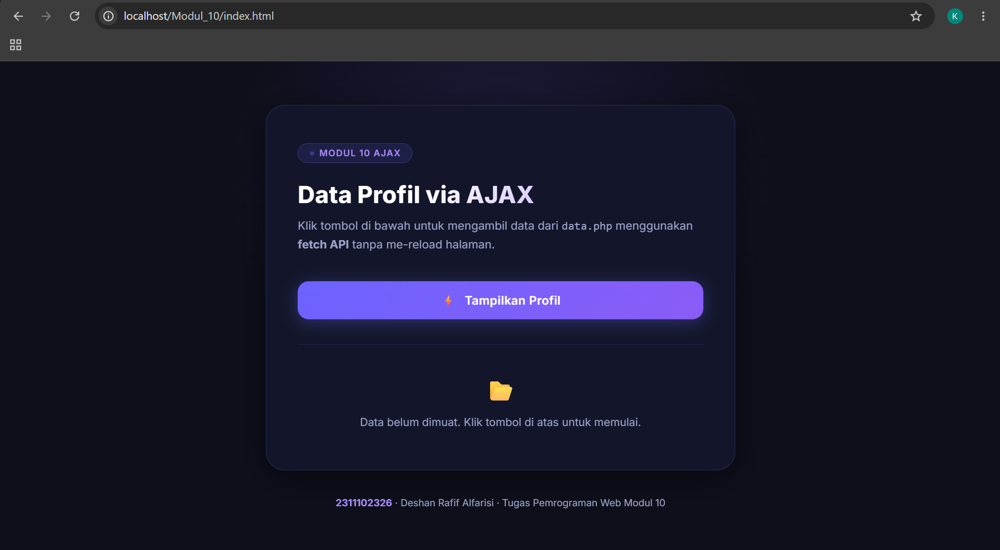
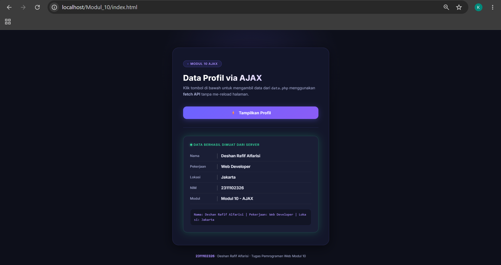

<div align="center">
  <br />
  <h1>LAPORAN PRAKTIKUM <br>APLIKASI BERBASIS PLATFORM</h1>
  <br />
  <h3> MODUL 10 <br> AJAX (Asynchronous JavaScript and XML) </h3>
  <br />
  
  <br />
  <br />
  <br />
  <h3>Disusun Oleh :</h3>
  <p>
    <strong>Deshan Rafif Alfarisi</strong><br>
    <strong>2311102326</strong><br>
    <strong>S1 IF-11-06</strong>
  </p>
  <br />
  <h3>Dosen Pengampu :</h3>
  <p>
    <strong>Dimas Fanny Hebrasianto Permadi, S.ST., M.Kom</strong>
  </p>
  <br />
  <br />
  <h4>Asisten Praktikum :</h4>
    <strong>Apri Pandu Wicaksono</strong> <br>
    <strong>Rangga Pradarrell Fathi</strong>
  <br />
  <h3>LABORATORIUM HIGH PERFORMANCE
  <br>FAKULTAS INFORMATIKA <br>UNIVERSITAS TELKOM PURWOKERTO <br>2026</h3>
</div>

---

## 1. Dasar Teori

## 📘 Dasar Teori

### 🔹 AJAX (Asynchronous JavaScript and XML)

AJAX adalah teknik pengembangan web yang memungkinkan halaman web untuk berkomunikasi dengan server secara **asinkron** — artinya pertukaran data dapat dilakukan di latar belakang **tanpa perlu me-reload seluruh halaman**. Meskipun namanya menyebut "XML", format data yang paling umum digunakan saat ini adalah **JSON** (JavaScript Object Notation).

AJAX banyak digunakan karena kemampuannya dalam:

* Mengambil data dari server tanpa refresh halaman
* Meningkatkan pengalaman pengguna (User Experience)
* Mengurangi beban transfer data karena hanya data yang diperbarui
* Membuat aplikasi web terasa lebih cepat dan responsif

---

### 🔹 Fetch API

Fetch API adalah antarmuka modern bawaan JavaScript untuk melakukan permintaan HTTP secara asinkron. Fetch API menggantikan cara lama menggunakan `XMLHttpRequest` dengan sintaks yang lebih bersih dan mudah dibaca.

Contoh penggunaan dasar:

```javascript
fetch('data.php')
  .then(function(response) {
    return response.json();
  })
  .then(function(data) {
    console.log(data);
  })
  .catch(function(err) {
    console.error(err);
  });
```

Fetch API mengembalikan **Promise**, sehingga pengolahan data dilakukan secara berantai menggunakan `.then()` dan penanganan error menggunakan `.catch()`.

---

### 🔹 JSON (JavaScript Object Notation)

JSON adalah format pertukaran data yang ringan dan mudah dibaca oleh manusia maupun mesin. JSON digunakan sebagai format standar dalam komunikasi antara client dan server pada aplikasi web modern.

Contoh data JSON:

```json
{
  "nama": "Deshan Rafif Alfarisi",
  "pekerjaan": "Web Developer",
  "lokasi": "Jakarta"
}
```

Dalam PHP, data dapat diubah menjadi format JSON menggunakan fungsi `json_encode()`.

---

### 🔹 PHP sebagai Server-Side Script

PHP (Hypertext Preprocessor) adalah bahasa pemrograman yang berjalan di sisi server. Dalam konteks AJAX, PHP berperan sebagai **penyedia data (endpoint)** yang menerima permintaan dari client, memproses data, lalu mengembalikan respons dalam format JSON.

Contoh penggunaan `header` dan `json_encode` di PHP:

```php
header('Content-Type: application/json');
$data = ['nama' => 'Deshan', 'lokasi' => 'Jakarta'];
echo json_encode($data);
```

Header `Content-Type: application/json` memberi tahu browser bahwa respons yang dikirim adalah data JSON, bukan HTML.

---

### 🔹 Event Listener JavaScript

Event listener adalah mekanisme JavaScript untuk mendeteksi dan merespons aksi pengguna, seperti klik tombol, input teks, atau hover mouse.

Contoh:

```javascript
document.getElementById('btn-tampilkan').addEventListener('click', function() {
    // logika dijalankan saat tombol diklik
});
```

Dalam program ini, event listener digunakan untuk memicu proses pengambilan data AJAX ketika tombol **"Tampilkan Profil"** diklik.

---

### 🔹 DOM Manipulation

DOM (Document Object Model) Manipulation adalah proses memodifikasi elemen HTML secara dinamis menggunakan JavaScript. Setelah data diterima dari server, JavaScript memasukkan data tersebut ke dalam elemen HTML tertentu menggunakan properti `innerHTML`.

Contoh:

```javascript
document.getElementById('hasil-profil').innerHTML = '<p>Data berhasil dimuat</p>';
```

---

### 🔹 Promise dan Asynchronous Programming

Promise adalah objek JavaScript yang merepresentasikan hasil operasi asinkron. Promise memiliki tiga kondisi:

* **Pending** → proses sedang berjalan
* **Fulfilled** → proses berhasil, `.then()` dipanggil
* **Rejected** → proses gagal, `.catch()` dipanggil

Penggunaan Promise dengan Fetch API memastikan data dari server diproses hanya setelah benar-benar diterima, tanpa memblokir eksekusi kode lainnya.

---

## 2. Sourcecode

### Sourcecode `data.php`

```php
<?php
header('Content-Type: application/json');
header('Access-Control-Allow-Origin: *');

$profil = [
    'nama'      => 'Deshan Rafif Alfarisi',
    'pekerjaan' => 'Web Developer',
    'lokasi'    => 'Jakarta',
    'nim'       => '2311102326',
    'modul'     => 'Modul 10 - AJAX'
];

echo json_encode($profil);
?>
```

---

### Sourcecode `index.html`

```html
<!DOCTYPE html>
<html lang="id">
<head>
  <meta charset="UTF-8" />
  <meta name="viewport" content="width=device-width, initial-scale=1.0" />
  <title>Modul 10 - AJAX | Deshan Rafif Alfarisi</title>
  <meta name="description" content="Tugas Modul 10 AJAX - Mengambil data dari server tanpa reload halaman menggunakan fetch API." />
  <link rel="preconnect" href="https://fonts.googleapis.com" />
  <link href="https://fonts.googleapis.com/css2?family=Inter:wght@300;400;500;600;700;800&display=swap" rel="stylesheet" />
  <style>
    *, *::before, *::after {
      box-sizing: border-box;
      margin: 0;
      padding: 0;
    }

    :root {
      --bg-dark:       #0d0f1a;
      --bg-card:       #13162a;
      --bg-card2:      #1a1e35;
      --accent:        #6c63ff;
      --accent2:       #a78bfa;
      --accent-glow:   rgba(108, 99, 255, 0.35);
      --green:         #34d399;
      --green-glow:    rgba(52, 211, 153, 0.25);
      --text-primary:  #e8eaf6;
      --text-secondary:#9da3c8;
      --border:        rgba(108, 99, 255, 0.18);
    }

    body {
      font-family: 'Inter', sans-serif;
      background-color: var(--bg-dark);
      color: var(--text-primary);
      min-height: 100vh;
      display: flex;
      flex-direction: column;
      align-items: center;
      justify-content: center;
      padding: 2rem 1rem;
      overflow-x: hidden;
    }

    body::before {
      content: '';
      position: fixed;
      top: -200px;
      left: 50%;
      transform: translateX(-50%);
      width: 700px;
      height: 700px;
      background: radial-gradient(circle, rgba(108,99,255,0.15) 0%, transparent 70%);
      pointer-events: none;
      z-index: 0;
    }

    .card {
      position: relative;
      z-index: 1;
      background: var(--bg-card);
      border: 1px solid var(--border);
      border-radius: 24px;
      padding: 3rem 2.5rem;
      width: 100%;
      max-width: 600px;
      box-shadow: 0 8px 40px rgba(0,0,0,0.5), 0 0 0 1px rgba(255,255,255,0.04);
      backdrop-filter: blur(20px);
    }

    .badge {
      display: inline-flex;
      align-items: center;
      gap: 6px;
      background: rgba(108,99,255,0.12);
      border: 1px solid rgba(108,99,255,0.3);
      color: var(--accent2);
      font-size: 0.72rem;
      font-weight: 600;
      letter-spacing: 0.08em;
      text-transform: uppercase;
      padding: 5px 14px;
      border-radius: 999px;
      margin-bottom: 1.4rem;
    }
    .badge .dot {
      width: 7px; height: 7px;
      background: var(--accent);
      border-radius: 50%;
      animation: pulse 2s infinite;
    }

    @keyframes pulse {
      0%, 100% { opacity: 1; transform: scale(1); }
      50%       { opacity: 0.4; transform: scale(0.7); }
    }

    h1 {
      font-size: 1.9rem;
      font-weight: 800;
      background: linear-gradient(135deg, #fff 30%, var(--accent2));
      -webkit-background-clip: text;
      -webkit-text-fill-color: transparent;
      background-clip: text;
      line-height: 1.2;
      margin-bottom: 0.6rem;
    }

    .subtitle {
      color: var(--text-secondary);
      font-size: 0.92rem;
      margin-bottom: 2.2rem;
      line-height: 1.6;
    }

    #btn-tampilkan {
      display: inline-flex;
      align-items: center;
      gap: 10px;
      background: linear-gradient(135deg, var(--accent), #8b5cf6);
      color: #fff;
      font-family: 'Inter', sans-serif;
      font-size: 0.95rem;
      font-weight: 600;
      padding: 14px 28px;
      border: none;
      border-radius: 14px;
      cursor: pointer;
      transition: transform 0.2s ease, box-shadow 0.2s ease, opacity 0.2s;
      box-shadow: 0 4px 20px var(--accent-glow);
      width: 100%;
      justify-content: center;
    }
    #btn-tampilkan:hover:not(:disabled) {
      transform: translateY(-2px);
      box-shadow: 0 8px 28px var(--accent-glow);
    }
    #btn-tampilkan:disabled { opacity: 0.6; cursor: not-allowed; }

    .spinner {
      width: 18px; height: 18px;
      border: 2px solid rgba(255,255,255,0.3);
      border-top-color: #fff;
      border-radius: 50%;
      animation: spin 0.7s linear infinite;
      display: none;
    }
    .loading .spinner { display: block; }
    .loading .btn-icon { display: none; }

    @keyframes spin { to { transform: rotate(360deg); } }

    .divider {
      border: none;
      border-top: 1px solid var(--border);
      margin: 2rem 0;
    }

    #hasil-profil {
      min-height: 80px;
      display: flex;
      align-items: center;
      justify-content: center;
    }

    .placeholder-text {
      color: var(--text-secondary);
      font-size: 0.88rem;
      text-align: center;
      line-height: 1.7;
    }
    .placeholder-text span { display: block; font-size: 1.8rem; margin-bottom: 6px; }

    .profil-box {
      background: var(--bg-card2);
      border: 1px solid rgba(52,211,153,0.2);
      border-radius: 16px;
      padding: 1.6rem;
      width: 100%;
      animation: fadeUp 0.4s ease both;
      box-shadow: 0 0 30px var(--green-glow);
    }

    @keyframes fadeUp {
      from { opacity: 0; transform: translateY(16px); }
      to   { opacity: 1; transform: translateY(0); }
    }

    .profil-box .profil-label {
      font-size: 0.72rem;
      font-weight: 600;
      letter-spacing: 0.1em;
      text-transform: uppercase;
      color: var(--green);
      margin-bottom: 1rem;
      display: flex;
      align-items: center;
      gap: 6px;
    }
    .profil-box .profil-label::before {
      content: '';
      display: inline-block;
      width: 8px; height: 8px;
      background: var(--green);
      border-radius: 50%;
      box-shadow: 0 0 8px var(--green);
    }

    .profil-row {
      display: flex;
      align-items: center;
      gap: 12px;
      padding: 10px 0;
      border-bottom: 1px solid rgba(255,255,255,0.05);
    }
    .profil-row:last-child { border-bottom: none; }
    .profil-row .key { font-size: 0.8rem; color: var(--text-secondary); font-weight: 500; min-width: 90px; }
    .profil-row .sep { color: rgba(255,255,255,0.2); font-weight: 300; }
    .profil-row .val { font-size: 0.95rem; font-weight: 600; color: var(--text-primary); }

    .raw-format {
      margin-top: 1.2rem;
      padding: 10px 14px;
      background: rgba(0,0,0,0.3);
      border-radius: 10px;
      font-size: 0.8rem;
      color: var(--accent2);
      font-family: monospace;
      word-break: break-all;
      line-height: 1.6;
      border: 1px solid rgba(108,99,255,0.12);
    }

    .error-box {
      background: rgba(239,68,68,0.1);
      border: 1px solid rgba(239,68,68,0.3);
      border-radius: 14px;
      padding: 1.2rem 1.4rem;
      width: 100%;
      color: #fca5a5;
      font-size: 0.88rem;
      display: flex;
      gap: 10px;
      align-items: flex-start;
      animation: fadeUp 0.3s ease both;
    }

    .footer-note {
      margin-top: 2rem;
      font-size: 0.78rem;
      color: var(--text-secondary);
      text-align: center;
      line-height: 1.6;
      z-index: 1;
    }
    .footer-note strong { color: var(--accent2); }
  </style>
</head>
<body>

  <div class="card">
    <div class="badge"><span class="dot"></span> Modul 10 AJAX</div>

    <h1>Data Profil via AJAX</h1>
    <p class="subtitle">
      Klik tombol di bawah untuk mengambil data dari <code>data.php</code>
      menggunakan <strong>fetch API</strong> tanpa me-reload halaman.
    </p>

    <button id="btn-tampilkan">
      <span class="btn-icon">⚡</span>
      <div class="spinner"></div>
      Tampilkan Profil
    </button>

    <hr class="divider" />

    <div id="hasil-profil">
      <div class="placeholder-text">
        <span>📂</span>
        Data belum dimuat. Klik tombol di atas untuk memulai.
      </div>
    </div>
  </div>

  <p class="footer-note">
    <strong>2311102326</strong> · Deshan Rafif Alfarisi ·
    Tugas Pemrograman Web Modul 10
  </p>

  <script>
    const btn    = document.getElementById('btn-tampilkan');
    const output = document.getElementById('hasil-profil');

    btn.addEventListener('click', function () {
      btn.disabled = true;
      btn.classList.add('loading');
      output.innerHTML = '';

      fetch('data.php')
        .then(function (response) {
          if (!response.ok) {
            throw new Error('HTTP error — status: ' + response.status);
          }
          return response.json();
        })
        .then(function (data) {
          const rawLine =
            'Nama: ' + data.nama +
            ' | Pekerjaan: ' + data.pekerjaan +
            ' | Lokasi: ' + data.lokasi;

          output.innerHTML = `
            <div class="profil-box">
              <div class="profil-label">Data berhasil dimuat dari server</div>
              <div class="profil-row">
                <span class="key">Nama</span>
                <span class="sep">|</span>
                <span class="val">${data.nama}</span>
              </div>
              <div class="profil-row">
                <span class="key">Pekerjaan</span>
                <span class="sep">|</span>
                <span class="val">${data.pekerjaan}</span>
              </div>
              <div class="profil-row">
                <span class="key">Lokasi</span>
                <span class="sep">|</span>
                <span class="val">${data.lokasi}</span>
              </div>
              <div class="profil-row">
                <span class="key">NIM</span>
                <span class="sep">|</span>
                <span class="val">${data.nim}</span>
              </div>
              <div class="profil-row">
                <span class="key">Modul</span>
                <span class="sep">|</span>
                <span class="val">${data.modul}</span>
              </div>
              <div class="raw-format">${rawLine}</div>
            </div>`;
        })
        .catch(function (err) {
          output.innerHTML = `
            <div class="error-box">
              <span>⚠️</span>
              <div>
                <strong>Gagal mengambil data.</strong><br/>
                Pastikan file <code>data.php</code> dijalankan di server PHP.<br/>
                <small style="opacity:.7;">${err.message}</small>
              </div>
            </div>`;
        })
        .finally(function () {
          btn.disabled = false;
          btn.classList.remove('loading');
        });
    });
  </script>

</body>
</html>
```

---

## 3. Output Program

### Tampilan Awal (Sebelum Tombol Diklik)

<p align="center">
  
</p>

### Tampilan Setelah Data Dimuat via AJAX

<p align="center">
  
</p>

---

## 4. Penjelasan Program

### 1. File `data.php` — Server Endpoint

```php
header('Content-Type: application/json');
header('Access-Control-Allow-Origin: *');
```

Dua baris header ini memiliki fungsi penting:

* `Content-Type: application/json` → memberi tahu browser bahwa respons yang dikembalikan adalah data berformat JSON, bukan HTML
* `Access-Control-Allow-Origin: *` → mengizinkan permintaan dari semua asal (domain), mencegah error CORS saat AJAX dilakukan

---

### 2. Inisialisasi Data Array Asosiatif

```php
$profil = [
    'nama'      => 'Deshan Rafif Alfarisi',
    'pekerjaan' => 'Web Developer',
    'lokasi'    => 'Jakarta',
    'nim'       => '2311102326',
    'modul'     => 'Modul 10 - AJAX'
];
```

Data profil disimpan dalam **array asosiatif PHP**. Setiap pasangan `key => value` merepresentasikan satu atribut profil. Array asosiatif dipilih karena memudahkan akses data berdasarkan nama kunci yang deskriptif.

---

### 3. Konversi ke JSON dan Output

```php
echo json_encode($profil);
```

Fungsi `json_encode()` mengubah array PHP menjadi string JSON yang dapat dibaca oleh JavaScript di sisi client. Hasilnya berupa:

```json
{
  "nama": "Deshan Rafif Alfarisi",
  "pekerjaan": "Web Developer",
  "lokasi": "Jakarta",
  "nim": "2311102326",
  "modul": "Modul 10 - AJAX"
}
```

---

### 4. Struktur Halaman HTML (index.html)

```html
<button id="btn-tampilkan">
  <span class="btn-icon">⚡</span>
  <div class="spinner"></div>
  Tampilkan Profil
</button>

<div id="hasil-profil">
  <div class="placeholder-text">
    <span>📂</span>
    Data belum dimuat. Klik tombol di atas untuk memulai.
  </div>
</div>
```

Halaman HTML terdiri dari dua elemen utama:

* **Tombol** `#btn-tampilkan` → memicu proses pengambilan data AJAX ketika diklik. Tombol juga memiliki elemen spinner untuk animasi loading
* **Div** `#hasil-profil` → wadah kosong yang akan diisi data dari server setelah AJAX berhasil

---

### 5. Event Listener pada Tombol

```javascript
btn.addEventListener('click', function () {
    btn.disabled = true;
    btn.classList.add('loading');
    output.innerHTML = '';
    // ...
});
```

Saat tombol diklik:
* `btn.disabled = true` → menonaktifkan tombol agar tidak diklik berulang saat proses berjalan
* `btn.classList.add('loading')` → menambahkan kelas CSS yang mengaktifkan animasi spinner
* `output.innerHTML = ''` → mengosongkan tampilan lama sebelum data baru dimuat

---

### 6. Fetch API — Mengambil Data dari Server

```javascript
fetch('data.php')
  .then(function (response) {
    if (!response.ok) {
      throw new Error('HTTP error — status: ' + response.status);
    }
    return response.json();
  })
```

Fungsi `fetch('data.php')` mengirimkan permintaan HTTP GET ke file `data.php` secara **asinkron**. Proses ini tidak memblokir halaman — pengguna tetap bisa berinteraksi dengan halaman sementara data sedang diambil.

* `response.ok` → memeriksa apakah status HTTP berhasil (200-299)
* `response.json()` → mem-parsing respons teks JSON menjadi objek JavaScript

---

### 7. Menampilkan Data ke DOM

```javascript
.then(function (data) {
  const rawLine =
    'Nama: ' + data.nama +
    ' | Pekerjaan: ' + data.pekerjaan +
    ' | Lokasi: ' + data.lokasi;

  output.innerHTML = `
    <div class="profil-box">
      ...
      <div class="raw-format">${rawLine}</div>
    </div>`;
})
```

Setelah data diterima sebagai objek JavaScript, setiap properti dapat diakses dengan `data.nama`, `data.pekerjaan`, dan seterusnya. Data kemudian dimasukkan ke dalam elemen HTML menggunakan `innerHTML` dengan **template literal** (backtick) untuk kemudahan pembuatan string HTML multi-baris.

`rawLine` menghasilkan format yang diminta:
```
Nama: Deshan Rafif Alfarisi | Pekerjaan: Web Developer | Lokasi: Jakarta
```

---

### 8. Penanganan Error

```javascript
.catch(function (err) {
  output.innerHTML = `
    <div class="error-box">
      <span>⚠️</span>
      <div>
        <strong>Gagal mengambil data.</strong><br/>
        Pastikan file <code>data.php</code> dijalankan di server PHP.<br/>
        <small>${err.message}</small>
      </div>
    </div>`;
})
```

Blok `.catch()` menangkap semua error yang terjadi, baik error jaringan maupun HTTP error. Pesan error yang informatif ditampilkan di `#hasil-profil` agar pengguna mengetahui penyebab kegagalan (misalnya server PHP tidak aktif).

---

### 9. Finally — Mengembalikan State Tombol

```javascript
.finally(function () {
  btn.disabled = false;
  btn.classList.remove('loading');
});
```

Blok `.finally()` selalu dijalankan baik proses berhasil maupun gagal. Fungsinya mengembalikan tombol ke kondisi normal: mengaktifkan kembali tombol dan menghentikan animasi spinner.

---

### 10. Animasi dan UI/UX

```css
@keyframes fadeUp {
  from { opacity: 0; transform: translateY(16px); }
  to   { opacity: 1; transform: translateY(0); }
}

.profil-box {
  animation: fadeUp 0.4s ease both;
}
```

Saat data berhasil dimuat, kotak profil muncul dengan animasi **fade up** (muncul dari bawah ke atas) selama 0.4 detik. Ini memberikan umpan balik visual yang halus kepada pengguna bahwa data baru telah dimuat.

---

## 5. Kesimpulan

Program ini berhasil mengimplementasikan konsep **AJAX** dalam pengembangan web dengan memanfaatkan:

* **PHP** sebagai server-side endpoint yang mengembalikan data dalam format JSON menggunakan `json_encode()` dan header `Content-Type: application/json`
* **Fetch API** sebagai mekanisme pengambilan data asinkron dari client ke server tanpa me-reload halaman
* **Promise** (`.then()`, `.catch()`, `.finally()`) untuk mengelola alur eksekusi asinkron secara terstruktur
* **DOM Manipulation** (`innerHTML`) untuk menampilkan data yang diterima ke dalam elemen HTML secara dinamis
* **Event Listener** untuk mendeteksi interaksi pengguna (klik tombol) sebagai pemicu proses AJAX

Hasilnya adalah halaman web yang dapat menampilkan data profil dari server secara **dinamis dan responsif** hanya dengan satu klik tombol, tanpa perlu reload halaman, yang merupakan inti dari teknologi AJAX dalam pengembangan aplikasi web modern.

---

## Referensi

* MDN Web Docs. (2024). *Using Fetch*. https://developer.mozilla.org/en-US/docs/Web/API/Fetch_API/Using_Fetch
* MDN Web Docs. (2024). *Promise*. https://developer.mozilla.org/en-US/docs/Web/JavaScript/Reference/Global_Objects/Promise
* PHP Manual. (2024). *json_encode*. https://www.php.net/manual/en/function.json-encode.php
* W3Schools. (2024). *AJAX Introduction*. https://www.w3schools.com/js/js_ajax_intro.asp
* MDN Web Docs. (2024). *EventTarget: addEventListener() method*. https://developer.mozilla.org/en-US/docs/Web/API/EventTarget/addEventListener
