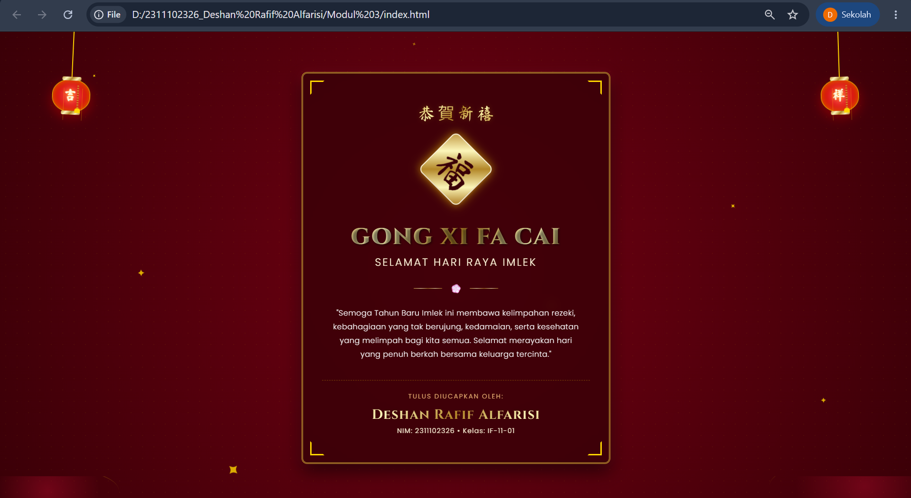

<div align="center">
  <br />
  <h1>LAPORAN PRAKTIKUM <br>APLIKASI BERBASIS PLATFORM</h1>
  <br />
  <h3>MODUL 3 <br> CSS - CASCADING STYLE SHEET</h3>
  <br />
  <br />
   
  <br />
  <br />
  <br />
  <br />
  <h3>Disusun Oleh :</h3>
  <p>
    <strong>Deshan Rafif Alfarisi</strong><br>
    <strong>2311102326</strong><br>
    <strong>S1 IF-11-01</strong>
  </p>
  <br />
  <h3>Dosen Pengampu :</h3>
  <p>
    <strong>Dimas Fanny Hebrasianto Permadi, S.ST., M.Kom</strong>
  </p>
  <br />
  <br />
    <h4>Asisten Praktikum :</h4>
    <strong> Apri Pandu Wicaksono </strong> <br>
    <strong>Rangga Pradarrell Fathi</strong>
  <br />
  <h3>LABORATORIUM HIGH PERFORMANCE
 <br>FAKULTAS INFORMATIKA <br>UNIVERSITAS TELKOM PURWOKERTO <br>2026</h3>
</div>

---

## 1. Dasar Teori

**CSS (Cascading Style Sheets)** adalah bahasa yang digunakan bersamaan dengan HTML untuk mengatur tampilan visual pada halaman web. Apabila HTML berfungsi sebagai struktur atau kerangka dasar dari sebuah halaman, maka CSS berperan untuk mempercantik tampilannya, seperti mengatur warna, tata letak, ukuran elemen, hingga berbagai aspek dekoratif lainnya.

CSS bekerja dengan cara memilih elemen HTML menggunakan **selector**, seperti tag, *class*, atau *id*, lalu menerapkan aturan gaya melalui berbagai properti, misalnya warna, ukuran teks, jarak antar elemen, dan lain sebagainya. Dengan penerapan CSS, struktur konten (HTML) dapat dipisahkan dari tampilan visualnya (CSS). Pemisahan ini membuat kode menjadi lebih rapi, terstruktur, serta memudahkan proses pengelolaan dan pembaruan pada halaman web.

Secara umum terdapat tiga metode untuk menambahkan CSS ke dalam dokumen HTML, yaitu:

1. **Inline CSS**  
   Gaya dituliskan langsung pada elemen HTML menggunakan atribut `style`.

2. **Internal CSS**  
   Aturan CSS ditulis di dalam tag `<style>` yang ditempatkan pada bagian `<head>` dokumen HTML.

3. **External CSS**  
  Aturan CSS umumnya disimpan dalam file terpisah yang memiliki ekstensi `.css`, kemudian dihubungkan dengan file HTML menggunakan tag `<link>`. Metode ini menjadi praktik yang paling direkomendasikan dalam pengembangan web karena membantu menjaga kerapian dan struktur kode. Selain itu, pemisahan file CSS dari HTML juga memudahkan pengelolaan dan pemeliharaan kode, terutama ketika digunakan pada proyek web yang lebih besar dan kompleks.


## 2. Penjelasan Kode HTML dan CSS

Berikut ini adalah implementasi desain kartu ucapan yang digabungkan antara struktur kerangka dasar HTML murni dan desain modern visual yang diambil dari *External CSS*, beserta hasil tampilannya.

### Kode HTML (`index.html`)

```html
<!DOCTYPE html>
<html lang="id">
<head>
    <meta charset="UTF-8">
    <meta name="viewport" content="width=device-width, initial-scale=1.0">
    <meta name="description" content="Ucapan Selamat Hari Raya Imlek dari Deshan Rafif Alfarisi. Semoga tahun baru membawa kemakmuran, keberuntungan, dan kebahagiaan.">
    <title>Selamat Hari Raya Imlek - Deshan Rafif Alfarisi</title>
    <!-- Google Fonts -->
    <link rel="preconnect" href="https://fonts.googleapis.com">
    <link rel="preconnect" href="https://fonts.gstatic.com" crossorigin>
    <link href="https://fonts.googleapis.com/css2?family=Cinzel:wght@500;700;900&family=Ma+Shan+Zheng&family=Poppins:wght@300;400;600&display=swap" rel="stylesheet">
    <!-- Style CSS -->
    <link rel="stylesheet" href="style.css">
</head>
<body>
    <!-- Background Sparkles/Petals -->
    <div class="sparkles-container">
        <div class="sparkle s1">✦</div>
        <div class="sparkle s2">✦</div>
        <div class="sparkle s3">✦</div>
        <div class="sparkle s4">✦</div>
        <div class="sparkle s5">✦</div>
        <div class="sparkle s6">✦</div>
        <div class="sparkle s7">✦</div>
        <div class="sparkle s8">✦</div>
    </div>

    <!-- Hanging Lanterns -->
    <div class="lantern-wrapper left">
        <div class="lantern-string"></div>
        <div class="lantern">
            <div class="lantern-top"></div>
            <div class="lantern-body">
                <div class="lantern-glow"></div>
                <div class="lantern-line"></div>
                <span class="lantern-text">吉</span>
            </div>
            <div class="lantern-bottom"></div>
            <div class="lantern-tassel"></div>
        </div>
    </div>
    
    <div class="lantern-wrapper right">
        <div class="lantern-string"></div>
        <div class="lantern">
            <div class="lantern-top"></div>
            <div class="lantern-body">
                <div class="lantern-glow"></div>
                <div class="lantern-line"></div>
                <span class="lantern-text">祥</span>
            </div>
            <div class="lantern-bottom"></div>
            <div class="lantern-tassel"></div>
        </div>
    </div>

    <main class="container">
        <div class="card">
            <!-- Decorative Corners -->
            <div class="corner top-left"></div>
            <div class="corner top-right"></div>
            <div class="corner bottom-left"></div>
            <div class="corner bottom-right"></div>

            <header class="header">
                <div class="chinese-accent">恭賀新禧</div>
                <div class="fu-character">福</div>
            </header>

            <section class="content">
                <h1 class="main-title">Gong Xi Fa Cai</h1>
                <h2 class="sub-title">Selamat Hari Raya Imlek</h2>
                <div class="divider">
                    <span class="divider-line"></span>
                    <span class="divider-symbol">💮</span>
                    <span class="divider-line"></span>
                </div>
                <p class="wishes">
                    "Semoga Tahun Baru Imlek ini membawa kelimpahan rezeki, kebahagiaan yang tak berujung, kedamaian, serta kesehatan yang melimpah bagi kita semua. Selamat merayakan hari yang penuh berkah bersama keluarga tercinta."
                </p>
            </section>

            <footer class="sender-info">
                <p class="from-text">Tulus Diucapkan Oleh:</p>
                <h3 class="sender-name">Deshan Rafif Alfarisi</h3>
                <p class="sender-details">NIM: 2311102326 &bull; Kelas: IF-11-01</p>
            </footer>
        </div>
    </main>

    <!-- Decorative Bottom Wave/Clouds -->
    <div class="clouds">
        <div class="cloud c1"></div>
        <div class="cloud c2"></div>
    </div>
</body>
</html>
```

### Kode CSS (`style.css`)

```css
/* Reset and General Settings */
*, *::before, *::after {
    box-sizing: border-box;
    margin: 0;
    padding: 0;
}

:root {
    --bg-dark-red: #3a0007;
    --bg-mid-red: #720012;
    --bg-crimson: #a8001e;
    
    --gold-base: #ffd700;
    --gold-dark: #b8860b;
    --gold-light: #fff8dc;
    --gold-gradient: linear-gradient(135deg, #bf953f 0%, #fcf6ba 25%, #b38728 50%, #fbf5b7 75%, #aa771c 100%);
    --gold-glow: 0 0 15px rgba(255, 215, 0, 0.6), 0 0 30px rgba(212, 175, 55, 0.4);
    
    --font-heading: 'Cinzel', serif;
    --font-chinese: 'Ma Shan Zheng', cursive;
    --font-body: 'Poppins', sans-serif;
}

body {
    background: radial-gradient(circle at center, var(--bg-mid-red) 0%, var(--bg-dark-red) 100%);
    color: #fff;
    font-family: var(--font-body);
    min-height: 100vh;
    display: flex;
    justify-content: center;
    align-items: center;
    overflow-x: hidden;
    position: relative;
    padding: 2rem 1rem;
}

/* Background Pattern (Silky texture using absolute elements) */
body::before {
    content: '';
    position: absolute;
    top: 0;
    left: 0;
    width: 100%;
    height: 100%;
    background-image: radial-gradient(circle, rgba(255, 215, 0, 0.05) 1px, transparent 1px);
    background-size: 24px 24px;
    z-index: 0;
    pointer-events: none;
}

/* Main Container & Card styling */
.container {
    width: 100%;
    max-width: 650px;
    display: flex;
    justify-content: center;
    align-items: center;
    z-index: 5;
}

.card {
    background: rgba(58, 0, 7, 0.85);
    border: 3px double #d4af37;
    border-radius: 12px;
    padding: 3.5rem 2.5rem;
    text-align: center;
    box-shadow: 0 15px 35px rgba(0, 0, 0, 0.6), 0 0 20px rgba(186, 12, 47, 0.3);
    position: relative;
    backdrop-filter: blur(10px);
    transition: transform 0.5s cubic-bezier(0.175, 0.885, 0.32, 1.275), box-shadow 0.5s ease;
    overflow: hidden;
}

.card:hover {
    transform: translateY(-5px) scale(1.01);
    box-shadow: 0 20px 40px rgba(0, 0, 0, 0.7), var(--gold-glow);
    border-color: #ffd700;
}

/* Traditional Chinese Border Corners */
.corner {
    position: absolute;
    width: 30px;
    height: 30px;
    border: 3px solid transparent;
    transition: all 0.5s ease;
}

.top-left {
    top: 15px;
    left: 15px;
    border-top: 3px solid var(--gold-base);
    border-left: 3px solid var(--gold-base);
}

.top-right {
    top: 15px;
    right: 15px;
    border-top: 3px solid var(--gold-base);
    border-right: 3px solid var(--gold-base);
}

.bottom-left {
    bottom: 15px;
    left: 15px;
    border-bottom: 3px solid var(--gold-base);
    border-left: 3px solid var(--gold-base);
}

.bottom-right {
    bottom: 15px;
    right: 15px;
    border-bottom: 3px solid var(--gold-base);
    border-right: 3px solid var(--gold-base);
}

.card:hover .corner {
    width: 45px;
    height: 45px;
    border-color: var(--gold-light);
}

/* Header & Calligraphy */
.header {
    margin-bottom: 1.5rem;
    display: flex;
    flex-direction: column;
    align-items: center;
    gap: 0.5rem;
}

.chinese-accent {
    font-family: var(--font-chinese);
    font-size: 2.2rem;
    background: var(--gold-gradient);
    -webkit-background-clip: text;
    -webkit-text-fill-color: transparent;
    letter-spacing: 6px;
    margin-left: 6px;
    text-shadow: 0 0 10px rgba(255, 215, 0, 0.2);
}

.fu-character {
    font-family: var(--font-chinese);
    font-size: 5rem;
    color: #3a0007;
    background: var(--gold-gradient);
    width: 110px;
    height: 110px;
    display: flex;
    align-items: center;
    justify-content: center;
    border-radius: 12px;
    transform: rotate(45deg);
    margin: 2rem 0;
    border: 2px solid var(--gold-light);
    box-shadow: 0 0 15px rgba(255, 215, 0, 0.4);
    animation: pulseGlow 3s infinite alternate;
}

/* Internal contents of Fu character rotated back to look straight */
.fu-character {
    padding-top: 5px;
}

@keyframes pulseGlow {
    0% {
        box-shadow: 0 0 10px rgba(255, 215, 0, 0.4);
    }
    100% {
        box-shadow: 0 0 25px rgba(255, 215, 0, 0.8);
        transform: rotate(45deg) scale(1.05);
    }
}

/* Greetings & Titles */
.main-title {
    font-family: var(--font-heading);
    font-size: 3rem;
    font-weight: 900;
    text-transform: uppercase;
    background: var(--gold-gradient);
    -webkit-background-clip: text;
    -webkit-text-fill-color: transparent;
    letter-spacing: 2px;
    margin-bottom: 0.2rem;
    text-shadow: 2px 2px 4px rgba(0, 0, 0, 0.5);
}

.sub-title {
    font-family: var(--font-body);
    font-size: 1.4rem;
    font-weight: 300;
    color: var(--gold-light);
    letter-spacing: 3px;
    margin-bottom: 1.5rem;
    text-transform: uppercase;
}

/* Dividers */
.divider {
    display: flex;
    align-items: center;
    justify-content: center;
    gap: 1rem;
    margin-bottom: 1.5rem;
}

.divider-line {
    display: block;
    height: 1px;
    width: 60px;
    background: var(--gold-gradient);
}

.divider-symbol {
    font-size: 1.2rem;
    animation: rotateSymbol 6s infinite linear;
}

@keyframes rotateSymbol {
    0% { transform: rotate(0deg); }
    100% { transform: rotate(360deg); }
}

.wishes {
    font-size: 1rem;
    line-height: 1.8;
    color: #f5f5f5;
    margin-bottom: 2.5rem;
    font-weight: 300;
    letter-spacing: 0.5px;
    padding: 0 1rem;
}

/* Sender Details */
.sender-info {
    border-top: 1px dashed rgba(255, 215, 0, 0.3);
    padding-top: 1.5rem;
}

.from-text {
    font-size: 0.85rem;
    color: #e0a96d;
    text-transform: uppercase;
    letter-spacing: 2px;
    margin-bottom: 0.5rem;
}

.sender-name {
    font-family: var(--font-heading);
    font-size: 1.8rem;
    font-weight: 700;
    background: var(--gold-gradient);
    -webkit-background-clip: text;
    -webkit-text-fill-color: transparent;
    letter-spacing: 1px;
    margin-bottom: 0.3rem;
}

.sender-details {
    font-size: 0.9rem;
    color: var(--gold-light);
    letter-spacing: 1px;
    opacity: 0.9;
}

/* Floating Lanterns */
.lantern-wrapper {
    position: fixed;
    top: 0;
    width: 120px;
    display: flex;
    flex-direction: column;
    align-items: center;
    z-index: 10;
    pointer-events: none;
}

.lantern-wrapper.left {
    left: 5%;
    animation: swayLeft 6s ease-in-out infinite alternate;
}

.lantern-wrapper.right {
    right: 5%;
    animation: swayRight 7s ease-in-out infinite alternate;
}

.lantern-string {
    width: 2px;
    height: 100px;
    background: var(--gold-base);
}

.lantern {
    position: relative;
    width: 80px;
    height: 70px;
    background: radial-gradient(circle at center, #ff4d4d 0%, #cc0000 70%, #800000 100%);
    border-radius: 50px / 40px;
    box-shadow: 0 10px 25px rgba(204, 0, 0, 0.5), inset 0 0 15px rgba(255, 215, 0, 0.6);
    display: flex;
    justify-content: center;
    align-items: center;
    border: 1px solid var(--gold-base);
    cursor: pointer;
    pointer-events: auto;
    transition: transform 0.3s ease, box-shadow 0.3s ease;
}

.lantern:hover {
    transform: scale(1.1);
    box-shadow: 0 15px 35px rgba(255, 87, 87, 0.7), inset 0 0 25px rgba(255, 215, 0, 0.9), var(--gold-glow);
}

.lantern-top, .lantern-bottom {
    position: absolute;
    width: 40px;
    height: 8px;
    background: var(--gold-gradient);
    border-radius: 3px;
    left: 50%;
    transform: translateX(-50%);
}

.lantern-top {
    top: -6px;
}

.lantern-bottom {
    bottom: -6px;
}

.lantern-line {
    position: absolute;
    width: 40px;
    height: 100%;
    border-left: 1px solid rgba(255, 215, 0, 0.3);
    border-right: 1px solid rgba(255, 215, 0, 0.3);
    pointer-events: none;
}

.lantern-text {
    font-family: var(--font-chinese);
    color: var(--gold-light);
    font-size: 1.8rem;
    font-weight: bold;
    text-shadow: 0 0 8px rgba(255, 215, 0, 0.8);
}

.lantern-tassel {
    width: 4px;
    height: 50px;
    background: repeating-linear-gradient(to bottom, #d4af37, #cc0000 5px);
    margin-top: 5px;
    position: relative;
    border-radius: 2px;
}

.lantern-tassel::after {
    content: '';
    position: absolute;
    bottom: -8px;
    left: 50%;
    transform: translateX(-50%);
    width: 12px;
    height: 10px;
    background: var(--gold-base);
    border-radius: 50% 50% 0 0;
}

/* Swaying Keyframes */
@keyframes swayLeft {
    0% {
        transform: rotate(-3deg);
        transform-origin: top center;
    }
    100% {
        transform: rotate(3deg);
        transform-origin: top center;
    }
}

@keyframes swayRight {
    0% {
        transform: rotate(-4deg);
        transform-origin: top center;
    }
    100% {
        transform: rotate(2deg);
        transform-origin: top center;
    }
}

/* Background Sparkles Animation */
.sparkles-container {
    position: fixed;
    top: 0;
    left: 0;
    width: 100vw;
    height: 100vh;
    pointer-events: none;
    z-index: 1;
}

.sparkle {
    position: absolute;
    color: var(--gold-base);
    font-size: 1.5rem;
    opacity: 0;
    animation: drift 8s infinite linear;
}

.s1 { left: 10%; animation-delay: 0s; font-size: 1rem; }
.s2 { left: 25%; animation-delay: 2s; font-size: 1.8rem; }
.s3 { left: 45%; animation-delay: 0.5s; font-size: 1.2rem; }
.s4 { left: 60%; animation-delay: 4.5s; font-size: 1.5rem; }
.s5 { left: 75%; animation-delay: 1.2s; font-size: 2rem; }
.s6 { left: 90%; animation-delay: 3s; font-size: 0.9rem; }
.s7 { left: 15%; animation-delay: 5s; font-size: 1.4rem; }
.s8 { left: 80%; animation-delay: 6s; font-size: 1.1rem; }

@keyframes drift {
    0% {
        transform: translateY(-50px) rotate(0deg) scale(0.5);
        opacity: 0;
    }
    10% {
        opacity: 0.8;
    }
    90% {
        opacity: 0.8;
    }
    100% {
        transform: translateY(105vh) rotate(360deg) scale(1.2);
        opacity: 0;
    }
}

/* Bottom Clouds Decoration */
.clouds {
    position: fixed;
    bottom: 0;
    left: 0;
    width: 100%;
    height: 60px;
    z-index: 2;
    pointer-events: none;
    overflow: hidden;
}

.cloud {
    position: absolute;
    bottom: -20px;
    background: radial-gradient(circle, rgba(186, 12, 47, 0.4) 0%, transparent 70%);
    border-radius: 50%;
}

.c1 {
    width: 300px;
    height: 100px;
    left: -50px;
    border-top: 3px solid rgba(255, 215, 0, 0.15);
}

.c2 {
    width: 400px;
    height: 120px;
    right: -100px;
    border-top: 3px solid rgba(255, 215, 0, 0.15);
}

/* Media Queries for Responsiveness */
@media (max-width: 768px) {
    .lantern-wrapper {
        display: none;
    }
    
    .card {
        padding: 2.5rem 1.5rem;
    }
    
    .main-title {
        font-size: 2.2rem;
    }
    
    .chinese-accent {
        font-size: 1.8rem;
    }
    
    .fu-character {
        width: 90px;
        height: 90px;
        font-size: 4rem;
    }
    
    .sender-name {
        font-size: 1.5rem;
    }
}
```

### Hasil Tampilan (Screenshot)



### Penjelasan Code

#### 1. HTML (`index.html`)

Program HTML di atas digunakan untuk membuat sebuah halaman web statis guna menyampaikan ucapan perayaan Tahun Baru Imlek dengan tampilan modern bernuansa merah dan emas. Pada bagian paling atas dokumen, dideklarasikan `<!DOCTYPE html>` yang menegaskan penggunaan standar **HTML5**. Melalui tag **`<html lang="id">`**, browser diinstruksikan bahwa bahasa konten utama dokumen tersebut adalah **Bahasa Indonesia**.

Bagian **`<head>`** menyimpan berbagai pengaturan metadata penting. Tag `<meta charset="UTF-8">` bertugas untuk memastikan penyandian karakter dapat memproses huruf khusus dengan baik (seperti karakter Hanzi Mandarin). Pengaturan viewport `<meta name="viewport" content="width=device-width, initial-scale=1.0">` menjamin halaman bersifat responsif di berbagai ukuran perangkat. Untuk kebutuhan estetika tipografi, dokumen ini memuat beberapa font dari **Google Fonts** (Cinzel, Ma Shan Zheng untuk tulisan kaligrafi Mandarin, dan Poppins sebagai font teks isi). Di bagian akhir head, terdapat tag `<link rel="stylesheet" href="style.css">` yang memetakan styling halaman menuju file stylesheet eksternal **`style.css`**.

Elemen di dalam **`<body>`** terbagi atas komponen latar belakang, ornamen melayang, kartu ucapan utama, dan ornamen penutup:
* **`sparkles-container`**: Berisi elemen-elemen bintang (`✦`) berkelas `sparkle` yang dianimasikan jatuh layaknya rintik emas berguguran.
* **`lantern-wrapper`**: Menyusun elemen visual berupa lampion gantung tradisional di sebelah kiri (dengan tulisan Hanzi "吉" - keberuntungan) dan kanan (tulisan "祥" - kemakmuran). Setiap lampion dirancang lengkap dengan bagian atas, badan, pendaran cahaya (*glow*), garis detail, bagian bawah, hingga rumbai-rumbai (*tassel*).
* **`main` dengan kelas `container`**: Sebagai pembungkus utama agar kartu ucapan berada presisi di tengah layar.
* **`card`**: Bagian terpenting yang berisi ornamen sudut dekoratif (`corner`), tajuk kaligrafi Imlek "恭賀新禧" (Gong He Xin Xi) beserta simbol "福" (Fu - keberuntungan), teks ucapan utama "Gong Xi Fa Cai", garis pemisah hiasan (`divider` dengan lambang bunga sakura `💮`), dan paragraf berisi teks ucapan hangat.
* **`sender-info`**: Berfungsi menampilkan data pembuat halaman secara terstruktur, yaitu nama **Deshan Rafif Alfarisi**, NIM **2311102326**, dan kelas **IF-11-01**.
* **`clouds`**: Menyediakan efek dekorasi awan tradisional pada bagian bawah layar untuk melengkapi estetika ornamen Imlek.


#### 2. Styling CSS (`style.css`)

Kode CSS eksternal ini bertanggung jawab atas seluruh visualisasi, tata letak, skema warna, hingga animasi dinamis tanpa bantuan JavaScript.

* **Reset & Variabel CSS (`:root`)**: CSS diawali dengan aturan reset margin dan padding ke angka 0 serta pengaturan `box-sizing: border-box`. Di dalam `:root` dideklarasikan palet warna utama seperti merah tua (`--bg-dark-red`, `--bg-mid-red`), warna dasar emas (`--gold-base`, `--gold-light`), gradasi metalik emas (`--gold-gradient`), efek glow berpendar (`--gold-glow`), dan jenis huruf yang disesuaikan dengan konsep ornamen.
* **Body & Background Pattern**: Menggunakan radial gradient untuk menghasilkan efek warna merah yang kaya dari tengah ke tepi luar. Pseudo-element `body::before` diisi dengan titik-titik samar berwarna emas berjarak 24px untuk menyimulasikan tekstur kain sutra tradisional Tiongkok yang mewah. Kombinasi Flexbox (`display: flex`) menempatkan kartu ucapan tepat di tengah secara vertikal maupun horizontal.
* **Card & Glassmorphism**: Elemen `.card` dirancang menggunakan teknik *glassmorphism* modern dengan latar belakang merah transparan (`rgba(58, 0, 7, 0.85)`) dan filter blur (`backdrop-filter: blur(10px)`). Kartu tersebut memiliki batas ganda emas (`3px double #d4af37`) dan efek bayangan radial. Ketika kursor diarahkan (*hover*), kartu akan bergeser ke atas 5px (`translateY`) disertai peningkatan skala ringan, serta pendaran cahaya emas yang makin terang.
* **Ornamen Bingkai (`.corner`)**: Empat sudut kartu dihiasi garis emas siku-siku yang akan merenggang dan memanjang dari ukuran 30px menjadi 45px saat kartu disorot, menciptakan interaksi mikro-animasi yang responsif dan elegan.
* **Kaligrafi & Simbol Fu (`.fu-character`)**: Karakter "福" diletakkan dalam kotak bergradasi emas yang diputar 45 derajat. Kotak ini memiliki animasi `pulseGlow` berdurasi 3 detik yang membuatnya berdenyut dan berpendar secara dinamis.
* **Animasi Lampion (`.lantern-wrapper` & `@keyframes sway`)**: Lampion diposisikan secara absolut di kiri dan kanan layar. Keduanya diberi animasi ayunan lembut (`swayLeft` dan `swayRight`) yang berjalan terus-menerus. pseudo-element `::after` pada tassel lampion menyusun tali rumbai. Saat lampion didekati kursor, ia membesar dengan efek cahaya pijar yang mengesankan.
* **Partikel Emas Melayang (`@keyframes drift`)**: Bintang-bintang emas pada `sparkles-container` diatur untuk mengalir turun dari atas ke bawah layar secara bergantian menggunakan properti delay. Animasi `drift` menggerakkan partikel sambil memutarnya 360 derajat secara halus.
* **Garis Pemisah Gradasi (`.divider-line`)**: Dibuat menipis di bagian ujung dengan gradasi transparan ke emas dan dihiasi bunga sakura (`💮`) di bagian tengah yang berputar tanpa henti (`rotateSymbol`).
* **Responsivitas Layar (Media Queries)**: Pada ukuran layar di bawah 768px, lampion gantung samping disembunyikan agar tidak menutupi isi kartu ucapan, ukuran font diperkecil secara proporsional, dan padding kartu disesuaikan agar tetap proporsional dibaca di layar smartphone.


## Referensi
- [Materi Modul 3](https://drive.google.com/file/d/1kd7ogQkR_rsNCnKDcJDmavY8FiOyTLzs/view?usp=sharing)
- Modul Praktikum Aplikasi Berbasis Platform: [Google Drive Folder](https://drive.google.com/drive/folders/1ug7dmm-aVF-NG9-YT5kT519HdGmkXaD-?usp=sharing)
