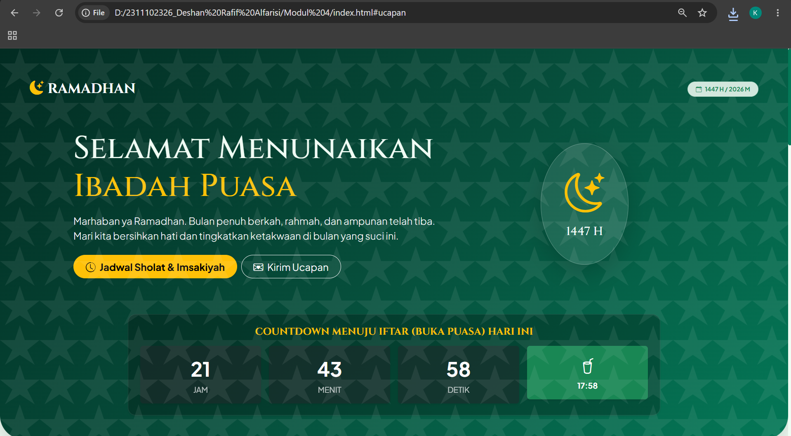
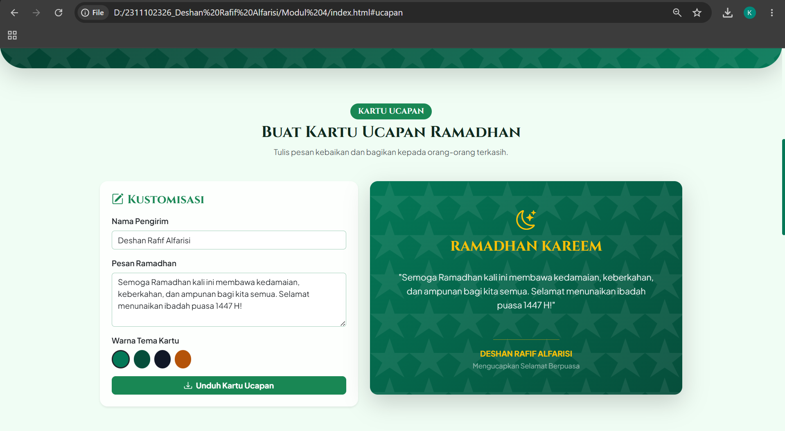
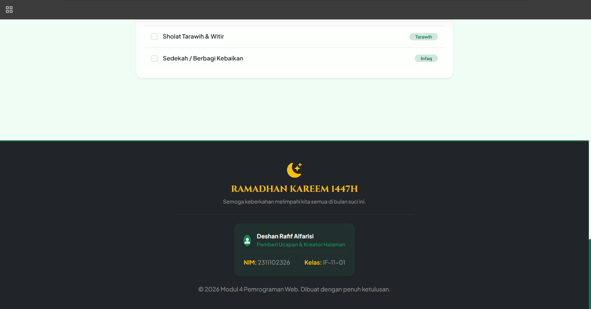

<div align="center">
  <br />
  <h1>LAPORAN PRAKTIKUM <br>APLIKASI BERBASIS PLATFORM</h1>
  <br />
  <h3>MODUL 4 <br> BOOTSTRAP</h3>
  <br />
  <br />
   
  <br />
  <br />
  <br />
  <br />
  <h3>Disusun Oleh :</h3>
  <p>
    <strong>Deshan Rafif Alfarisi</strong><br>
    <strong>2311102326</strong><br>
    <strong>S1 IF-11-01</strong>
  </p>
  <br />
  <h3>Dosen Pengampu :</h3>
  <p>
    <strong>Dimas Fanny Hebrasianto Permadi, S.ST., M.Kom</strong>
  </p>
  <br />
  <br />
    <h4>Asisten Praktikum :</h4>
    <strong> Apri Pandu Wicaksono </strong> <br>
    <strong>Rangga Pradarrell Fathi</strong>
  <br />
  <h3>LABORATORIUM HIGH PERFORMANCE
 <br>FAKULTAS INFORMATIKA <br>UNIVERSITAS TELKOM PURWOKERTO <br>2026</h3>
</div>

---

## 1. Dasar Teori

**Bootstrap** adalah kerangka kerja (framework) front-end CSS yang bersifat open-source dan paling populer di dunia. Bootstrap dirancang untuk membantu pengembang web dalam membangun antarmuka web yang responsif (*responsive design*), mengutamakan perangkat seluler (*mobile-first*), serta mempercepat proses pembuatan situs web dengan menyediakan pustaka kelas-kelas CSS, komponen siap pakai, dan plugin JavaScript bawaan.

Dengan Bootstrap, pengembang tidak perlu lagi menulis kode CSS dari awal untuk elemen-elemen umum seperti tata letak, tombol, formulir, navigasi, tabel, modal, dan lainnya. Kerangka kerja ini dibangun menggunakan Flexbox modern dan mendukung penyesuaian (*customization*) dengan mudah.

Prinsip kerja utama Bootstrap didasarkan pada beberapa pilar penting:

1. **Sistem Grid Responsif (Grid System)**  
   Sistem grid Bootstrap menggunakan wadah (*containers*), baris (*rows*), dan kolom (*columns*) untuk menyusun dan menyelaraskan konten. Sistem ini menggunakan grid 12 kolom yang responsif di berbagai perangkat berkat *breakpoints* media queries (seperti `sm`, `md`, `lg`, `xl`, dan `xxl`).

2. **Utility Classes**  
   Bootstrap 5 menyediakan ribuan kelas utilitas untuk mengatur margin (`m-`), padding (`p-`), tata letak Flexbox (`d-flex`, `justify-content-center`), warna teks (`text-success`), latar belakang (`bg-dark`), border, transparansi, dan lain sebagainya. Hal ini memungkinkan pembangunan tata letak halaman yang kompleks langsung dari file HTML tanpa perlu menulis native CSS.

3. **Komponen Siap Pakai (Pre-styled Components)**  
   Bootstrap menyediakan komponen UI berstandar tinggi yang modern dan siap digunakan seperti Navbar, Cards, Buttons, Progress Bar, List Groups, dan Forms.

4. **Konektivitas Mudah**  
   Bootstrap dapat dengan mudah diintegrasikan ke proyek web baik menggunakan CDN (*Content Delivery Network*) untuk pemuatan cepat, maupun secara lokal melalui instalasi npm/yarn.


## 2. Penjelasan Kode HTML dan Javascript

Berikut ini adalah implementasi pembuatan halaman bertema Ramadhan dan Emerald yang menggunakan framework Bootstrap 5 dengan memanfaatkan utility class dan komponen interaktif bawaannya.

### Kode HTML (`index.html`)

```html
<!DOCTYPE html>
<html lang="id">
<head>
    <meta charset="UTF-8">
    <meta name="viewport" content="width=device-width, initial-scale=1.0">
    <title>Ramadhan Kareem 1447H - Mubarak Celebration</title>
    
    <!-- Bootstrap 5 CSS -->
    <link href="https://cdn.jsdelivr.net/npm/bootstrap@5.3.3/dist/css/bootstrap.min.css" rel="stylesheet">
    
    <!-- Bootstrap Icons -->
    <link href="https://cdn.jsdelivr.net/npm/bootstrap-icons@1.11.3/font/bootstrap-icons.min.css" rel="stylesheet">
    
    <!-- Google Fonts -->
    <link rel="preconnect" href="https://fonts.googleapis.com">
    <link rel="preconnect" href="https://fonts.gstatic.com" crossorigin>
    <link href="https://fonts.googleapis.com/css2?family=Cinzel:wght@500;700;900&family=Plus+Jakarta+Sans:wght@300;400;500;600;700&display=swap" rel="stylesheet">
    
    <style>
        /* Custom emerald variables and minimal tweaks to make Bootstrap look premium */
        :root {
            --emerald-primary: #047857;
            --emerald-dark: #064e3b;
            --emerald-light: #34d399;
            --emerald-bg: #022c22;
        }

        body {
            font-family: 'Plus Jakarta Sans', sans-serif;
            background-color: #f0fdf4;
            color: #0f291e;
            overflow-x: hidden;
        }

        .font-cinzel {
            font-family: 'Cinzel', serif;
        }

        /* Glassmorphism card standardizing Bootstrap classes */
        .glass-card {
            background: rgba(255, 255, 255, 0.85);
            backdrop-filter: blur(10px);
            border: 1px solid rgba(4, 120, 87, 0.15);
            border-radius: 1rem;
            transition: all 0.3s ease-in-out;
        }
        
        .glass-card:hover {
            transform: translateY(-5px);
            box-shadow: 0 10px 25px rgba(4, 120, 87, 0.1) !important;
        }

        /* Customize scrollbar */
        ::-webkit-scrollbar {
            width: 8px;
        }
        ::-webkit-scrollbar-track {
            background: #f0fdf4;
        }
        ::-webkit-scrollbar-thumb {
            background: var(--emerald-primary);
            border-radius: 4px;
        }

        /* Custom hero overlay gradient */
        .hero-section {
            background: linear-gradient(135deg, var(--emerald-bg) 0%, var(--emerald-dark) 50%, var(--emerald-primary) 100%);
            color: #f0fdf4;
            position: relative;
            overflow: hidden;
            border-bottom-left-radius: 3rem;
            border-bottom-right-radius: 3rem;
        }

        /* Islamic patterns using lightweight SVGs */
        .islamic-pattern {
            position: absolute;
            top: 0;
            left: 0;
            width: 100%;
            height: 100%;
            opacity: 0.07;
            pointer-events: none;
            background-image: url("data:image/svg+xml,%3Csvg xmlns='http://www.w3.org/2000/svg' width='80' height='80' viewBox='0 0 80 80'%3E%3Cpath d='M40 0l10 30h30L55 50l15 30-30-20-30 20 15-30L0 30h30z' fill='%23ffffff' fill-rule='evenodd'/%3E%3C/svg%3E");
        }

        /* Interactive widgets styling */
        .prayer-active {
            border-left: 5px solid var(--emerald-light) !important;
            background-color: rgba(4, 120, 87, 0.1) !important;
        }
    </style>
</head>
<body>

    <!-- Hero / Header Section -->
    <header class="hero-section py-5 px-3 px-md-5 text-center shadow-lg">
        <div class="islamic-pattern"></div>
        
        <!-- Navbar -->
        <nav class="navbar navbar-expand-lg navbar-dark bg-transparent mb-4">
            <div class="container-fluid">
                <a class="navbar-brand font-cinzel fs-3 fw-bold text-white tracking-widest" href="#">
                    <i class="bi bi-moon-stars-fill text-warning me-2"></i>RAMADHAN
                </a>
                <div class="ms-auto d-flex align-items-center">
                    <span class="badge bg-success-subtle text-success border border-success-subtle px-3 py-2 rounded-pill fs-7">
                        <i class="bi bi-calendar-event me-1"></i> 1447 H / 2026 M
                    </span>
                </div>
            </div>
        </nav>

        <!-- Main Hero Intro -->
        <div class="container py-4">
            <div class="row align-items-center">
                <div class="col-lg-7 text-lg-start text-center mb-4 mb-lg-0">
                    <h1 class="display-3 font-cinzel fw-black mb-3">
                        Selamat Menunaikan <br>
                        <span class="text-warning">Ibadah Puasa</span>
                    </h1>
                    <p class="lead mb-4 opacity-90 text-light">
                        Marhaban ya Ramadhan. Bulan penuh berkah, rahmah, dan ampunan telah tiba. Mari kita bersihkan hati dan tingkatkan ketakwaan di bulan yang suci ini.
                    </p>
                    <div class="d-flex flex-wrap gap-2 justify-content-center justify-content-lg-start">
                        <a href="#jadwal" class="btn btn-warning btn-lg px-4 rounded-pill shadow-sm fw-bold">
                            <i class="bi bi-clock-history me-2"></i>Jadwal Sholat & Imsakiyah
                        </a>
                        <a href="#ucapan" class="btn btn-outline-light btn-lg px-4 rounded-pill">
                            <i class="bi bi-envelope-heart me-2"></i>Kirim Ucapan
                        </a>
                    </div>
                </div>
                <div class="col-lg-5 text-center position-relative">
                    <div class="p-5 bg-white bg-opacity-10 rounded-circle d-inline-block shadow-lg border border-white border-opacity-25 animate-bounce">
                        <i class="bi bi-moon-stars text-warning display-1 d-block mb-3"></i>
                        <span class="d-block font-cinzel fs-4 text-white">1447 H</span>
                    </div>
                </div>
            </div>
        </div>

        <!-- Countdown Timer -->
        <div class="container mt-5">
            <div class="row justify-content-center">
                <div class="col-md-10">
                    <div class="bg-black bg-opacity-25 border border-white border-opacity-10 rounded-4 p-4 shadow-sm backdrop-blur">
                        <h5 class="text-warning mb-3 fw-bold tracking-wider font-cinzel">COUNTDOWN MENUJU IFTAR (BUKA PUASA) HARI INI</h5>
                        <div class="row text-center g-3" id="countdown-timer">
                            <div class="col-3">
                                <div class="p-3 bg-dark bg-opacity-50 rounded shadow-sm">
                                    <div class="fs-1 fw-bold text-white" id="hours">00</div>
                                    <div class="text-uppercase text-light opacity-75 fs-7">Jam</div>
                                </div>
                            </div>
                            <div class="col-3">
                                <div class="p-3 bg-dark bg-opacity-50 rounded shadow-sm">
                                    <div class="fs-1 fw-bold text-white" id="minutes">00</div>
                                    <div class="text-uppercase text-light opacity-75 fs-7">Menit</div>
                                </div>
                            </div>
                            <div class="col-3">
                                <div class="p-3 bg-dark bg-opacity-50 rounded shadow-sm">
                                    <div class="fs-1 fw-bold text-white" id="seconds">00</div>
                                    <div class="text-uppercase text-light opacity-75 fs-7">Detik</div>
                                </div>
                            </div>
                            <div class="col-3">
                                <div class="p-3 bg-success rounded shadow-sm d-flex flex-column justify-content-center align-items-center">
                                    <i class="bi bi-cup-straw text-white fs-2 mb-1"></i>
                                    <div class="text-uppercase text-white fw-bold fs-7" id="iftar-time">17:58</div>
                                </div>
                            </div>
                        </div>
                    </div>
                </div>
            </div>
        </div>
    </header>

    <!-- Main Content Section -->
    <main class="container py-5">
        
        <!-- Greeting Card Creator Section -->
        <section id="ucapan" class="mb-5 py-4">
            <div class="text-center mb-5">
                <span class="badge bg-success text-white px-3 py-2 rounded-pill mb-2 font-cinzel fs-6">KARTU UCAPAN</span>
                <h2 class="fw-bold font-cinzel">Buat Kartu Ucapan Ramadhan</h2>
                <p class="text-muted">Tulis pesan kebaikan dan bagikan kepada orang-orang terkasih.</p>
            </div>

            <div class="row g-4 justify-content-center">
                <!-- Creator Form -->
                <div class="col-md-5">
                    <div class="card glass-card p-4 border-0 shadow-sm">
                        <h4 class="mb-3 fw-bold text-success font-cinzel"><i class="bi bi-pencil-square me-2"></i>Kustomisasi</h4>
                        <div class="mb-3">
                            <label for="inputName" class="form-label fw-semibold">Nama Pengirim</label>
                            <input type="text" class="form-control border-success-subtle" id="inputName" placeholder="Masukkan nama Anda" value="Deshan Rafif Alfarisi">
                        </div>
                        <div class="mb-3">
                            <label for="inputMessage" class="form-label fw-semibold">Pesan Ramadhan</label>
                            <textarea class="form-control border-success-subtle" id="inputMessage" rows="4" placeholder="Tuliskan ucapan atau doa tulus Anda...">Semoga Ramadhan kali ini membawa kedamaian, keberkahan, dan ampunan bagi kita semua. Selamat menunaikan ibadah puasa 1447 H!</textarea>
                        </div>
                        <div class="mb-3">
                            <label class="form-label fw-semibold">Warna Tema Kartu</label>
                            <div class="d-flex gap-2">
                                <button type="button" class="btn btn-success border-3 border-dark rounded-circle p-3 theme-color-btn active" data-color="#047857" style="background-color: #047857;"></button>
                                <button type="button" class="btn rounded-circle p-3 theme-color-btn" data-color="#064e3b" style="background-color: #064e3b;"></button>
                                <button type="button" class="btn rounded-circle p-3 theme-color-btn" data-color="#111827" style="background-color: #111827;"></button>
                                <button type="button" class="btn rounded-circle p-3 theme-color-btn" data-color="#b45309" style="background-color: #b45309;"></button>
                            </div>
                        </div>
                        <button type="button" id="btnDownload" class="btn btn-success w-100 py-2.5 rounded-3 fw-bold">
                            <i class="bi bi-download me-2"></i>Unduh Kartu Ucapan
                        </button>
                    </div>
                </div>

                <!-- Preview Area -->
                <div class="col-md-6">
                    <div class="card border-0 shadow-lg text-white overflow-hidden rounded-4 position-relative" id="greetingCard" style="background: linear-gradient(135deg, #047857 0%, #064e3b 100%); min-height: 380px;">
                        <div class="islamic-pattern"></div>
                        <div class="card-body d-flex flex-column justify-content-between p-5 text-center z-1">
                            <div>
                                <i class="bi bi-moon-stars text-warning fs-1"></i>
                                <h3 class="font-cinzel text-warning mt-2 tracking-widest fw-bold">RAMADHAN KAREEM</h3>
                            </div>
                            <div class="my-4">
                                <p class="lead italic text-light" id="previewMessage" style="font-size: 1.1rem; line-height: 1.6;">
                                    "Semoga Ramadhan kali ini membawa kedamaian, keberkahan, dan ampunan bagi kita semua. Selamat menunaikan ibadah puasa 1447 H!"
                                </p>
                            </div>
                            <div>
                                <hr class="border-warning opacity-50 w-25 mx-auto">
                                <p class="mb-0 text-uppercase tracking-wider fw-bold text-warning" id="previewSender">Deshan Rafif Alfarisi</p>
                                <small class="text-white-50">Mengucapkan Selamat Berpuasa</small>
                            </div>
                        </div>
                    </div>
                </div>
            </div>
        </section>

        <!-- Prayer Schedule Section -->
        <section id="jadwal" class="mb-5 py-4">
            <div class="text-center mb-5">
                <span class="badge bg-success text-white px-3 py-2 rounded-pill mb-2 font-cinzel fs-6">IMSABIYAH & SHOLAT</span>
                <h2 class="fw-bold font-cinzel">Jadwal Sholat Hari Ini</h2>
                <p class="text-muted">Zona Waktu: Jakarta & Sekitarnya (WIB)</p>
            </div>

            <div class="row justify-content-center">
                <div class="col-md-10">
                    <div class="card glass-card border-0 shadow-sm p-4">
                        <div class="row row-cols-2 row-cols-md-5 g-3 text-center" id="prayerTimesContainer">
                            <div class="col">
                                <div class="p-3 border rounded-3 bg-light transition-all" id="time-subuh">
                                    <h6 class="text-muted mb-1 text-uppercase fw-semibold">Subuh</h6>
                                    <h3 class="fw-bold text-success font-cinzel mb-0">04:35</h3>
                                </div>
                            </div>
                            <div class="col">
                                <div class="p-3 border rounded-3 bg-light transition-all" id="time-dzuhur">
                                    <h6 class="text-muted mb-1 text-uppercase fw-semibold">Dzuhur</h6>
                                    <h3 class="fw-bold text-success font-cinzel mb-0">11:52</h3>
                                </div>
                            </div>
                            <div class="col">
                                <div class="p-3 border rounded-3 bg-light transition-all" id="time-ashar">
                                    <h6 class="text-muted mb-1 text-uppercase fw-semibold">Ashar</h6>
                                    <h3 class="fw-bold text-success font-cinzel mb-0">15:12</h3>
                                </div>
                            </div>
                            <div class="col">
                                <div class="p-3 border rounded-3 bg-light transition-all" id="time-maghrib">
                                    <h6 class="text-muted mb-1 text-uppercase fw-semibold">Maghrib</h6>
                                    <h3 class="fw-bold text-success font-cinzel mb-0">17:58</h3>
                                </div>
                            </div>
                            <div class="col">
                                <div class="p-3 border rounded-3 bg-light transition-all" id="time-isya">
                                    <h6 class="text-muted mb-1 text-uppercase fw-semibold">Isya</h6>
                                    <h3 class="fw-bold text-success font-cinzel mb-0">19:10</h3>
                                </div>
                            </div>
                        </div>
                    </div>
                </div>
            </div>
        </section>

        <!-- Ramadan Daily Planner / Checklist -->
        <section id="tracker" class="mb-5 py-4">
            <div class="text-center mb-5">
                <span class="badge bg-success text-white px-3 py-2 rounded-pill mb-2 font-cinzel fs-6">TRACKER</span>
                <h2 class="fw-bold font-cinzel">Amalan Harian Ramadhan</h2>
                <p class="text-muted">Pantau ibadah harian Anda untuk memaksimalkan keberkahan bulan Ramadhan.</p>
            </div>

            <div class="row justify-content-center">
                <div class="col-md-8">
                    <div class="card glass-card border-0 shadow-sm p-4">
                        <div class="d-flex justify-content-between align-items-center mb-4">
                            <h5 class="fw-bold font-cinzel text-success mb-0">
                                <i class="bi bi-check2-all me-2"></i>Capaian Hari Ini
                            </h5>
                            <span class="badge bg-success px-3 py-2 rounded-pill" id="progress-text">0% Selesai</span>
                        </div>
                        
                        <div class="progress mb-4" style="height: 10px;">
                            <div class="progress-bar bg-success progress-bar-striped progress-bar-animated" role="progressbar" style="width: 0%" id="progress-bar"></div>
                        </div>

                        <ul class="list-group list-group-flush" id="checklist">
                            <li class="list-group-item d-flex justify-content-between align-items-center bg-transparent py-3">
                                <div class="form-check">
                                    <input class="form-check-input border-success-subtle p-2" type="checkbox" id="check1" checked>
                                    <label class="form-check-label ms-2 fw-semibold" for="check1">Makan Sahur Tepat Waktu</label>
                                </div>
                                <span class="badge bg-success-subtle text-success rounded-pill px-3 py-1">Sahur</span>
                            </li>
                            <li class="list-group-item d-flex justify-content-between align-items-center bg-transparent py-3">
                                <div class="form-check">
                                    <input class="form-check-input border-success-subtle p-2" type="checkbox" id="check2">
                                    <label class="form-check-label ms-2 fw-semibold" for="check2">Sholat 5 Waktu Berjamaah</label>
                                </div>
                                <span class="badge bg-success-subtle text-success rounded-pill px-3 py-1">Sholat</span>
                            </li>
                            <li class="list-group-item d-flex justify-content-between align-items-center bg-transparent py-3">
                                <div class="form-check">
                                    <input class="form-check-input border-success-subtle p-2" type="checkbox" id="check3">
                                    <label class="form-check-label ms-2 fw-semibold" for="check3">Membaca Al-Qur'an (Tadarus)</label>
                                </div>
                                <span class="badge bg-success-subtle text-success rounded-pill px-3 py-1">Al-Qur'an</span>
                            </li>
                            <li class="list-group-item d-flex justify-content-between align-items-center bg-transparent py-3">
                                <div class="form-check">
                                    <input class="form-check-input border-success-subtle p-2" type="checkbox" id="check4">
                                    <label class="form-check-label ms-2 fw-semibold" for="check4">Sholat Tarawih & Witir</label>
                                </div>
                                <span class="badge bg-success-subtle text-success rounded-pill px-3 py-1">Tarawih</span>
                            </li>
                            <li class="list-group-item d-flex justify-content-between align-items-center bg-transparent py-3">
                                <div class="form-check">
                                    <input class="form-check-input border-success-subtle p-2" type="checkbox" id="check5">
                                    <label class="form-check-label ms-2 fw-semibold" for="check5">Sedekah / Berbagi Kebaikan</label>
                                </div>
                                <span class="badge bg-success-subtle text-success rounded-pill px-3 py-1">Infaq</span>
                            </li>
                        </ul>
                    </div>
                </div>
            </div>
        </section>

    </main>

    <!-- Footer -->
    <footer class="bg-dark text-white py-5 mt-5 border-top border-success border-3">
        <div class="container text-center">
            <div class="mb-4">
                <i class="bi bi-moon-stars-fill text-warning fs-1"></i>
                <h4 class="font-cinzel text-warning mt-2 fw-bold tracking-widest">RAMADHAN KAREEM 1447H</h4>
                <p class="text-white-50 small">Semoga keberkahan melimpahi kita semua di bulan suci ini.</p>
            </div>
            
            <hr class="border-secondary my-4 w-50 mx-auto">
            
            <!-- Sender Information -->
            <div class="my-4">
                <div class="d-inline-block p-4 rounded-4 bg-success bg-opacity-10 border border-success border-opacity-25 shadow-sm text-start" style="max-width: 450px;">
                    <div class="d-flex align-items-center mb-3">
                        <div class="bg-success text-white rounded-circle p-2.5 me-3">
                            <i class="bi bi-person-fill fs-5"></i>
                        </div>
                        <div>
                            <h6 class="mb-0 text-white fw-bold">Deshan Rafif Alfarisi</h6>
                            <small class="text-success fw-semibold">Pemberi Ucapan & Kreator Halaman</small>
                        </div>
                    </div>
                    <div class="row g-2 border-top border-secondary border-opacity-25 pt-2 text-white-50 fs-7">
                        <div class="col-6">
                            <span class="text-warning fw-semibold">NIM:</span> 2311102326
                        </div>
                        <div class="col-6 text-end">
                            <span class="text-warning fw-semibold">Kelas:</span> IF-11-01
                        </div>
                    </div>
                </div>
            </div>
            
            <p class="mb-0 text-white-50 fs-7">&copy; 2026 Modul 4 Pemrograman Web. Dibuat dengan penuh ketulusan.</p>
        </div>
    </footer>

    <!-- Bootstrap 5 Bundle JS with Popper -->
    <script src="https://cdn.jsdelivr.net/npm/bootstrap@5.3.3/dist/js/bootstrap.bundle.min.js"></script>

    <!-- html2canvas for card export -->
    <script src="https://cdnjs.cloudflare.com/ajax/libs/html2canvas/1.4.1/html2canvas.min.js"></script>

    <script>
        // Custom Greeting Card Interactivity
        const inputName = document.getElementById('inputName');
        const inputMessage = document.getElementById('inputMessage');
        const previewSender = document.getElementById('previewSender');
        const previewMessage = document.getElementById('previewMessage');
        const greetingCard = document.getElementById('greetingCard');
        const themeBtns = document.querySelectorAll('.theme-color-btn');

        inputName.addEventListener('input', (e) => {
            previewSender.textContent = e.target.value || 'Nama Pengirim';
        });

        inputMessage.addEventListener('input', (e) => {
            previewMessage.textContent = e.target.value ? `"${e.target.value}"` : '"Tuliskan ucapan atau doa tulus Anda..."';
        });

        themeBtns.forEach(btn => {
            btn.addEventListener('click', () => {
                themeBtns.forEach(b => b.classList.remove('active', 'border-3', 'border-dark'));
                btn.classList.add('active', 'border-3', 'border-dark');
                const color = btn.getAttribute('data-color');
                greetingCard.style.background = `linear-gradient(135deg, ${color} 0%, #000000 100%)`;
            });
        });

        document.getElementById('btnDownload').addEventListener('click', () => {
            html2canvas(greetingCard, {
                useCORS: true,
                scale: 2
            }).then(canvas => {
                const link = document.createElement('a');
                link.download = 'ucapan_ramadhan_deshan.png';
                link.href = canvas.toDataURL();
                link.click();
            });
        });

        // Countdown Timer Logic
        function updateCountdown() {
            const now = new Date();
            const target = new Date();
            target.setHours(17, 58, 0, 0);
            
            let diff = target - now;
            if (diff < 0) {
                target.setDate(target.getDate() + 1);
                diff = target - now;
            }
            
            const hours = Math.floor(diff / (1000 * 60 * 60));
            const minutes = Math.floor((diff % (1000 * 60 * 60)) / (1000 * 60));
            const seconds = Math.floor((diff % (1000 * 60)) / 1000);
            
            document.getElementById('hours').textContent = String(hours).padStart(2, '0');
            document.getElementById('minutes').textContent = String(minutes).padStart(2, '0');
            document.getElementById('seconds').textContent = String(seconds).padStart(2, '0');
        }
        
        setInterval(updateCountdown, 1000);
        updateCountdown();

        // Prayer Schedule - Highlight Active Hour
        function checkActivePrayer() {
            const now = new Date();
            const currentHour = now.getHours();
            const currentMin = now.getMinutes();
            const currentTimeStr = `${String(currentHour).padStart(2, '0')}:${String(currentMin).padStart(2, '0')}`;
            
            const prayers = [
                { id: 'time-subuh', time: '04:35', name: 'Subuh' },
                { id: 'time-dzuhur', time: '11:52', name: 'Dzuhur' },
                { id: 'time-ashar', time: '15:12', name: 'Ashar' },
                { id: 'time-maghrib', time: '17:58', name: 'Maghrib' },
                { id: 'time-isya', time: '19:10', name: 'Isya' }
            ];

            prayers.forEach(p => {
                document.getElementById(p.id).classList.remove('prayer-active', 'border-success', 'shadow-sm');
                document.getElementById(p.id).classList.add('bg-light');
            });

            for (let i = 0; i < prayers.length; i++) {
                const pTime = prayers[i].time;
                const nextTime = prayers[(i + 1) % prayers.length].time;
                
                if (i === prayers.length - 1 || (currentTimeStr >= pTime && currentTimeStr < nextTime)) {
                    const activeEl = document.getElementById(prayers[i].id);
                    activeEl.classList.add('prayer-active', 'border-success', 'shadow-sm');
                    activeEl.classList.remove('bg-light');
                    break;
                }
            }
        }
        
        checkActivePrayer();
        setInterval(checkActivePrayer, 60000);

        // Daily Tracker Checklist
        const checkboxes = document.querySelectorAll('#checklist input[type="checkbox"]');
        const progressBar = document.getElementById('progress-bar');
        const progressText = document.getElementById('progress-text');

        function updateProgress() {
            const checkedCount = Array.from(checkboxes).filter(cb => cb.checked).length;
            const percentage = Math.round((checkedCount / checkboxes.length) * 100);
            
            progressBar.style.width = `${percentage}%`;
            progressText.textContent = `${percentage}% Selesai`;
        }

        checkboxes.forEach(cb => {
            cb.addEventListener('change', updateProgress);
        });

        updateProgress();
    </script>
</body>
</html>
```

### Hasil Tampilan (Screenshot)

#### 1. Banner Utama & Countdown Iftar


#### 2. Kustomisasi & Unduh Kartu Ucapan Ramadhan


#### 3. Jadwal Sholat & Imsakiyah Hari Ini


#### 4. Amalan Harian Tracker


### Penjelasan Code

#### 1. HTML & Bootstrap 5 Structure

Program HTML di atas digunakan untuk membangun halaman web interaktif perayaan bulan suci Ramadhan 1447H dengan tema visual Emerald yang mewah. Halaman dibangun dengan standar **HTML5** yang ditandai dengan tag `<!DOCTYPE html>`. Untuk mendukung sifat responsif yang optimal, tag meta viewport `<meta name="viewport" content="width=device-width, initial-scale=1.0">` ditambahkan pada bagian `<head>`.

Bootstrap 5 diintegrasikan secara langsung menggunakan **CDN** melalui `<link href="https://cdn.jsdelivr.net/npm/bootstrap@5.3.3/dist/css/bootstrap.min.css" rel="stylesheet">`. Integrasi ini memberikan akses instan ke seluruh sistem grid, komponen pra-desain, serta kelas-kelas utilitas Bootstrap. Selain itu, pustaka **Bootstrap Icons** juga disertakan untuk menghadirkan ornamen ikonik bertema Ramadan dan fitur web lainnya secara instan.

Bagian utama halaman dibagi menjadi beberapa bagian terstruktur:
* **Header / Hero Section:** Dibuat menggunakan paduan warna latar belakang gradasi hijau emerald tua (`linear-gradient`) dengan pola latar belakang islami yang diatur transparan. Navbar bertema transparan disematkan di bagian atas untuk menjaga estetika. Konten hero mencakup sapaan utama "Selamat Menunaikan Ibadah Puasa" serta sub-pesan pendorong spiritualitas. Di dalamnya juga disematkan tombol berdesain modern melengkung penuh (`rounded-pill`) untuk navigasi cepat halaman.
* **Countdown Timer:** Sebuah widget canggih berlatar belakang semi-transparan (*backdrop-blur*) yang menyajikan waktu hitung mundur menuju Iftar (buka puasa) hari ini dengan format grid kolom responsif.
* **Greeting Card Creator:** Komponen utama interaktif yang terbagi dalam dua kolom grid (`col-md-5` untuk form konfigurasi kustomisasi input nama dan pesan, serta `col-md-6` untuk visualisasi preview kartu ucapan secara langsung).
* **Prayer Schedule:** Kontainer baris kolom responsif (`row-cols-2 row-cols-md-5`) yang merangkum jadwal ibadah sholat 5 waktu serta penunjuk aktif otomatis.
* **Ramadan Tracker / Checklist:** Bagian interaktif menggunakan list group Bootstrap (`list-group-flush`) dan progress bar untuk mencatat capaian amal harian selama bulan Ramadhan.
* **Footer:** Menampilkan pesan hak cipta dan kartu identitas pembuat halaman dengan penataan detail nama (**Deshan Rafif Alfarisi**), **NIM (2311102326)**, dan **Kelas (IF-11-01)** menggunakan ikon personil dan elemen-elemen label Bootstrap.

#### 2. Javascript Logic (Interaktivitas)

Kode JavaScript di dalam berkas HTML bertanggung jawab atas jalannya fungsi interaktif dan dinamis di sisi klien:
* **Sinkronisasi Teks Kartu Ucapan:** Menggunakan pendengar aktivitas (*event listener*) bertipe `input` pada elemen kolom nama dan pesan. Setiap karakter yang diinput oleh pengguna akan langsung dicerminkan ke dalam elemen kartu pratinjau (*preview*).
* **Pilihan Tema Warna Kartu:** Mengubah gaya latar belakang (`background`) pada elemen pratinjau kartu secara dinamis berdasarkan nilai atribut `data-color` tombol lingkaran warna yang diklik.
* **Unduh Kartu Gambar:** Memanfaatkan pustaka external `html2canvas` untuk menangkap (*render*) elemen kartu ucapan HTML (`#greetingCard`) menjadi sebuah kanvas grafis berkualitas tinggi dengan skala 2x resolusi asli, lalu mengunduhnya secara otomatis ke komputer pengguna dengan nama `ucapan_ramadhan_deshan.png`.
* **Hitung Mundur Iftar:** Fungsi `updateCountdown()` menghitung selisih waktu saat ini dengan target waktu berbuka hari ini pukul 17:58 WIB. Selisih milidetik dikonversi menjadi unit jam, menit, dan detik, lalu dimasukkan ke dalam elemen HTML bersangkutan setiap 1 detik sekali (`setInterval`).
* **Deteksi Waktu Sholat Aktif:** Fungsi `checkActivePrayer()` membandingkan waktu lokal saat ini dengan jadwal sholat yang ditentukan. Elemen sholat yang sesuai dengan rentang waktu aktif saat itu secara otomatis mendapatkan kelas `.prayer-active` (garis batas emerald terang di kiri serta latar belakang hijau transparan) dan menghapus kelas dasar abu-abu.
* **Capaian Amalan Harian:** Fungsi `updateProgress()` menghitung jumlah kotak centang (*checkbox*) yang dipilih dari total daftar amalan, menghitung nilai persentase, lalu menerapkannya pada properti lebar (`width`) *progress bar* dan mengubah teks capaian.

---

## Referensi
- [Materi Modul 4 Bootstrap](https://drive.google.com/file/d/1kd7ogQkR_rsNCnKDcJDmavY8FiOyTLzs/view?usp=sharing)
- Modul praktikum dan Panduan Pembelajaran Bootstrap 5
