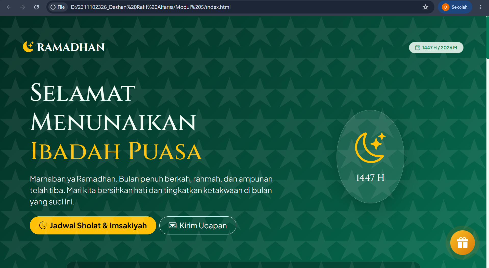
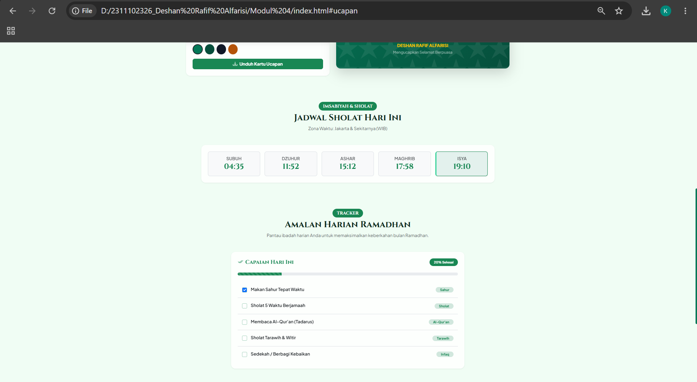
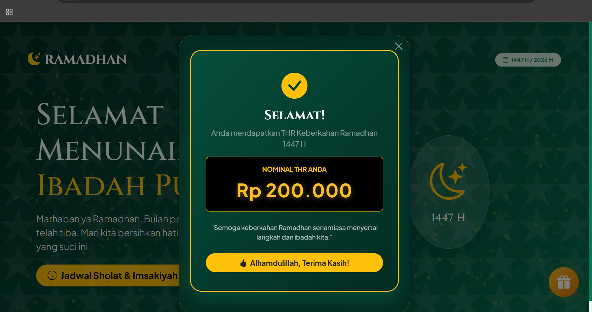

<div align="center">
  <br />
  <h1>LAPORAN PRAKTIKUM <br>APLIKASI BERBASIS PLATFORM</h1>
  <br />
  <h3>MODUL 5 <br> JAVASCRIPT</h3>
  <br />
  <br />
   
  <br />
  <br />
  <br />
  <br />
  <h3>Disusun Oleh :</h3>
  <p>
    <strong>Deshan Rafif Alfarisi</strong><br>
    <strong>2311102326</strong><br>
    <strong>S1 IF-11-01</strong>
  </p>
  <br />
  <h3>Dosen Pengampu :</h3>
  <p>
    <strong>Dimas Fanny Hebrasianto Permadi, S.ST., M.Kom</strong>
  </p>
  <br />
  <br />
    <h4>Asisten Praktikum :</h4>
    <strong> Apri Pandu Wicaksono </strong> <br>
    <strong>Rangga Pradarrell Fathi</strong>
  <br />
  <h3>LABORATORIUM HIGH PERFORMANCE
 <br>FAKULTAS INFORMATIKA <br>UNIVERSITAS TELKOM PURWOKERTO <br>2026</h3>
</div>

---

## 1. Dasar Teori

**JavaScript** adalah bahasa pemrograman tingkat tinggi, dinamis, berbasis prototipe, dan bertipe longgar yang menjadi pilar utama pengembangan web interaktif di sisi klien (*client-side*). JavaScript memungkinkan pengembang untuk menerapkan fitur kompleks pada halaman web, seperti pembaruan konten dinamis, manipulasi peta interaktif, animasi grafis 2D/3D, pemutar media, kontrol form, hingga interaksi real-time tanpa memuat ulang seluruh halaman.

Dalam pemrograman web modern, JavaScript bekerja erat dengan DOM (Document Object Model) untuk mengendalikan dokumen HTML secara terstruktur:

1. **Manipulasi DOM (DOM Manipulation)**  
   JavaScript menyediakan metode penyeleksian elemen (seperti `document.getElementById` atau `document.querySelectorAll`) dan manipulasi atribut/gaya (seperti `element.classList.add` atau `element.style.background`) untuk mengubah struktur halaman secara instan saat berinteraksi dengan pengguna.

2. **Penanganan Aktivitas (Event Handling)**  
   Mekanisme pendengar aktivitas (*event listener*) digunakan untuk menangkap aksi pengguna (seperti `click`, `input`, `change`) dan menjalankan fungsi callback tertentu. Hal ini menciptakan interaktivitas langsung pada formulir kustomisasi dan tombol aksi.

3. **API Web Bawaan (Web Audio API & Intl)**  
   * **Web Audio API**: Menyediakan sistem yang kuat untuk mensintesis, memproses, dan memutar audio secara langsung di peramban web tanpa memerlukan berkas audio eksternal (.mp3/.wav). Nada frekuensi dapat diciptakan murni melalui objek `OscillatorNode` dan `GainNode`.
   * **Intl (Internationalization API)**: Mempermudah pemformatan nilai angka, tanggal, dan mata uang sesuai standar lokal tertentu (seperti format Rupiah Indonesia menggunakan `new Intl.NumberFormat('id-ID', { style: 'currency', currency: 'IDR' })`).

4. **Library Interaktivitas Pihak Ketiga**  
   Penggunaan library eksternal memperkaya interaktivitas web dengan mudah:
   * **html2canvas**: Mengonversi elemen HTML menjadi gambar bitmap (canvas) untuk diekspor secara dinamis.
   * **canvas-confetti**: Pustaka animasi konfeti berbasis canvas untuk memberikan respons visual perayaan yang dinamis.

---

## 2. Penjelasan Kode HTML, CSS, dan Javascript

Berikut adalah pembagian kode aplikasi web Ramadhan Kareem 1447H yang telah dipisah menjadi blok HTML, CSS, dan JavaScript untuk mempermudah analisis pengembangan.

### Kode HTML (`index.html`)

```html
<!-- Struktur Utama Halaman -->
<header class="hero-section py-5 px-3 px-md-5 text-center shadow-lg">
    <div class="islamic-pattern"></div>
    <nav class="navbar navbar-expand-lg navbar-dark bg-transparent mb-4">
        <div class="container-fluid">
            <a class="navbar-brand font-cinzel fs-3 fw-bold text-white tracking-widest" href="#">
                <i class="bi bi-moon-stars-fill text-warning me-2"></i>RAMADHAN
            </a>
            <span class="badge bg-success-subtle text-success border border-success-subtle px-3 py-2 rounded-pill fs-7">
                <i class="bi bi-calendar-event me-1"></i> 1447 H / 2026 M
            </span>
        </div>
    </nav>

    <!-- Countdown Timer Iftar -->
    <div class="container mt-5">
        <div class="bg-black bg-opacity-25 border border-white border-opacity-10 rounded-4 p-4 shadow-sm backdrop-blur">
            <h5 class="text-warning mb-3 fw-bold tracking-wider font-cinzel">COUNTDOWN MENUJU IFTAR</h5>
            <div class="row text-center g-3" id="countdown-timer">
                <div class="col-3"><div class="p-3 bg-dark bg-opacity-50 text-white rounded fs-1 fw-bold" id="hours">00</div></div>
                <div class="col-3"><div class="p-3 bg-dark bg-opacity-50 text-white rounded fs-1 fw-bold" id="minutes">00</div></div>
                <div class="col-3"><div class="p-3 bg-dark bg-opacity-50 text-white rounded fs-1 fw-bold" id="seconds">00</div></div>
                <div class="col-3"><div class="p-3 bg-success text-white rounded fw-bold" id="iftar-time">17:58</div></div>
            </div>
        </div>
    </div>
</header>

<main class="container py-5">
    <!-- Greeting Card Creator -->
    <section id="ucapan" class="mb-5 py-4">
        <!-- Input Form & Live Preview Grid -->
    </section>

    <!-- Jadwal Sholat -->
    <section id="jadwal" class="mb-5 py-4">
        <!-- Prayer Time Grid Cards -->
    </section>

    <!-- Daily Amalan Tracker -->
    <section id="tracker" class="mb-5 py-4">
        <!-- Checklist & Progress Bar -->
    </section>

    <!-- Pojok THR Kareem -->
    <section id="thr-section" class="mb-5 py-4">
        <div class="text-center mb-5">
            <span class="badge bg-warning text-dark px-3 py-2 rounded-pill mb-2 font-cinzel fs-6 fw-bold">BERKAH RAMADHAN</span>
            <h2 class="fw-bold font-cinzel text-emerald-dark">Bagi-Bagi THR Kareem</h2>
            <button type="button" class="btn btn-warning btn-lg px-5 rounded-pill shadow fw-bold text-dark btn-klaim-thr">
                <i class="bi bi-envelope-paper-heart me-2"></i>Klaim THR Sekarang
            </button>
        </div>
    </section>
</main>

<!-- Modal Interaktif THR -->
<div class="modal fade" id="thrModal" data-bs-backdrop="static" data-bs-keyboard="false" tabindex="-1">
    <div class="modal-dialog modal-dialog-centered">
        <div class="modal-content thr-modal-content text-white shadow-lg">
            <div class="modal-body text-center pt-0 px-4 pb-5">
                <!-- Amplop Emas 3D -->
                <div id="envelope-container">
                    <div class="envelope-wrapper" id="thrEnvelope">
                        <div class="envelope-seal"><i class="bi bi-star-fill"></i></div>
                        <div class="envelope-letter">
                            <span class="badge bg-success-subtle text-success mb-2">THR 1447H</span>
                            <h6 class="text-dark fw-bold mb-0">Klik Untuk Buka</h6>
                        </div>
                        <div class="envelope-left"></div>
                        <div class="envelope-right"></div>
                        <div class="envelope-bottom"></div>
                    </div>
                </div>
                <!-- Kartu Hasil Nominal -->
                <div id="reward-container" class="d-none">
                    <div class="thr-reward-card" id="thrRewardCard">
                        <h3 class="font-cinzel text-white fw-bold mb-2">Selamat!</h3>
                        <span class="thr-amount" id="thrAmountText">Rp 0</span>
                        <button type="button" class="btn btn-warning mt-4 rounded-pill w-100" data-bs-dismiss="modal">Alhamdulillah!</button>
                    </div>
                </div>
            </div>
        </div>
    </div>
</div>

<!-- Floating Action Gift Button -->
<div class="floating-thr-btn btn-klaim-thr" title="Klaim THR Ramadhan">
    <i class="bi bi-gift-fill"></i>
</div>
```

### Kode CSS (`index.css` / bagian `<style>`)

```css
:root {
    --emerald-primary: #047857;
    --emerald-dark: #064e3b;
    --emerald-light: #34d399;
    --emerald-bg: #022c22;
}

/* Floating Action Button dengan Efek Pulse & Glow */
.floating-thr-btn {
    position: fixed;
    bottom: 30px;
    right: 30px;
    z-index: 1050;
    width: 65px;
    height: 65px;
    border-radius: 50%;
    background: linear-gradient(135deg, #fbbf24 0%, #d97706 100%);
    box-shadow: 0 10px 25px rgba(217, 119, 6, 0.4);
    display: flex;
    align-items: center;
    justify-content: center;
    color: white;
    cursor: pointer;
    transition: all 0.3s cubic-bezier(0.175, 0.885, 0.32, 1.275);
    animation: floatAnim 3s ease-in-out infinite, pulseGlow 2s infinite;
}
.floating-thr-btn:hover {
    transform: scale(1.1) rotate(10deg);
}

@keyframes floatAnim {
    0%, 100% { transform: translateY(0); }
    50% { transform: translateY(-10px); }
}
@keyframes pulseGlow {
    0% { box-shadow: 0 0 0 0 rgba(217, 119, 6, 0.7); }
    70% { box-shadow: 0 0 0 15px rgba(217, 119, 6, 0); }
    100% { box-shadow: 0 0 0 0 rgba(217, 119, 6, 0); }
}

/* Gaya Amplop 3D Interaktif */
.envelope-wrapper {
    position: relative;
    width: 280px;
    height: 180px;
    background-color: #d97706;
    border-radius: 0 0 15px 15px;
    box-shadow: 0 20px 40px rgba(0,0,0,0.3);
    margin: 60px auto 30px auto;
    cursor: pointer;
}
.envelope-wrapper::before {
    content: '';
    position: absolute;
    top: 0; left: 0;
    width: 0; height: 0;
    border-left: 140px solid transparent;
    border-right: 140px solid transparent;
    border-bottom: 90px solid #b45309;
    transform-origin: bottom;
    transform: translateY(-90px);
    transition: transform 0.4s 0.2s ease-in-out, z-index 0.2s 0.2s;
    z-index: 3;
}
.envelope-wrapper.open::before {
    transform: translateY(-90px) rotateX(180deg);
    z-index: 1;
}
.envelope-letter {
    position: absolute;
    bottom: 10px; left: 15px;
    width: 250px; height: 140px;
    background-color: #fff;
    border-radius: 10px;
    z-index: 2;
    transition: transform 0.5s ease-in-out, height 0.5s;
    padding: 20px;
    text-align: center;
}
.envelope-wrapper.open .envelope-letter {
    transform: translateY(-80px);
    height: 160px;
    z-index: 5;
}

/* Gold Reward Card Transition */
.thr-reward-card {
    background: linear-gradient(135deg, #064e3b 0%, #022c22 100%);
    border: 2px solid #fbbf24;
    border-radius: 1.5rem;
    padding: 2.5rem 2rem;
    box-shadow: 0 15px 35px rgba(4, 120, 87, 0.4);
    transform: scale(0.7);
    opacity: 0;
    transition: all 0.5s cubic-bezier(0.34, 1.56, 0.64, 1);
}
.thr-reward-card.show {
    transform: scale(1);
    opacity: 1;
}
```

### Kode Javascript (`script` bagian logika utama)

```javascript
// 1. Audio Chime Synthesizer
function playChime() {
    try {
        const ctx = new (window.AudioContext || window.webkitAudioContext)();
        const notes = [523.25, 659.25, 783.99, 1046.50]; // Nada C5, E5, G5, C6
        notes.forEach((freq, idx) => {
            setTimeout(() => {
                let osc = ctx.createOscillator();
                let gain = ctx.createGain();
                osc.type = 'sine';
                osc.frequency.setValueAtTime(freq, ctx.currentTime);
                gain.gain.setValueAtTime(0, ctx.currentTime);
                gain.gain.linearRampToValueAtTime(0.15, ctx.currentTime + 0.05);
                gain.gain.exponentialRampToValueAtTime(0.001, ctx.currentTime + 0.8);
                osc.connect(gain);
                gain.connect(ctx.destination);
                osc.start();
                osc.stop(ctx.currentTime + 0.8);
            }, idx * 150);
        });
    } catch(e) { console.log(e); }
}

// 2. Event Listener Buka Amplop & Confetti
const thrEnvelope = document.getElementById('thrEnvelope');
const envelopeContainer = document.getElementById('envelope-container');
const rewardContainer = document.getElementById('reward-container');
const thrRewardCard = document.getElementById('thrRewardCard');
const thrAmountText = document.getElementById('thrAmountText');
let envelopeOpened = false;

thrEnvelope.addEventListener('click', () => {
    if (envelopeOpened) return;
    envelopeOpened = true;
    
    thrEnvelope.classList.add('open');
    playChime();

    // Ledakan Confetti Ganda
    const duration = 2 * 1000;
    const end = Date.now() + duration;
    (function frame() {
        confetti({ particleCount: 5, angle: 60, spread: 55, origin: { x: 0 }, colors: ['#fbbf24', '#047857'] });
        confetti({ particleCount: 5, angle: 120, spread: 55, origin: { x: 1 }, colors: ['#fbbf24', '#047857'] });
        if (Date.now() < end) requestAnimationFrame(frame);
    }());

    // Animasi Muncul Card & Nominal
    setTimeout(() => {
        envelopeContainer.classList.add('d-none');
        rewardContainer.classList.remove('d-none');
        
        setTimeout(() => {
            thrRewardCard.classList.add('show');
            const targetAmount = 200000; // Nominal THR disesuaikan menjadi Rp 200.000
            let currentAmount = 0;
            const steps = 30;
            const stepValue = targetAmount / steps;
            let step = 0;

            const interval = setInterval(() => {
                step++;
                currentAmount = Math.round(stepValue * step);
                if (step >= steps) {
                    currentAmount = targetAmount;
                    clearInterval(interval);
                }
                // Memformat nilai rupiah menggunakan Intl API 'id-ID' secara presisi
                thrAmountText.textContent = new Intl.NumberFormat('id-ID', {
                    style: 'currency',
                    currency: 'IDR',
                    minimumFractionDigits: 0
                }).format(currentAmount);
            }, 30);
        }, 50);
    }, 1200);
});
```

---

## Hasil Tampilan (Screenshot)

#### 1. Banner Utama & Countdown Iftar


#### 2. Kustomisasi & Unduh Kartu Ucapan Ramadhan


#### 3. Jadwal Sholat & Imsakiyah Hari Ini


#### 4. Amalan Harian Tracker


#### 5. Modul Interaktif Klaim THR (Semburan Confetti & Nominal Rp 200.000)


---

## Penjelasan Code

### 1. Struktur HTML & Layout Responsif
Struktur HTML dikemas menggunakan sintaks HTML5 semantik dan Bootstrap 5 Grid. Halaman dibagi atas Header (Hero banner & target countdown Iftar), Main Content (Pembuat ucapan ramadhan, jadwal sholat, checklist ibadah, dan Pojok THR baru), serta Footer. Keberadaan modal interaktif `#thrModal` diletakkan di luar kontainer utama untuk mencegah interferensi penataan letak visual, sementara tombol melayang `.floating-thr-btn` dipasang dengan posisi *fixed* di atas z-index dasar halaman agar selalu mudah diakses oleh pengguna.

### 2. Styling CSS & Animasi Transisi 3D
Desain CSS menggunakan variabel kustom emerald untuk menghadirkan visualisasi tema yang konsisten. Kunci dari interaktivitas amplop terletak pada teknik transformasi 3D CSS:
* Elemen `.envelope-wrapper::before` sebagai penutup atas diatur berotasi `rotateX(180deg)` dengan asal transformasi di sisi bawah (`transform-origin: bottom`) agar menghasilkan efek penutup amplop terbuka ke atas.
* Elemen `.envelope-letter` diatur bergeser vertikal ke atas (`translateY(-80px)`) dengan transisi durasi `0.5s` sehingga memunculkan surat dari dalam kantong amplop secara mulus.
* Tombol melayang memanfaatkan `@keyframes floatAnim` (efek mengambang naik-turun) dan `@keyframes pulseGlow` (bayangan menyebar berdenyut) untuk menarik perhatian pengguna.

### 3. Logika JavaScript & Web API Bawaan
Logika dinamis JavaScript menghidupkan seluruh antarmuka interaktif:
* **Audio Synthesis:** Fungsi `playChime()` secara dinamis membuat `AudioContext` bawaan peramban dan memicu 4 notasi nada ceria berfrekuensi C5, E5, G5, dan C6 yang disusun secara bergantian dengan jeda waktu terkendali.
* **Canvas Confetti:** Menangkap *event* klik amplop untuk merilis ledakan partikel warna-warni secara sinkron dari sisi kiri (`x: 0`) dan kanan (`x: 1`) layar.
* **Format & Counter IDR:** Setelah transisi amplop selesai, nilai nominal dihitung naik secara iteratif melalui `setInterval` menuju angka **Rp 200.000**. Pada setiap langkah, nilai angka diformat dengan presisi menggunakan pustaka standard `Intl.NumberFormat` lokal `'id-ID'` untuk menghasilkan teks representasi Rupiah yang valid secara hukum tanpa membebani browser.

---

## Referensi
- [Materi Modul 5 JavaScript](https://drive.google.com/file/d/1kd7ogQkR_rsNCnKDcJDmavY8FiOyTLzs/view?usp=sharing)
- Panduan Pemrograman Interaktif Client-Side JavaScript & MDN Web Docs
