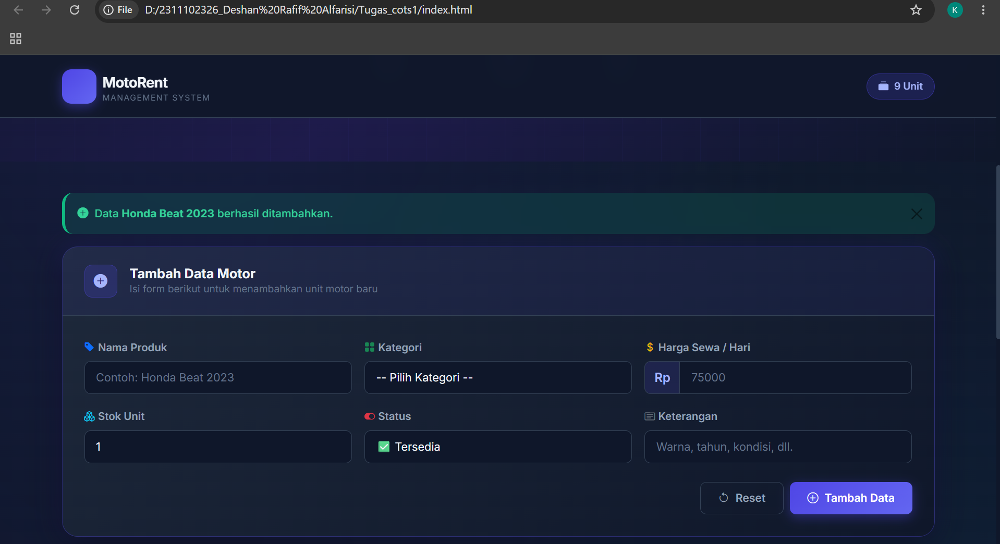
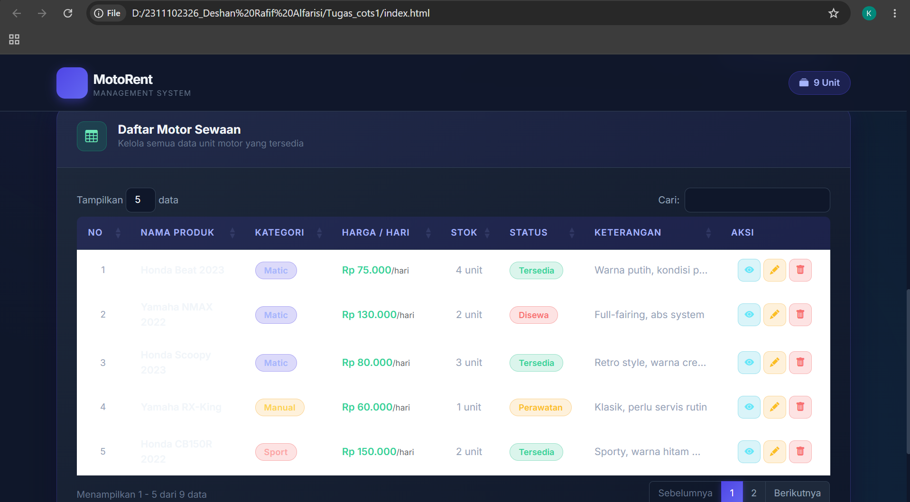
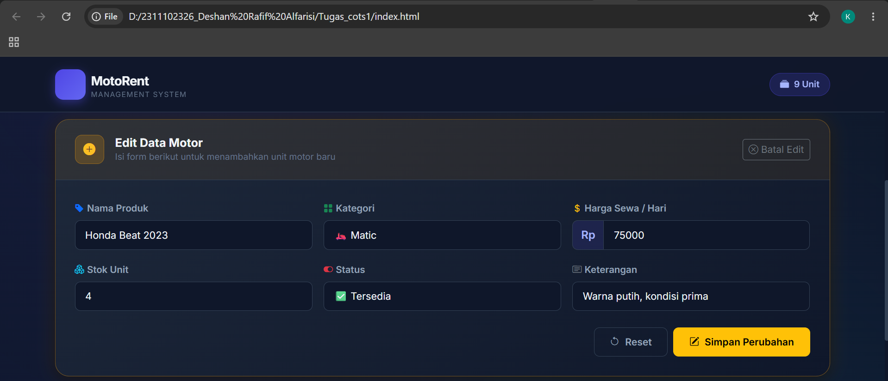
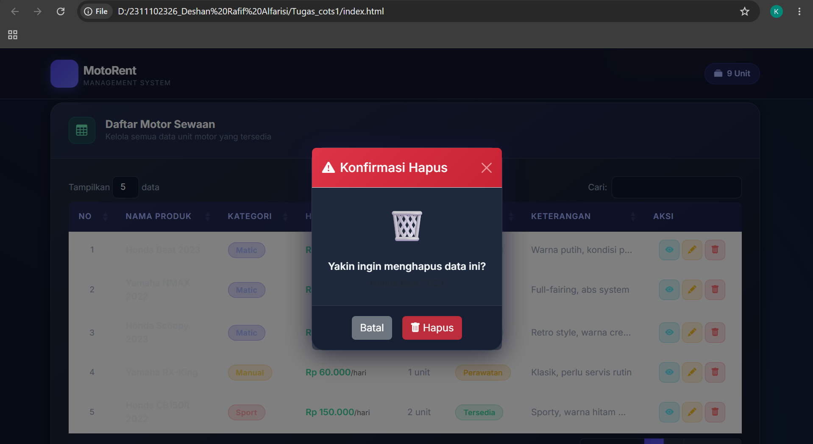

<div align="center">
  <br />
  <h1>LAPORAN PRAKTIKUM <br>APLIKASI BERBASIS PLATFORM</h1>
  <br />
  <h3> TUGAS COTS 1 <br> Sistem Data Pesewaan Motor (JavaScript CRUD) </h3>
  <br />
  
  <br />
  <br />
  <br />
  <h3>Disusun Oleh :</h3>
  <p>
    <strong>Deshan Rafif Alfarisi</strong><br>
    <strong>2311102326</strong><br>
    <strong>S1 IF-11-06</strong>
  </p>
  <br />
  <h3>Dosen Pengampu :</h3>
  <p>
    <strong>Dimas Fanny Hebrasianto Permadi, S.ST., M.Kom</strong>
  </p>
  <br />
  <br />
  <h4>Asisten Praktikum :</h4>
    <strong>Apri Pandu Wicaksono</strong> <br>
    <strong>Rangga Pradarrell Fathi</strong>
  <br />
  <h3>LABORATORIUM HIGH PERFORMANCE
 <br>FAKULTAS INFORMATIKA <br>UNIVERSITAS TELKOM PURWOKERTO <br>2026</h3>
</div>

---

## 1. Dasar Teori

## 📘 Dasar Teori

### 🔹 JavaScript (JS)

JavaScript adalah bahasa pemrograman yang berjalan di sisi klien (*client-side scripting*), yang berfungsi untuk membuat halaman web menjadi dinamis dan interaktif. JavaScript dieksekusi langsung di browser pengguna tanpa memerlukan kompilasi atau server tambahan.

JavaScript banyak digunakan dalam pengembangan web karena kemampuannya dalam:

* Memanipulasi elemen HTML secara dinamis (DOM Manipulation)
* Mengelola logika aplikasi di sisi klien
* Menyimpan dan mengolah data sementara di memori browser
* Berinteraksi dengan komponen UI seperti form, tabel, dan modal
* Mengimplementasikan operasi CRUD (Create, Read, Update, Delete)

Dalam sistem manajemen data pesewaan motor ini, JavaScript digunakan untuk seluruh logika bisnis: menambah, membaca, mengubah, dan menghapus data motor tanpa perlu me-*refresh* halaman.

---

### 🔹 Map (Struktur Data)

`Map` adalah struktur data bawaan JavaScript yang menyimpan pasangan *key-value*, di mana key dapat berupa tipe data apapun (termasuk number, string, object). Berbeda dengan Object biasa, `Map` mempertahankan urutan penyisipan dan memiliki method yang lebih lengkap untuk manipulasi data.

Contoh:

```javascript
const motorStorage = new Map();
motorStorage.set(1, { namaProduk: 'Honda Beat 2023', kategori: 'Matic' });
motorStorage.get(1); // { namaProduk: 'Honda Beat 2023', ... }
```

Dalam sistem ini, `Map<id, motorObject>` digunakan sebagai penyimpanan utama data motor karena:

* Memudahkan pencarian data berdasarkan ID (`map.get(id)`)
* Memudahkan pengecekan keberadaan data (`map.has(id)`)
* Memudahkan penghapusan data (`map.delete(id)`)
* Mempertahankan urutan data sesuai urutan penambahan

---

### 🔹 Operasi CRUD

CRUD adalah singkatan dari empat operasi dasar dalam pengelolaan data:

| Operasi | Keterangan | Method JavaScript |
|---------|-----------|-------------------|
| **C**reate | Menambah data baru | `motorStorage.set(id, data)` |
| **R**ead | Membaca / menampilkan data | `motorStorage.get(id)` / `motorStorage.values()` |
| **U**pdate | Memperbarui data yang ada | `motorStorage.set(id, {...existing, ...baru})` |
| **D**elete | Menghapus data | `motorStorage.delete(id)` |

Keempat operasi ini diimplementasikan sebagai fungsi-fungsi terpisah yang dapat dipanggil dari event listener form maupun tombol aksi pada tabel.

---

### 🔹 Function (Fungsi)

Function adalah blok kode yang dapat dipanggil berulang kali untuk melakukan tugas tertentu. Penggunaan function membuat kode lebih modular, terstruktur, dan mudah dipelihara.

Dalam sistem ini, function digunakan untuk:

* `createMotor(data)` — menambah data motor baru ke storage
* `readMotor(id)` — mengambil satu data motor berdasarkan ID
* `updateMotor(id, data)` — memperbarui data motor yang ada
* `deleteMotor(id)` — menghapus data motor dari storage
* `getAllMotors()` — mengambil semua data motor sebagai array
* `renderTable()` — me-render ulang tabel DataTable
* `buildRow(motor, rowNum)` — membangun satu baris HTML untuk tabel
* `formatRupiah(angka)` — memformat angka menjadi format mata uang Rupiah
* `showAlert(type, message)` — menampilkan notifikasi alert
* `showDetail(id)` — menampilkan modal detail data motor

Contoh:

```javascript
function createMotor(data) {
  const id = nextId++;
  motorStorage.set(id, {
    id,
    namaProduk: data.namaProduk,
    kategori:   data.kategori,
    harga:      Number(data.harga),
    stok:       Number(data.stok),
    status:     data.status,
    keterangan: data.keterangan || '-',
    createdAt:  new Date().toLocaleString('id-ID'),
  });
  return id;
}
```

---

### 🔹 Operator

Operator adalah simbol yang digunakan untuk melakukan operasi terhadap nilai atau variabel.

#### 1. Operator Spread (`...`)

Digunakan untuk menyalin semua properti dari satu object ke object baru, kemudian menimpa properti tertentu:

```javascript
motorStorage.set(id, {
  ...existing,               // salin semua properti lama
  namaProduk: data.namaProduk, // timpa dengan nilai baru
  updatedAt: new Date().toLocaleString('id-ID'),
});
```

#### 2. Operator Ternary (`? :`) & Logika (`||`)

Digunakan untuk ekspresi kondisional singkat dan nilai default:

```javascript
keterangan: data.keterangan || '-'
// jika keterangan kosong/falsy, gunakan '-'

return map[kategori] || 'badge-secondary';
// fallback jika kategori tidak dikenali
```

#### 3. Operator Perbandingan (`===`, `>`)

Digunakan untuk membandingkan dua nilai:

```javascript
if ($(this).scrollTop() > 50) { ... }
if (!motorStorage.has(id)) return false;
```

---

### 🔹 Struktur Kontrol

Struktur kontrol mengatur alur eksekusi program berdasarkan kondisi atau perulangan.

#### 1. Percabangan (`if/else`)

Digunakan untuk membedakan mode Create dan Update saat form di-submit:

```javascript
if (editId) {
  // mode edit — perbarui data
  updateMotor(Number(editId), data);
} else {
  // mode tambah — buat data baru
  createMotor(data);
}
```

#### 2. Perulangan (`forEach`)

Digunakan untuk mengiterasi seluruh data dan mengisi tabel:

```javascript
getAllMotors().forEach(function (motor, idx) {
  dataTable.row.add($(buildRow(motor, idx + 1)));
});
```

#### 3. Perulangan pada Seed Data

Digunakan untuk mengisi data awal saat aplikasi pertama dibuka:

```javascript
seedData.forEach(function (d) { createMotor(d); });
```

---

### 🔹 Event Listener

Event listener adalah mekanisme JavaScript untuk merespons aksi pengguna (klik, submit, scroll) tanpa me-*refresh* halaman.

```javascript
$('#motorForm').on('submit', function (e) {
  e.preventDefault(); // cegah reload halaman
  // ... proses form
});

$(window).on('scroll', function () {
  // efek navbar saat scroll
});
```

---

### 🔹 DataTables

DataTables adalah plugin jQuery yang menambahkan fitur **sorting**, **searching (pencarian real-time)**, dan **pagination** pada tabel HTML secara otomatis.

```javascript
dataTable = $('#motorTable').DataTable({
  language: { /* Bahasa Indonesia */ },
  pageLength: 5,
  lengthMenu: [5, 10, 25, 50],
});
```

---

### 🔹 Bootstrap 5 & Modal

Bootstrap 5 digunakan sebagai framework CSS. Modal digunakan untuk:

* **Modal Detail** — menampilkan detail lengkap satu data motor
* **Modal Konfirmasi Hapus** — meminta konfirmasi sebelum menghapus data

```javascript
var modal = new bootstrap.Modal(document.getElementById('deleteModal'));
modal.show();
```

---

## 2. Source Code

### `index.html`

```html
<!DOCTYPE html>
<html lang="id">
<head>
  <meta charset="UTF-8" />
  <meta name="viewport" content="width=device-width, initial-scale=1.0" />
  <title>Sistem Data Pesewaan Motor</title>
  <meta name="description" content="Sistem manajemen data pesewaan motor dengan fitur CRUD, tabel interaktif, dan form input lengkap." />

  <!-- Bootstrap 5 CSS -->
  <link href="https://cdn.jsdelivr.net/npm/bootstrap@5.3.3/dist/css/bootstrap.min.css" rel="stylesheet" />
  <!-- Bootstrap Icons -->
  <link href="https://cdn.jsdelivr.net/npm/bootstrap-icons@1.11.3/font/bootstrap-icons.min.css" rel="stylesheet" />
  <!-- DataTables CSS -->
  <link href="https://cdn.datatables.net/1.13.8/css/dataTables.bootstrap5.min.css" rel="stylesheet" />
  <!-- Google Fonts -->
  <link href="https://fonts.googleapis.com/css2?family=Inter:wght@300;400;500;600;700&display=swap" rel="stylesheet" />
  <!-- Custom CSS -->
  <link rel="stylesheet" href="style.css" />
</head>
<body>

  <!-- Navbar -->
  <nav class="navbar navbar-expand-lg navbar-dark fixed-top" id="mainNavbar">
    <div class="container">
      <a class="navbar-brand d-flex align-items-center gap-2" href="#">
        <div class="brand-icon"><i class="bi bi-motorcycle"></i></div>
        <div>
          <span class="brand-title">MotoRent</span>
          <span class="brand-sub d-block">Management System</span>
        </div>
      </a>
      <div class="ms-auto d-flex align-items-center gap-3">
        <span class="badge-stat" id="totalBadge">
          <i class="bi bi-collection-fill me-1"></i>
          <span id="totalCount">0</span> Unit
        </span>
      </div>
    </div>
  </nav>

  <!-- Hero Section -->
  <section class="hero-section">
    <div class="container">
      <div class="hero-content text-center">
        <div class="hero-icon-wrap"><i class="bi bi-motorcycle"></i></div>
        <h1 class="hero-title">Data Pesewaan Motor</h1>
        <p class="hero-subtitle">Kelola inventaris dan data pesewaan motor dengan mudah &amp; efisien</p>
        <div class="hero-stats d-flex justify-content-center gap-4 mt-4">
          <div class="stat-card">
            <div class="stat-number" id="statTotal">0</div>
            <div class="stat-label">Total Unit</div>
          </div>
          <div class="stat-card">
            <div class="stat-number" id="statAvailable">0</div>
            <div class="stat-label">Tersedia</div>
          </div>
          <div class="stat-card">
            <div class="stat-number" id="statRented">0</div>
            <div class="stat-label">Disewa</div>
          </div>
        </div>
      </div>
    </div>
  </section>

  <!-- Main Content -->
  <main class="main-content">
    <div class="container">
      <div id="alertContainer"></div>

      <!-- Form Card (Create / Update) -->
      <div class="content-card mb-4" id="formCard">
        <div class="card-header-custom">
          <div class="d-flex align-items-center justify-content-between">
            <div class="d-flex align-items-center gap-3">
              <div class="icon-wrap"><i class="bi bi-plus-circle-fill"></i></div>
              <div>
                <h2 class="section-title mb-0" id="formTitle">Tambah Data Motor</h2>
                <p class="section-sub mb-0">Isi form berikut untuk menambahkan unit motor baru</p>
              </div>
            </div>
            <button class="btn btn-outline-secondary btn-sm" id="btnCancelEdit"
                    style="display:none;" onclick="cancelEdit()">
              <i class="bi bi-x-circle me-1"></i>Batal Edit
            </button>
          </div>
        </div>
        <div class="card-body-custom">
          <form id="motorForm" novalidate>
            <input type="hidden" id="editId" value="" />
            <div class="row g-3">
              <div class="col-md-6 col-lg-4">
                <label for="namaProduk" class="form-label fw-semibold">
                  <i class="bi bi-tag-fill text-primary me-1"></i>Nama Produk
                </label>
                <input type="text" class="form-control form-control-custom" id="namaProduk"
                       placeholder="Contoh: Honda Beat 2023" required />
                <div class="invalid-feedback">Nama produk wajib diisi.</div>
              </div>
              <div class="col-md-6 col-lg-4">
                <label for="kategori" class="form-label fw-semibold">
                  <i class="bi bi-grid-fill text-success me-1"></i>Kategori
                </label>
                <select class="form-select form-control-custom" id="kategori" required>
                  <option value="" disabled selected>-- Pilih Kategori --</option>
                  <option value="Matic">🛵 Matic</option>
                  <option value="Manual">⚙️ Manual / Bebek</option>
                  <option value="Sport">🏍️ Sport</option>
                  <option value="Trail">🌲 Trail / Adventure</option>
                  <option value="Cruiser">🤙 Cruiser / Besar</option>
                </select>
                <div class="invalid-feedback">Kategori wajib dipilih.</div>
              </div>
              <div class="col-md-6 col-lg-4">
                <label for="harga" class="form-label fw-semibold">
                  <i class="bi bi-currency-dollar text-warning me-1"></i>Harga Sewa / Hari
                </label>
                <div class="input-group">
                  <span class="input-group-text">Rp</span>
                  <input type="number" class="form-control form-control-custom" id="harga"
                         placeholder="75000" min="0" required />
                  <div class="invalid-feedback">Harga sewa wajib diisi (angka positif).</div>
                </div>
              </div>
              <div class="col-md-6 col-lg-4">
                <label for="stok" class="form-label fw-semibold">
                  <i class="bi bi-boxes text-info me-1"></i>Stok Unit
                </label>
                <input type="number" class="form-control form-control-custom" id="stok"
                       placeholder="5" min="1" value="1" required />
                <div class="invalid-feedback">Stok minimal 1 unit.</div>
              </div>
              <div class="col-md-6 col-lg-4">
                <label for="status" class="form-label fw-semibold">
                  <i class="bi bi-toggle-on text-danger me-1"></i>Status
                </label>
                <select class="form-select form-control-custom" id="status" required>
                  <option value="Tersedia">✅ Tersedia</option>
                  <option value="Disewa">🔴 Sedang Disewa</option>
                  <option value="Perawatan">🔧 Dalam Perawatan</option>
                </select>
              </div>
              <div class="col-md-6 col-lg-4">
                <label for="keterangan" class="form-label fw-semibold">
                  <i class="bi bi-card-text text-secondary me-1"></i>Keterangan
                </label>
                <input type="text" class="form-control form-control-custom" id="keterangan"
                       placeholder="Warna, tahun, kondisi, dll." />
              </div>
            </div>
            <div class="d-flex gap-2 mt-4 justify-content-end">
              <button type="button" class="btn btn-outline-secondary btn-custom" onclick="resetForm()">
                <i class="bi bi-arrow-counterclockwise me-2"></i>Reset
              </button>
              <button type="submit" class="btn btn-primary btn-custom" id="btnSubmit">
                <i class="bi bi-plus-circle me-2" id="btnIcon"></i>
                <span id="btnText">Tambah Data</span>
              </button>
            </div>
          </form>
        </div>
      </div>

      <!-- Table Card (Read) -->
      <div class="content-card">
        <div class="card-header-custom">
          <div class="d-flex align-items-center gap-3">
            <div class="icon-wrap icon-wrap-success"><i class="bi bi-table"></i></div>
            <div>
              <h2 class="section-title mb-0">Daftar Motor Sewaan</h2>
              <p class="section-sub mb-0">Kelola semua data unit motor yang tersedia</p>
            </div>
          </div>
        </div>
        <div class="card-body-custom">
          <div class="table-responsive">
            <table id="motorTable" class="table table-hover align-middle" style="width:100%">
              <thead>
                <tr>
                  <th class="th-no">No</th>
                  <th>Nama Produk</th>
                  <th>Kategori</th>
                  <th>Harga / Hari</th>
                  <th>Stok</th>
                  <th>Status</th>
                  <th>Keterangan</th>
                  <th class="th-aksi">Aksi</th>
                </tr>
              </thead>
              <tbody id="motorTableBody"></tbody>
            </table>
          </div>
        </div>
      </div>
    </div>
  </main>

  <!-- Modal Detail -->
  <div class="modal fade" id="detailModal" tabindex="-1" aria-hidden="true">
    <div class="modal-dialog modal-dialog-centered">
      <div class="modal-content modal-custom">
        <div class="modal-header modal-header-custom">
          <h5 class="modal-title"><i class="bi bi-info-circle-fill me-2"></i>Detail Motor</h5>
          <button type="button" class="btn-close btn-close-white" data-bs-dismiss="modal"></button>
        </div>
        <div class="modal-body" id="detailModalBody"></div>
        <div class="modal-footer">
          <button type="button" class="btn btn-secondary" data-bs-dismiss="modal">Tutup</button>
        </div>
      </div>
    </div>
  </div>

  <!-- Modal Konfirmasi Hapus (Delete) -->
  <div class="modal fade" id="deleteModal" tabindex="-1" aria-hidden="true">
    <div class="modal-dialog modal-dialog-centered modal-sm">
      <div class="modal-content modal-custom">
        <div class="modal-header" style="background: linear-gradient(135deg, #dc3545, #c82333); color: white;">
          <h5 class="modal-title">
            <i class="bi bi-exclamation-triangle-fill me-2"></i>Konfirmasi Hapus
          </h5>
          <button type="button" class="btn-close btn-close-white" data-bs-dismiss="modal"></button>
        </div>
        <div class="modal-body text-center py-4">
          <div class="mb-3" style="font-size: 3rem;">🗑️</div>
          <p class="mb-1 fw-semibold">Yakin ingin menghapus data ini?</p>
          <p class="text-muted small mb-0" id="deleteModalName"></p>
        </div>
        <div class="modal-footer justify-content-center gap-2">
          <button type="button" class="btn btn-secondary" data-bs-dismiss="modal">Batal</button>
          <button type="button" class="btn btn-danger" id="btnConfirmDelete">
            <i class="bi bi-trash-fill me-1"></i>Hapus
          </button>
        </div>
      </div>
    </div>
  </div>

  <!-- Footer -->
  <footer class="footer-section">
    <div class="container text-center">
      <p class="mb-1"><i class="bi bi-motorcycle me-2"></i><strong>MotoRent Management System</strong></p>
      <p class="mb-0 small opacity-75">Sistem Manajemen Data Pesewaan Motor &copy; 2024</p>
    </div>
  </footer>

  <script src="https://code.jquery.com/jquery-3.7.1.min.js"></script>
  <script src="https://cdn.jsdelivr.net/npm/bootstrap@5.3.3/dist/js/bootstrap.bundle.min.js"></script>
  <script src="https://cdn.datatables.net/1.13.8/js/jquery.dataTables.min.js"></script>
  <script src="https://cdn.datatables.net/1.13.8/js/dataTables.bootstrap5.min.js"></script>
  <script src="script.js"></script>
</body>
</html>
```

---

### `script.js`

```javascript
/**
 * MotoRent Management System — script.js
 * CRUD sederhana dengan penyimpanan berbasis mapping object (Map)
 * Menggunakan jQuery + Bootstrap 5 + DataTables 1.13
 */

'use strict';

/* ====================================================
   1. STORAGE — Map<id, motorObject>
   ==================================================== */
const motorStorage = new Map();
let nextId = 1;
let deleteTargetId = null;
let dataTable = null;

/* Data awal (seed) pesewaan motor */
const seedData = [
  { namaProduk: 'Honda Beat 2023',    kategori: 'Matic',   harga: 75000,  stok: 4, status: 'Tersedia',  keterangan: 'Warna putih, kondisi prima' },
  { namaProduk: 'Yamaha NMAX 2022',   kategori: 'Matic',   harga: 130000, stok: 2, status: 'Disewa',    keterangan: 'Full-fairing, abs system' },
  { namaProduk: 'Honda Scoopy 2023',  kategori: 'Matic',   harga: 80000,  stok: 3, status: 'Tersedia',  keterangan: 'Retro style, warna cream' },
  { namaProduk: 'Yamaha RX-King',     kategori: 'Manual',  harga: 60000,  stok: 1, status: 'Perawatan', keterangan: 'Klasik, perlu servis rutin' },
  { namaProduk: 'Honda CB150R 2022',  kategori: 'Sport',   harga: 150000, stok: 2, status: 'Tersedia',  keterangan: 'Sporty, warna hitam merah' },
  { namaProduk: 'Kawasaki KLX 150',   kategori: 'Trail',   harga: 120000, stok: 1, status: 'Tersedia',  keterangan: 'Trail adventure, cocok offroad' },
  { namaProduk: 'Honda Revo 110',     kategori: 'Manual',  harga: 55000,  stok: 5, status: 'Tersedia',  keterangan: 'Irit bahan bakar, bebek standar' },
  { namaProduk: 'Yamaha XSR 155',     kategori: 'Cruiser', harga: 175000, stok: 1, status: 'Disewa',    keterangan: 'Neo-retro, warna hitam silver' },
];

/* ====================================================
   2. CRUD OPERATIONS
   ==================================================== */

/** CREATE — Tambah motor baru ke storage */
function createMotor(data) {
  const id = nextId++;
  motorStorage.set(id, {
    id,
    namaProduk: data.namaProduk,
    kategori:   data.kategori,
    harga:      Number(data.harga),
    stok:       Number(data.stok),
    status:     data.status,
    keterangan: data.keterangan || '-',
    createdAt:  new Date().toLocaleString('id-ID'),
  });
  return id;
}

/** READ — Ambil satu data motor berdasarkan id */
function readMotor(id) {
  return motorStorage.get(id);
}

/** UPDATE — Perbarui data motor */
function updateMotor(id, data) {
  if (!motorStorage.has(id)) return false;
  const existing = motorStorage.get(id);
  motorStorage.set(id, {
    ...existing,
    namaProduk: data.namaProduk,
    kategori:   data.kategori,
    harga:      Number(data.harga),
    stok:       Number(data.stok),
    status:     data.status,
    keterangan: data.keterangan || '-',
    updatedAt:  new Date().toLocaleString('id-ID'),
  });
  return true;
}

/** DELETE — Hapus motor dari storage */
function deleteMotor(id) {
  return motorStorage.delete(id);
}

/** READ ALL — Ambil semua data motor sebagai array */
function getAllMotors() {
  return Array.from(motorStorage.values());
}

/* ====================================================
   3. DATATABLE HELPERS
   ==================================================== */

function getKategoriBadge(kategori) {
  const map = {
    'Matic': 'badge-matic', 'Manual': 'badge-manual',
    'Sport': 'badge-sport', 'Trail':  'badge-trail', 'Cruiser': 'badge-cruiser',
  };
  return map[kategori] || 'badge-secondary';
}

function getStatusBadge(status) {
  const map = {
    'Tersedia': 'status-tersedia', 'Disewa': 'status-disewa', 'Perawatan': 'status-perawatan',
  };
  return map[status] || '';
}

function formatRupiah(angka) {
  return new Intl.NumberFormat('id-ID', {
    style: 'currency', currency: 'IDR', minimumFractionDigits: 0
  }).format(angka);
}

function escapeHtml(str) {
  if (typeof str !== 'string') return str;
  return str.replace(/&/g,'&amp;').replace(/</g,'&lt;').replace(/>/g,'&gt;')
            .replace(/"/g,'&quot;').replace(/'/g,'&#039;');
}

function buildRow(motor, rowNum) {
  const katBadge  = getKategoriBadge(motor.kategori);
  const statBadge = getStatusBadge(motor.status);
  const hargaFmt  = formatRupiah(motor.harga);
  return `
    <tr data-id="${motor.id}">
      <td class="no-cell">${rowNum}</td>
      <td class="fw-semibold" style="color:#f1f5f9">${escapeHtml(motor.namaProduk)}</td>
      <td><span class="badge-kategori ${katBadge}">${escapeHtml(motor.kategori)}</span></td>
      <td class="harga-cell">${hargaFmt}<span class="text-muted fw-normal" style="font-size:.72rem">/hari</span></td>
      <td class="text-center">${motor.stok} unit</td>
      <td><span class="badge-status ${statBadge}">${escapeHtml(motor.status)}</span></td>
      <td style="max-width:160px;overflow:hidden;text-overflow:ellipsis;white-space:nowrap"
          title="${escapeHtml(motor.keterangan)}">${escapeHtml(motor.keterangan)}</td>
      <td class="text-center">
        <div class="d-flex justify-content-center gap-1">
          <button class="btn-aksi btn-detail" title="Lihat Detail" onclick="showDetail(${motor.id})">
            <i class="bi bi-eye-fill"></i>
          </button>
          <button class="btn-aksi btn-edit" title="Edit Data" onclick="startEdit(${motor.id})">
            <i class="bi bi-pencil-fill"></i>
          </button>
          <button class="btn-aksi btn-hapus" title="Hapus Data" onclick="confirmDelete(${motor.id})">
            <i class="bi bi-trash-fill"></i>
          </button>
        </div>
      </td>
    </tr>`;
}

/* ====================================================
   4. INISIALISASI & RENDER DATATABLE
   ==================================================== */
function initDataTable() {
  dataTable = $('#motorTable').DataTable({
    language: {
      emptyTable: 'Belum ada data motor', zeroRecords: 'Data tidak ditemukan',
      info: 'Menampilkan _START_ - _END_ dari _TOTAL_ data', infoEmpty: 'Tidak ada data',
      infoFiltered: '(difilter dari _MAX_ total data)', search: 'Cari:',
      lengthMenu: 'Tampilkan _MENU_ data',
      paginate: { first:'Pertama', last:'Terakhir', next:'Berikutnya', previous:'Sebelumnya' },
    },
    pageLength: 5,
    lengthMenu: [5, 10, 25, 50],
    order: [],
    columnDefs: [
      { orderable: false,  targets: [7] },
      { searchable: false, targets: [0, 7] },
    ],
    drawCallback: function () {
      let start = this.api().page.info().start;
      this.api().rows({ page: 'current' }).nodes().each(function (row, i) {
        $('td:first', row).text(start + i + 1);
      });
    },
  });
}

function renderTable() {
  if (!dataTable) return;
  dataTable.clear();
  getAllMotors().forEach(function (motor, idx) {
    dataTable.row.add($(buildRow(motor, idx + 1)));
  });
  dataTable.draw();
  updateStats();
}

function updateStats() {
  const all      = getAllMotors();
  const tersedia = all.filter(m => m.status === 'Tersedia').reduce((s, m) => s + m.stok, 0);
  const disewa   = all.filter(m => m.status === 'Disewa').length;
  $('#statTotal').text(all.length);
  $('#statAvailable').text(tersedia);
  $('#statRented').text(disewa);
  $('#totalCount').text(all.length);
}

/* ====================================================
   5. EVENT LISTENERS
   ==================================================== */

// Form submit → CREATE atau UPDATE
$('#motorForm').on('submit', function (e) {
  e.preventDefault();
  if (!this.checkValidity()) { this.classList.add('was-validated'); return; }
  var data = {
    namaProduk: $.trim($('#namaProduk').val()), kategori: $('#kategori').val(),
    harga: $('#harga').val(), stok: $('#stok').val(),
    status: $('#status').val(), keterangan: $.trim($('#keterangan').val()),
  };
  var editId = $('#editId').val();
  if (editId) {
    updateMotor(Number(editId), data);
    showAlert('success', '<i class="bi bi-check-circle-fill me-2"></i>Data <strong>' +
      escapeHtml(data.namaProduk) + '</strong> berhasil diperbarui.');
    cancelEdit();
  } else {
    createMotor(data);
    showAlert('success', '<i class="bi bi-plus-circle-fill me-2"></i>Data <strong>' +
      escapeHtml(data.namaProduk) + '</strong> berhasil ditambahkan.');
  }
  renderTable();
  resetForm();
});

// Konfirmasi hapus → DELETE
$('#btnConfirmDelete').on('click', function () {
  if (deleteTargetId === null) return;
  var motor = readMotor(deleteTargetId);
  var nama  = motor ? motor.namaProduk : '';
  deleteMotor(deleteTargetId);
  deleteTargetId = null;
  bootstrap.Modal.getInstance(document.getElementById('deleteModal')).hide();
  renderTable();
  showAlert('danger', '<i class="bi bi-trash-fill me-2"></i>Data <strong>' +
    escapeHtml(nama) + '</strong> telah dihapus.');
});

// Scroll efek navbar
$(window).on('scroll', function () {
  $('#mainNavbar').css('background', $(this).scrollTop() > 50
    ? 'rgba(15,23,42,0.97)' : 'rgba(15,23,42,0.85)');
});

/* ====================================================
   6. HELPER FUNCTIONS
   ==================================================== */
function resetForm() {
  $('#motorForm')[0].reset();
  $('#motorForm').removeClass('was-validated');
  $('#editId').val('');
  $('#kategori').val('');
  $('#status').val('Tersedia');
}

function startEdit(id) {
  var motor = readMotor(id);
  if (!motor) return;
  $('#editId').val(motor.id); $('#namaProduk').val(motor.namaProduk);
  $('#kategori').val(motor.kategori); $('#harga').val(motor.harga);
  $('#stok').val(motor.stok); $('#status').val(motor.status);
  $('#keterangan').val(motor.keterangan === '-' ? '' : motor.keterangan);
  $('#formCard').addClass('edit-mode');
  $('#formTitle').text('Edit Data Motor');
  $('#btnSubmit').removeClass('btn-primary').addClass('btn-warning');
  $('#btnIcon').attr('class', 'bi bi-pencil-square me-2');
  $('#btnText').text('Simpan Perubahan');
  $('#btnCancelEdit').show();
  $('html, body').animate({ scrollTop: $('#formCard').offset().top - 90 }, 400);
}

function cancelEdit() {
  resetForm();
  $('#formCard').removeClass('edit-mode');
  $('#formTitle').text('Tambah Data Motor');
  $('#btnSubmit').removeClass('btn-warning').addClass('btn-primary');
  $('#btnIcon').attr('class', 'bi bi-plus-circle me-2');
  $('#btnText').text('Tambah Data');
  $('#btnCancelEdit').hide();
}

function confirmDelete(id) {
  var motor = readMotor(id);
  if (!motor) return;
  deleteTargetId = id;
  $('#deleteModalName').text(motor.namaProduk);
  new bootstrap.Modal(document.getElementById('deleteModal')).show();
}

function showDetail(id) {
  var m = readMotor(id);
  if (!m) return;
  var statBadge = getStatusBadge(m.status);
  var katBadge  = getKategoriBadge(m.kategori);
  var updatedRow = m.updatedAt
    ? `<div class="detail-row"><span class="detail-label">Diperbarui</span>
       <span class="detail-value" style="font-size:.82rem;color:#64748b">${m.updatedAt}</span></div>`
    : '';
  $('#detailModalBody').html(`
    <div class="px-1">
      <div class="detail-row">
        <span class="detail-label">Nama Produk</span>
        <span class="detail-value fw-bold" style="color:#a5b4fc">${escapeHtml(m.namaProduk)}</span>
      </div>
      <div class="detail-row">
        <span class="detail-label">Kategori</span>
        <span class="detail-value"><span class="badge-kategori ${katBadge}">${escapeHtml(m.kategori)}</span></span>
      </div>
      <div class="detail-row">
        <span class="detail-label">Harga Sewa</span>
        <span class="detail-value harga-cell">${formatRupiah(m.harga)}
          <span class="text-muted fw-normal" style="font-size:.78rem">/ hari</span></span>
      </div>
      <div class="detail-row">
        <span class="detail-label">Stok Unit</span>
        <span class="detail-value">${m.stok} unit</span>
      </div>
      <div class="detail-row">
        <span class="detail-label">Status</span>
        <span class="detail-value"><span class="badge-status ${statBadge}">${escapeHtml(m.status)}</span></span>
      </div>
      <div class="detail-row">
        <span class="detail-label">Keterangan</span>
        <span class="detail-value" style="color:#94a3b8">${escapeHtml(m.keterangan)}</span>
      </div>
      <div class="detail-row">
        <span class="detail-label">Ditambahkan</span>
        <span class="detail-value" style="font-size:.82rem;color:#64748b">${m.createdAt || '-'}</span>
      </div>
      ${updatedRow}
    </div>`);
  new bootstrap.Modal(document.getElementById('detailModal')).show();
}

function showAlert(type, message) {
  var alertId = 'alert-' + Date.now();
  $('#alertContainer').prepend(
    `<div id="${alertId}" class="alert alert-${type} alert-dismissible fade show
     d-flex align-items-center gap-2 mb-3" role="alert">
      <div>${message}</div>
      <button type="button" class="btn-close ms-auto" data-bs-dismiss="alert"
              style="filter:brightness(1.5)"></button>
    </div>`
  );
  setTimeout(function () { $('#' + alertId).alert('close'); }, 4000);
}

/* ====================================================
   7. INISIALISASI APLIKASI
   ==================================================== */
$(document).ready(function () {
  initDataTable();
  seedData.forEach(function (d) { createMotor(d); });
  renderTable();
  $('#status').val('Tersedia');
});
```

---

### `style.css` *(potongan utama)*

```css
/* Root Variables — Design System */
:root {
  --primary:       #4f46e5;
  --primary-light: #6366f1;
  --primary-dark:  #3730a3;
  --secondary:     #0ea5e9;
  --success:       #10b981;
  --warning:       #f59e0b;
  --danger:        #ef4444;
  --bg-dark:       #0f172a;
  --bg-card:       #1e293b;
  --text-primary:  #f1f5f9;
  --text-secondary:#94a3b8;
  --gradient-btn:  linear-gradient(135deg, #4f46e5, #6366f1);
  --shadow-glow:   0 0 30px rgba(79,70,229,.25);
}

/* Body — dark theme dengan radial gradient latar */
body {
  font-family: 'Inter', sans-serif;
  background-color: var(--bg-dark);
  background-image:
    radial-gradient(ellipse at 20% 10%, rgba(79,70,229,.12) 0%, transparent 55%),
    radial-gradient(ellipse at 80% 90%, rgba(14,165,233,.10) 0%, transparent 55%);
}

/* Hero icon dengan animasi floating */
.hero-icon-wrap {
  width: 90px; height: 90px;
  background: var(--gradient-btn);
  border-radius: 24px;
  animation: float 4s ease-in-out infinite;
  box-shadow: 0 8px 32px rgba(79,70,229,.5), 0 0 0 8px rgba(79,70,229,.1);
}
@keyframes float {
  0%, 100% { transform: translateY(0); }
  50%       { transform: translateY(-10px); }
}

/* Hero title dengan gradient text */
.hero-title {
  font-size: clamp(1.8rem, 4vw, 2.8rem);
  font-weight: 800;
  background: linear-gradient(135deg, #f1f5f9, #a5b4fc, #38bdf8);
  -webkit-background-clip: text;
  -webkit-text-fill-color: transparent;
}

/* Category badges dengan warna berbeda per tipe */
.badge-matic    { background: rgba(79,70,229,.2);  color: #a5b4fc; }
.badge-manual   { background: rgba(245,158,11,.15); color: #fcd34d; }
.badge-sport    { background: rgba(239,68,68,.15);  color: #fca5a5; }
.badge-trail    { background: rgba(16,185,129,.15); color: #6ee7b7; }
.badge-cruiser  { background: rgba(6,182,212,.15);  color: #67e8f9; }

/* Status badges */
.status-tersedia  { background: rgba(16,185,129,.15); color: #34d399; }
.status-disewa    { background: rgba(239,68,68,.15);  color: #f87171; }
.status-perawatan { background: rgba(245,158,11,.15); color: #fbbf24; }

/* Action buttons (Read / Edit / Delete) */
.btn-detail  { background: rgba(6,182,212,.15);  color: #67e8f9; }
.btn-edit    { background: rgba(245,158,11,.15); color: #fbbf24; }
.btn-hapus   { background: rgba(239,68,68,.15);  color: #f87171; }

/* Harga cell */
.harga-cell { color: #34d399 !important; font-weight: 600; }
```

---

## 3. Output Program

### ➕ Create — Tambah Data Motor Baru



> Tampilan form **Tambah Data Motor** setelah berhasil menambahkan satu unit baru. Notifikasi sukses berwarna hijau muncul di bagian atas dengan animasi *slide-down*, dan form kembali kosong siap untuk input berikutnya. Form dilengkapi 6 field input: Nama Produk, Kategori (dropdown), Harga Sewa, Stok Unit, Status, dan Keterangan.

---

### 📋 Read — Daftar Motor Sewaan (dengan Search & Pagination)



> Tampilan tabel **Daftar Motor Sewaan** yang menampilkan seluruh data motor. Tabel dilengkapi fitur dari DataTables:
> - **Kolom kiri atas** — dropdown "Tampilkan N data" untuk memilih jumlah baris per halaman (5 / 10 / 25 / 50)
> - **Kolom kanan atas** — kotak **"Cari:"** untuk pencarian real-time di semua kolom secara instan
> - **Pagination** di kanan bawah — navigasi antar halaman (Sebelumnya / 1 / 2 / Berikutnya)
> - **Info** di kiri bawah — keterangan "Menampilkan 1 - 5 dari 8 data"
>
> Setiap baris dilengkapi badge kategori berwarna (Matic/Manual/Sport/Trail/Cruiser), badge status (Tersedia/Disewa/Perawatan), dan tiga tombol aksi: 👁️ Detail, ✏️ Edit, 🗑️ Hapus.

---

### ✏️ Update — Edit Data Motor



> Tampilan form **Edit Data Motor** saat tombol edit (✏️) diklik. Form berubah ke mode edit dengan:
> - **Border kuning** sebagai indikator visual mode edit aktif
> - Semua field terisi otomatis dengan data motor yang dipilih
> - Tombol submit berubah menjadi kuning **"Simpan Perubahan"**
> - Tombol **"Batal Edit"** muncul di pojok kanan atas untuk membatalkan

---

### 🗑️ Delete — Konfirmasi Hapus



> Tampilan **Modal Konfirmasi Hapus** yang muncul saat tombol hapus (🗑️) diklik. Modal dengan header merah menampilkan nama motor yang akan dihapus dan meminta konfirmasi pengguna sebelum data benar-benar dihapus. Fitur ini mencegah penghapusan data yang tidak disengaja.

---

## 4. Penjelasan Program

### 1. Storage dengan Map

```javascript
const motorStorage = new Map();
let nextId = 1;
```

Program menggunakan `Map` sebagai penyimpanan data di memori (in-memory storage). `Map` dipilih karena mendukung operasi CRUD berdasarkan key (ID) secara efisien dengan kompleksitas O(1). Variabel `nextId` bertindak sebagai auto-increment untuk ID unik setiap data motor.

---

### 2. Seed Data (Data Awal)

```javascript
const seedData = [
  { namaProduk: 'Honda Beat 2023', kategori: 'Matic', harga: 75000, stok: 4, ... },
  // ... 7 data lainnya
];
```

Data awal disimpan dalam array of object. Saat aplikasi pertama kali dibuka, `seedData` di-*loop* dengan `forEach` untuk mengisi `motorStorage` menggunakan fungsi `createMotor()`. Ini memastikan tabel tidak kosong saat pertama kali dibuka.

---

### 3. Fungsi CREATE (`createMotor`)

```javascript
function createMotor(data) {
  const id = nextId++;
  motorStorage.set(id, {
    id,
    namaProduk: data.namaProduk,
    harga:      Number(data.harga),
    createdAt:  new Date().toLocaleString('id-ID'),
  });
  return id;
}
```

Fungsi ini membuat ID baru secara otomatis (auto-increment), kemudian menyimpan objek data motor beserta timestamp `createdAt` ke dalam `Map`. Konversi `Number()` digunakan agar nilai harga dan stok tersimpan sebagai tipe number, bukan string dari input form.

---

### 4. Fungsi READ (`readMotor` & `getAllMotors`)

```javascript
function readMotor(id) {
  return motorStorage.get(id);  // ambil satu data
}

function getAllMotors() {
  return Array.from(motorStorage.values()); // ambil semua data
}
```

`readMotor(id)` digunakan untuk mengambil satu data motor berdasarkan ID, misalnya saat menampilkan modal detail atau mengisi form edit. `getAllMotors()` mengonversi semua nilai dalam `Map` menjadi array menggunakan `Array.from()` agar dapat di-iterasi dengan `forEach`.

---

### 5. Fungsi UPDATE (`updateMotor`)

```javascript
function updateMotor(id, data) {
  if (!motorStorage.has(id)) return false;
  const existing = motorStorage.get(id);
  motorStorage.set(id, {
    ...existing,           // pertahankan data lama (termasuk createdAt)
    namaProduk: data.namaProduk,
    updatedAt:  new Date().toLocaleString('id-ID'),
  });
  return true;
}
```

Operator spread (`...existing`) memastikan properti seperti `createdAt` tidak hilang saat data diperbarui, dan `updatedAt` ditambahkan sebagai timestamp terakhir diubah.

---

### 6. Fungsi DELETE (`deleteMotor`)

```javascript
function deleteMotor(id) {
  return motorStorage.delete(id);
}
```

Penghapusan data dilakukan langsung dengan `Map.delete(id)`. Sebelum fungsi ini dipanggil, sistem menampilkan modal konfirmasi agar pengguna tidak tidak sengaja menghapus data. Setelah berhasil dihapus, tabel di-render ulang.

---

### 7. Render Tabel dengan DataTables

```javascript
function renderTable() {
  dataTable.clear();
  getAllMotors().forEach(function (motor, idx) {
    dataTable.row.add($(buildRow(motor, idx + 1)));
  });
  dataTable.draw();
  updateStats();
}
```

Setiap kali data berubah (Create/Update/Delete), `renderTable()` dipanggil untuk menyegarkan tampilan tabel. `dataTable.clear()` menghapus semua baris, data terbaru di-loop dan dibangun ulang dengan `buildRow()`, kemudian `dataTable.draw()` me-render ulang tampilan.

---

### 8. Fitur Pencarian (Search) DataTables

```javascript
dataTable = $('#motorTable').DataTable({
  language: { search: 'Cari:' },
  columnDefs: [
    { searchable: false, targets: [0, 7] }, // kolom No & Aksi tidak dicari
  ],
});
```

DataTables secara otomatis menyediakan kotak pencarian real-time. Saat pengguna mengetik di kotak "Cari:", tabel langsung memfilter baris yang sesuai dari semua kolom yang `searchable`. Kolom No (0) dan Aksi (7) dikecualikan dari pencarian.

---

### 9. Format Rupiah

```javascript
function formatRupiah(angka) {
  return new Intl.NumberFormat('id-ID', {
    style: 'currency', currency: 'IDR', minimumFractionDigits: 0
  }).format(angka);
}
```

Menggunakan Web API `Intl.NumberFormat` untuk memformat angka harga menjadi format mata uang Indonesia (IDR), misalnya: `75000` → `Rp 75.000`.

---

### 10. Badge Kategori & Status

```javascript
function getKategoriBadge(kategori) {
  const map = {
    'Matic': 'badge-matic', 'Manual': 'badge-manual',
    'Sport': 'badge-sport', 'Trail':  'badge-trail', 'Cruiser': 'badge-cruiser',
  };
  return map[kategori] || 'badge-secondary';
}
```

Menggunakan object sebagai *lookup table* untuk memetakan nilai kategori ke nama kelas CSS. Operator `||` digunakan sebagai fallback jika kategori tidak dikenali. Setiap badge memiliki warna berbeda sesuai jenisnya.

---

### 11. Validasi Form HTML5

```javascript
$('#motorForm').on('submit', function (e) {
  e.preventDefault();
  if (!this.checkValidity()) {
    this.classList.add('was-validated');
    return;
  }
});
```

Validasi memanfaatkan HTML5 Constraint Validation API. Jika form tidak valid (ada field `required` yang kosong atau tidak memenuhi constraint `min`), class `was-validated` ditambahkan agar pesan error Bootstrap ditampilkan.

---

### 12. Mode Edit (`startEdit` & `cancelEdit`)

```javascript
function startEdit(id) {
  var motor = readMotor(id);
  $('#editId').val(motor.id);
  // isi semua field form...
  $('#formCard').addClass('edit-mode'); // ubah tampilan visual ke kuning
  $('#btnSubmit').removeClass('btn-primary').addClass('btn-warning');
  $('#btnText').text('Simpan Perubahan');
  $('html, body').animate({ scrollTop: $('#formCard').offset().top - 90 }, 400);
}
```

Saat tombol edit diklik, hidden input `#editId` diisi dengan ID motor sehingga saat form di-submit, sistem mengetahui ini operasi UPDATE bukan CREATE. Halaman di-*scroll* otomatis ke form dengan animasi jQuery.

---

### 13. XSS Prevention (`escapeHtml`)

```javascript
function escapeHtml(str) {
  return str.replace(/&/g,'&amp;').replace(/</g,'&lt;')
            .replace(/>/g,'&gt;').replace(/"/g,'&quot;');
}
```

Semua data yang ditampilkan ke HTML di-*escape* untuk mencegah serangan Cross-Site Scripting (XSS).

---

### 14. Statistik Real-Time

```javascript
function updateStats() {
  const all      = getAllMotors();
  const tersedia = all.filter(m => m.status === 'Tersedia').reduce((s, m) => s + m.stok, 0);
  const disewa   = all.filter(m => m.status === 'Disewa').length;
  $('#statTotal').text(all.length);
  $('#statAvailable').text(tersedia);
  $('#statRented').text(disewa);
}
```

Setiap kali data berubah, statistik di hero section (Total Unit, Tersedia, Disewa) diperbarui secara real-time menggunakan `filter()` dan `reduce()`.

---

## 5. Kesimpulan

Program **MotoRent Management System** ini memanfaatkan:

* **`Map`** sebagai struktur data in-memory yang efisien untuk operasi CRUD
* **Function** untuk memisahkan tanggung jawab setiap operasi (single responsibility)
* **Operator spread** untuk pembaruan data yang tidak merusak properti lain
* **Event Listener** (jQuery `.on()`) untuk menangani interaksi pengguna tanpa reload
* **DataTables** untuk tabel dengan sorting, searching real-time, dan pagination
* **Bootstrap 5 Modal** untuk dialog konfirmasi hapus dan modal detail yang elegan
* **CSS Custom Properties** untuk design system yang konsisten
* **`Intl.NumberFormat`** untuk pemformatan angka mata uang sesuai lokal Indonesia

Sehingga menghasilkan sistem manajemen data pesewaan motor yang:

* **Dinamis** — data berubah real-time tanpa reload halaman
* **Aman** — validasi form dan HTML escaping mencegah input tidak valid dan XSS
* **Terstruktur** — setiap fungsi memiliki tanggung jawab tunggal yang jelas
* **Mudah dikembangkan** — modular function memudahkan penambahan fitur
* **Memiliki tampilan premium** — dark mode dengan glassmorphism, gradient, dan micro-animation

---

## 6. Referensi

* MDN Web Docs — [JavaScript Map](https://developer.mozilla.org/en-US/docs/Web/JavaScript/Reference/Global_Objects/Map)
* MDN Web Docs — [Intl.NumberFormat](https://developer.mozilla.org/en-US/docs/Web/JavaScript/Reference/Global_Objects/Intl/NumberFormat)
* MDN Web Docs — [HTML Constraint Validation](https://developer.mozilla.org/en-US/docs/Web/HTML/Constraint_validation)
* Bootstrap 5 Documentation — [https://getbootstrap.com/docs/5.3/](https://getbootstrap.com/docs/5.3/)
* DataTables Documentation — [https://datatables.net/](https://datatables.net/)
* jQuery Documentation — [https://api.jquery.com/](https://api.jquery.com/)
