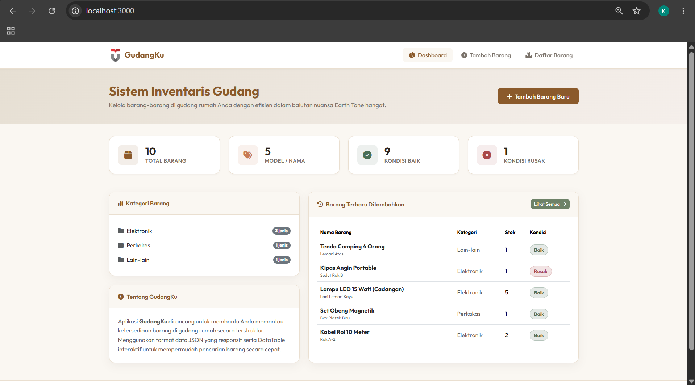
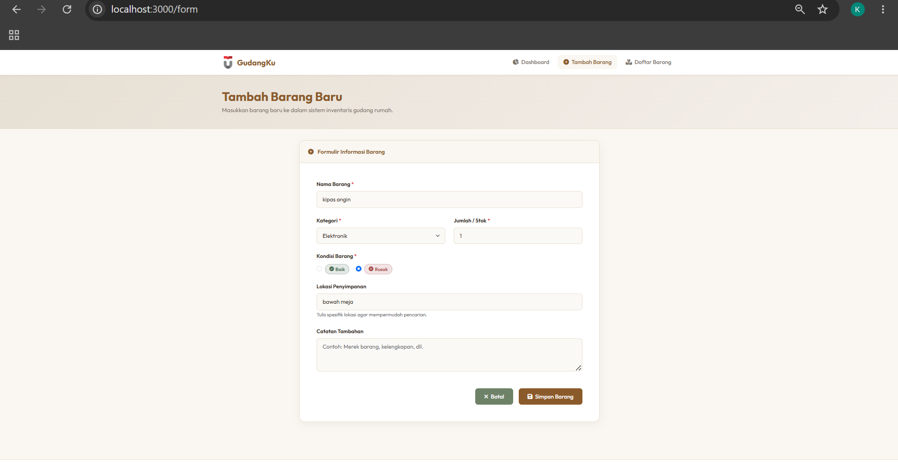
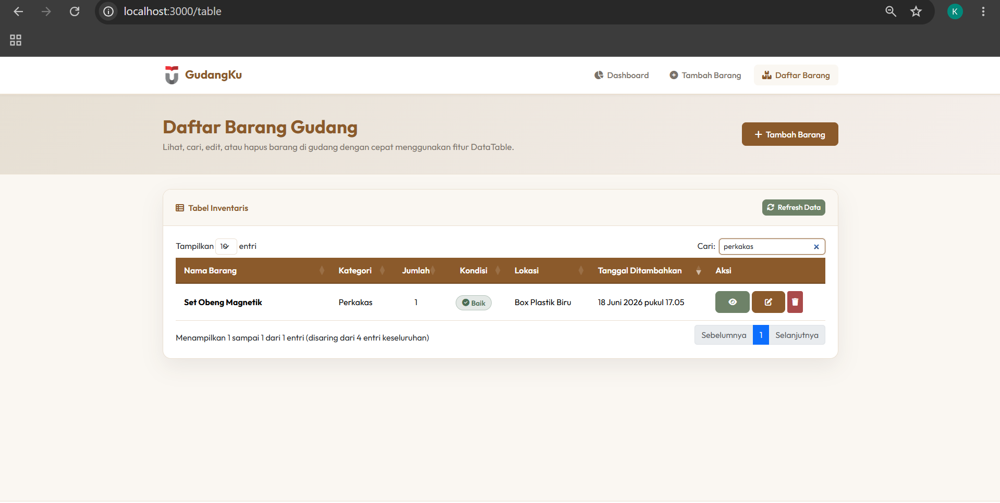
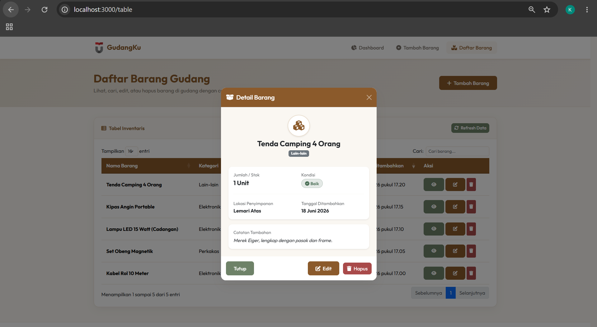
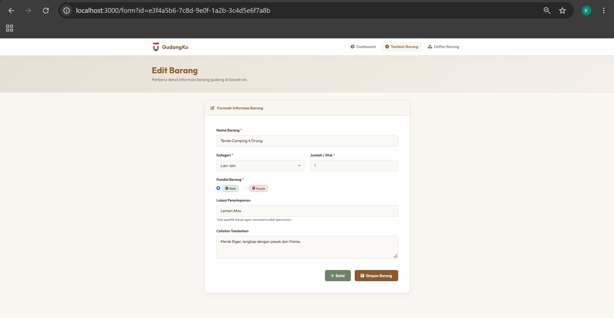
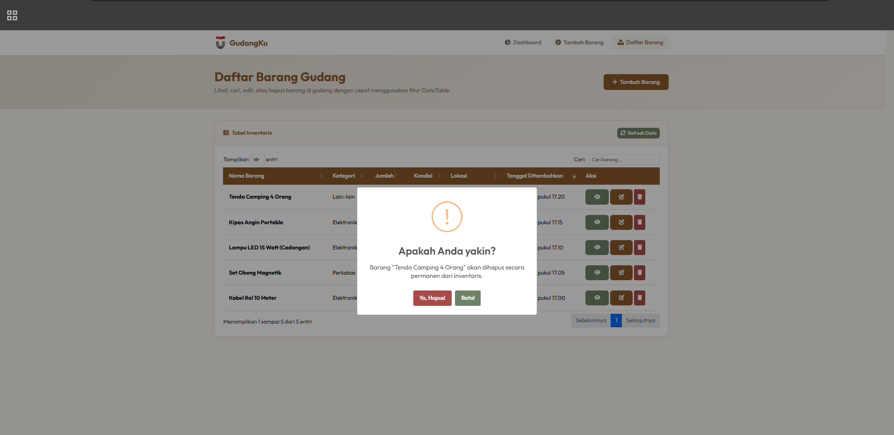

<div align="center">
  <br />
  <h1>LAPORAN PRAKTIKUM <br>APLIKASI BERBASIS PLATFORM</h1>
  <br />
  <h3> TUGAS COTS 2 <br> INVENTARIS GUDANG RUMAH (EARTH TONE) </h3>
  <br />
   
  <br />
  <br />
  <br />
  <h3>Disusun Oleh :</h3>
  <p>
    <strong>Deshan Rafif Alfarisi</strong><br>
    <strong>2311102326</strong><br>
    <strong>S1 IF-11-01</strong>
  </p>
  <br />
  <h3>Dosen Pengampu :</h3>
  <p>
    <strong>Dimas Fanny Hebrasianto Permadi, S.ST., M.Kom</strong>
  </p>
  <br />
  <br />
    <h4>Asisten Praktikum :</h4>
    <strong> Apri Pandu Wicaksono </strong> <br>
    <strong>Rangga Pradarrell Fathi</strong>
  <br />
  <h3>LABORATORIUM HIGH PERFORMANCE
 <br>FAKULTAS INFORMATIKA <br>UNIVERSITAS TELKOM PURWOKERTO <br>2026</h3>
</div>

---

## 1. Dasar Teori

### 📘 Dasar Teori

### 🔹 Node.js & Express.js

Node.js adalah *runtime environment* berbasis mesin JavaScript V8 Google Chrome yang memungkinkan eksekusi kode JavaScript di sisi server (*server-side*). Sementara itu, **Express.js** adalah framework minimalis berbasis Node.js yang mempermudah perancangan routing web, penanganan middleware, serta penyediaan API RESTful secara cepat dan modular. 

Pada sistem inventaris ini, Express digunakan untuk:
* Melayani request halaman statis dan merender halaman EJS (*Embedded JavaScript Templates*).
* Menyediakan API JSON (`/api/inventory`) yang berfungsi sebagai *backend* data bagi DataTable di sisi *client*.
* Menangani alur CRUD (Create, Read, Update, Delete) yang dipicu oleh client melalui metode HTTP (GET, POST, PUT, DELETE).

---

### 🔹 RESTful API & Penyimpanan Format JSON

REST (Representational State Transfer) adalah gaya arsitektur perangkat lunak untuk membangun web service yang memungkinkan komunikasi antar client dan server menggunakan protokol standar HTTP. Format data yang umum digunakan adalah **JSON (JavaScript Object Notation)** karena sifatnya yang ringan, mudah dibaca manusia, dan mudah diproses oleh browser.

Dalam program ini, data disimpan dalam file lokal `data/inventory.json` bertindak sebagai database file sederhana. Proses CRUD dimanipulasi menggunakan modul bawaan Node.js (`fs`) untuk membaca dan memperbarui data file JSON secara dinamis setiap kali ada request dari client.

---

### 🔹 Bootstrap 5 (Styling Earth Tone)

Bootstrap 5 adalah kerangka kerja CSS (CSS Framework) responsif paling populer yang memudahkan pembuatan antarmuka modern. Bootstrap menyediakan grid layout fleksibel serta komponen UI bawaan (card, modal, button, input) yang siap pakai.

Pada tugas ini, styling Bootstrap disesuaikan dengan tema **Earth Tone** (warna alam yang hangat):
* **Latar Belakang**: Soft Cream/Beige (`#FAF7F2`)
* **Warna Utama**: Wood Brown/Chestnut (`#8B5A2B`)
* **Warna Aksen**: Sage Green (`#6E8268`) & Terracotta Clay (`#C87A53`)
* **Warna Teks**: Charcoal Dark Brown (`#2D241E`)

Kustomisasi warna ini ditulis pada file CSS eksternal (`public/css/style.css`) dengan menimpa default class Bootstrap guna menampilkan antarmuka yang premium dan nyaman dilihat.

---

### 🔹 jQuery, AJAX, & jQuery DataTables

**jQuery** adalah pustaka JavaScript yang mempercepat manipulasi DOM, penanganan event, dan interaksi AJAX. **AJAX (Asynchronous JavaScript and XML)** digunakan untuk mengirim serta menerima data dari server secara *asynchronous* di latar belakang tanpa memicu muat ulang (refresh) halaman secara penuh.

**jQuery DataTables** adalah plugin jQuery serbaguna untuk membuat tabel HTML interaktif. Keunggulan DataTable yang digunakan di proyek ini meliputi:
* **JSON Processing**: Memuat baris tabel secara dinamis dari API JSON server (`/api/inventory`).
* **Fitur Terbawa**: Otomatis menyediakan fitur pencarian (*instant search*), pengurutan kolom (*sorting*), dan pembagian halaman (*pagination*).
* **Responsive Layout**: Menyesuaikan lebar tabel dengan berbagai ukuran layar perangkat.

---

### 🔹 SweetAlert2 (jQuery Plugin)

SweetAlert2 adalah pustaka JavaScript untuk menggantikan fungsi dialog/alert bawaan browser dengan modal box yang interaktif, modern, dan sangat kustomisasinya. Pada sistem ini, SweetAlert2 dipadukan dengan jQuery untuk menampilkan:
* Konfirmasi sebelum aksi penghapusan barang (Delete) diproses ke API server.
* Feedback visual berupa toast success berdurasi pendek setelah proses simpan/update sukses dilakukan.

---

## 2. Sourcecode 

### A. server.js
```javascript
const express = require('express');
const path = require('path');
const fs = require('fs');
const { v4: uuidv4 } = require('uuid');

const app = express();
const PORT = process.env.PORT || 3000;
const DATA_FILE = path.join(__dirname, 'data', 'inventory.json');

// Middleware
app.use(express.json());
app.use(express.urlencoded({ extended: true }));
app.use(express.static(path.join(__dirname, 'public')));

// Set EJS as Templating Engine
app.set('view engine', 'ejs');
app.set('views', path.join(__dirname, 'views'));

// Utility functions to read/write JSON data
const readData = () => {
  try {
    if (!fs.existsSync(DATA_FILE)) {
      // Ensure directory exists
      fs.mkdirSync(path.dirname(DATA_FILE), { recursive: true });
      fs.writeFileSync(DATA_FILE, JSON.stringify([], null, 2));
      return [];
    }
    const rawData = fs.readFileSync(DATA_FILE, 'utf8');
    return JSON.parse(rawData || '[]');
  } catch (error) {
    console.error('Error reading data file:', error);
    return [];
  }
};

const writeData = (data) => {
  try {
    fs.mkdirSync(path.dirname(DATA_FILE), { recursive: true });
    fs.writeFileSync(DATA_FILE, JSON.stringify(data, null, 2), 'utf8');
  } catch (error) {
    console.error('Error writing to data file:', error);
  }
};

// ==================== WEB ROUTES ====================

// 1. Dashboard Page
app.get('/', (req, res) => {
  const items = readData();
  
  // Calculate simple statistics for dashboard cards
  const stats = {
    totalItems: items.reduce((acc, item) => acc + (parseInt(item.quantity) || 0), 0),
    totalTypes: items.length,
    goodCondition: items.filter(i => i.condition === 'Baik').reduce((acc, item) => acc + (parseInt(item.quantity) || 0), 0),
    badCondition: items.filter(i => i.condition === 'Rusak').reduce((acc, item) => acc + (parseInt(item.quantity) || 0), 0),
    categories: {}
  };

  // Group by category
  items.forEach(i => {
    stats.categories[i.category] = (stats.categories[i.category] || 0) + 1;
  });

  res.render('index', { 
    title: 'Dashboard - GudangKu',
    stats: stats,
    recentItems: items.slice(-5).reverse() // Last 5 added
  });
});

// 2. Form Page (Add / Edit)
app.get('/form', (req, res) => {
  const editId = req.query.id;
  let editItem = null;

  if (editId) {
    const items = readData();
    editItem = items.find(i => i.id === editId) || null;
  }

  res.render('form', { 
    title: editItem ? 'Edit Barang - GudangKu' : 'Tambah Barang - GudangKu',
    editItem: editItem
  });
});

// 3. Table/Data View Page
app.get('/table', (req, res) => {
  res.render('table', { 
    title: 'Daftar Barang - GudangKu' 
  });
});

// ==================== API ROUTES (CRUD) ====================

// GET: Read all items (JSON formatted)
app.get('/api/inventory', (req, res) => {
  const items = readData();
  res.json({ data: items });
});

// GET: Read single item
app.get('/api/inventory/:id', (req, res) => {
  const items = readData();
  const item = items.find(i => i.id === req.params.id);
  if (!item) {
    return res.status(404).json({ success: false, message: 'Barang tidak ditemukan' });
  }
  res.json({ success: true, data: item });
});

// POST: Create new item
app.post('/api/inventory', (req, res) => {
  const { name, category, quantity, condition, location, notes } = req.body;
  
  if (!name || !category || !quantity || !condition) {
    return res.status(400).json({ success: false, message: 'Kolom wajib diisi!' });
  }

  const items = readData();
  const newItem = {
    id: uuidv4(),
    name,
    category,
    quantity: parseInt(quantity) || 0,
    condition,
    location: location || '-',
    notes: notes || '',
    createdAt: new Date().toISOString()
  };

  items.push(newItem);
  writeData(items);

  res.status(201).json({ success: true, message: 'Barang berhasil ditambahkan', data: newItem });
});

// PUT: Update an item
app.put('/api/inventory/:id', (req, res) => {
  const { name, category, quantity, condition, location, notes } = req.body;
  const items = readData();
  const index = items.findIndex(i => i.id === req.params.id);

  if (index === -1) {
    return res.status(404).json({ success: false, message: 'Barang tidak ditemukan' });
  }

  if (!name || !category || !quantity || !condition) {
    return res.status(400).json({ success: false, message: 'Kolom wajib diisi!' });
  }

  items[index] = {
    ...items[index],
    name,
    category,
    quantity: parseInt(quantity) || 0,
    condition,
    location: location || '-',
    notes: notes || ''
  };

  writeData(items);
  res.json({ success: true, message: 'Barang berhasil diperbarui', data: items[index] });
});

// DELETE: Delete an item
app.delete('/api/inventory/:id', (req, res) => {
  let items = readData();
  const index = items.findIndex(i => i.id === req.params.id);

  if (index === -1) {
    return res.status(404).json({ success: false, message: 'Barang tidak ditemukan' });
  }

  items.splice(index, 1);
  writeData(items);
  res.json({ success: true, message: 'Barang berhasil dihapus' });
});

// Start Server
app.listen(PORT, () => {
  console.log(`Server is running at http://localhost:${PORT}`);
});
```

---

### B. public/js/app.js
```javascript
$(document).ready(function () {
  
  // ==================== DATATABLE INITIALIZATION ====================
  let table = null;
  if ($('#inventoryTable').length > 0) {
    table = $('#inventoryTable').DataTable({
      ajax: '/api/inventory',
      responsive: true,
      columns: [
        { 
          data: 'name',
          render: function (data, type, row) {
            return `<strong>${data}</strong>`;
          }
        },
        { data: 'category' },
        { 
          data: 'quantity',
          className: 'text-center'
        },
        { 
          data: 'condition',
          className: 'text-center',
          render: function (data) {
            if (data === 'Baik') {
              return `<span class="badge-good"><i class="fa-solid fa-circle-check me-1"></i>Baik</span>`;
            } else {
              return `<span class="badge-bad"><i class="fa-solid fa-circle-xmark me-1"></i>Rusak</span>`;
            }
          }
        },
        { data: 'location' },
        { 
          data: 'createdAt',
          render: function (data) {
            if (!data) return '-';
            const date = new Date(data);
            return date.toLocaleDateString('id-ID', {
              day: 'numeric',
              month: 'long',
              year: 'numeric',
              hour: '2-digit',
              minute: '2-digit'
            });
          }
        },
        {
          data: null,
          orderable: false,
          searchable: false,
          render: function (data, type, row) {
            return `
              <div class="d-flex gap-1">
                <button class="btn btn-sm btn-earth-secondary btn-view" data-id="${row.id}" title="Detail Barang">
                  <i class="fa-solid fa-eye"></i>
                </button>
                <a href="/form?id=${row.id}" class="btn btn-sm btn-earth-primary btn-edit" title="Edit Barang">
                  <i class="fa-solid fa-pen-to-square"></i>
                </a>
                <button class="btn btn-sm btn-danger btn-delete btn-delete-row" data-id="${row.id}" data-name="${row.name}" title="Hapus Barang" style="background-color: var(--danger-color); border-color: var(--danger-color);">
                  <i class="fa-solid fa-trash"></i>
                </button>
              </div>
            `;
          }
        }
      ],
      language: {
        url: 'https://cdn.datatables.net/plug-ins/1.13.7/i18n/id.json',
        searchPlaceholder: 'Cari barang...'
      },
      order: [[5, 'desc']]
    });

    // Refresh Table Button
    $('#btnRefreshTable').on('click', function () {
      table.ajax.reload();
      Swal.fire({
        toast: true,
        position: 'top-end',
        icon: 'success',
        title: 'Data berhasil diperbarui',
        showConfirmButton: false,
        timer: 1500
      });
    });
  }

  // ==================== FORM SUBMISSION (CREATE & UPDATE) ====================
  const form = $('#inventoryForm');
  if (form.length > 0) {
    form.on('submit', function (e) {
      e.preventDefault();
      
      if (!this.checkValidity()) {
        e.stopPropagation();
        form.addClass('was-validated');
        return;
      }

      const id = $('#itemId').val();
      const isEdit = !!id;
      const url = isEdit ? `/api/inventory/${id}` : '/api/inventory';
      const method = isEdit ? 'PUT' : 'POST';

      const formData = {
        name: $('#name').val(),
        category: $('#category').val(),
        quantity: $('#quantity').val(),
        condition: $('input[name="condition"]:checked').val(),
        location: $('#location').val() || '-',
        notes: $('#notes').val()
      };

      $('#btnSubmitForm').prop('disabled', true).html('<span class="spinner-border spinner-border-sm me-1" role="status" aria-hidden="true"></span> Menyimpan...');

      $.ajax({
        url: url,
        type: method,
        contentType: 'application/json',
        data: JSON.stringify(formData),
        success: function (response) {
          if (response.success) {
            Swal.fire({
              icon: 'success',
              title: isEdit ? 'Diperbarui!' : 'Tersimpan!',
              text: response.message,
              confirmButtonColor: '#8B5A2B',
              timer: 2000,
              timerProgressBar: true
            }).then(() => {
              window.location.href = '/table';
            });
          } else {
            Swal.fire({
              icon: 'error',
              title: 'Gagal',
              text: response.message,
              confirmButtonColor: '#8B5A2B'
            });
            $('#btnSubmitForm').prop('disabled', false).html('<i class="fa-solid fa-floppy-disk me-1"></i> Simpan Barang');
          }
        },
        error: function (xhr) {
          const err = xhr.responseJSON || { message: 'Terjadi kesalahan sistem' };
          Swal.fire({
            icon: 'error',
            title: 'Terjadi Kesalahan',
            text: err.message,
            confirmButtonColor: '#8B5A2B'
          });
          $('#btnSubmitForm').prop('disabled', false).html('<i class="fa-solid fa-floppy-disk me-1"></i> Simpan Barang');
        }
      });
    });
  }

  // ==================== CRUD OPERATIONS VIA TABLE (DELETE & READ DETAILS) ====================
  
  if ($('#inventoryTable').length > 0) {
    $('#inventoryTable').on('click', '.btn-view', function () {
      const id = $(this).data('id');
      loadDetail(id);
    });

    $('#inventoryTable').on('click', '.btn-delete-row', function () {
      const id = $(this).data('id');
      const name = $(this).data('name');
      confirmDelete(id, name);
    });
  }

  let currentDetailId = null;
  
  function loadDetail(id) {
    $.ajax({
      url: `/api/inventory/${id}`,
      type: 'GET',
      success: function (response) {
        if (response.success) {
          const item = response.data;
          currentDetailId = item.id;
          
          $('#detailName').text(item.name);
          $('#detailCategory').text(item.category);
          $('#detailQuantity').text(item.quantity + ' Unit');
          
          const conditionHtml = item.condition === 'Baik' 
            ? `<span class="badge-good"><i class="fa-solid fa-circle-check me-1"></i>Baik</span>`
            : `<span class="badge-bad"><i class="fa-solid fa-circle-xmark me-1"></i>Rusak</span>`;
          $('#detailCondition').html(conditionHtml);
          
          $('#detailLocation').text(item.location || '-');
          
          const date = new Date(item.createdAt);
          $('#detailCreatedAt').text(date.toLocaleDateString('id-ID', {
            day: 'numeric',
            month: 'long',
            year: 'numeric'
          }));
          
          $('#detailNotes').text(item.notes || 'Tidak ada catatan tambahan.');
          
          $('#detailModal').modal('show');
        }
      }
    });
  }

  $('#btnEditDetail').on('click', function () {
    if (currentDetailId) {
      window.location.href = `/form?id=${currentDetailId}`;
    }
  });

  $('#btnDeleteDetail').on('click', function () {
    if (currentDetailId) {
      const name = $('#detailName').text();
      $('#detailModal').modal('hide');
      confirmDelete(currentDetailId, name);
    }
  });

  function confirmDelete(id, name) {
    Swal.fire({
      title: 'Apakah Anda yakin?',
      text: `Barang "${name}" akan dihapus secara permanen dari inventaris.`,
      icon: 'warning',
      showCancelButton: true,
      confirmButtonColor: '#A94A4A',
      cancelButtonColor: '#6E8268',
      confirmButtonText: 'Ya, Hapus!',
      cancelButtonText: 'Batal'
    }).then((result) => {
      if (result.isConfirmed) {
        $.ajax({
          url: `/api/inventory/${id}`,
          type: 'DELETE',
          success: function (response) {
            if (response.success) {
              Swal.fire({
                icon: 'success',
                title: 'Dihapus!',
                text: 'Barang telah berhasil dihapus.',
                confirmButtonColor: '#8B5A2B',
                timer: 1500
              });
              if (table) table.ajax.reload();
            }
          },
          error: function () {
            Swal.fire({
              icon: 'error',
              title: 'Gagal',
              text: 'Terjadi kesalahan saat menghapus barang.',
              confirmButtonColor: '#8B5A2B'
            });
          }
        });
      }
    });
  }
});
```

---

### C. public/css/style.css
```css
@import url('https://fonts.googleapis.com/css2?family=Outfit:wght@300;400;500;600;700;800&display=swap');

:root {
  --bg-cream: #FAF7F2;
  --bg-card: #FFFFFF;
  --primary-earth: #8B5A2B;
  --primary-hover: #724922;
  --secondary-sage: #6E8268;
  --secondary-hover: #5A6B55;
  --accent-terracotta: #C87A53;
  --accent-clay: #E6DFD3;
  --text-dark: #2D241E;
  --text-muted: #7A726A;
  --border-color: #EADFD0;
  --success-color: #4A6E55;
  --danger-color: #A94A4A;
  --shadow-sm: 0 2px 4px rgba(45, 36, 30, 0.04);
  --shadow-md: 0 8px 24px rgba(45, 36, 30, 0.06);
  --shadow-lg: 0 16px 40px rgba(45, 36, 30, 0.08);
}

body {
  font-family: 'Outfit', sans-serif;
  background-color: var(--bg-cream);
  color: var(--text-dark);
  min-height: 100vh;
  display: flex;
  flex-direction: column;
}

.navbar-earth {
  background-color: var(--bg-card);
  border-bottom: 2px solid var(--border-color);
  padding: 0.8rem 1.5rem;
  box-shadow: var(--shadow-sm);
}

.navbar-brand-earth {
  font-weight: 700;
  color: var(--primary-earth) !important;
  font-size: 1.4rem;
  display: flex;
  align-items: center;
  gap: 0.5rem;
}

.navbar-brand-earth img {
  height: 35px;
  width: auto;
}

.nav-link-earth {
  font-weight: 500;
  color: var(--text-muted) !important;
  padding: 0.5rem 1rem !important;
  border-radius: 8px;
  transition: all 0.3s ease;
}

.nav-link-earth:hover, .nav-link-earth.active {
  color: var(--primary-earth) !important;
  background-color: var(--bg-cream);
}

.page-header {
  background: linear-gradient(135deg, var(--accent-clay) 0%, #F5EFEB 100%);
  padding: 2.5rem 0;
  border-bottom: 1px solid var(--border-color);
  margin-bottom: 2rem;
}

.page-header h1 {
  font-weight: 700;
  font-size: 2.2rem;
  color: var(--primary-earth);
  margin-bottom: 0.3rem;
}

.page-header p {
  color: var(--text-muted);
  font-size: 1.05rem;
  margin-bottom: 0;
}

.card-earth {
  background-color: var(--bg-card);
  border: 1px solid var(--border-color);
  border-radius: 16px;
  box-shadow: var(--shadow-md);
  transition: transform 0.3s ease, box-shadow 0.3s ease;
  overflow: hidden;
}

.card-earth:hover {
  transform: translateY(-4px);
  box-shadow: var(--shadow-lg);
}

.card-earth-header {
  background-color: var(--bg-cream);
  border-bottom: 1px solid var(--border-color);
  font-weight: 600;
  color: var(--primary-earth);
  padding: 1.2rem 1.5rem;
}

.stat-card {
  padding: 1.5rem;
  border-radius: 16px;
  border: 1px solid var(--border-color);
  display: flex;
  align-items: center;
  gap: 1.2rem;
  background-color: var(--bg-card);
  box-shadow: var(--shadow-sm);
  transition: all 0.3s ease;
}

.stat-card:hover {
  transform: translateY(-3px);
  box-shadow: var(--shadow-md);
}

.stat-icon {
  width: 56px;
  height: 56px;
  border-radius: 12px;
  display: flex;
  align-items: center;
  justify-content: center;
  font-size: 1.5rem;
}

.stat-icon-total {
  background-color: rgba(139, 90, 43, 0.1);
  color: var(--primary-earth);
}

.stat-icon-types {
  background-color: rgba(200, 122, 83, 0.1);
  color: var(--accent-terracotta);
}

.stat-icon-good {
  background-color: rgba(74, 110, 85, 0.1);
  color: var(--success-color);
}

.stat-icon-bad {
  background-color: rgba(169, 74, 74, 0.1);
  color: var(--danger-color);
}

.stat-details h3 {
  font-size: 1.8rem;
  font-weight: 700;
  margin: 0;
  color: var(--text-dark);
}

.stat-details p {
  color: var(--text-muted);
  margin: 0;
  font-size: 0.9rem;
  text-transform: uppercase;
  letter-spacing: 0.5px;
  font-weight: 600;
}

.btn-earth-primary {
  background-color: var(--primary-earth);
  border-color: var(--primary-earth);
  color: #FFFFFF;
  font-weight: 500;
  padding: 0.6rem 1.5rem;
  border-radius: 8px;
  transition: all 0.2s ease;
}

.btn-earth-primary:hover {
  background-color: var(--primary-hover);
  border-color: var(--primary-hover);
  color: #FFFFFF;
}

.btn-earth-secondary {
  background-color: var(--secondary-sage);
  border-color: var(--secondary-sage);
  color: #FFFFFF;
  font-weight: 500;
  padding: 0.6rem 1.5rem;
  border-radius: 8px;
  transition: all 0.2s ease;
}

.btn-earth-secondary:hover {
  background-color: var(--secondary-hover);
  border-color: var(--secondary-hover);
  color: #FFFFFF;
}

.form-label-earth {
  font-weight: 600;
  color: var(--text-dark);
  font-size: 0.95rem;
}

.form-control-earth, .form-select-earth {
  border: 1px solid var(--border-color);
  border-radius: 8px;
  padding: 0.65rem 1rem;
  background-color: #FAF9F6;
  color: var(--text-dark);
  transition: all 0.2s ease;
}

.form-control-earth:focus, .form-select-earth:focus {
  border-color: var(--primary-earth);
  box-shadow: 0 0 0 3px rgba(139, 90, 43, 0.15);
  background-color: #FFFFFF;
}

.table-earth-container {
  padding: 1.5rem;
}

.table-earth {
  width: 100% !important;
  border-collapse: collapse;
}

.table-earth th {
  background-color: var(--primary-earth);
  color: #FFFFFF !important;
  font-weight: 600;
  padding: 12px 16px !important;
  border-bottom: 2px solid var(--primary-hover);
}

.table-earth td {
  padding: 14px 16px !important;
  vertical-align: middle;
  border-bottom: 1px solid var(--border-color);
}

.table-earth tr:hover {
  background-color: rgba(234, 223, 208, 0.3) !important;
}

.dataTables_wrapper .dataTables_paginate .paginate_button.current, 
.dataTables_wrapper .dataTables_paginate .paginate_button.current:hover {
  background: var(--primary-earth) !important;
  color: #FFFFFF !important;
  border: 1px solid var(--primary-earth) !important;
  border-radius: 6px !important;
}

.dataTables_wrapper .dataTables_paginate .paginate_button:hover {
  background: var(--secondary-sage) !important;
  color: #FFFFFF !important;
  border: 1px solid var(--secondary-sage) !important;
  border-radius: 6px !important;
}

.dataTables_wrapper .dataTables_filter input,
.dataTables_wrapper .dataTables_length select {
  border: 1px solid var(--border-color);
  border-radius: 6px;
  padding: 4px 8px;
  background-color: #FFFFFF;
}

.dataTables_wrapper .dataTables_filter input:focus,
.dataTables_wrapper .dataTables_length select:focus {
  outline: none;
  border-color: var(--primary-earth);
  box-shadow: 0 0 0 2px rgba(139, 90, 43, 0.1);
}

.badge-good {
  background-color: rgba(74, 110, 85, 0.15);
  color: var(--success-color);
  border: 1px solid rgba(74, 110, 85, 0.3);
  font-weight: 600;
  padding: 0.35em 0.8em;
  border-radius: 30px;
  font-size: 0.85rem;
}

.badge-bad {
  background-color: rgba(169, 74, 74, 0.15);
  color: var(--danger-color);
  border: 1px solid rgba(169, 74, 74, 0.3);
  font-weight: 600;
  padding: 0.35em 0.8em;
  border-radius: 30px;
  font-size: 0.85rem;
}

footer {
  margin-top: auto;
  background-color: var(--bg-card);
  border-top: 1px solid var(--border-color);
  color: var(--text-muted);
  font-size: 0.9rem;
  padding: 1.5rem 0;
  text-align: center;
}
```

---

## 3. Output Program

### 🔹 1. Halaman Beranda (Dashboard)
Halaman utama yang menampilkan statistik ringkasan barang gudang secara keseluruhan, jumlah kategori, barang dengan kondisi baik, rusak, serta riwayat penambahan barang terbaru.
<p align="center">
  
</p>

---

### 🔹 2. Halaman Form Tambah Barang (Create)
Formulir input data barang dengan validasi HTML5 dan interaksi AJAX saat tombol "Simpan Barang" diklik.
<p align="center">
  
</p>

---

### 🔹 3. Halaman Daftar Tabel (Read) & Fitur Pencarian
Halaman yang memuat data JSON dari API `/api/inventory` dan merendernya secara dinamis di DataTable jQuery, dilengkapi kotak pencarian instan dan pagination.
<p align="center">
  
</p>

---

### 🔹 4. Modal Detail Barang (Read Detail)
Pop-up detail barang yang diaktifkan dengan mengklik tombol mata pada kolom aksi tabel, mengambil data langsung dari API `/api/inventory/:id`.
<p align="center">
  
</p>

---

### 🔹 5. Halaman Edit Barang (Update)
Formulir modifikasi data barang yang dipopulasi otomatis berdasarkan data barang yang dipilih dengan parameter `?id=...`.
<p align="center">
  
</p>

---

### 🔹 6. Dialog Hapus Barang (Delete)
Konfirmasi dialog interaktif menggunakan SweetAlert2 sebelum memproses penghapusan data secara permanen via AJAX DELETE.
<p align="center">
  
</p>

---

## 4. Penjelasan Program

### 1. Model Data Inventaris (JSON Database)
Data barang disimpan dalam bentuk array berisi objek di file `data/inventory.json`:
```json
{
  "id": "a9b1c2d3-4e5f-6a7b-8c9d-0e1f2a3b4c5d",
  "name": "Kabel Rol 10 Meter",
  "category": "Elektronik",
  "quantity": 2,
  "condition": "Baik",
  "location": "Rak A-2",
  "notes": "Kabel rol tebal warna hitam, kondisi normal.",
  "createdAt": "2026-06-18T10:00:00.000Z"
}
```
Setiap item diidentifikasi menggunakan ID unik buatan UUID v4.

---

### 2. Penanganan API di Server Express (`server.js`)
Proses CRUD ditangani menggunakan REST API di Express:
* **Create (POST `/api/inventory`)**: Mengambil body data form, membuat UUID baru, menambahkan ke array, lalu menulis ulang file database JSON.
* **Read (GET `/api/inventory`)**: Membaca file database dan membalas dalam format `{ data: [...] }` yang sesuai dengan spesifikasi format input DataTable.
* **Update (PUT `/api/inventory/:id`)**: Mencari kecocokan ID item, memperbarui nilai field dengan data baru dari req.body, dan menyimpan hasilnya.
* **Delete (DELETE `/api/inventory/:id`)**: Memotong (*splice*) array barang di indeks yang cocok, lalu menulis ulang database.

---

### 3. Rendering EJS Halaman Form & Dashboard
* **Dashboard**: Mengkalkulasi statistik total barang secara dinamis di server saat halaman di-request, lalu merendernya ke layout.
* **Form**: Mengecek query string `?id=...`. Jika bernilai True, server memuat data barang tersebut lalu mengirimkannya ke template EJS untuk dipasang sebagai *value* default di input form.

---

### 4. Integrasi jQuery DataTables (`app.js`)
Di sisi client, inisialisasi tabel memicu request AJAX otomatis ke router API:
```javascript
table = $('#inventoryTable').DataTable({
  ajax: '/api/inventory',
  ...
});
```
Kolom-kolom dipetakan ke field JSON secara langsung. Kolom "Kondisi" dan "Aksi" dirender secara khusus menggunakan fungsi `render()` untuk memformat HTML berupa badge dan tombol aksi kustom.

---

### 5. Interaksi AJAX & Feedback UI (CRUD)
* Form submit dicegah perilakunya menggunakan `e.preventDefault()`, divalidasi kebenaran inputnya, dan dikirim menggunakan `$.ajax()` dalam format Payload JSON.
* Aksi hapus di dalam DataTable diwakili oleh *event delegation* `.btn-delete-row` karena baris tabel dibuat secara dinamis. Pustaka SweetAlert2 menampilkan pop-up konfirmasi yang jika disetujui, akan mengirim request DELETE via AJAX dan memanggil `table.ajax.reload()` untuk memperbarui tampilan tabel secara langsung tanpa memicu refresh halaman web.

---

## 5. Kesimpulan

Dengan menggabungkan kekuatan Node.js (Express) sebagai back-end dan framework client-side seperti Bootstrap 5, jQuery, DataTables, serta SweetAlert2, berhasil dibuat aplikasi manajemen inventaris gudang rumah yang fungsional dan estetis. Pemanfaatan format data JSON untuk loading tabel melalui DataTable dan proses modifikasi data via AJAX menunjukkan alur kerja aplikasi web modern yang responsif dan hemat bandwidth.

---

## 6. Referensi
1. ExpressJS Official Documentation: https://expressjs.com/
2. Bootstrap 5.3 Documentation: https://getbootstrap.com/docs/5.3/
3. jQuery DataTables Manual: https://datatables.net/manual/
4. SweetAlert2 Guide: https://sweetalert2.github.io/
